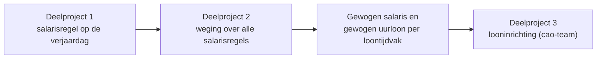

# Ontwerp RHR02159 Uurloon verhoging bij verjaardag

## 1. Inleiding

Project RHR02159 zorgt dat een loonsverhoging ingaat op de verjaardag van de medewerker in plaats van op de eerste dag van het loontijdvak, en dat de loonberekening daar correct mee omgaat.
De oplossing is gerealiseerd via drie samenhangende deelprojecten (fases): de verhoging op de verjaardag, de gewogen (uur)loonberekening en de looninrichting.
Dit hoofdontwerp beschrijft die deelprojecten in samenhang; de technische diepte staat in de deelprojectdocumenten waarnaar dit ontwerp verwijst.

### Aanleiding en behoefte

De aanleiding is een [toezegging](https://32772.afasinsite.nl/toezegging?SbId=32718374) aan een klant (hierna `Klant A`).
De behoefte van `Klant A` is dat een loonsverhoging pas ingaat op de verjaardag van de medewerker in plaats van op de eerste dag van het loontijdvak, zodat de medewerker niet te vroeg recht krijgt op de hogere beloning.

`Klant A` rekent zelf niet met een gewogen uurloon.
Zodra de salarisregel op de verjaardag ontstaat, weegt het bestaande stamgegeven al via het `Rooster toepassen in Payroll` dat `Klant A` gebruikt; die weging voorkomt een aanzienlijke jaarlijkse meerkost.

De onderliggende functionaliteit is breder inzetbaar dan alleen voor `Klant A`.
Het gewogen uurloon en de bijbehorende looninrichting zijn vooral relevant voor sectoren met eigen weegafspraken, zoals de bouw en de schoonmaak; die inzet volgt later, vanaf Profit 9.

### Probleemstelling

Profit laat een periodieke of leeftijdsafhankelijke verhoging nu ingaan op de eerste dag van het loontijdvak.
Valt de verjaardag halverwege de periode, dan gaat het loon te vroeg omhoog.

Zodra een verhoging op de verjaardag ontstaat, staan er meerdere salarisregels binnen hetzelfde loontijdvak.
De loonberekening moet daar een correct gewogen salaris en, waar nodig, een gewogen uurloon uit afleiden.
Het bestaande stamgegeven `Uurloon` (parameter 12) is ongewogen en voldoet daarom niet voor situaties en sectoren die een gewogen uurloon vragen.

### Doel

- De salarisregel ontstaat op de verjaardag in plaats van op de eerste dag van het loontijdvak (deelproject 1).
- De loonberekening bepaalt een correct gewogen salaris en een nieuw gewogen uurloon over alle salarisregels binnen het loontijdvak (deelproject 2).
- De looninrichting sluit hierop aan, zodat cao's met het gewogen uurloon kunnen rekenen (deelproject 3, cao-team).

De hoofdbehoefte van `Klant A` — de verhoging pas op de verjaardag — wordt gedekt door de wijzigingen van deelproject 1. Deelproject 2 en 3 verbreden de oplossing naar andere sectoren.

### Afbakening

`Periodiek toekennen` kent twee varianten: in combinatie met periodeverwerking en in combinatie met declaratieverwerking Flex. Alleen de eerste valt binnen dit project; in de rest van dit ontwerp verwijst `Periodiek toekennen` daarom naar de variant in combinatie met periodeverwerking.

In scope:

- `Periodiek toekennen` in combinatie met periodeverwerking, waarbij de salarisregel ingaat op de verjaardag van de medewerker.
- Een leeftijdsvoorwaarde voor tredeverhoging bij `Periodiek toekennen`, via een nieuw veld `Tredeverhoging vanaf leeftijd` op `Eigenschappen periodiek`.
- Periodeverwerking waarbij een gewogen uurloon voor het loontijdvak wordt toegepast (`BES-003`).
- Een loonberekening die op basis van rooster en vastgelegd salaris automatisch het gewogen salaris en gewogen uurloon voor het loontijdvak bepaalt.
- Overdracht aan het cao-team van de nieuwe en gewijzigde stamgegeven parameters voor de looninrichting.

Buiten scope:

- `Periodiek toekennen` in combinatie met declaratieverwerking Flex.
- Het opknippen van het loontijdvak om variabele uren, meeruren of overwerk te laten rekenen met het uurloon van de specifieke boekingsdag (`BES-004`).
- Een generieke programmatuuroplossing waarmee variabele uren die op verschillende manieren zijn geboekt automatisch met het uurloon van de betreffende boekingsdag rekenen.
- Roosterwijzigingen binnen hetzelfde loontijdvak (`BES-035`).

Dit project levert geen generieke programmatuuroplossing voor variabele uren per boekingsdag en geen standaard looninrichting daarvoor.
Klanten met eigen looninrichting kunnen de nieuwe stamgegeven parameters wel gebruiken om zelf rekenvarianten te maken.

### Begrippen

| Begrip | Betekenis |
| --- | --- |
| Periodeverwerking | Verloningssoort met een vast periodeloon voor het loontijdvak. |
| Leeftijdsperiodiek | Instelling op eigenschappen loonschaal die stuurt wanneer een leeftijdsafhankelijke verhoging ingaat. |
| Tredeverhoging | Verhoging doordat de medewerker naar een hogere loonschaaltrede gaat, los van een leeftijdsband. |
| Leeftijdsstaffel | Indeling waarbij het salaris binnen dezelfde schaal en trede varieert per leeftijdsband. |
| Gewogen salaris | Bestaand stamgegeven (parameter 209) dat het periodesalaris weegt over de salarisregels binnen het loontijdvak. |
| Gewogen uurloon | Nieuw stamgegeven dat het uurloon weegt over de salarisregels binnen het loontijdvak. |
| Methode gewogen periodeberekening | Cao-instelling (`niet toepassen` / `kalenderdagen` / `werkdagen`) die het weeggedrag bepaalt. |
| Rooster toepassen in Payroll | Veld dat aangeeft dat er een vast overeengekomen rooster is; stuurt mede of Profit weegt. |

## 2. Oplossing op hoofdlijnen en samenhang

De oplossing volgt één keten: de verhoging ontstaat op het juiste moment, de loonberekening weegt de resulterende salarisregels, en de looninrichting rekent met de uitkomst.

Elk deelproject levert een eigen implementatieplan op voor applicatieontwikkelaars of cao-beheerders.
Dit hoofdontwerp beschrijft de samenhang op hoofdlijnen; de per-discipline status, de realisatie-checklist en het technische detail staan in de deelprojectdocumenten.

| Deelproject | Rol in de keten | Eigenaar realisatie | Status | Ontwerpbestand |
| --- | --- | --- | --- | --- |
| 1 — Periodieke verhoging i.c.m. periodeverwerking | Laat de salarisregel ontstaan op de verjaardag | `PD HRM/Payroll & Flex` | Realisatie | [01-periodiek.md](./01-periodiek.md) |
| 2 — Loonberekening | Weegt over de salarisregels; levert gewogen salaris en gewogen uurloon | `PD HRM/Payroll & Flex` | Realisatie | [02-loonberekening.md](./02-loonberekening.md) |
| 3 — Looninrichting | Rekent met de bouwstenen; overdracht aan het cao-team | `Cao-team` | Overdracht aan cao-team | [03-looninrichting.md](./03-looninrichting.md) |

## 3. Gedeelde uitgangspunten en ontwerpkeuzes

Deze keuzes gelden over de deelprojecten heen en vormen de basis onder de thematische hoofdstukken hierna.

- **Weging over alle salarisregels, zonder markering.** De salarisregel die op de verjaardag ontstaat, krijgt geen aparte markering (`BES-034`). De loonberekening weegt over alle salarisregels binnen het loontijdvak; salariswijzigingen door de verjaardag en met een andere oorzaak worden gelijk behandeld.
- **Jaarafhankelijkheid vanaf loonjaar 2027.** Aanpassingen op bestaand rekengedrag gaan jaarafhankelijk in vanaf loonjaar 2027 (`BES-041`), zodat oude perioden niet met terugwerkende kracht anders rekenen. De nieuwe cao-instelling kent hiervoor een eigen veld `Loonjaar van`.
- **Scopegrens variabele uren en roosterwijziging.** De oplossing richt zich op gewogen salaris en gewogen uurloon binnen het loontijdvak. Variabele uren per boekingsdag en roosterwijzigingen binnen hetzelfde loontijdvak vallen buiten scope (`BES-004`, `BES-035`).
- **Bredere inzetbaarheid.** De behoefte van `Klant A` is dekkend met deelproject 1. Het gewogen uurloon en de looninrichting verbreden de toepasbaarheid naar andere sectoren en volgen vanaf Profit 9.

## 4. Verhoging op de verjaardag

Deelproject 1 zorgt dat de verhoging ingaat op de verjaardag in plaats van op de eerste dag van het loontijdvak.
De volledige uitwerking, met scenario's en componentmodel, staat in [01-periodiek.md](./01-periodiek.md).

### Ingangsmoment via de leeftijdsperiodiek

De instelling voor de leeftijdsperiodiek verhuist van eigenschappen werkgever (voorheen `Periodiek in periode`) naar **eigenschappen loonschaal**.
Op die plek bepaalt de instelling wanneer een leeftijdsafhankelijke verhoging ingaat, met als opties de verhoging in de huidige periode, in de volgende periode of op de verjaardag zelf.
Op de verjaardag ontstaat dan een nieuwe salarisregel; ook de plekken waar het loon wordt bepaald (onder andere de loonschalen) zijn zo aangepast dat het salaris niet al vóór de verjaardag omhooggaat.

### Leeftijdsverhoging versus tredeverhoging

Het ontwerp maakt onderscheid tussen twee oorzaken van een hoger salaris op de verjaardag:

- De leeftijdsband wijzigt binnen dezelfde schaal en trede (leeftijdsverhoging).
- De medewerker gaat naar een hogere loonschaaltrede (tredeverhoging).

Dit onderscheid is belangrijk voor cao's waarin schaal, trede en leeftijd afzonderlijke dimensies zijn.
Voor de leeftijdsvoorwaarde bij tredeverhoging krijgt `Eigenschappen periodiek` een nieuw veld `Tredeverhoging vanaf leeftijd`. Het bepaalt vanaf welke leeftijd Profit bij `Periodiek toekennen` de loonschaaltrede mag verhogen; de leeftijdsstaffel binnen dezelfde trede blijft mogelijk zonder dat aan die voorwaarde is voldaan. Het veld is zichtbaar afhankelijk van `Gedrag periodiek toekennen`.

Als bij de combinatie van cao, arbeidsvoorwaarde en functietype geen functietype-regel is ingericht, past Profit nu geen tredeverhoging toe. Dit deelproject behandelt dat als een bug: `Trede periodiek verhogen` is een opt-out-instelling, dus bij een ontbrekende regel past Profit voortaan wél een tredeverhoging toe. Alleen als de regel bestaat én `Trede periodiek verhogen` uit staat, blijft de tredeverhoging achterwege.

### Conversie bij de verplaatsing

Doordat één cao aan meerdere werkgevers met onderling afwijkende waarden hangt (1-op-N-relatie), is een waardebehoudende conversie principieel onbetrouwbaar.
Bij conversie krijgen daarom **alle loonschalen** de default `Leeftijdsperiodiek in huidige periode`; de oude per-werkgever-waarde wordt niet overgenomen.
De kleine, geconcentreerde groep getroffen klanten wordt via de checklistovergang en een gerichte mailing opgevangen (`ACT-025`).

### Gedrag bij een latere geboortedatumwijziging

Als de geboortedatum achteraf wijzigt, past Profit bestaande salarisregels niet automatisch aan en toont het geen melding of signalering.
Een correctie blijft een bewuste actie van de gebruiker of volgt bij een volgende uitvoering van `Periodiek toekennen`.
Zo worden salarisregels met een andere oorzaak niet onbedoeld aangepast.

### Inzicht in toegekende periodieken

De bestaande gegevensverzameling met de resultaten van de procestaak `Periodiek toekennen` — benaderbaar via de actie `Taakinformatie` in het menu `Wachtrij` — wordt beschikbaar gesteld voor rapporten en analyses.
Zo kan een klant achteraf inzien welke periodieke verhogingen in een periode hebben plaatsgevonden, inclusief de oude en nieuwe trede en het oude en nieuwe salaris.
De benodigde velden zijn al aanwezig; er komt geen apart veld `Reden` dat tredeverhoging, leeftijdsverhoging of een combinatie onderscheidt.

Doordat bij de optie `Leeftijdsperiodiek op verjaardag` twee salarisregels binnen hetzelfde loontijdvak kunnen ontstaan, toont de weergave achter `Taakinformatie` ook de begindatum van de salarisregel.
Het bestaande veld `Begindatum salaris` komt daarvoor als derde kolom `Begin` in de standaardweergave (`BES-044`), en `Periodiek toekennen` vult dat veld voortaan met de begindatum van de aangemaakte of bijgewerkte salarisregel in plaats van die van de bronsalarisregel (`BES-045`).

## 5. Gewogen (uur)loonberekening

Deelproject 2 bepaalt uit de salarisregels binnen het loontijdvak een correct gewogen salaris en een gewogen uurloon.
De edge cases, parametertabellen en informatiebolletjes staan in [02-loonberekening.md](./02-loonberekening.md).

### Nieuw gewogen uurloon naast het ongewogen uurloon

Parameter 12 (`Uurloon`) blijft ongewijzigd en ongewogen, omdat veel looninrichting juist het ongewogen uurloon nodig heeft.
Daarnaast komt er een nieuw stamgegeven `Gewogen uurloon` dat altijd weegt en het bestaande weegmechanisme van het gewogen salaris volgt.
De uurloonvarianten `Uurloon vorige periode` (36) en `Uurloon onafgerond` (77) krijgen geen gewogen tegenhanger; alleen de hoofdvariant wordt gewogen beschikbaar gemaakt.

### Gewogen salaris ook bij uurloners

Het bestaande gewogen salaris (parameter 209) weegt het periodesalaris al.
Bij soort salaris `Uurloon` of `Schaal uurloon` weegt Profit vandaag alleen als `Rooster toepassen in Payroll` aan staat.
Voor klanten die het vaste rooster extern bijhouden komt op `Eigenschappen cao` een nieuw vinkje `Uurloon wegen zonder Rooster toepassen in Payroll` (`BES-040`): uit (default) betekent wegen zoals nu, aan betekent altijd wegen.
Zodra het vinkje aan staat, verschijnt het veld `Loonjaar van` dat bepaalt vanaf welk loonjaar de weging geldt.

### Wisselen tussen periodeloon en uurloon

Wisselt een medewerker binnen hetzelfde loontijdvak van periodeloon naar uurloon of andersom, dan wordt niet gewogen: de loonberekening geeft een voorspelbaar ultimo-resultaat (`BES-041`).
Deze aanpassing op bestaand gedrag geldt vanaf loonjaar 2027 en voorkomt onbedoelde correcties met terugwerkende kracht over afgesloten boekjaren.

## 6. Looninrichting — overdracht aan het cao-team

Deelproject 3 is een overdrachtsdocument aan het cao-team en geen zelfstandig bouwontwerp; het cao-team beheert de standaard Profit cao-looninrichting zelf en legt de realisatie vast in een eigen technisch ontwerp.
De overdracht staat in [03-looninrichting.md](./03-looninrichting.md).

Voor `Klant A` volstaat de huidige looninrichting: met het gewogen salaris (parameter 209) via de nieuwe cao-instelling zijn geen wijzigingen aan looncomponenten nodig.
Als algemene verbetering luidt het advies om het nieuwe stamgegeven `Gewogen uurloon` standaard aan het looncomponent `Uurloonberekening` te koppelen, zodat de waarde per loontijdvak wordt vastgelegd en beschikbaar is voor cao's die ermee willen rekenen.
Klantspecifieke uitbreidingen voor sectoren als de bouw en de schoonmaak volgen later, vanaf Profit 9.

## 7. Open punten

- Welke instellingsvelden op `Eigenschappen cao` een informatiebolletje krijgen en met welke tekst. Het cao-team toetst de conceptteksten en draagt daarna over aan het content-team (`BES-039`, `BES-042`).
