# Ontwerp: Periodetoekenning abonnement

|   |   |
| --- | --- |
| **Project** | RPT00692 |
| **Versie** | 0044 |
| **Datum** | 10-09-2026 |
| **Status** | Concept |
| **Module** | Financial Basic – Abonnementen |
| **Gepland voor** | P09 |
| **Auteur** | Eric Zaal |

---

## Versiehistorie

| Versie | Datum | Auteur | Wijziging |
| --- | --- | --- | --- |
| 0044 | 10-09-2026 | Eric Zaal | US10 uitgebreid met het tabblad Financiële mutaties op Eigenschappen abonnement. Het tabblad toont de financiële mutaties die aan het abonnement zijn gekoppeld. §3.10 bijgewerkt. |
| 0043 | 23-07-2026 | Eric Zaal | Nieuwe integratiesoort voor periodetoekenning toegevoegd waarmee het dagboek van de journaalposten (toekenning en tegenboeking) wordt bepaald. Het dagboek is per administratie en wordt daarom via de integratiesoort ingericht; alleen dagboeken van het type Variabel memoriaal zijn kiesbaar. §2.3, journaliseringslogica §5.1, bedrijfsregel B16 en work item D67 (Bijlage F8) bijgewerkt. |
| 0042 | 08-07-2026 | Eric Zaal | US12 toegevoegd: wizard Collectief wijzigen abonnementen uitgebreid met veld Factuurmoment. Deze user story is verplaatst vanuit ontwerp RPT00701, waar Factuurmoment onterecht stond. Factuurmoment is een nieuw veld in dit ontwerp (US08). Overzicht §3.0, componenten §2.3, afbakening §1.4, beslissing B55, work item D66 (Bijlage F2) en Podium-spec G9 toegevoegd. Definition of Done bijgewerkt. |
| 0041 | 08-06-2026 | Eric Zaal | Beslispunt vastgelegd: Factuurmoment en Aantal dagen worden niet op de verkooprelatie (debiteur) vastgelegd; de standaard op het verkooprelatieprofiel volstaat. Overerving blijft twee niveaus (verkooprelatieprofiel → abonnement). Beslissing B54 toegevoegd in Bijlage D. |
| 0040 | 04-06-2026 | Eric Zaal | Alle Podium-specificaties verplaatst naar nieuwe Bijlage G – Podium-specificaties (G1 t/m G8). Onder elke mockup in de user stories een link naar de bijbehorende specificatie toegevoegd. Bijlagen-tabel §1.6 bijgewerkt. |
| 0039 | 01-06-2026 | Eric Zaal | User stories opgesplitst en hernummerd zodat elke story behapbaar is voor developers. US01 gesplitst in een schermstory (tabblad Periodetoekenningsregels op Periodeafsluitingsplan) en een actiestory US02 (Periodetoekenningsregels genereren). Verwijder-inhoud verplaatst naar US03 (Toekenningen verwijderen). Oude US03 t/m US10 hernummerd naar US04 t/m US11. Overzichtstabel §3.0, traceability, kruisverwijzingen, bedrijfsregels (B19, B49), Definition of Done en Bijlage F (sectiekoppen + D-items) bijgewerkt. | Hoofdstuk 2 Globale beschrijving toegevoegd met een korte solutionbeschrijving, een aparte paragraaf §2.2 Factuurmoment (vijf waarden, standaard en overerving) en het overzicht getroffen componenten (§2.3). Hoofdstukken User stories (nu 3), Datamodel (nu 4) en Gegevensverzameling (nu 5) hernummerd; bijbehorende §-verwijzingen in de lopende tekst, Definition of Done en work items bijgewerkt. |
| 0037 | 26-05-2026 | Eric Zaal | Briefing 20-05 verwerkt: omgevingsinstelling Factuurmoment op Facturering/voorraad geschrapt. Overerving vereenvoudigd naar twee niveaus (verkooprelatieprofiel → abonnement). §1.4, §1.5, US07, §3.2, §3.3, §3.4a, §3.5, B27, B46 en D57/D58 bijgewerkt. |
| 0036 | 11-05-2026 | Eric Zaal | Ontwerpreview verwerkt: KPI-verwijzingen opgeschoond (B44, D55, T37, T38, uitvoeringsvolgorde). D41/D42 referentie gecorrigeerd naar US09. D01 kolom Soort toegevoegd. D29/D30 herschreven (facturatieverwerking en Genereer i.p.v. event-trigger). US02 submenu-conditie gecorrigeerd (B44). Tabblad-naam consistent gemaakt (Periodetoekenningsregels abonnementen op Periodeafsluitingsplan). B38 formulering gecorrigeerd. Typo noe→nee in US02. Technische tabelnaam AfasFiLinkEntry verwijderd uit US10. Tweede T40/T41 hernummerd naar T59/T60. DoD-telling testscenario's gecorrigeerd (48). Koptabel bijgewerkt naar versie 0036. |
| 0035 | 11-05-2026 | Eric Zaal | US10 toegevoegd: tabblad Periodetoekenningsregels op Eigenschappen journaalpost en Eigenschappen journaalpostregel. §3.4b Uitbreiding tabel Subadministratie koppeling met veld Periodetoekenningsregel. Relatiediagram §3.5 bijgewerkt. Work items D62–D65 toegevoegd. Definition of Done bijgewerkt. Twee mockup-pagina's aangemaakt. |
| 0034 | 11-05-2026 | Eric Zaal | Brainstorm 11-05 verwerkt: US03 en US05 draaien niet meer automatisch maar via de Genereer-wizard (B53). US01 Genereer toont drie soorten (Toekenning, Correctie, Tegenboeking). US03 herschreven als correctie via Genereer. US05 herschreven als uitgesteld terugdraaien via Genereer. B19 vervallen, B21/B33/B37 bijgewerkt, B52/B53 toegevoegd. Kwartaalfactuurvoorbeeld toegevoegd. US06 filter "Alleen regels zonder factuurregel" toegevoegd. Testscenario's T10/T13/T57/T58 bijgewerkt. Work items D27–D28/D31–D33 herschreven. "Genulled" vervangen door "leeggemaakt". |
| 0033 | 07-05-2026 | Eric Zaal | Brainstorm Facilicom 07-05 verwerkt: B33 facturatielogica uitgebreid met splitsing (toekenningsbedrag naar tussenrekening, verschil naar omzetrekening). US03 gewijzigd naar automatische delta bij bedragwijziging (geen handmatige Genereer meer nodig). B37 bijgewerkt. Tussenrekening hoeft niet afletterbaar te zijn (US08). T55–T58 toegevoegd. |
| 0032 | 22-04-2026 | Eric Zaal | Brainstorm Facilicom 22-04 II verwerkt: US10 (geplande taak) vervallen — T51–T53, D59–D60 en afbakening verwijderd. Tussenrekening niet wijzigbaar bij gejournaliseerde toekenningsregels (B51, T54, D61). Beginstanden verduidelijkt: reeds gebruikte rekening mag worden gekoppeld. O2 bijgewerkt. |
| 0031 | 22-04-2026 | Eric Zaal | Brainstorm Facilicom 22-04 verwerkt: US10 geplande taak periodetoekenning genereren toegevoegd. Open punten O1 (handmatig boeken verbieden) en O2 (startsaldo bij live-gang) genoteerd. Afbakening, testscenario's T51–T53, work items D59–D60 en Definition of Done bijgewerkt. |
| 0030 | 22-04-2026 | Eric Zaal | US04 herschreven: onderscheid beëindigen en crediteren. Crediteren is optioneel na einddatum, vereist verstuurde facturen en moet binnen de laatst gefactureerde periode vallen. Bij creditering met periodetoekenning draait US04 toekenningen niet terug (B49); de credit + Genereer handelen de correctie af. Vier voorbeelden (A–D) voor alle combinaties. B47–B50 en T45–T50 toegevoegd. |
| 0029 | 21-04-2026 | Eric Zaal | Factuurmoment instelbaar op omgevingsinstelling (Facturering/voorraad) als systeemstandaard en op verkooprelatieprofiel als default per profiel. Overerving: omgevingsinstelling → verkooprelatieprofiel → abonnement. §3.2, §3.4a, US07, B27, B46, T40–T43, D56–D57 en Definition of Done bijgewerkt. |
| 0028 | 21-04-2026 | Eric Zaal | Activering Periodetoekenning toepassen toegevoegd op Facturering/voorraad (tabblad Abonnementen, veldgroep Periodetoekenning). Vinkje is alleen zichtbaar als de module Abonnementen actief is. Staat het vinkje uit, dan is de volledige periodetoekenningsfunctionaliteit verborgen: tabblad op Periodeafsluitingsplan, menu-items, KPI's en tabbladen op Eigenschappen abonnement. US08, §3.2, B1, B44, T37–T39, D55 en Definition of Done bijgewerkt. |
| 0027 | 21-04-2026 | Eric Zaal | US06 herschreven: rapport verklaart het volledige saldo op de tussenrekening, inclusief handmatige boekingen. User story, Podium-specificatie, §4.2 en testscenario's T20/T21 bijgewerkt. |
| 0026 | 21-04-2026 | Eric Zaal | US06 herschreven als rapport (WizardPage, 2 stappen: periode kiezen en saldoverklaring tonen). Podium-specificatie gewijzigd van ListPage naar WizardPage. Export toegevoegd. Gegevensverzameling §4.2 Saldoverklaring Te factureren abonnementen omzet toegevoegd als databron. Work item D40 en D54 bijgewerkt. Definition of Done bijgewerkt. Traceability §4.1 gecorrigeerd. |
| 0025 | 20-04-2026 | Eric Zaal | Acties Genereer en Verwijder zijn apart autoriseerbaar via twee rechtenobjecten (Periodetoekenning genereren, Periodetoekenning verwijderen). B43 toegevoegd, B7 vervangen. Autorisatiesecties US01 en US02 bijgewerkt. Acties-blokken uitgebreid met kolom Autoriseerbaar. Definition of Done bijgewerkt. |
| 0025 | 20-04-2026 | Eric Zaal | US04 trigger gewijzigd: automatisch terugdraaien bij beëindigen draait nu bij de facturatieverwerking (het factuurmoment), niet meer event-driven bij het instellen van de einddatum. B5, T11, levenscyclus en afbakening bijgewerkt. |
| 0024 | 20-04-2026 | Eric Zaal | Screenshots van de Podium-mockups toegevoegd aan US01 (tabblad Periodetoekenningsregels, Genereer-wizard), US07 (Facturering/voorraad tabblad Abonnementen, Boekingslay-out abonnement met Factuurmoment), US08 (KPI K004 Dagen tot facturering op Eigenschappen abonnement) en US09 (tabblad Periodetoekenningsregels op Eigenschappen abonnement). Verouderde lijst-screenshots in US01 vervangen door de tabbladweergave op Periodeafsluiting. |
| 0023 | 18-04-2026 | Eric Zaal | US09 toegevoegd: tabblad Periodetoekenningsregels op Eigenschappen abonnement. Weergave met toekenningsregels per abonnement, onder tabblad Facturen. |
| 0022 | 18-04-2026 | Eric Zaal | Verwijderde toekenningsregels krijgen status Verwijderd in plaats van fysieke verwijdering. Record blijft bewaard voor audit trail. Samenloop B9, facturatielogica en levenscyclus aangepast: een verwijderde regel telt niet mee — het tijdvak gedraagt zich alsof er geen toekenningsregel is. |
| 0021 | 18-04-2026 | Eric Zaal | Brainstorm Facilicom 18-04 verwerkt: Genereer-wizard vereenvoudigd naar 1 stap (boekjaar en periode bovenin, geen begin-/einddatum). Journalisering vindt altijd direct plaats bij genereren — optie Direct journaliseren en aparte Journaliseer-actie vervallen. Verwijderactie met multiselect vervangt Journaliseren ongedaan maken; validatie op geblokkeerde periode. Menu-items Te journaliseren en Gejournaliseerde periodetoekenningsregels vervallen; alleen Alle periodetoekenningsregels blijft. Status Te journaliseren vervalt. |
| 0020 | 17-04-2026 | Eric Zaal | Brainstorm Facilicom 17-04 verwerkt: periodetoekenning niet meer beperkt tot factuurmoment ④, artikelgroep-instelling geschrapt, wizard met multi-select, facturatielogica vereenvoudigd (bestaan FbFalAss-record bepaalt grootboekrekening), samenloopregeling transitorisch herschreven (toekenningsregel wint), geparkeerde abonnementen meegenomen met laatst bekende bedrag. |
| 0019 | 14-04-2026 | Eric Zaal | Factuurmoment gewijzigd naar vier waarden. Midden vervalt. Periodetoekenning geldt alleen bij Aantal dagen na einddatumcyclus; bij de overige drie factuurmomenten is transitorisch journaliseren van toepassing. Bedrijfsregels B31 en B32 toegevoegd: Aantal dagen mag bij Aantal dagen na begindatumcyclus en Aantal dagen voor einddatumcyclus niet groter zijn dan de cyclusdagen. Testscenario's T35–T36 en taken D43–D44 toegevoegd. |
| 0018 | 13-04-2026 | Eric Zaal | Bijlage F toegevoegd: work items developer met 66 taken gegroepeerd per onderdeel en uitvoeringsvolgorde. |
| 0017 | 13-04-2026 | Eric Zaal | KPI K004 Dagen tot facturering toegevoegd aan US08. Value-KPI op abonnementsform met berekende countdown in dagen. |
| 0016 | 13-04-2026 | Eric Zaal | Gegevensverzameling Periodetoekenningsregels toegevoegd (§4.1) met alle toekenningsvelden en KPI-velden. Definition of Done bijgewerkt. |
| 0015 | 13-04-2026 | Eric Zaal | US08 toegevoegd: KPI's periodetoekenning op abonnementsregel (gefactureerd, toegerekend, openstaand saldo). Afbakening, overzicht en testscenario's T32–T34 bijgewerkt. |
| 0014 | 13-04-2026 | Eric Zaal | Gedrag bij uitzetten Periodetoekenning toepassen: te journaliseren regels worden automatisch verwijderd na bevestiging (B30). Acceptatiecriteria US07, testscenario's T30–T31 toegevoegd. |
| 0013 | 13-04-2026 | Eric Zaal | Velden Aantal dagen vooraf (bestaand, conditioneel) en Aantal dagen achteraf (nieuw) beschreven. Zichtbaarheid in boekingslay-out afhankelijk van Facturatiemethode. Datamodel §3.4, acceptatiecriteria, tooltips, B28 en B29 toegevoegd. |
| 0012 | 13-04-2026 | Eric Zaal | Facturatiemethode als nieuw veld op abonnement beschreven (vooraf/achteraf/midden). Afbakening, US07, datamodel §3.4, conversie, testscenario's T27–T29 en B27 toegevoegd. |
| 0011 | 13-04-2026 | Eric Zaal | Facturatiemethode "midden" toegevoegd als derde optie naast vooraf en achteraf. Inleiding, begrippen, flowdiagram en ER-diagram bijgewerkt. Periodetoekenning geldt alleen voor achteraf-abonnementen. |
| 0010 | 13-04-2026 | Eric Zaal | Grootboekrekening Te factureren abonnementen omzet verplaatst van artikelgroep naar instellingen Facturering/voorraad (centraal). Datamodel §3.2 en §3.3, relatiediagram, US07 en boekingsstromen bijgewerkt. |
| 0009 | 11-04-2026 | Eric Zaal | Ontwerpreview verwerkt: unique constraint §3.1 beperkt tot Te journaliseren. Tab-zichtbaarheid US01 verduidelijkt. Grensregel toekomstige periode US04 met scenariotabel. Autorisatiemotivering US04/US05. B5 vereenvoudigd (altijd actief). Terminologie: weesgegeven → ongedekt saldo. Herberekening verplaatst van Journaliseer naar Genereer (US03/B21). Wizard-flow US01 beschreven. Journaliseer-actie verwijderd uit standalone weergave US02. US06 uitgebreid met saldoverklaring (Podium-specificatie, menu-item, kolom Administratie). |
| 0008 | 11-04-2026 | Eric Zaal | Vereenvoudiging: US07 (audit trail) samengevoegd met US02. Wizard-specs Journaliseer/Terugdraaien gecombineerd. Sequence diagram Bijlage B vervangen door levenscyclustabel. Randvoorwaarden opgeschoond (R5-oud, R9 verwijderd). Contradictie B7 vs R9 opgelost. |
| 0007 | 11-04-2026 | Eric Zaal | Periodetoekenning-instellingen verplaatst van instellingen abonnementen naar artikelgroep (B17). Instelling kan nu per artikelgroep worden in- of uitgeschakeld. Datamodel §3.2, relatiediagram, US07, B17 en B18 bijgewerkt. |
| 0006 | 11-04-2026 | Eric Zaal | Overgangsregeling live-gang: startperiode toegevoegd op instellingen abonnementen (B25). Vóór startperiode blijft transitorisch journaliseren actief; geen conversie of beginstandregels nodig. B9 verduidelijkt, datamodel §3.2 uitgebreid, testscenario's T22–T25 toegevoegd. |
| 0005 | 11-04-2026 | Eric Zaal | Brainstormresultaten verwerkt: dubbele koppeling FbSulId+FbFalId, doorschuiflogica gesloten periode, twee rechtenobjecten, vijf redencodes, validatie grootboekrekening, herberekening bij Journaliseer, Direct journaliseren vinkje, instelbaar automatisch terugdraaien, blokkeren verwijdering bij gesloten periodes, uitsluiting verdichting, integratieschema uitbreiding. |
| 0004 | 10-04-2026 | Eric Zaal | Herstructurering naar v2: user story-centraal format, functionele termen, nieuwe hoofdstukindeling. Vorige versie gearchiveerd als v1.12. |
| 0003 | 09-04-2026 | Eric Zaal | Methode bepalen peildatum op abonnement (V/A/M), instelling Periodetoekenning toepassen, selectiecriterium Genereer beperkt tot achteraf-abonnementen |
| 0002 | 01-03-2026 | Eric Zaal | Eerste volledige versie |
| 0001 | 01-03-2026 | Eric Zaal | Initieel concept |

---

## 1. Inleiding

### 1.1 Aanleiding

Profit ondersteunt transitorisch journaliseren voor abonnementen. Zolang de factuur vóór de periodeafsluiting bestaat, werkt dat prima. Maar als het factuurmoment ná de afsluiting valt — bijvoorbeeld omdat een klant achteraf factureert — is er geen factuurregel om te journaliseren. De periode kan dan niet worden afgesloten: het systeem blokkeert.

Periodetoekenning abonnement lost dit op. Je journaliseert de verwachte omzet vóór de periodeafsluiting, ook als de factuur er nog niet is. Via een wizard selecteer je per periode welke abonnementsregels meedoen. Dat werkt voor alle abonnementen.

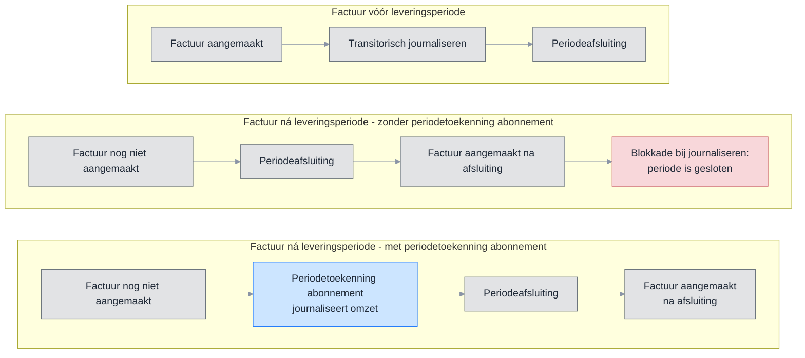

> ⬜ Grijs = bestaand &nbsp;&nbsp; 🟦 Blauw = nieuw &nbsp;&nbsp; 🟥 Rood = blokkade

#### Huidige situatie

Vandaag kent een abonnement alleen de optie Vooraf factureren — de factuur ontstaat vóór de leveringsperiode:

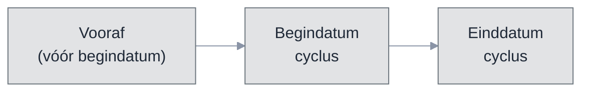

| Factuurmoment | Factuurdatum | Journalisering |
| --- | --- | --- |
| Vooraf | Vóór begindatum cyclus | Transitorisch journaliseren |

Klanten als Facilicom willen echter achteraf factureren. Die mogelijkheid ontbreekt nu.

#### Nieuwe situatie: vijf factuurmomenten op een tijdlijn

Een abonnement heeft een cyclus — de leveringsperiode. Het factuurmoment bepaalt wanneer de factuur ontstaat ten opzichte van die cyclus. Hieronder de vijf waarden op een tijdlijn, met als voorbeeld cyclus april 2026 en Aantal dagen = 10:

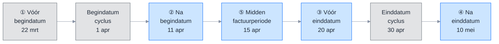

> ⬜ Grijs = bestaand &nbsp;&nbsp; 🟦 Blauw = nieuw

| Nr | Factuurmoment | Berekening | Factuurdatum | Journalisering |
| --- | --- | --- | --- | --- |
| ① | Aantal dagen vóór begindatumcyclus | 1 apr − 10 dagen | 22 mrt | Transitorisch journaliseren of periodetoekenning |
| ② | Aantal dagen ná begindatumcyclus | 1 apr + 10 dagen | 11 apr | Transitorisch journaliseren of periodetoekenning |
| ③ | Aantal dagen vóór einddatumcyclus | 30 apr − 10 dagen | 20 apr | Transitorisch journaliseren of periodetoekenning |
| ④ | Aantal dagen ná einddatumcyclus | 30 apr + 10 dagen | 10 mei | Transitorisch journaliseren of periodetoekenning |
| ⑤ | Midden van de factuurperiode | (1 apr + 30 apr) / 2 | 15 apr | Transitorisch journaliseren of periodetoekenning |

Periodetoekenning abonnement is beschikbaar bij elk factuurmoment. In de wizard bepaal je per periode welke abonnementsregels meedoen.

> **Samenloop met transitorisch journaliseren.** Bestaat er een periodetoekenningsregel voor een abonnementsregel in een periode? Dan slaat transitorisch journaliseren die regel over — periodetoekenning abonnement wint. Een verwijderde toekenningsregel (status Verwijderd) telt niet mee: het tijdvak gedraagt zich alsof er geen toekenningsregel is. Transitorisch journaliseren werkt dan gewoon zoals voorheen.

Dit probleem pakken we langs twee lijnen aan:
- **RPT00702** zorgt dat journalisering bij een geblokkeerde periode doorschuift naar de eerstvolgende vrije periode.
- **RPT00692** (dit ontwerp) voegt een tabblad toe waarmee je vóór de afsluiting omzet per abonnement kunt toekennen aan de juiste periode.

### 1.2 Vooronderzoek

- Klantgesprekken met Facilicom over hun periodeafsluitingsproces
- Analyse van de bestaande abonnementen- en facturatieflow in Profit
- Inventarisatie van de boekingslogica rond Te factureren abonnementen omzet en Omzet

### 1.3 Resultaat

Op het bestaande Periodeafsluitingsplan komt een nieuw tabblad **Periodetoekenningsregels abonnementen** (zichtbaar als Periodetoekenning abonnement toepassen aan staat, B44) met twee acties:
1. **Genereer periodetoekenningsregels** — opent een wizard (1 stap) waarin je via multi-select kiest welke abonnementsregels periodetoekenning abonnement krijgen. De geselecteerde regels worden direct aangemaakt én gejournaliseerd — er is geen aparte journaliseerstap.
2. **Verwijder toekenningsregels** — verwijdert geselecteerde toekenningsregels en draait de bijbehorende journaalposten automatisch terug. Het systeem valideert of de periode niet geblokkeerd is.

De wizard toont alleen abonnementsregels die over de gekozen periode lopen, waarvoor nog niet is gefactureerd en waarvoor nog geen toekenningsregel bestaat. De wizard bestaat uit 1 stap: bovenin staan boekjaar en periode, daaronder de toekenbare regels.

Bij de facturatieverwerking bepaalt het bestaan van een toekenningsregel de grootboekrekening: mét toekenningsregel boekt het systeem op de tussenrekening, zonder op de omzetrekening.

#### Praatplaat

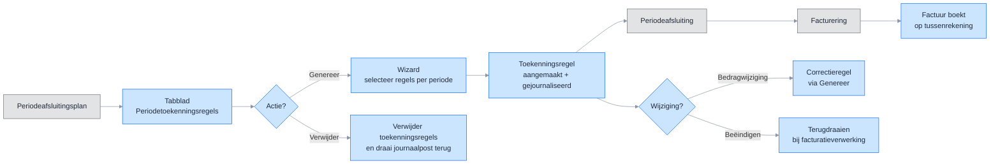

> ⬜ Grijs = bestaand &nbsp;&nbsp; 🟦 Blauw = nieuw

#### 1.4 Afbakening

**Tabblad en acties**

- Nieuw tabblad Periodetoekenningsregels abonnementen op het Periodeafsluitingsplan — centraal ingangspunt voor beide acties
- Genereer-actie: regels aanmaken én direct journaliseren in één stap
- Verwijderactie: geselecteerde toekenningsregels verwijderen met automatisch terugdraaien van de journaalpost; validatie op geblokkeerde periode
- Wizard met 1 stap en multi-select voor selectie van toekenbare regels per periode
- Geparkeerde abonnementen doen mee in de wizard met het laatst bekende bedrag

**Verwerking terugdraaien**

- Terugdraaien bij beëindigen abonnementsregel (bij de facturatieverwerking)
- Terugdraaien bij verwijderen abonnementsregel — toekenningsregel blijft staan, de volgende Genereer toont een tegenboeking
- Correctie bij bedragwijziging via Genereer — de wizard toont het verschilbedrag als correctieregel
- Creditfactuurafhandeling via standaard flow — negatief bedrag corrigeert automatisch

**Datamodel en instellingen**

- Activering via vinkje Periodetoekenning abonnement toepassen op Facturering/voorraad (tabblad Abonnementen) — alleen zichtbaar als module Abonnementen actief is. Staat het vinkje uit, dan is de volledige functionaliteit verborgen.
- Nieuwe tabel Toekenningsregels voor opslag van toekenningen en tegenboekingen
- Nieuw veld Factuurmoment op het abonnement (vijf waarden, standaard: Aantal dagen voor begindatumcyclus). Defaultwaarde instelbaar op het verkooprelatieprofiel; bij het aanmaken van een nieuw abonnement neemt het systeem de waarde over
- Uitbreiding wizard Collectief wijzigen abonnementen met veld Factuurmoment (zichtbaar en verplicht bij het vinkje Aantal dagen vooraf)
- Facturatielogica: bestaan van een toekenningsrecord bepaalt tussenrekening vs. omzetrekening
- Nieuw tabblad Financiële mutaties op Eigenschappen abonnement — weergave met aan het abonnement gekoppelde financiële mutaties

### 1.5 Begrippen

| Term | Betekenis |
| --- | --- |
| Factuurmoment | Instelling op het abonnement die bepaalt wanneer de factuur wordt aangemaakt ten opzichte van de cyclus. Vijf waarden: Aantal dagen voor begindatumcyclus, Aantal dagen na begindatumcyclus, Aantal dagen voor einddatumcyclus, Aantal dagen na einddatumcyclus, Midden van de factuurperiode. Standaard: Aantal dagen voor begindatumcyclus. Op het verkooprelatieprofiel kan een afwijkende standaard worden ingesteld per profiel. |
| Periodetoekenning abonnement | Omzet van abonnementen toerekenen aan de juiste perioden vóór de periodeafsluiting |
| Periodetoekenning abonnement toepassen | Vinkje op Facturering/voorraad (tabblad Abonnementen) dat de volledige periodetoekenningsfunctionaliteit activeert. Alleen zichtbaar als de module Abonnementen actief is. |
| Toekenningsregel | Record dat een abonnementsregel koppelt aan een boekjaar en periode. Wordt direct gejournaliseerd bij genereren. |
| Journaalpost omzettoekenning | Boeking: Te factureren abonnementen omzet → Omzet |
| Tegenboeking toekenning | Boeking: Omzet → Te factureren abonnementen omzet |
| Omzet | Grootboekrekening waarop de omzet definitief wordt geboekt |
| Te factureren abonnementen omzet | Balansrekening waarop omzet tijdelijk staat totdat toekenning plaatsvindt. Wordt ingesteld op Facturering/voorraad (tabblad Abonnementen, veldgroep Periodetoekenning abonnement). |
| Netto-saldo | Som van alle toekenningsregels per abonnementsregel (gejournaliseerd + tegengeboekt) |
| Geparkeerd abonnement | Abonnement dat tijdelijk niet gefactureerd wordt, bijvoorbeeld omdat een indexering nog niet vaststaat. Omzet over deze perioden kan via periodetoekenning abonnement worden toegerekend met het laatst bekende bedrag. |
| Crediteren | Optioneel vinkje op de abonnementsregel na het invullen van een einddatum. Maakt creditfactuurregels aan bij de volgende facturatieverwerking. Vereist verstuurde facturen. Crediteren vanaf moet binnen de laatst gefactureerde periode vallen. |

### 1.6 Bijlagen

| Bijlage | Titel |
| --- | --- |
| [Bijlage D](#bijlage-d--open-punten-en-beslissingen) | Open punten en beslissingen |
| [Bijlage F](#bijlage-f--work-items-developer) | Work items developer |
| [Bijlage G](#bijlage-g--podium-specificaties) | Podium-specificaties |

---

## 2. Globale beschrijving

Periodetoekenning abonnement rekent de omzet van een abonnement toe aan de juiste periode. Dat gebeurt vóór de periodeafsluiting, ook als de factuur er nog niet is. Zo kun je de periode altijd afsluiten.

Je werkt vanuit één plek: een nieuw tabblad op het Periodeafsluitingsplan. Daar genereer je toekenningsregels en verwijder je ze weer. Elke regel wordt direct gejournaliseerd. Bij het factureren bepaalt de toekenningsregel op welke grootboekrekening de omzet komt.

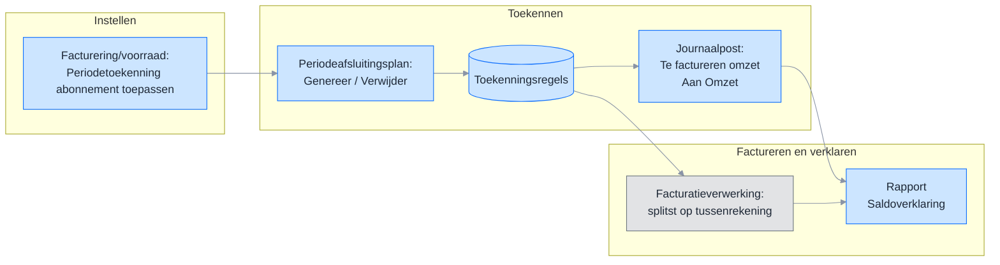

> ⬜ Grijs = bestaand &nbsp;&nbsp; 🟦 Blauw = nieuw

### 2.1 Hoe periodetoekenning abonnement werkt

- Je kiest in een wizard per periode welke abonnementsregels meedoen.
- Het systeem maakt een toekenningsregel aan en journaliseert die meteen.
- De boeking gaat van Te factureren abonnementen omzet naar Omzet.
- Bestaat er een toekenningsregel? Dan slaat transitorisch journaliseren die regel over. Periodetoekenning abonnement wint.
- Bij het factureren splitst het systeem het bedrag. Het toegekende deel gaat naar de tussenrekening. Een verschil gaat naar de omzetrekening.

### 2.2 Factuurmoment

Het factuurmoment is een nieuw veld op het abonnement. Het bepaalt wanneer de factuur ontstaat ten opzichte van de cyclus. De cyclus is de leveringsperiode van het abonnement.

Het factuurmoment kent vijf waarden. Bij vier waarden geef je ook een Aantal dagen op. Dat aantal verschuift de factuurdatum vóór of na de begin- of einddatum van de cyclus.

```mermaid
%%{init: {'themeVariables': {'lineColor': '#8a94a6'}}}%%
flowchart LR
    M1["Aantal dagen voor<br/>begindatumcyclus"] --> BD([Begindatum cyclus])
    BD --> M2["Aantal dagen na<br/>begindatumcyclus"]
    M2 --> M5["Midden van<br/>de factuurperiode"]
    M5 --> M3["Aantal dagen voor<br/>einddatumcyclus"]
    M3 --> ED([Einddatum cyclus])
    ED --> M4["Aantal dagen na<br/>einddatumcyclus"]

    style BD fill:#e2e3e5,stroke:#6c757d,color:#1f2937
    style ED fill:#e2e3e5,stroke:#6c757d,color:#1f2937
    style M1 fill:#cce5ff,stroke:#0d6efd,color:#1f2937
    style M2 fill:#cce5ff,stroke:#0d6efd,color:#1f2937
    style M3 fill:#cce5ff,stroke:#0d6efd,color:#1f2937
    style M4 fill:#cce5ff,stroke:#0d6efd,color:#1f2937
    style M5 fill:#cce5ff,stroke:#0d6efd,color:#1f2937
```

> ⬜ Grijs = grens van de cyclus &nbsp;&nbsp; 🟦 Blauw = factuurmoment

| Factuurmoment | Wanneer ontstaat de factuur |
| --- | --- |
| Aantal dagen voor begindatumcyclus | Een aantal dagen vóór de begindatum van de cyclus |
| Aantal dagen na begindatumcyclus | Een aantal dagen ná de begindatum van de cyclus |
| Aantal dagen voor einddatumcyclus | Een aantal dagen vóór de einddatum van de cyclus |
| Aantal dagen na einddatumcyclus | Een aantal dagen ná de einddatum van de cyclus |
| Midden van de factuurperiode | Halverwege de cyclus |

Standaard staat het factuurmoment op Aantal dagen voor begindatumcyclus. Dat is het bestaande gedrag: vooraf factureren. Bestaande abonnementen krijgen automatisch deze waarde.

Het factuurmoment bepaalt of je periodetoekenning abonnement nodig hebt. Valt de factuurdatum ná de periodeafsluiting? Dan is er geen factuur om te journaliseren. Met periodetoekenning abonnement ken je de omzet dan toch toe aan de juiste periode. Bij elk factuurmoment kun je periodetoekenning abonnement gebruiken.

Op het verkooprelatieprofiel stel je een standaard factuurmoment in per profiel. Maak je een nieuw abonnement aan? Dan neemt het systeem die standaard over. Wijzig je het profiel later? Dan verandert er niets aan bestaande abonnementen.

### 2.3 Overzicht getroffen componenten

| Component | Type | Wijziging |
| --- | --- | --- |
| Toekenningsregels | Nieuwe tabel | Slaat toekenningen, correcties en tegenboekingen op per abonnementsregel, boekjaar en periode |
| Instellingen Facturering/voorraad | Bestaande tabel | Nieuw vinkje Periodetoekenning abonnement toepassen en nieuwe grootboekrekening Te factureren abonnementen omzet (tabblad Abonnementen) |
| Abonnement | Bestaande tabel | Nieuw veld Factuurmoment (vijf waarden). Veld Aantal dagen vooraf hernoemd naar Aantal dagen. Veld Dagen achteraf vervalt |
| Verkooprelatieprofiel | Bestaande tabel | Standaard Factuurmoment en Aantal dagen voor nieuwe abonnementen |
| Subadministratie koppeling | Bestaande tabel | Nieuw veld Periodetoekenningsregel dat de journaalpost aan de toekenningsregel koppelt |
| Integratiesoort periodetoekenning | Nieuwe integratiesoort | Nieuwe integratiesoort binnen het integratieschema abonnementen. Bepaalt per administratie het dagboek waarin de journaalposten van periodetoekenning worden geboekt. Alleen dagboeken van het type Variabel memoriaal zijn kiesbaar |
| Periodeafsluitingsplan | Bestaand scherm | Nieuw tabblad Periodetoekenningsregels abonnementen met de acties Genereer en Verwijder |
| Genereer periodetoekenningsregels | Nieuwe wizard | Eén stap, multi-select. Maakt regels aan en journaliseert direct. Toont Toekenning, Correctie en Tegenboeking |
| Verwijder toekenningsregels | Nieuwe actie | Verwijdert regels en draait de journaalpost terug. Controleert op een geblokkeerde periode |
| Alle periodetoekenningsregels | Nieuw menu-item | Weergave van alle toekenningsregels met de actie Verwijderen |
| Saldoverklaring Te factureren abonnementen omzet | Nieuw rapport | Wizard met 2 stappen die het saldo op de tussenrekening verklaart |
| Eigenschappen abonnement | Bestaand scherm | Nieuw tabblad Financiële mutaties met gekoppelde verkoopfactuurjournaalposten, periodetoekenningsregels en transitorische journaalposten |
| Eigenschappen journaalpost en journaalpostregel | Bestaand scherm | Nieuw tabblad Periodetoekenningsregels |
| Boekingslay-out abonnement | Bestaand scherm | Nieuw veld Factuurmoment |
| Wizard Collectief wijzigen abonnementen | Bestaand scherm | Uitgebreid met veld Factuurmoment; het veld verschijnt en is verplicht zodra het vinkje Aantal dagen vooraf aan staat en wordt dan collectief bijgewerkt |
| Facturatieverwerking | Bestaande verwerking | Boekt op de tussenrekening als er een toekenningsregel is, anders direct op de omzetrekening |
| Periodetoekenningsregels | Nieuwe gegevensverzameling | Bron voor analyses en rapportages over periodetoekenning |
| Saldoverklaring Te factureren abonnementen omzet | Nieuwe gegevensverzameling | Bron voor het saldoverklaringsrapport |

---

## 3. User stories

### 3.0 Overzicht

| Nr | User story | Toelichting |
| --- | --- | --- |
| US01 | Tabblad Periodetoekenningsregels abonnementen op Periodeafsluitingsplan | Nieuw tabblad met een weergave van alle toekenningsregels van de periode. Van hieruit start je de acties Genereer (US02) en Verwijder (US03). |
| US02 | Periodetoekenningsregels genereren | Regels aanmaken en direct journaliseren via de actie Genereer. Wizard met 1 stap toont drie soorten: Toekenning, Correctie en Tegenboeking. Creditfacturen lopen mee als negatief bedrag. |
| US03 | Toekenningen verwijderen | Toekenningsregels verwijderen met automatisch terugdraaien van journaalposten. Validatie op geblokkeerde periode. Ook beschikbaar via een standalone menu-item. |
| US04 | Correctie bij bedragwijziging via Genereer | Bij Genereer toont de wizard correctieregels voor abonnementsregels waarvan het bedrag is gewijzigd. De gebruiker selecteert of het verschil wordt toegekend. |
| US05 | Automatisch terugdraaien bij beëindigen | Toekomstige toekenningen terugdraaien bij factuurmoment als einddatum is ingesteld |
| US06 | Verwijderen abonnementsregel met uitgesteld terugdraaien | Bij verwijdering blijft de toekenningsregel staan. Bij de volgende Genereer toont de wizard een tegenboeking die de gebruiker selecteert. |
| US07 | Rapport: Saldoverklaring Te factureren abonnementen omzet | Nieuw rapport (wizard, 2 stappen). Verklaart het volledige saldo op de tussenrekening: facturatie, periodetoekenning, tegenboekingen en handmatige boekingen. Gegevensverzameling §5.2. |
| US08 | Instelling factuurmoment op abonnement | Nieuw veld Factuurmoment op abonnement met vijf waarden. Systeemstandaard op omgevingsinstelling (Facturering/voorraad). Default per profiel op verkooprelatieprofiel. |
| US09 | Activering periodetoekenning abonnement en instelling grootboekrekening | Activering via vinkje Periodetoekenning abonnement toepassen op Facturering/voorraad. Centrale instelling grootboekrekening, facturatielogica en samenloop transitorisch journaliseren |
| US10 | Financiële mutaties op Eigenschappen abonnement | Eén tabblad met financiële mutaties die aan het abonnement zijn gekoppeld, waaronder verkoopfactuurjournaalposten, periodetoekenningsregels en transitorische journaalposten. |
| US11 | Periodetoekenningsregels op Eigenschappen journaalpost en journaalpostregel | Tabblad Periodetoekenningsregels op Eigenschappen journaalpost en Eigenschappen journaalpostregel. Koppeling via tabel Subadministratie koppeling. |
| US12 | Collectief wijzigen abonnementen: Factuurmoment meenemen | Wizard Collectief wijzigen abonnementen uitgebreid met veld Factuurmoment. Het veld volgt het bestaande vinkje Aantal dagen vooraf en werkt het factuurmoment (US08) collectief bij. |

---

### 3.1 US01 – Tabblad Periodetoekenningsregels abonnementen op Periodeafsluitingsplan

**Als** financieel medewerker **wil ik** op het Periodeafsluitingsplan een tabblad met de periodetoekenningsregels van de periode, **zodat** ik in één overzicht zie wat is toegerekend en van daaruit kan genereren (US02) en verwijderen (US03).

#### Praatplaat

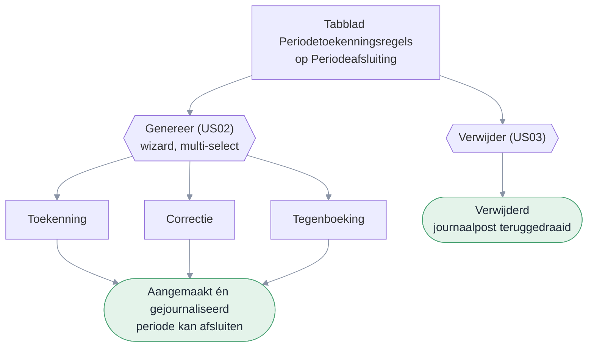

#### Mockups

*Tabblad Periodetoekenningsregels abonnementen op Periodeafsluiting — mockup: *`pages/rpt00692-abonnement-cyclus/detail.ts`

> Zie de Podium-specificatie in [Bijlage G1](#g1--us01-tabblad-op-periodeafsluiting-embedded-listpage).

#### Functionele uitwerking

Op het Periodeafsluitingsplan komt een nieuw tabblad **Periodetoekenningsregels abonnementen**. Dit tabblad is alleen zichtbaar als Periodetoekenning toepassen aan staat op Facturering/voorraad (B44). Boekjaar en periode neemt het tabblad over van het hoofdscherm; het grid start leeg.

Het tabblad toont alle toekenningsregels van de periode en biedt twee acties: **Genereer periodetoekenningsregels** (US02) en **Verwijder toekenningsregels** (US03). Beide acties zijn apart autoriseerbaar.

#### Scherm en gedrag

Het tabblad Periodetoekenningsregels abonnementen zit op het Periodeafsluitingsplan, boven Dossier. Het toont een weergave met twee acties.
Het grid toont alle toekenningsregels waarvan de journaalpost is geboekt in de huidige (tabblad-)periode, óf waarvan het factuurtijdvak in de huidige periode valt. Zo zie je zowel de regels die in deze periode zijn gejournaliseerd als de regels die over deze periode gaan (inclusief retroactieve correcties uit voorgaande perioden die hier zijn gejournaliseerd, en regels over deze periode die in een latere open periode zijn gejournaliseerd).

| Veld | Gedrag |
| --- | --- |
| Jaar | Overgenomen van hoofdscherm, alleen-lezen |
| Periode | Overgenomen van hoofdscherm, alleen-lezen |
| Jaar (factuur) | Alleen-lezen, afgeleid van de toekenningsregel. Periode van het factuurtijdvak waarover de toekenningsregel gaat. |
| Periode (factuur) | Alleen-lezen, afgeleid van de toekenningsregel. |
| Jaar (journaalpost) | Alleen-lezen, afgeleid van de toekenningsregel. Periode waarin de journaalpost is geboekt. |
| Periode (journaalpost) | Alleen-lezen, afgeleid van de toekenningsregel. |
| Grid | Rijen aanvinkbaar. Tegenboekingsregels zijn grijs en niet aanvinkbaar |
| Genereer | Alleen actief als de periode nog niet is afgesloten (US02) |
| Verwijder | Alleen actief als minimaal één regel met status Gejournaliseerd is geselecteerd (US03) |

#### Autorisatie

Toegang tot het tabblad volgt het bestaande recht op het Periodeafsluitingsplan. De acties Genereer en Verwijder zijn apart autoriseerbaar (zie US02 en US03).

---

### 3.2 US02 – Periodetoekenningsregels genereren

**Als** financieel medewerker **wil ik** periodetoekenningsregels genereren via de Genereer-wizard op het tabblad (US01), **zodat** omzet correct aan perioden wordt toegerekend en direct gejournaliseerd.

#### Mockups

*Genereer-wizard (1 stap, multi-select) — mockup: *`pages/rpt00692-genereer-wizard/detail.ts`

> Zie de Podium-specificatie in [Bijlage G2](#g2--us02-genereer-wizard-wizardpage).

#### Functionele uitwerking

**Genereer**

Met de actie **Genereer periodetoekenningsregels** open je een wizard met 1 stap. Bovenin staan boekjaar en periode (alleen-lezen). Daaronder toont het systeem alle regels die in aanmerking komen als multi-select. Je selecteert welke regels je wilt verwerken en klikt op Voltooien. De geselecteerde regels worden aangemaakt én direct gejournaliseerd. De actie draait als batchverwerking in de wachtrij.

De wizard toont drie soorten regels:

| Soort | Wanneer in de wizard | Kolom Bestaande toekenning | Bedrag |
| --- | --- | --- | --- |
| Toekenning | Abonnementsregel zonder toekenning voor deze periode | Leeg | Volledig periodetoekenningsbedrag |
| Correctie | Abonnementsregel met bestaande toekenning maar gewijzigd bedrag (US04) | Toont het al toegerekende bedrag | Alleen het verschilbedrag |
| Tegenboeking | Abonnementsregel verwijderd met openstaande toekenning (US06) | Toont het openstaande bedrag | Negatief bedrag |

**Toekenning** — een abonnementsregel komt in aanmerking als:
- de regel loopt over de gekozen periode of een eerdere periode
- er is nog niet gefactureerd voor die regel in die periode
- er bestaat nog geen gejournaliseerde toekenningsregel voor die periode

**Correctie** — een correctieregel verschijnt als:
- er bestaat een gejournaliseerde toekenningsregel voor deze abonnementsregel in deze periode
- het huidige bedrag op de abonnementsregel wijkt af van de som van gejournaliseerde toekenningsregels

**Tegenboeking** — een tegenboekingsregel verschijnt als:
- de abonnementsregel is verwijderd
- er bestaan nog gejournaliseerde toekenningsregels voor die abonnementsregel

De gebruiker bepaalt wat wordt verwerkt (B53). Niet-geselecteerde regels blijven staan. Bij correcties en tegenboekingen vangt de facturatielogica (B33) eventuele restverschillen op.

Een abonnementsregel mag uit meerdere toekenningsregels bestaan.

**Correcties ná het afsluiten van een periode**

Soms wijzigt een abonnementsregel na het sluiten van een periode. Het systeem past een gesloten periode niet aan. Genereer maakt dan een correctieregel in de huidige open periode.

Voor de correctieregel geldt:

- Het boekjaar en de periode blijven die van de gesloten periode.
- De journaalpost komt in de huidige open periode.
- De wizard toont de correctie in de multi-select. Je ziet het label van de oorspronkelijke periode. Zo weet je wat je boekt.

Je kunt Genereer niet starten op een gesloten periode. Correcties lopen altijd via de eerste open periode.

**Journalisering**

De journaalposten (Te factureren abonnementen omzet → Omzet) worden direct geboekt bij het genereren. Na voltooien is de status Gejournaliseerd. De omzetrekening volgt de artikelgroep van de abonnementsregel.

Voor correctieregels over een reeds gesloten periode geldt: de toekenningsregel houdt boekjaar en periode van de oorspronkelijke periode (het factuurtijdvak), en de journaalpost wordt geboekt in de huidige open periode waarin Genereer draait.

**Berekening en verdeling**

Het bedrag per toekenningsregel volgt dezelfde verdelingslogica als transitorisch journaliseren. De verdelingsmethode op het abonnement bepaalt de verdeling over perioden. Afrondingsverschillen komen in de laatste periode; is die gesloten, dan schuift de compensatie door naar de eerstvolgende vrije periode.

**Creditfacturen**

Creditfacturen lopen mee in de periodetoekenning. Een creditfactuurregel heeft een negatief bedrag. Crediteren op een abonnementsregel is optioneel na het invullen van een einddatum en vereist verstuurde facturen (B47, B48).

Bij de volgende Genereer vergelijkt het systeem het verwachte bedrag (inclusief de credit) met het netto-saldo van de toekenningsregels. Genereer maakt een negatieve toekenningsregel per gecrediteerd tijdvak. Die corrigeert het saldo op Te factureren abonnementen omzet — geen aparte actie nodig.

Zonder periodetoekenning gaat de creditfactuur direct naar de omzetrekening (B33, B50). Zie US05 voor de volledige uitwerking en voorbeelden.

**Foutafhandeling**

Genereer werkt alles-of-niets. Gaat er iets mis halverwege? Dan draait het systeem alle wijzigingen terug. Er blijven geen halve resultaten achter.

#### Acceptatiecriteria

**Genereer**

1. Na Genereer staan de geselecteerde abonnementsregels in het grid met status Gejournaliseerd en zijn de journaalposten geboekt.
2. Een tweede Genereer voor dezelfde periode maakt geen dubbele regels.
3. Genereer is alleen beschikbaar als de periode nog open is; op een gesloten periode is de actie verborgen.
4. Bij een herhaalde Genereer worden nieuwe toekenningsregels aangemaakt.
5. Wijzigingen op een abonnementsregel over een reeds gesloten periode leiden bij de volgende Genereer (in een open periode) tot een aparte correctie-toekenningsregel met de oorspronkelijke periode als factuurtijdvak; de journaalpost wordt geboekt in de huidige open periode.

**Creditfacturen** — Een creditfactuurregel leidt tot een toekenningsregel met negatief bedrag. Na genereren is het saldo op Te factureren abonnementen omzet gecorrigeerd.

**Foutafhandeling** — Bij een fout worden boeking en statuswijziging teruggedraaid (alles-of-niets).

#### Meldingstekst

| Situatie | Melding |
| --- | --- |
| Geen toekenbare regels | Geen toekenbare factuurregels gevonden voor deze periode. |

#### Autorisatie

De actie Genereer is apart autoriseerbaar via het rechtenobject **Periodetoekenning genereren** (standaard aan). Heeft een gebruiker geen recht? Dan is de actieknop niet zichtbaar. Toegang tot het tabblad en het grid volgt het recht op het Periodeafsluitingsplan (US01).

---

### 3.3 US03 – Toekenningen verwijderen

**Als** financieel medewerker **wil ik** toekenningsregels kunnen verwijderen bij foutieve toekenning of beëindiging, **zodat** omzet niet ten onrechte op Omzet blijft staan.

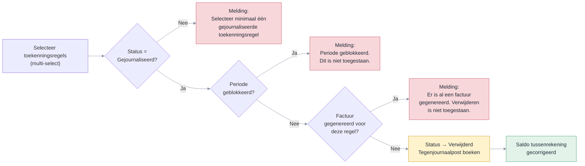

#### Mockups

*Menu-item Alle periodetoekenningsregels (standalone weergave) — mockup: *`pages/rpt00692-toekenningsregels/index.ts`

> Zie de Podium-specificatie in [Bijlage G3](#g3--us03-alle-periodetoekenningsregels-listpage).

#### Functionele uitwerking

Met **Verwijder toekenningsregels** verwijder je gejournaliseerde toekenningen via multi-select. Het systeem zet per geselecteerde regel de status op Verwijderd en boekt de tegenjournaalpost: Omzet → Te factureren abonnementen omzet. Het record blijft bewaard voor audit trail.

Een verwijderde toekenningsregel telt niet mee voor de samenloop met transitorisch journaliseren. Het tijdvak gedraagt zich alsof er geen toekenningsregel is.

Bij het verwijderen valideert het systeem of de periode geblokkeerd is. Is de periode geblokkeerd, dan verschijnt de foutmelding: "Periode geblokkeerd. Dit is niet toegestaan." De actie wordt niet uitgevoerd.

Daarnaast valideert het systeem of er al een factuur is gegenereerd voor deze abonnementsregel in deze periode en dit tijdvak. Is dat het geval, dan verschijnt de foutmelding: "Er is al een factuur gegenereerd voor deze abonnementsregel in deze periode. Verwijderen is niet toegestaan." De toekenningsregel kan dan niet worden verwijderd.

Alleen regels met status Gejournaliseerd kunnen worden verwijderd. De actie draait als batchverwerking.

#### Acceptatiecriteria

1. Verwijderen zet de status op Verwijderd en boekt een tegenjournaalpost. Het record wordt niet fysiek verwijderd.
2. Een verwijderde toekenningsregel telt niet mee: het tijdvak gedraagt zich alsof er geen toekenningsregel is.
3. Tegenjournaalposten zijn geboekt via de journalisatieprocedure.
4. Na verwijderen toont Te factureren abonnementen omzet het teruggedraaide bedrag als openstaand saldo.
5. Bij een geblokkeerde periode verschijnt de foutmelding: "Periode geblokkeerd. Dit is niet toegestaan."
6. Bij een gegenereerde factuur voor deze abonnementsregel in deze periode verschijnt de foutmelding: "Er is al een factuur gegenereerd voor deze abonnementsregel in deze periode. Verwijderen is niet toegestaan."

#### Meldingstekst

| Situatie | Melding |
| --- | --- |
| Geen regels geselecteerd | Selecteer minimaal één gejournaliseerde toekenningsregel. |
| Periode geblokkeerd | Periode geblokkeerd. Dit is niet toegestaan. |
| Factuur gegenereerd | Er is al een factuur gegenereerd voor deze abonnementsregel in deze periode. Verwijderen is niet toegestaan. |

#### Tooltiptekst

| Onderdeel | Tekst |
| --- | --- |
| Verwijder toekenningsregels | Verwijder geselecteerde regels en draai de journaalpost terug. |

#### Autorisatie

De actie Verwijder is apart autoriseerbaar via het rechtenobject Periodetoekenning verwijderen (zie US01). Heeft een gebruiker geen recht? Dan is de actieknop niet zichtbaar.

#### Scherm en gedrag

Verwijderen is beschikbaar op het tabblad Periodetoekenningsregels (US01) en op het standalone menu-item Alle periodetoekenningsregels.

#### Menu-items

Er komt een nieuw submenu **Periodetoekenning** onder Abonnementen &rarr; Facturering. Binnen dit submenu komen twee menu-items: de weergave met alle toekenningsregels en de saldoverklaring.

**Submenu**

| Eigenschap | Waarde |
| --- | --- |
| Menupad | Abonnementen &rarr; Facturering &rarr; Periodetoekenning |
| Positie | Tussen Facturen en Journaliseren |
| Sneltoets | P (1e letter; niet in gebruik binnen Facturering — bestaande items: Facturen (F), Journaliseren (J)) |
| Conditie | Zichtbaar als Periodetoekenning toepassen aan staat (B44) |

**Menu-item 1: Alle periodetoekenningsregels**

| Eigenschap | Waarde |
| --- | --- |
| Menupad | Abonnementen &rarr; Facturering &rarr; Periodetoekenning &rarr; Alle periodetoekenningsregels |
| Sneltoets | A (1e letter; niet in gebruik binnen submenu Periodetoekenning) |
| Conditie | Zichtbaar als submenu zichtbaar is |
| Autorisatie | Bestaand recht op Periodeafsluitingsplan. Actie Verwijder apart autoriseerbaar (Periodetoekenning verwijderen). |
| Filter | Geen (alle regels) |
| Acties | Verwijder toekenningsregels |

**Menu-item 2: Saldoverklaring Te factureren abonnementen omzet**

| Eigenschap | Waarde |
| --- | --- |
| Menupad | Abonnementen &rarr; Facturering &rarr; Periodetoekenning &rarr; Saldoverklaring Te factureren abonnementen omzet |
| Sneltoets | S (1e letter; niet in gebruik binnen submenu Periodetoekenning — bestaand: Alle (A)) |
| Conditie | Zichtbaar als submenu zichtbaar is |
| Autorisatie | Bestaand recht op Periodeafsluitingsplan. Geen apart autorisatierecht. Geen rolconversie nodig. |

> **Opmerking:** De saldoverklaring heeft geen autoriseerbare acties. Toegang volgt het recht op Periodeafsluitingsplan.

---

### 3.4 US04 – Correctie bij bedragwijziging via Genereer

**Als** financieel medewerker **wil ik** bij Genereer zien welke abonnementsregels een bedragwijziging hebben ten opzichte van de bestaande toekenning, **zodat** ik zelf kan beslissen of ik het verschil wil toekennen.

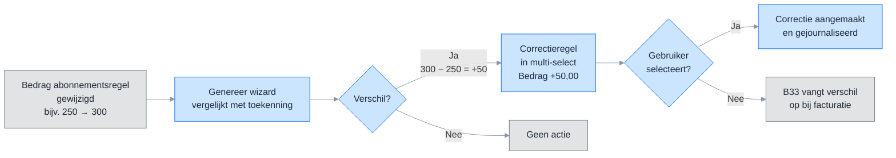

> ⬜ Grijs = bestaand &nbsp;&nbsp; 🟦 Blauw = nieuw

#### Wat is een delta-regel?

Een toekenningsregel met soort **Correctie** legt het verschil vast tussen het al toegerekende bedrag en het huidige bedrag op de abonnementsregel. De oorspronkelijke toekenningsregel blijft ongewijzigd. Het verschil wordt apart geboekt.

In de Genereer-wizard en in alle weergaven toont de kolom **Soort** wat voor regel het is:

| Soort | Betekenis |
| --- | --- |
| Toekenning | Eerste periodetoekenning voor deze abonnementsregel in deze periode |
| Correctie | Verschilboeking doordat het bedrag op de abonnementsregel is gewijzigd na een eerdere toekenning |
| Tegenboeking | Terugdraaien van openstaande toekenning bij verwijderde abonnementsregel |

| Situatie | Bestaande toekenning | Huidig bedrag | Bedrag (soort Correctie) |
| --- | --- | --- | --- |
| Verhoging | 250,00 | 300,00 | +50,00 |
| Verlaging | 250,00 | 200,00 | −50,00 |

In de wizard toont de kolom **Bestaande toekenning** het al toegerekende bedrag. Bij soort Toekenning is die kolom leeg.

#### Functionele uitwerking

Bij Genereer vergelijkt het systeem per abonnementsregel het huidige bedrag met de som van bestaande gejournaliseerde toekenningsregels voor die periode. Is er een verschil? Dan toont de wizard een regel met soort **Correctie** in de multi-select. De kolom Bestaande toekenning toont het al toegerekende bedrag. De gebruiker selecteert of hij het verschil wil toekennen.

De gebruiker bepaalt wat wordt toegekend (B53).

**Voorbeeld**: er bestaat een toekenning van 250,00 voor april. Het abonnementsbedrag is gewijzigd naar 300,00. Bij Genereer voor april toont de wizard een regel met soort Correctie, Bestaande toekenning 250,00 en Bedrag +50,00. De gebruiker selecteert de regel en klikt Voltooien. De toekenningsregel wordt aangemaakt en direct gejournaliseerd. De netto-toekenning is nu 300,00.

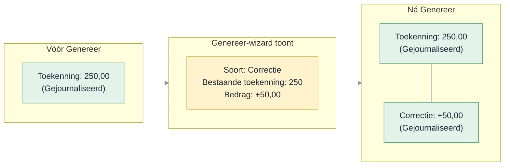

**Wat als de gebruiker de regel niet selecteert?** Dan blijft de bestaande toekenning staan op het oude bedrag. Bij facturatie vangt B33 het verschil op: het toekenningsbedrag gaat naar de tussenrekening, het verschil naar de omzetrekening. Het eindresultaat klopt altijd.

Is de periode al gesloten, dan boekt het systeem de journaalpost in de eerstvolgende vrije periode (B12).

#### Acceptatiecriteria

1. Bij Genereer toont de wizard regels met soort Correctie voor abonnementsregels waarvan het bedrag is gewijzigd ten opzichte van de bestaande toekenning.
2. De kolom Bestaande toekenning toont het al toegerekende bedrag. De kolom Bedrag toont het verschil.
3. De gebruiker selecteert welke regels worden aangemaakt.
4. Een regel met soort Correctie bevat alleen het verschilbedrag. Positief bij verhoging, negatief bij verlaging.
5. Bestaande gejournaliseerde regels blijven ongewijzigd.
6. Als de gebruiker de regel niet selecteert, vangt B33 het verschil op bij facturatie.
7. Bij een gesloten periode boekt het systeem de journaalpost in de eerstvolgende vrije periode.

#### Autorisatie

Onderdeel van de Genereer-actie — autorisatie via rechtenobject Periodetoekenning genereren (zie US02).

---

### 3.5 US05 – Automatisch terugdraaien bij beëindigen

**Als** financieel medewerker **wil ik** dat bij de facturatieverwerking toekomstige gejournaliseerde toekenningsregels automatisch worden teruggedraaid als de abonnementsregel is beëindigd, **zodat** omzet na de einddatum niet ten onrechte op Omzet blijft staan.

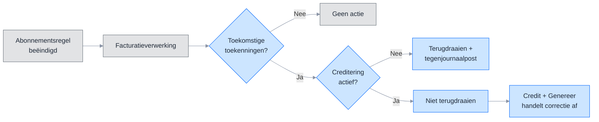

> ⬜ Grijs = bestaand &nbsp;&nbsp; 🟦 Blauw = nieuw

#### Functionele uitwerking

**Context: beëindigen en crediteren**

In Profit zijn beëindigen en crediteren twee aparte stappen:

1. **Beëindigen** — je vult een einddatum in op de abonnementsregel. Het abonnement stopt na die datum.
2. **Crediteren** — je vinkt optioneel Crediteren aan en vult Crediteren vanaf in. Profit maakt dan creditfactuurregels bij de volgende facturatieverwerking.

Crediteren is optioneel. Niet elke beëindiging leidt tot een creditfactuur.

Voorwaarden voor crediteren (B47, B48):
- Er moeten verstuurde facturen bestaan voor de te crediteren periode.
- Crediteren vanaf moet binnen de laatst gefactureerde periode vallen. Vul je een datum buiten die range in, dan verschijnt de foutmelding: "Je kunt alleen crediteren over de periode van [begindatum] t/m [einddatum]. Kies een andere datum."

**Terugdraaien toekomstige toekenningen**

Bij de facturatieverwerking controleert het systeem of een abonnementsregel een einddatum heeft. Zo ja, dan kijkt het naar gejournaliseerde toekenningsregels voor toekomstige perioden (ná de einddatum). Het systeem onderscheidt twee situaties:

1. **Geen creditering voor die periode** — het systeem draait de toekenningsregel terug en boekt een tegenjournaalpost. Er komt geen creditfactuur die het saldo corrigeert.
2. **Wel creditering voor die periode** — het systeem draait de toekenningsregel niet terug (B49). De creditfactuur en de toekenningslogica handelen de correctie af (zie hieronder).

Is de toekomstige periode al gesloten en valt die niet onder creditering? Dan boekt het systeem de tegenjournaalpost in de eerstvolgende vrije periode.

**Creditfactuur met periodetoekenning**

Als crediteren actief is en er bestaat een toekenningsregel voor die periode:
- De facturatielogica (B33) routeert de creditfactuur naar de tussenrekening. De toekenningsregel bestaat nog.
- Bij de volgende Genereer vergelijkt het systeem het verwachte bedrag (nu lager door de credit) met het netto-saldo van de toekenningsregels. Het verschil is het creditbedrag.
- Genereer maakt een negatieve toekenningsregel per gecrediteerd tijdvak. Die wordt direct gejournaliseerd.
- De negatieve toekenningsregel corrigeert de omzet.

**Creditfactuur zonder periodetoekenning**

Als crediteren actief is maar er is geen toekenningsregel:
- De facturatielogica (B33) routeert de creditfactuur naar de omzetrekening. De credit corrigeert de omzet direct.
- Geen extra stap nodig.

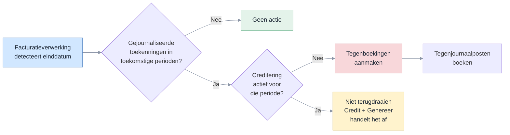

#### Voorbeeld A – Beëindigen met creditering hele periode, met periodetoekenning

Abonnementsregel: 100 per maand. De factuur voor januari is al verstuurd. Toekenning januari is Gejournaliseerd (+100). Het abonnement wordt beëindigd per 31 december. Crediteren is aangevinkt met Crediteren vanaf 1 januari.

**Stap 1 — US05 bij facturatieverwerking:**
Januari valt in de gecrediteerde periode. US05 draait de toekenning niet terug (B49). De toekenningsregel blijft staan.

| Toekenningsregel | Bedrag | Status |
| --- | --- | --- |
| Origineel januari | 100 | Gejournaliseerd (ongewijzigd) |

**Stap 2 — Profit maakt creditfactuurregel -100:**
De toekenningsregel bestaat → B33: creditfactuur naar tussenrekening.

**Stap 3 — Genereer:**
Verwacht bedrag = 0 (origineel 100 − credit 100). Netto-saldo toekenningen = 100. Delta = −100. Genereer maakt een negatieve toekenningsregel aan en journaliseert direct.

| Toekenningsregel | Bedrag | Status | Journaalpost |
| --- | --- | --- | --- |
| Origineel januari | 100 | Gejournaliseerd | Debet Te factureren omzet / Credit Omzet |
| Delta januari | -100 | Gejournaliseerd | Debet Omzet / Credit Te factureren omzet |

**Eindsaldo januari:**

| Rekening | Saldo |
| --- | --- |
| Debiteuren | 0 (factuur 100 − credit 100) |
| Te factureren abonnementen omzet | 0 (factuur 100 − credit 100 + toekenning 100 − toekenning 100) |
| Omzet | 0 (toekenning 100 − delta 100) |

> **Let op:** als US05 de toekenning wél zou terugdraaien, gaat de creditfactuur naar de omzetrekening (geen toekenningsregel meer, B33). De tussenrekening houdt dan een resterend saldo. Dat is een dubbele correctie.

---

#### Voorbeeld B – Beëindigen met creditering halve periode, met periodetoekenning

Abonnementsregel: 100 per maand. Toekenning januari is Gejournaliseerd (+100). Het abonnement wordt beëindigd per 15 januari. Crediteren is aangevinkt met Crediteren vanaf 16 januari.

**Stap 1 — US05 bij facturatieverwerking:**
Januari is de einddatumperiode én valt in de gecrediteerde periode. US05 draait niet terug. Februari en verder worden wél teruggedraaid als daar toekenningen bestaan en die perioden niet gecrediteerd worden.

| Toekenningsregel | Bedrag | Status |
| --- | --- | --- |
| Origineel januari | 100 | Gejournaliseerd (ongewijzigd) |

**Stap 2 — Profit maakt creditfactuurregel -50 (halve maand):**
De toekenningsregel bestaat → B33: creditfactuur naar tussenrekening.

**Stap 3 — Genereer:**
Verwacht bedrag = 50 (origineel 100 − credit 50). Netto-saldo toekenningen = 100. Delta = −50. Genereer maakt een negatieve toekenningsregel aan en journaliseert direct.

| Toekenningsregel | Bedrag | Status | Journaalpost |
| --- | --- | --- | --- |
| Origineel januari | 100 | Gejournaliseerd | Debet Te factureren omzet / Credit Omzet |
| Delta januari | -50 | Gejournaliseerd | Debet Omzet / Credit Te factureren omzet |

**Eindsaldo januari:**

| Rekening | Saldo |
| --- | --- |
| Te factureren abonnementen omzet | 0 (factuur 100 − credit 50 + toekenning 100 − delta 50 = 0) |
| Omzet | 50 (toekenning 100 − delta 50) |

De netto-toekenning van 50 komt overeen met de geleverde halve maand.

---

#### Voorbeeld C – Beëindigen zonder creditering, met periodetoekenning

Abonnementsregel: 100 per maand. Toekenning januari is Gejournaliseerd (+100). Het abonnement wordt beëindigd per 31 december. Crediteren is **niet** aangevinkt.

**Stap 1 — US05 bij facturatieverwerking:**
Geen creditering actief. US05 draait de toekenning voor januari terug en boekt een tegenjournaalpost.

| Actie | Bedrag | Journaalpost |
| --- | --- | --- |
| Origineel januari teruggedraaid | 100 | Debet Omzet / Credit Te factureren omzet |

Netto-saldo toekenningsregels januari: **0**.

**Geen creditfactuur.** Er worden geen creditfactuurregels aangemaakt.

---

#### Voorbeeld D – Beëindigen met creditering, zonder periodetoekenning

Abonnementsregel: 100 per maand. Er is geen toekenningsregel (periodetoekenning niet toegepast). De factuur voor januari is al verstuurd. Het abonnement wordt beëindigd per 31 december. Crediteren is aangevinkt met Crediteren vanaf 1 januari.

**Stap 1 — Profit maakt creditfactuurregel -100:**
Geen toekenningsregel → B33: creditfactuur naar omzetrekening. De credit corrigeert de omzet direct.

**Eindsaldo januari:**

| Rekening | Saldo |
| --- | --- |
| Debiteuren | 0 (factuur 100 − credit 100) |
| Omzet | 0 (factuur 100 − credit 100, beide direct op omzet) |

Geen extra stap nodig.

---

#### Acceptatiecriteria

1. Toekomstige gejournaliseerde toekenningsregels worden automatisch teruggedraaid bij de facturatieverwerking als de abonnementsregel is beëindigd én er geen creditering actief is voor die periode.
2. Bij actieve creditering voor een toekomstige periode draait US05 de toekenning niet terug (B49). De credit + Genereer handelen de correctie af.
3. Tegenjournaalposten (bij situatie zonder creditering) ontstaan zonder gebruikersactie.
4. Bij een gesloten toekomstige periode (zonder creditering) boekt het systeem in de eerstvolgende vrije periode.
5. Creditering hele periode met periodetoekenning: Genereer maakt een negatieve toekenningsregel. Het netto-saldo wordt nul.
6. Creditering halve periode met periodetoekenning: Genereer maakt een delta-regel voor het verschilbedrag.
7. Creditering zonder periodetoekenning: de creditfactuur gaat direct naar de omzetrekening (B33).
8. Crediteren vereist verstuurde facturen (B47). Crediteren vanaf moet binnen de laatst gefactureerde periode vallen (B48).

#### Meldingstekst

| Situatie | Melding |
| --- | --- |
| Geen open periode voor tegenboeking | Automatische tegenboeking is niet mogelijk. Er is geen open periode beschikbaar. Draai de toekenning handmatig terug via het tabblad. |

#### Autorisatie

Systeemactie — geen apart recht vereist.

---

### 3.6 US06 – Verwijderen abonnementsregel met uitgesteld terugdraaien

**Als** financieel medewerker **wil ik** een abonnementsregel kunnen verwijderen zonder dat het systeem direct een tegenboeking vereist, **zodat** de verwijdering nooit wordt geblokkeerd en ik zelf bepaal wanneer de toekenning wordt teruggedraaid.

#### Functionele uitwerking

Bij verwijdering van een abonnementsregel controleert het systeem niet  of er toekenningsregels bestaan. De abonnementsregel wordt direct verwijderd. Bestaande toekenningsregels blijven staan — de koppeling naar de abonnementsregel wordt leeggemaakt maar het record blijft bewaard.

Bij de volgende **Genereer** detecteert het systeem dat de abonnementsregel niet meer bestaat terwijl er nog gejournaliseerde toekenningsregels openstaan. De wizard toont deze regels met soort **Tegenboeking** en een negatief bedrag. De kolom Bestaande toekenning toont het openstaande bedrag. De gebruiker selecteert de tegenboeking en klikt Voltooien.

Factuurregels blijven behouden (geen cascade-delete) — de koppeling wordt leeggemaakt.

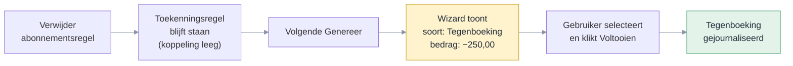

**Voorbeeld**: abonnementsregel AR-0010 heeft een toekenning van 250,00 (Gejournaliseerd) voor april. De gebruiker verwijdert de abonnementsregel. De toekenningsregel blijft staan. Bij de volgende Genereer voor april toont de wizard: soort Tegenboeking, Bestaande toekenning 250,00, Bedrag −250,00. De gebruiker selecteert de regel. Na voltooien is de tegenboeking gejournaliseerd en het saldo op de tussenrekening gecorrigeerd.

#### Acceptatiecriteria

1. Verwijdering van een abonnementsregel is altijd toegestaan — geen blokkering.
2. Toekenningsregels blijven bewaard. De koppeling naar de abonnementsregel wordt leeggemaakt.
3. Factuurregels en journaalposten blijven behouden.
4. Bij de volgende Genereer toont de wizard een regel met soort Tegenboeking en negatief bedrag.
5. De gebruiker selecteert de tegenboeking. Na voltooien is de tegenjournaalpost geboekt.
6. Als de gebruiker de tegenboeking niet selecteert, blijft het saldo open op de tussenrekening.

#### Autorisatie

Onderdeel van de Genereer-actie — autorisatie via rechtenobject Periodetoekenning genereren (zie US02).

---

### 3.7 US07 – Rapport: Saldoverklaring Te factureren abonnementen omzet

**Als** controller **wil ik** het saldo op de tussenrekening Te factureren abonnementen omzet kunnen verklaren, **zodat** ik weet hoe het saldo is opgebouwd uit facturatie, periodetoekenning, tegenboekingen en handmatige boekingen.

#### Mockups

*Rapport Saldoverklaring Te factureren abonnementen omzet — mockup: *`pages/rpt00692-saldoverklaring/detail.ts`

> Zie de Podium-specificatie in [Bijlage G4](#g4--us07-saldoverklaring-wizardpage).

#### Functionele uitwerking

De tussenrekening Te factureren abonnementen omzet heeft altijd een saldo. Dat saldo ontstaat doordat:

- **Facturatie** bedragen op de tussenrekening boekt (debet).
- **Periodetoekenning** bedragen van de tussenrekening afboekt naar Omzet (credit).
- **Tegenboekingen** bedragen terugboeken bij verwijdering of beëindiging (debet).
- **Handmatige boekingen** via memoriaalposten het saldo corrigeren (debet of credit).

Het saldo is dus niet per definitie nul. Dit rapport verklaart het volledige saldo.

Dit is een nieuw rapport: **Saldoverklaring Te factureren abonnementen omzet**. Het opent als wizard met twee stappen:

1. **Stap 1 — Periode kiezen**: je selecteert boekjaar en periode.
2. **Stap 2 — Saldoverklaring**: het rapport toont bovenin een telling met het grootboeksaldo, de som van alle deelcomponenten en het verschil. Daaronder een lijst per abonnementsregel met gefactureerd, toegerekend, teruggedraaid en openstaand saldo. Onderaan staat een aparte rij voor handmatige boekingen.

De gegevens komen uit de gegevensverzameling Saldoverklaring Te factureren abonnementen omzet (§5.2).

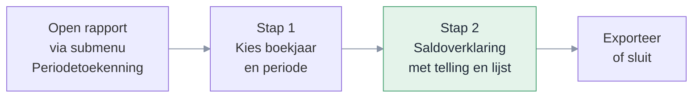

**Opbouw saldo**

Het saldo op de tussenrekening is als volgt opgebouwd:

| Component | Richting | Toelichting |
| --- | --- | --- |
| Gefactureerd | Debet (+) | Facturatieverwerking boekt omzet op de tussenrekening |
| Toegerekend | Credit (−) | Periodetoekenning boekt omzet van de tussenrekening naar Omzet |
| Teruggedraaid | Debet (+) | Verwijdering of beëindiging boekt terug van Omzet naar de tussenrekening |
| Handmatig geboekt | Debet/Credit | Memoriaalposten of overige boekingen op de tussenrekening |

**Formule:** Saldo = Gefactureerd − Toegerekend + Teruggedraaid + Handmatig geboekt

**Handmatige boekingen**

Het rapport haalt alle journaalposten op de tussenrekening op die niet afkomstig zijn van de facturatieverwerking of de periodetoekenning. Die boekingen zijn niet te koppelen aan een abonnementsregel. Het rapport toont ze als apart totaal in de telling en als aparte rij onderaan de lijst (omschrijving: "Handmatige boekingen").

#### Acceptatiecriteria

1. Het rapport verklaart het volledige saldo op de tussenrekening.
2. De som van alle componenten (gefactureerd − toegerekend + teruggedraaid + handmatig) is gelijk aan het grootboeksaldo.
3. Het rapport toont per abonnementsregel: gefactureerd, toegerekend, teruggedraaid en openstaand saldo.
4. Handmatige boekingen op de tussenrekening verschijnen als apart totaal in de telling en als aparte rij in de lijst.
5. Stap 1 toont boekjaar en periode als verplichte velden. Stap 2 toont pas na invullen van stap 1.
6. De telling bovenin stap 2 toont: grootboeksaldo, totaal gefactureerd, totaal toegerekend, totaal teruggedraaid, totaal handmatig geboekt en het verschil.
7. Het rapport heeft een filter "Alleen regels zonder factuurregel" (standaard uit). Staat het filter aan, dan toont de lijst alleen toekenningsregels waaraan nog geen factuurregel is gekoppeld (B10, factuurregel = leeg). Dit helpt bij het identificeren van openstaande toekenningen.

#### Scherm en gedrag

Het rapport valt als menu-item onder het submenu Periodetoekenning. Het opent als wizard met twee stappen.

| Veld | Gedrag |
| --- | --- |
| Administratie | Verplicht, standaard de huidige administratie |
| Boekjaar | Verplicht, standaard het huidige boekjaar |
| Periode | Verplicht, standaard de huidige periode |
| Grootboeksaldo | Alleen-lezen, opgehaald uit het grootboek voor de tussenrekening t/m de gekozen periode |
| Totaal gefactureerd | Alleen-lezen, som van kolom Gefactureerd in de lijst |
| Totaal toegerekend | Alleen-lezen, som van kolom Toegerekend in de lijst |
| Totaal teruggedraaid | Alleen-lezen, som van kolom Teruggedraaid in de lijst |
| Totaal handmatig geboekt | Alleen-lezen, som van journaalposten op de tussenrekening die niet uit facturatie of periodetoekenning komen |
| Verschil | Alleen-lezen, berekend: Grootboeksaldo − (Gefactureerd − Toegerekend + Teruggedraaid + Handmatig). Moet nul zijn. |
| Lijst | Alleen-lezen, gesorteerd op administratie en abonnementsregel |

#### Menu-item

Zie menu-item 2 (Saldoverklaring Te factureren abonnementen omzet) in US03.

---

### 3.8 US08 – Instelling factuurmoment op abonnement

**Als** financieel medewerker **wil ik** per abonnement het factuurmoment instellen, **zodat** het systeem weet wanneer de factuur wordt aangemaakt ten opzichte van de cyclus.

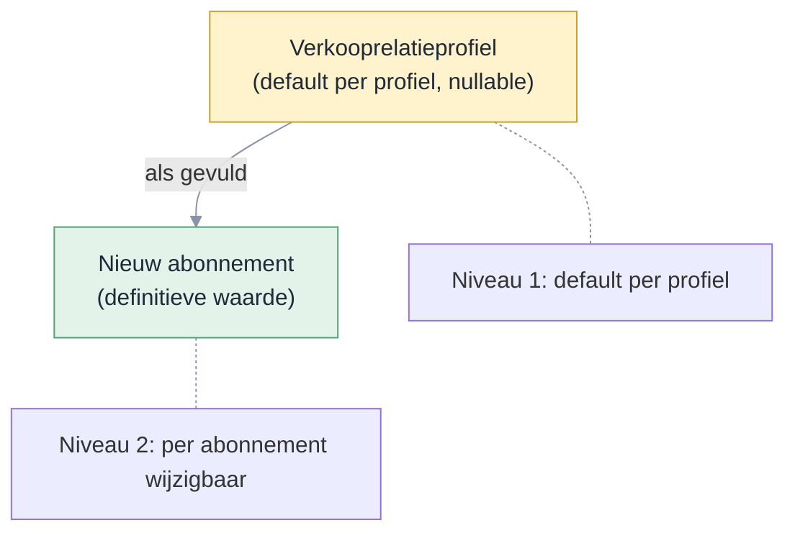

> Na overname is er geen koppeling meer. Een wijziging op het profiel werkt niet door naar bestaande abonnementen.

#### Mockups

*Boekingslay-out abonnement, veldgroep Factuurmoment — mockup: *`pages/rpt00692-boekingslayout-abonnement/detail.ts`

*Verkooprelatieprofiel — tabblad Factureren, veldgroep Abonnementen — mockup: *`pages/rpt00692-verkooprelatieprofiel/detail.ts`

#### Functionele uitwerking

Op het abonnement komt een nieuw veld **Factuurmoment** met vijf waarden:
- Aantal dagen voor begindatumcyclus
- Aantal dagen na begindatumcyclus
- Aantal dagen voor einddatumcyclus
- Aantal dagen na einddatumcyclus
- Midden van de factuurperiode

Standaard staat het op Aantal dagen voor begindatumcyclus — dat is het huidige gedrag. Bestaande abonnementen krijgen die waarde automatisch via conversie, zodat klanten niets merken zolang ze het factuurmoment niet wijzigen.

Het veld **Aantal dagen** (het huidige "Aantal dagen vooraf", hernoemd) is altijd zichtbaar, behalve bij Midden van de factuurperiode.

**Defaultwaarde via verkooprelatieprofiel**

Op het verkooprelatieprofiel staan de velden **Factuurmoment** en **Aantal dagen**. Beide staan standaard leeg. Vul je ze in, dan geldt die waarde voor alle debiteuren met dat profiel.

Bij het aanmaken van een nieuw abonnement bepaalt het systeem het factuurmoment als volgt:
1. Verkooprelatieprofiel van de debiteur (als gevuld)
2. Standaard: Aantal dagen voor begindatumcyclus

De gebruiker kan het factuurmoment per abonnement wijzigen. Een wijziging op het verkooprelatieprofiel werkt niet door naar bestaande abonnementen — alleen naar nieuwe.

#### Acceptatiecriteria

1. Standaard: Aantal dagen voor begindatumcyclus. Bestaande abonnementen krijgen die waarde via conversie.
2. Aantal dagen is zichtbaar, behalve bij Midden van de factuurperiode.
3. Bij Aantal dagen na begindatumcyclus mag Aantal dagen niet groter zijn dan de cyclusdagen.
4. Bij Aantal dagen voor einddatumcyclus mag Aantal dagen niet groter zijn dan de cyclusdagen.
5. Bij Midden van de factuurperiode berekent het systeem de factuurdatum als het midden van de cyclus.
6. Bij het aanmaken van een nieuw abonnement neemt het systeem het factuurmoment en het aantal dagen over van het verkooprelatieprofiel (als gevuld). Is het profiel leeg? Dan geldt Aantal dagen voor begindatumcyclus.
7. Een wijziging van het factuurmoment op het verkooprelatieprofiel werkt niet door naar bestaande abonnementen.
8. De gebruiker kan het overgenomen factuurmoment per abonnement wijzigen.

#### Tooltiptekst

| Veld | Tekst |
| --- | --- |
| Factuurmoment (abonnement) | Bepaalt wanneer de factuur wordt aangemaakt ten opzichte van de cyclus. |
| Aantal dagen (abonnement) | Aantal dagen verschuiving ten opzichte van de gekozen referentiedatum. |
| Factuurmoment (verkooprelatieprofiel) | Standaard factuurmoment voor nieuwe abonnementen van debiteuren met dit profiel. Laat leeg voor de standaardwaarde (Aantal dagen voor begindatumcyclus). |
| Aantal dagen (verkooprelatieprofiel) | Standaard aantal dagen verschuiving voor nieuwe abonnementen van debiteuren met dit profiel. |

#### Autorisatie

Geen apart recht vereist — toegang volgt het abonnement respectievelijk het verkooprelatieprofiel.

---

### 3.9 US09 – Instelling periodetoekenning en grootboekrekening Te factureren abonnementen omzet

**Als** financieel medewerker **wil ik** periodetoekenning centraal activeren en de grootboekrekening Te factureren abonnementen omzet instellen, **zodat** het systeem weet of periodetoekenning actief is en op welke tussenrekening omzet wordt geboekt.

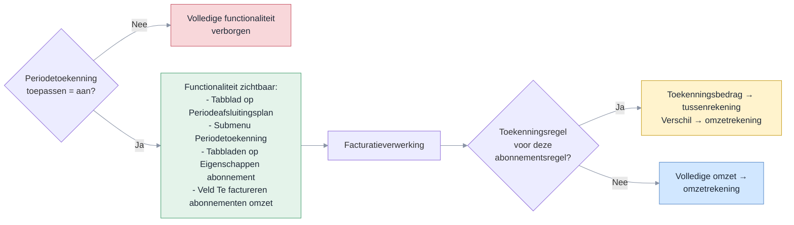

#### Mockups

*Facturering/voorraad — tabblad Abonnementen, veldgroep Periodetoekenning — mockup: *`pages/rpt00692-facturering-voorraad/detail.ts`

> Zie de Podium-specificatie in [Bijlage G5](#g5--us09-factureringvoorraad-detailpage).

#### Functionele uitwerking

**Activering**

De veldgroep Periodetoekenning op Facturering/voorraad (tabblad Abonnementen) is alleen zichtbaar als de module Abonnementen actief is. In de veldgroep staat het vinkje **Periodetoekenning toepassen**. Dit vinkje staat standaard uit.

Als het vinkje uit staat, is de volledige periodetoekenningsfunctionaliteit verborgen:
- Tabblad Periodetoekenningsregels abonnementen op het Periodeafsluitingsplan
- Submenu Periodetoekenning onder Abonnementen → Facturering (inclusief menu-items)
- Tabblad Financiële mutaties op Eigenschappen abonnement
- Het veld Te factureren abonnementen omzet

Zet je het vinkje aan, dan wordt de volledige functionaliteit zichtbaar.

Het vinkje kan niet worden uitgezet als er toekenningsregels bestaan met status Gejournaliseerd (B45). Verwijder eerst alle gejournaliseerde toekenningsregels voordat je periodetoekenning uitschakelt.

**Centrale instelling**

De grootboekrekening **Te factureren abonnementen omzet** is alleen zichtbaar als Periodetoekenning toepassen aan staat. Het veld is verplicht zodra het vinkje aan staat. De tussenrekening hoeft niet afletterbaar te zijn. Het rapport Saldoverklaring (US07) verklaart het volledige saldo op de rekening. Aflettering is daardoor overbodig.

**Facturatielogica**

Bij de facturatieverwerking is één ding bepalend: bestaat er een toekenningsregel voor de abonnementsregel in die periode?

- **Ja** → het toekenningsbedrag gaat naar de tussenrekening (Te factureren abonnementen omzet). Is het factuurbedrag hoger of lager dan het toekenningsbedrag? Dan gaat het verschil direct naar de omzetrekening. Zo hoeft de gebruiker geen extra Genereer uit te voeren.
- **Nee** (inclusief alleen verwijderde regels) → omzet direct naar de omzetrekening

De artikelgroep en het factuurmoment spelen hierbij geen rol.

**Samenloop met transitorisch journaliseren**

Bestaat er een toekenningsregel voor een abonnementsregel in een periode? Dan slaat transitorisch journaliseren die regel over — periodetoekenning wint. Een verwijderde toekenningsregel (status Verwijderd) telt niet mee. Zonder toekenningsregel werkt transitorisch journaliseren gewoon.

#### Acceptatiecriteria

**Activering**

1. De veldgroep Periodetoekenning is alleen zichtbaar als de module Abonnementen actief is.
2. Het vinkje Periodetoekenning toepassen staat standaard uit.
3. Als het vinkje uit staat, is de volledige periodetoekenningsfunctionaliteit verborgen, inclusief het veld Te factureren abonnementen omzet (B44).
4. Als het vinkje aan staat, is de volledige functionaliteit zichtbaar en de grootboekrekening verplicht.
5. Het vinkje kan niet worden uitgezet als er toekenningsregels bestaan met status Gejournaliseerd. Foutmelding: "Er bestaan gejournaliseerde toekenningsregels. Verwijder deze eerst." (B45).

**Grootboekrekening**

1. De grootboekrekening Te factureren abonnementen omzet op Facturering/voorraad accepteert alleen rekeningen van het type Activa of Passiva (B13).
2. Bij de start van de inrichting mag een reeds gebruikte grootboekrekening worden gekoppeld.
3. De grootboekrekening Te factureren abonnementen omzet is niet wijzigbaar als er toekenningsregels bestaan met status Gejournaliseerd. Foutmelding: "Er bestaan gejournaliseerde toekenningsregels. Wijzig eerst de rekening niet." (B51).

**Facturatielogica**

1. Met toekenningsregel → toekenningsbedrag naar tussenrekening, verschil naar omzetrekening (B33).
2. Zonder toekenningsregel → omzet op omzetrekening.

**Samenloop**

1. Transitorisch journaliseren slaat abonnementsregels over waarvoor een toekenningsregel bestaat. Verwijderde regels tellen niet mee.

#### Tooltiptekst

| Veld | Tekst |
| --- | --- |
| Periodetoekenning toepassen | Rekent verwachte abonnementsomzet toe aan een periode vóór de periodeafsluiting, ook als de factuur er nog niet is. |
| Te factureren abonnementen omzet | Grootboekrekening die tegengeboekt wordt bij het factureren. |

#### Autorisatie

Geen apart recht vereist — toegang volgt Facturering/voorraad.

---

### 3.10 US10 – Financiële mutaties op Eigenschappen abonnement

**Als** financieel medewerker **wil ik** op het Eigenschappen abonnement financiële mutaties zien die aan het abonnement zijn gekoppeld, zoals verkoopfactuurjournaalposten, periodetoekenningsregels en de bijbehorende transitorische journaalposten, **zodat** ik direct vanuit het abonnement kan controleren wat is toegerekend en geboekt.

#### Mockups

*Eigenschappen abonnement — tabblad Financiële mutaties — mockup: *`pages/rpt00692-abonnement-eigenschappen/detail.ts`

> Zie de Podium-specificatie in [Bijlage G6](#g6--us10-eigenschappen-abonnement-embedded-listpage).

#### Functionele uitwerking

Op het Eigenschappen abonnement komt onder het bestaande tabblad **Facturen** één nieuw tabblad: **Financiële mutaties**. Het tabblad toont de financiële mutaties die aan het abonnement zijn gekoppeld:
- verkoopfactuurjournaalposten;
- periodetoekenningsregels;
- bijbehorende transitorische journaalposten.

Het tabblad is alleen zichtbaar als er financiële mutaties aan dit abonnement zijn gekoppeld.

De weergave is alleen-lezen. Acties als Genereer en Verwijder zijn niet beschikbaar op dit scherm — die lopen via het Periodeafsluitingsplan (US02/US03).

---

#### Acceptatiecriteria

**Tabblad Financiële mutaties**

1. Het tabblad staat onder Facturen in de tabbladlijst.
2. Het tabblad is alleen zichtbaar als er financiële mutaties aan het abonnement zijn gekoppeld.
3. De weergave toont de verkoopfactuurjournaalposten, periodetoekenningsregels en bijbehorende transitorische journaalposten van dit abonnement.
4. De weergave is alleen-lezen — geen acties.
5. Bij doorklikken op een regel opent de bijbehorende financiële mutatie of periodetoekenningsregel.

#### Scherm en gedrag

**Tabblad Financiële mutaties**

Het tabblad zit op het Eigenschappen abonnement, onder Facturen.

| Veld | Gedrag |
| --- | --- |
| Grid | Alleen-lezen. Geen rijselectie. |
| Filter | Automatisch gefilterd op het huidige abonnement |
| Sortering | Datum aflopend, daarna nummer aflopend |

#### Tooltiptekst

Het tabblad zit op het Eigenschappen abonnement, onder Facturen.

| Veld | Gedrag |
| --- | --- |
| Tabblad | Financiële mutaties die aan dit abonnement zijn gekoppeld, waaronder verkoopfactuurjournaalposten, periodetoekenningsregels en transitorische journaalposten. |

#### Autorisatie

Geen apart recht vereist — zichtbaar voor iedereen met toegang tot het abonnement.

---

### 3.11 US11 – Periodetoekenningsregels op Eigenschappen journaalpost en journaalpostregel

**Als** financieel medewerker **wil ik** op de Eigenschappen journaalpost en de Eigenschappen journaalpostregel de periodetoekenningsregels zien die bij die journaalpost horen, **zodat** ik direct vanuit de journaalpost kan controleren welke toekenningen zijn geboekt.

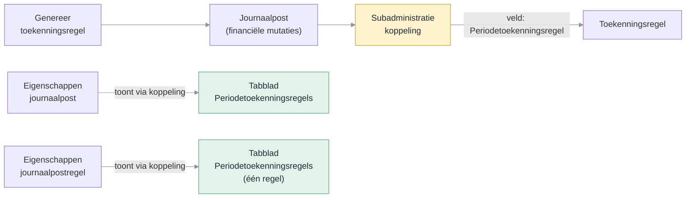

#### Mockups

*Eigenschappen journaalpost — tabblad Periodetoekenningsregels — mockup: *`pages/rpt00692-journaalpost-eigenschappen/detail.ts`

> Zie de Podium-specificatie in [Bijlage G7](#g7--us11-eigenschappen-journaalpost-embedded-listpage).

*Eigenschappen journaalpostregel — tabblad Periodetoekenningsregels — mockup: *`pages/rpt00692-journaalpostregel-eigenschappen/detail.ts`

> Zie de Podium-specificatie in [Bijlage G8](#g8--us11-eigenschappen-journaalpostregel-embedded-listpage).

#### Functionele uitwerking

Op Eigenschappen journaalpost en Eigenschappen journaalpostregel komt een nieuw tabblad **Periodetoekenningsregels**. Dit tabblad toont de toekenningsregels die via de subadministratiekoppeling gekoppeld zijn aan de journaalpost of journaalpostregel.

**Koppeling** — De koppeling loopt via de bestaande tabel Subadministratie koppeling. Die tabel krijgt een nieuw veld Periodetoekenningsregel. Bij het journaliseren van een toekenningsregel vult het systeem dit veld automatisch. Zo is vanuit elke financiële mutatie direct zichtbaar welke toekenningsregel erbij hoort.

**Positionering** — Het tabblad zit op Eigenschappen journaalpost onder het bestaande tabblad E-factuurregels. Op Eigenschappen journaalpostregel (= financiële mutatie) zit het tabblad ook onderaan.

**Zichtbaarheid** — Het tabblad is alleen zichtbaar als Periodetoekenning toepassen aan staat op Facturering/voorraad (B44).

De weergave is alleen-lezen. Geen acties beschikbaar.

#### Acceptatiecriteria

**Tabblad op Eigenschappen journaalpost**

1. Het tabblad staat onder E-factuurregels in de tabbladlijst.
2. Het tabblad is alleen zichtbaar als Periodetoekenning toepassen aan staat.
3. De weergave toont alle toekenningsregels die gekoppeld zijn aan financiële mutaties van deze journaalpost.
4. De weergave is alleen-lezen — geen acties.

**Tabblad op Eigenschappen journaalpostregel**

1. Het tabblad staat onderaan in de tabbladlijst.
2. Het tabblad is alleen zichtbaar als Periodetoekenning toepassen aan staat.
3. De weergave toont de toekenningsregel die gekoppeld is aan deze journaalpostregel (één regel).
4. De weergave is alleen-lezen — geen acties.

#### Scherm en gedrag

**Eigenschappen journaalpost**

| Veld | Gedrag |
| --- | --- |
| Grid | Alleen-lezen. Geen rijselectie. |
| Filter | Automatisch gefilterd op de huidige journaalpost (alle financiële mutaties) |
| Sortering | Boekjaar aflopend, daarna periode aflopend |

**Eigenschappen journaalpostregel**

| Veld | Gedrag |
| --- | --- |
| Grid | Alleen-lezen. Geen rijselectie. |
| Filter | Automatisch gefilterd op de huidige journaalpostregel (één financiële mutatie) |
| Sortering | Boekjaar aflopend, daarna periode aflopend |

#### Autorisatie

Geen apart recht vereist — zichtbaar voor iedereen met toegang tot de journaalpost.

---

### 3.12 US12 – Collectief wijzigen abonnementen: Factuurmoment meenemen

**Als** financieel medewerker **wil ik** bij het collectief wijzigen van abonnementen ook het factuurmoment aanpassen, **zodat** ik voor meerdere abonnementen tegelijk het factuurmoment bijstel samen met het aantal dagen vooraf.

**Toelichting:** De bestaande wizard Collectief wijzigen abonnementen werkt met vinkjes in de groep "Selecteer de te wijzigen velden". Elk vinkje toont een invoerveld in de groep "Te wijzigen velden". Het vinkje Aantal dagen vooraf bestaat al en toont het veld Aantal dagen (voorheen Aantal dagen vooraf, hernoemd in US08). Dit vinkje stuurt voortaan twee velden aan: Aantal dagen én Factuurmoment. Er komt geen apart vinkje voor Factuurmoment.

Factuurmoment is een nieuw veld op het abonnement (US08). Met deze user story werk je dat veld ook in bulk bij.

> Zie de Podium-specificatie in [Bijlage G9](#g9--us12-wizard-collectief-wijzigen-abonnementen-wizardpage).

#### Functionele uitwerking

- In de groep "Selecteer de te wijzigen velden" blijft het vinkje Aantal dagen vooraf ongewijzigd.
- Staat dit vinkje aan? Dan toont de groep "Te wijzigen velden" twee velden: Aantal dagen (bestaand) en Factuurmoment (nieuw).
- Het veld Factuurmoment is verplicht zodra het zichtbaar is.
- Het veld Factuurmoment kent dezelfde vijf waarden als op het abonnement (US08).
- Bij uitvoeren werkt de wizard voor elk gekozen abonnement zowel Aantal dagen als Factuurmoment bij.
- Staat het vinkje uit? Dan zijn beide velden verborgen en verandert er niets.

#### Acceptatiecriteria

1. Het veld Factuurmoment is verborgen zolang het vinkje Aantal dagen vooraf uit staat.
2. Staat het vinkje Aantal dagen vooraf aan? Dan is het veld Factuurmoment zichtbaar.
3. Is het veld Factuurmoment zichtbaar? Dan is het verplicht.
4. Het veld Factuurmoment toont dezelfde vijf waarden als op het abonnement.
5. Bij uitvoeren werkt de wizard Factuurmoment bij op alle gekozen abonnementen.
6. Er is geen apart vinkje voor Factuurmoment; het volgt het vinkje Aantal dagen vooraf.

#### Meldingstekst

| Situatie | Melding |
| --- | --- |
| Vinkje Aantal dagen vooraf aan en Factuurmoment leeg | Vul een factuurmoment in. |

#### Tooltiptekst

| Veld | Tekst |
| --- | --- |
| Factuurmoment (collectief wijzigen) | Bepaalt wanneer de factuur wordt aangemaakt ten opzichte van de cyclus. |

#### Autorisatie

Geen apart recht vereist — toegang volgt de bestaande wizard Collectief wijzigen abonnementen.

---

## 4. Datamodel

### 4.1 Nieuwe tabel: Toekenningsregels

| Kolom | Type | Verplicht | Omschrijving |
| --- | --- | --- | --- |
| Id | Geheel getal (oplopend) | Ja | Primaire sleutel |
| Abonnementsregel | Geheel getal | Ja | Verwijzing naar abonnementsregel. Altijd gevuld bij Genereer. |
| Factuurregel | Geheel getal | Nee | Verwijzing naar factuurregel. Wordt automatisch gevuld bij de facturatieverwerking. Blijft leeg als de factuur nooit wordt aangemaakt (bijv. beëindiging vóór facturatie). |
| Soort | Keuzelijst (Toekenning, Correctie, Tegenboeking) | Ja | Toekenning = eerste periodetoekenning voor deze periode. Correctie = verschilboeking na bedragwijziging. Tegenboeking = terugdraaien van openstaande toekenning bij verwijderde abonnementsregel. |
| Boekjaar | Geheel getal | Ja | Boekjaar van toekenning |
| Periode | Geheel getal | Ja | Periode van toekenning |
| Bedrag | Bedrag (2 decimalen) | Ja | Toegerekend bedrag |
| Status | Keuzelijst (Gejournaliseerd, Verwijderd) | Ja | Status van de toekenningsregel. Standaard: Gejournaliseerd. Wordt Verwijderd na de actie Verwijder toekenningsregels. |
| Aangemaakt op | Datum/tijd | Ja | Tijdstip aanmaak |
| Aangemaakt door | Tekst | Ja | Gebruiker |
**Constraints:**
- Foreign key Abonnementsregel &rarr; Abonnementsregel.
- Foreign key Factuurregel &rarr; Factuurregel (nullable).

> Uniciteit per (Abonnementsregel, Boekjaar, Periode) wordt functioneel gehandhaafd door de Genereer-logica (US02, US04): bestaat er al een Gejournaliseerd-regel, dan maakt Genereer een regel met soort Correctie (verschilbedrag) in plaats van een duplicate. Er is geen database-constraint nodig.

**Koppeling factuurregel:**
- Bij Genereer is alleen de abonnementsregel gevuld. De factuurregel is nog leeg.
- Bij de facturatieverwerking zoekt het systeem toekenningsregels voor dezelfde abonnementsregel en koppelt de factuurregel.
- Als de factuur nooit wordt aangemaakt (bijv. beëindiging vóór facturatie), blijft de factuurregel leeg. Dit is acceptabel.

**Bedrijfsregels:**
- De som van alle bedragen per abonnementsregel bepaalt de netto-toekenning. Na verwijderen is dit nul.

**Traceability:** US01, US02, US03, US04, US05, US06.

### 4.2 Uitbreiding bestaande tabel: Instellingen Facturering/voorraad

| Instelling | Type | Default | Omschrijving |
| --- | --- | --- | --- |
| Periodetoekenning toepassen | Boolean | Nee | Rekent verwachte abonnementsomzet toe aan een periode vóór de periodeafsluiting, ook als de factuur er nog niet is. Als dit vinkje uit staat, is de volledige periodetoekenningsfunctionaliteit verborgen. |
| Te factureren abonnementen omzet | Grootboekrekening (FK) | Leeg | Te factureren abonnementen omzet — balansrekening waarop omzet tijdelijk staat. Centraal ingesteld voor alle artikelgroepen. Verplicht zodra Periodetoekenning toepassen aan staat. |

**Traceability:** US09.

### 4.3 Uitbreiding bestaande tabel: Abonnement

| Instelling | Type | Default | Omschrijving |
| --- | --- | --- | --- |
| Factuurmoment | Keuzelijst (Aantal dagen voor begindatumcyclus, Aantal dagen na begindatumcyclus, Aantal dagen voor einddatumcyclus, Aantal dagen na einddatumcyclus, Midden van de factuurperiode) | Aantal dagen voor begindatumcyclus | Factuurmoment — bepaalt wanneer de factuur wordt aangemaakt ten opzichte van de cyclus. Bestaande abonnementen krijgen automatisch de waarde Aantal dagen voor begindatumcyclus. Bij nieuw aanmaken overgenomen van het verkooprelatieprofiel (indien gevuld), anders Aantal dagen voor begindatumcyclus. |

**Conversie:** alle bestaande abonnementen krijgen de waarde Aantal dagen voor begindatumcyclus. Het bestaande veld Aantal dagen vooraf wordt hernoemd naar Aantal dagen. Het veld Dagen achteraf vervalt.

**Traceability:** US08, US09.

### 4.4a Uitbreiding bestaande tabel: Verkooprelatieprofiel

| Instelling | Type | Default | Omschrijving |
| --- | --- | --- | --- |
| Factuurmoment | Keuzelijst (Aantal dagen voor begindatumcyclus, Aantal dagen na begindatumcyclus, Aantal dagen voor einddatumcyclus, Aantal dagen na einddatumcyclus, Midden van de factuurperiode) | Leeg | Standaard factuurmoment voor nieuwe abonnementen van debiteuren met dit profiel. Leeg = standaardwaarde (Aantal dagen voor begindatumcyclus). |
| Aantal dagen | Geheel getal | Leeg | Standaard aantal dagen verschuiving voor nieuwe abonnementen. Alleen van toepassing als Factuurmoment gevuld is en niet Midden van de factuurperiode. |

**Overerving:** bij het aanmaken van een nieuw abonnement bepaalt het systeem het factuurmoment als volgt: (1) verkooprelatieprofiel van de debiteur (als gevuld), (2) standaard: Aantal dagen voor begindatumcyclus. Na overname is er geen koppeling meer — wijzigingen op het verkooprelatieprofiel werken niet door naar bestaande abonnementen.

**Traceability:** US08.

### 4.4b Uitbreiding bestaande tabel: Subadministratie koppeling

De tabel Subadministratie koppeling is de standaard koppeltabel in Profit. Elke financiële mutatie kan via deze tabel verwijzen naar de bron in een subadministratie (verkoopfactuur, inkoopfactuur, nacalculatie, e-factuur, etc.).

| Kolom | Type | Verplicht | Omschrijving |
| --- | --- | --- | --- |
| Periodetoekenningsregel | Geheel getal (FK) | Nee | Verwijzing naar de toekenningsregel. Wordt automatisch gevuld bij het journaliseren van een periodetoekenning. |

Het nieuwe veld Periodetoekenningsregel komt in de tabel Subadministratie koppeling. Het is een nullable foreign key naar de tabel Toekenningsregels (§4.1).

**Vullogica:**
- Bij het journaliseren van een toekenningsregel (Genereer) vult het systeem automatisch het veld op de aangemaakte financiële mutaties.
- Bij het journaliseren van een tegenboeking (Verwijder) vult het systeem het veld op de tegenboekingsmutaties.
- Het veld is niet handmatig te wijzigen.

**Traceability:** US11.

### 4.4c Bestaande tabellen (geen wijziging)

- Factuurregels abonnement
- Abonnementsregels
- Periodeafsluitingsproces — periodeafsluiting

### 4.5 Relatiediagram

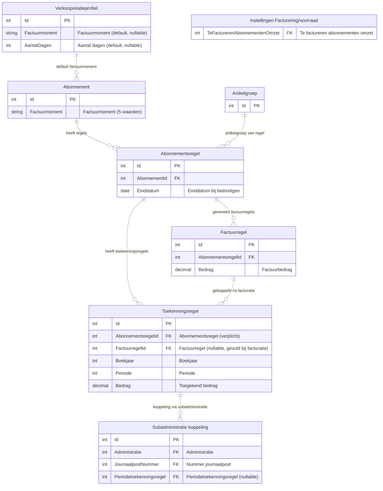

### 4.6 Boekingsstromen

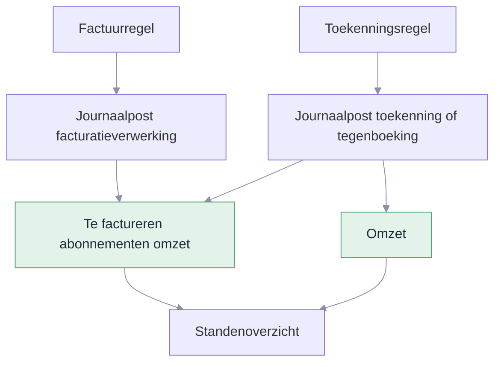

**Toekenning** (Journaliseer-actie):

| Debet | Credit | Toelichting |
| --- | --- | --- |
| Te factureren abonnementen omzet | Omzet | Positief bedrag bij toekenning |

**Tegenboeking** (Journaliseren ongedaan maken):

| Debet | Credit | Toelichting |
| --- | --- | --- |
| Omzet | Te factureren abonnementen omzet | Spiegelt de oorspronkelijke boeking |

De grootboekrekening **Te factureren abonnementen omzet** is een centrale instelling op Facturering/voorraad (tabblad Abonnementen, veldgroep Periodetoekenning). De omzetrekening volgt de artikelgroep van de abonnementsregel (B14). De journalisatie verloopt via het bestaande integratieschema abonnementen, uitgebreid met een nieuw regeltype voor periodetoekenning (B16). Voor periodetoekenning voegen we een nieuwe integratiesoort toe. Omdat een dagboek per administratie geldt, richt de klant het dagboek per administratie in via deze integratiesoort. Alleen dagboeken van het type Variabel memoriaal zijn kiesbaar (B16). Journaalposten van periodetoekenning zijn uitgesloten van verdichting (B15).

**Facturatielogica:** bij de facturatieverwerking bepaalt het bestaan van een toekenningsrecord de splitsing. Bestaat er een toekenningsregel, dan gaat het toekenningsbedrag naar de tussenrekening (Te factureren abonnementen omzet). Is het factuurbedrag hoger of lager, dan gaat het verschil direct naar de omzetrekening. Bestaat er geen toekenningsregel, dan gaat de volledige omzet direct naar de omzetrekening.

---

## 5. Gegevensverzameling

### 5.1 Gegevensverzameling: Periodetoekenningsregels

| Eigenschap | Waarde |
| --- | --- |
| Basistabel | Toekenningsregels |
| Naam | Periodetoekenningsregels |
| Standaardfilter | Geen |
| Filterautorisatie | Nee |
| Sortering | Boekjaar (aflopend), Periode (aflopend), Aangemaakt op (aflopend) |
| Gebruik | Dashboards, analyses en rapportages over periodetoekenning |

**Velden**

| Veld | Bron | Type | Toelichting |
| --- | --- | --- | --- |
| Toekenningsregel | Toekenningsregels | Geheel getal | Primaire sleutel |
| Abonnementsregel | Abonnementsregel | Geheel getal | Verwijzing naar abonnementsregel |
| Abonnement | Abonnement (via abonnementsregel) | Tekst | Omschrijving abonnement |
| Factuurregel | Factuurregel | Geheel getal | Verwijzing naar factuurregel (kan leeg zijn) |
| Artikelgroep | Artikelgroep (via abonnementsregel) | Tekst | Artikelgroep van de abonnementsregel |
| Administratie | Administratie (via abonnement) | Tekst | Administratie van het abonnement |
| Boekjaar | Toekenningsregels | Geheel getal | Boekjaar van toekenning |
| Periode | Toekenningsregels | Geheel getal | Periode van toekenning |
| Jaar (journaalpost) | Journaalpost (via toekenningsregel) | Geheel getal | Boekjaar waarin de journaalpost is geboekt |
| Periode (journaalpost) | Journaalpost (via toekenningsregel) | Geheel getal | Periode waarin de journaalpost is geboekt |
| Bedrag | Toekenningsregels | Bedrag | Toegerekend bedrag |
| Aangemaakt op | Toekenningsregels | Datum/tijd | Tijdstip aanmaak |
| Aangemaakt door | Toekenningsregels | Tekst | Gebruiker |

**Traceability:** US01, US03, US10, US11.

### 5.2 Gegevensverzameling: Saldoverklaring Te factureren abonnementen omzet

| Eigenschap | Waarde |
| --- | --- |
| Basistabel | Abonnementsregels (geaggregeerd met Toekenningsregels, Factuurregels en Journaalposten) |
| Naam | Saldoverklaring Te factureren abonnementen omzet |
| Standaardfilter | Huidige administratie |
| Filterautorisatie | Ja, op Administratie |
| Sortering | Administratie (oplopend), Abonnementsregel (oplopend) |
| Gebruik | Rapport Saldoverklaring Te factureren abonnementen omzet (US07), eigen analyses voor controllers |

**Velden**

| Veld | Bron | Type | Toelichting |
| --- | --- | --- | --- |
| Administratie | Administratie (via abonnement) | Tekst | Administratie van het abonnement |
| Abonnementsregel | Abonnementsregels | Geheel getal | Primaire sleutel abonnementsregel |
| Abonnement | Abonnement (via abonnementsregel) | Tekst | Omschrijving abonnement |
| Item | Artikelgroep (via abonnementsregel) | Tekst | Artikelomschrijving van de abonnementsregel |
| Datum van | Abonnementsregels | Datum | Begindatum van de abonnementsregel |
| Datum tot | Abonnementsregels | Datum | Einddatum van de abonnementsregel (kan leeg zijn) |
| Gefactureerd | Factuurregels (som per abonnementsregel) | Bedrag | Totaalbedrag aan factuurregels die op Te factureren abonnementen omzet zijn geboekt |
| Toegerekend | Toekenningsregels (som per abonnementsregel, status Gejournaliseerd) | Bedrag | Totaalbedrag aan gejournaliseerde toekenningsregels |
| Teruggedraaid | Toekenningsregels (som per abonnementsregel, status Verwijderd) | Bedrag | Totaalbedrag aan verwijderde (teruggedraaide) toekenningsregels |
| Openstaand saldo | Berekend: Gefactureerd − Toegerekend + Teruggedraaid | Bedrag | Resterend saldo per abonnementsregel op de tussenrekening |
| Factuurmoment | Abonnement (via abonnementsregel) | Tekst | Factuurmoment van het abonnement |
| Geparkeerd | Abonnementsregels | Ja/Nee | Of de abonnementsregel geparkeerd is |
| Handmatig geboekt | Journaalposten op tussenrekening (niet uit facturatie of periodetoekenning) | Bedrag | Nettobedrag van handmatige boekingen op de tussenrekening. Niet te koppelen aan een abonnementsregel; verschijnt als aparte rij in het rapport. |
| Grootboeksaldo | Grootboek (saldo tussenrekening t/m gekozen periode) | Bedrag | Saldo op de tussenrekening Te factureren abonnementen omzet |

> **Aansluiting grootboek:** de som van alle openstaande saldi + het totaal handmatig geboekt sluit aan op het grootboeksaldo van de rekening Te factureren abonnementen omzet. Controllers gebruiken dit rapport om dat saldo te verklaren.

**Traceability:** US07.

---

## Bijlage D – Open punten en beslissingen

### Open punten

| Nr | Punt | Bron |
| --- | --- | --- |
| O1 | Handmatig boeken op de grootboekrekening Te factureren abonnementen omzet verbieden als Periodetoekenning toepassen aan staat. Uitzondering: de beginsituatie bij live-gang. Moet nog uitgewerkt worden als bedrijfsregel of als open punt voor de bouw. | Brainstorm 22-04-2026 |
| O2 | Startsaldo bij live-gang concreter beschrijven: hoe bepaalt een klant het beginsaldo per administratie? Welke journaalpost hoort daarbij? Moet het rapport Saldoverklaring (US07) bruikbaar zijn voor die controle? Klanten mogen op de tussenrekening boeken en bij de start een reeds gebruikte rekening koppelen (brainstorm 22-04 II). Het saldo wordt apart vermeld op het rapport. | Brainstorm 22-04-2026 |

### Beslissingen

| Nr | Besluit |
| --- | --- |
| B1 | Tabblad Periodetoekenningsregels abonnementen is zichtbaar op het Periodeafsluitingsplan als Periodetoekenning toepassen aan staat (B44). |
| B2 | Bij verwijderen krijgt de toekenningsregel status Verwijderd. Het record wordt niet fysiek verwijderd (audit trail). Een verwijderde regel telt niet mee voor samenloop en facturatielogica — het tijdvak gedraagt zich alsof er geen toekenningsregel is. |
| B3 | Genereer alleen vóór periodeafsluiting toegestaan. Genereer is alleen beschikbaar vanuit het Periodeafsluitingsplan, niet op de standalone weergave. Journalisering vindt altijd direct plaats bij genereren. |
| B5 | Automatisch terugdraaien bij beëindigen is altijd actief en draait bij de facturatieverwerking (het factuurmoment). Bij actieve creditering voor een periode draait het systeem de toekenning voor die periode niet terug (B49). Zonder creditering draait het systeem de toekenning wél terug. |
| B6 | Geen cascade-delete bij verwijdering abonnementsregel; koppeling wordt leeggemaakt |
| B8 | Periodetoekenning hergebruikt de bestaande verdelingslogica van transitorisch journaliseren. Geen nieuwe verdelingsmethoden. |
| B9 | Samenloop periodetoekenning en transitorisch journaliseren: als er een toekenningsregel bestaat voor een abonnementsregel in een periode, slaat transitorisch journaliseren die regel over. Periodetoekenning wint. Bestaat er geen toekenningsregel (of alleen status Verwijderd), dan werkt transitorisch journaliseren zoals voorheen. |
| B10 | Dubbele koppeling: toekenningsregels worden gekoppeld aan de abonnementsregel (verplicht) én aan de factuurregel (nullable). Bij Genereer is alleen de abonnementsregel gevuld. De factuurregel wordt automatisch gevuld bij de facturatieverwerking. |
| B11 | Als de factuur nooit wordt aangemaakt (bijv. beëindiging vóór facturatie), blijft de factuurregel leeg. Dit is acceptabel. |
| B12 | Doorschuiflogica: als de periode al gesloten is bij Journaliseer of bij automatisch terugdraaien, wordt de journaalpost geboekt in de eerstvolgende vrije periode. Dit geldt altijd (handmatig en automatisch). |
| B13 | Validatie grootboekrekening Te factureren abonnementen omzet: alleen type Activa of Passiva toegestaan. |
| B14 | Omzetrekening volgt de artikelgroep van de abonnementsregel, niet een vaste instelling. |
| B15 | Journaalposten van periodetoekenning zijn uitgesloten van verdichting. |
| B16 | Bestaand integratieschema abonnementen wordt uitgebreid met een nieuw regeltype voor periodetoekenning. Geen nieuw integratieschema. Voor periodetoekenning voegen we wel een nieuwe integratiesoort toe. Omdat een dagboek per administratie geldt, bepaalt de klant het dagboek per administratie via deze integratiesoort. Alleen dagboeken van het type Variabel memoriaal zijn kiesbaar. |
| B19 | Vervallen — zie B19 in vervallen beslissingen. |
| B21 | Bij een herhaalde Genereer voor dezelfde periode toont de wizard correctieregels (soort Correctie) als het bedrag op de abonnementsregel is gewijzigd, en tegenboekingen (soort Tegenboeking) als de abonnementsregel is verwijderd. Bestaande gejournaliseerde regels worden niet gewijzigd. |
| B22 | Volgorde in het maandafsluitingsproces: (1) Facturatieverwerking, (2) Periodetoekenning genereren (inclusief journaliseren), (3) Periode afsluiten. |
| B23 | RPT00692 en RPT00702 werken onafhankelijk. 692 boekt omzet, 702 verschuift de balansboeking. Geen samenlooprisico. |
| B24 | Periodetoekenning vereist het Periodeafsluitingsplan. Zonder Periodeafsluitingsplan is periodetoekenning niet beschikbaar. |
| B27 | Factuurmoment is een nieuw veld op het abonnement met vijf waarden: Aantal dagen voor begindatumcyclus, Aantal dagen na begindatumcyclus, Aantal dagen voor einddatumcyclus, Aantal dagen na einddatumcyclus, Midden van de factuurperiode. Standaard: Aantal dagen voor begindatumcyclus. Bestaande abonnementen krijgen deze waarde via conversie. Het veld is altijd zichtbaar op het abonnement. Bij het aanmaken van een nieuw abonnement wordt de waarde overgenomen van het verkooprelatieprofiel (indien gevuld), anders geldt Aantal dagen voor begindatumcyclus. |
| B46 | Factuurmoment en Aantal dagen zijn instelbaar op twee niveaus: verkooprelatieprofiel (default per profiel, nullable) en abonnement (definitieve waarde). Bij het aanmaken van een nieuw abonnement neemt het systeem het factuurmoment over van het verkooprelatieprofiel als dat gevuld is, anders geldt Aantal dagen voor begindatumcyclus. Na overname is er geen koppeling meer: wijzigingen op het verkooprelatieprofiel werken niet door naar bestaande abonnementen. |
| B28 | Het bestaande veld Aantal dagen vooraf wordt hernoemd naar Aantal dagen. Dit veld is altijd zichtbaar in de boekingslay-out. |
| B29 | Het veld DaysAfter (Aantal dagen achteraf) vervalt. De richting en referentiedatum zitten nu in het factuurmoment. |
| B31 | Bij factuurmoment Aantal dagen na begindatumcyclus mag het veld Aantal dagen niet groter zijn dan het aantal dagen van de cyclus. Dit voorkomt dat het factuurmoment na de einddatum van de cyclus valt. |
| B32 | Bij factuurmoment Aantal dagen voor einddatumcyclus mag het veld Aantal dagen niet groter zijn dan het aantal dagen van de cyclus. Dit voorkomt dat het factuurmoment voor de begindatum van de cyclus valt. |
| B33 | Facturatielogica: bij de facturatieverwerking bepaalt het bestaan van een toekenningsrecord de splitsing. Bestaat er een toekenningsregel: het toekenningsbedrag gaat naar de tussenrekening, het verschil tussen factuurbedrag en toekenningsbedrag gaat direct naar de omzetrekening. Geen toekenningsregel: volledige omzet naar omzetrekening. Dit is de enige afhandeling van bedragverschillen bij facturatie. |
| B34 | Geparkeerde abonnementen verschijnen in de Genereer-wizard. Het bedrag is het laatst bekende bedrag van de abonnementsregel. |
| B35 | De Genereer-wizard bestaat uit 1 stap. Bovenin staan boekjaar en periode (alleen-lezen, geen begin-/einddatum). Daaronder toont het systeem de toekenbare abonnementsregels. De gebruiker selecteert via multi-select welke regels periodetoekenning krijgen. |
| B36 | Bij factuurmoment Midden van de factuurperiode berekent het systeem de factuurdatum als het midden van de cyclus: (begindatum cyclus + einddatum cyclus) / 2. Het veld Aantal dagen is verborgen en niet van toepassing. |
| B37 | Bij een bedragwijziging op een abonnementsregel met een gejournaliseerde toekenningsregel toont de volgende Genereer een correctieregel (soort Correctie) met het verschilbedrag. De gebruiker selecteert of het verschil wordt toegekend. Bestaande gejournaliseerde regels worden nooit gewijzigd. Selecteert de gebruiker de correctie niet, dan vangt B33 het verschil op bij de facturatieverwerking. |
| B38 | Verwijderen van toekenningsregels vervangt de oude actie Journaliseren ongedaan maken. Bij verwijderen valideert het systeem of de periode geblokkeerd is. Is de periode geblokkeerd, dan verschijnt de foutmelding: "Periode geblokkeerd. Dit is niet toegestaan." Het record krijgt status Verwijderd en de bijbehorende journaalpost wordt teruggedraaid via een tegenjournaalpost. |
| B39 | De menu-items Te journaliseren periodetoekenningsregels en Gejournaliseerde periodetoekenningsregels zijn vervallen. Alleen het menu-item Alle periodetoekenningsregels blijft bestaan. |
| B40 | Status Te journaliseren vervalt. Toekenningsregels gaan bij genereren direct naar status Gejournaliseerd. Verwijderen zet de status op Verwijderd; het record blijft bewaard voor audit trail. Statussen: Gejournaliseerd, Verwijderd. |
| B41 | Verwijderen van een toekenningsregel is niet toegestaan als er voor deze periode en dit tijdvak een factuur is gegenereerd voor de bijbehorende abonnementsregel. Dit borgt de boekhoudkundige consistentie: de factuurboeking is al naar de tussenrekening gerouteerd op basis van de toekenningsregel (B33). |
| B42 | Genereren en verwijderen (inclusief de bijbehorende journaalposten en tegenjournaalposten) lopen altijd als batchverwerking via de wachtrij. De wizard of de actie plaatst een taak in de wachtrij en sluit direct. Het grid ververst zodra de taak klaar is; tijdens verwerking toont het systeem een voortgangsindicatie. Er is geen synchrone uitvoering. |
| B43 | De acties Genereer en Verwijder zijn apart autoriseerbaar via twee rechtenobjecten: Periodetoekenning genereren en Periodetoekenning verwijderen. Beide staan standaard aan. Heeft een gebruiker geen recht op een actie, dan is de actieknop niet zichtbaar. Toegang tot het tabblad en de weergave volgt het bestaande recht op Periodeafsluitingsplan. |
| B44 | Periodetoekenning toepassen is een vinkje op Facturering/voorraad (tabblad Abonnementen, veldgroep Periodetoekenning). De veldgroep is alleen zichtbaar als de module Abonnementen actief is. Het vinkje staat standaard uit. Als het vinkje uit staat, is de volledige periodetoekenningsfunctionaliteit verborgen: tabblad Periodetoekenningsregels abonnementen op het Periodeafsluitingsplan, submenu en menu-items Periodetoekenning, tabblad Financiële mutaties op Eigenschappen abonnement en het veld Te factureren abonnementen omzet. |
| B45 | Het vinkje Periodetoekenning toepassen kan niet worden uitgezet als er toekenningsregels bestaan met status Gejournaliseerd. Foutmelding: "Er bestaan gejournaliseerde toekenningsregels. Verwijder deze eerst." |
| B47 | Crediteren op een abonnementsregel vereist dat er verstuurde facturen bestaan voor de te crediteren periode. Zonder verstuurde facturen is crediteren niet mogelijk. |
| B48 | Crediteren vanaf moet binnen de laatst gefactureerde periode vallen. Vul je een datum buiten die range in, dan verschijnt de foutmelding: "Je kunt alleen crediteren over de periode van [begindatum] t/m [einddatum]. Kies een andere datum." |
| B49 | Bij de facturatieverwerking draait US05 toekomstige toekenningsregels niet terug als er een creditering actief is voor die periode. De creditfactuur en de toekenningslogica handelen de correctie af. Zonder creditering draait US05 de toekenning wél terug. Dit voorkomt dubbele correcties op de tussenrekening. |
| B50 | Een creditfactuurregeling volgt de standaard facturatielogica (B33): bestaat er een toekenningsregel → toekenningsbedrag naar tussenrekening, verschil naar omzetrekening; geen toekenningsregel → volledige omzet naar omzetrekening. Met periodetoekenning maakt Genereer een negatieve toekenningsregel per gecrediteerd tijdvak. Zonder periodetoekenning corrigeert de credit de omzet direct. |
| B51 | De grootboekrekening Te factureren abonnementen omzet is niet wijzigbaar als er toekenningsregels bestaan met status Gejournaliseerd. Foutmelding: "Er bestaan gejournaliseerde toekenningsregels. Wijzig eerst de rekening niet." Dit voorkomt dat lopende boekingen op een verkeerde rekening terechtkomen. |
| B52 | Het systeem houdt geen aparte tabel bij met verwachte omzet per periode per abonnementsregel. Het verwachte bedrag wordt bij facturatie berekend op basis van de actuele abonnementsregel en de bestaande toekenningsregels. |
| B53 | De gebruiker bepaalt wat wordt toegekend. Het systeem kent niet automatisch perioderesultaat toe aan een periode. Alle toekenning, correctie en tegenboeking loopt via de Genereer-wizard. De gebruiker selecteert welke regels worden verwerkt. |
| B54 | Factuurmoment en Aantal dagen worden niet vastgelegd op de verkooprelatie (debiteur) zelf. De standaard op het verkooprelatieprofiel volstaat. Overerving blijft twee niveaus: verkooprelatieprofiel → abonnement. |
| B55 | De wizard Collectief wijzigen abonnementen krijgt het veld Factuurmoment. Het veld hoort bij het bestaande vinkje Aantal dagen vooraf: staat dat vinkje aan, dan is Factuurmoment zichtbaar en verplicht. Er komt geen apart vinkje. Bij uitvoeren werkt de wizard Aantal dagen en Factuurmoment collectief bij. |

### Vervallen beslissingen

| Nr | Reden |
| --- | --- |
| B4 | Dekking staat in B2 (status Verwijderd, audit trail) |
| B7 | Vervangen door B43 (aparte rechtenobjecten voor Genereer en Verwijder) |
| B17 | Artikelgroep-instelling geschrapt |
| B18 | Artikelgroep-instelling geschrapt |
| B19 | Verwijdering van een abonnementsregel is niet meer geblokkeerd. Toekenningsregels blijven staan; de volgende Genereer toont een tegenboeking (US06, brainstorm 11-05-2026). |
| B20 | Geen vinkje Direct journaliseren; journalisering is onderdeel van Genereer |
| B25 | Startperiode op artikelgroep geschrapt |
| B26 | Beginsaldo was gekoppeld aan vervallen startperiode |
| B30 | Artikelgroep-instelling geschrapt |

### Definition of Done

| Onderdeel | Status | Toelichting |
| --- | --- | --- |
| Datamodel en conversie | Afgedekt | Nieuwe tabel Toekenningsregels beschreven in §4.1. Nieuw veld Factuurmoment op Abonnement in §4.3. Uitbreiding tabel Subadministratie koppeling met veld Periodetoekenningsregel in §4.4b. Conversie: bestaande abonnementen krijgen waarde Aantal dagen voor begindatumcyclus. Artikelgroep-uitbreiding geschrapt. |
| Weergaven | Afgedekt | Embedded ListPage (US01) en standalone ListPage (US03) beschreven met kolommen, filters en acties. Genereer-wizard met 1 stap en multi-select toont drie soorten (Toekenning, Correctie, Tegenboeking). Directe journalisering. |
| Autorisatie | Afgedekt | Twee rechtenobjecten: Periodetoekenning genereren en Periodetoekenning verwijderen (B43). Beide standaard aan. Tabbladtoegang volgt bestaand recht op Periodeafsluitingsplan. |
| Rapportages en gegevensverzamelingen | Afgedekt | Gegevensverzameling Periodetoekenningsregels beschreven in §5.1. Gegevensverzameling Saldoverklaring Te factureren abonnementen omzet beschreven in §5.2, met geaggregeerde velden per abonnementsregel. Rapport US07 gebruikt §5.2 als databron. |
| Signalen | N.v.t. | Geen automatisch signaal. US07 beschrijft een saldocontrole via het standenoverzicht, geen Profit-signaal. |
| Connectors en integraties | N.v.t. | Geen nieuwe GetConnectors, UpdateConnectors of koppelingen. |
| User interface | Afgedekt | Tabblad, standalone weergave, wizard (1 stap) met multi-select en instellingenscherm beschreven met Podium-specificaties en mockups. Tabbladen Periodetoekenningsregels op Eigenschappen journaalpost en journaalpostregel (US11). Wizard Collectief wijzigen abonnementen uitgebreid met veld Factuurmoment (US12). |
| Menu-items | Afgedekt | Nieuw submenu Periodetoekenning onder Abonnementen &rarr; Facturering met twee menu-items: Alle periodetoekenningsregels en Saldoverklaring (US03/US07). |
| Regels en validaties | Afgedekt | Unieke constraint, statusvalidaties en foutmeldingen beschreven per user story. |
| Testscenario's en acceptatiecriteria | Afgedekt | Acceptatiecriteria beschreven per user story. |
| Geplande taak | N.v.t. | Geplande taak is vervallen na brainstorm 22-04-2026 II. |
| Documentatie | Afgedekt | Helpteksten, tooltips en stappenplan beschreven per user story. |

---

## Bijlage F – Work items developer

Deze bijlage bevat alle taken die de developer moet uitvoeren. De taken zijn gegroepeerd per onderdeel. Voer ze uit in de aangegeven volgorde.

### F1 – Datamodel en conversie

| Nr | Taak | Referentie | Toelichting |
| --- | --- | --- | --- |
| D01 | Maak nieuwe tabel Toekenningsregels | §4.1 | Kolommen: Id, Abonnementsregel, Factuurregel, Soort (Toekenning, Correctie, Tegenboeking), Boekjaar, Periode, Bedrag, Status (Gejournaliseerd, Verwijderd), Aangemaakt op, Aangemaakt door |
| D02 | Voeg foreign keys toe op Toekenningsregels | §4.1 | FK naar Abonnementsregel (verplicht), Factuurregel (nullable) |
| D03 | Voeg veld Te factureren abonnementen omzet toe op Facturering/voorraad | §4.2 | FK naar grootboekrekening, nullable |
| D04 | Voeg veld Factuurmoment toe op Abonnement | §4.3 | Keuzelijst: Aantal dagen voor begindatumcyclus, Aantal dagen na begindatumcyclus, Aantal dagen voor einddatumcyclus, Aantal dagen na einddatumcyclus, Midden van de factuurperiode. Standaard: Aantal dagen voor begindatumcyclus |
| D05 | Hernoem bestaand veld Aantal dagen vooraf naar Aantal dagen | §4.3 | Veld Dagen achteraf vervalt |
| D06 | Schrijf conversiescript: bestaande abonnementen krijgen Factuurmoment = Aantal dagen voor begindatumcyclus | §4.3, B27 | Bestaand gedrag blijft ongewijzigd |

### F2 – Instellingen en validaties (US08, US09, US12)

| Nr | Taak | Referentie | Toelichting |
| --- | --- | --- | --- |
| D07 | Toon veld Factuurmoment op het abonnement | US08 | Altijd zichtbaar. Vijf waarden |
| D08 | Toon veld Aantal dagen op het abonnement | US08, B28 | Zichtbaar behalve bij Midden van de factuurperiode |
| D09 | Verwijder veld Dagen achteraf | US08, B29 | Vervalt; richting zit nu in Factuurmoment |
| D10 | Toon veld Te factureren abonnementen omzet op Facturering/voorraad | US09 | Tabblad Abonnementen, veldgroep Periodetoekenning. Zichtbaar als Periodetoekenning toepassen aan staat. |
| D55 | Bouw activering Periodetoekenning toepassen op Facturering/voorraad | US09, B44, B45 | Vinkje op tabblad Abonnementen, veldgroep Periodetoekenning. Veldgroep alleen zichtbaar als module Abonnementen actief is. Standaard uit. Als uit: verberg tabblad op Periodeafsluitingsplan, submenu en menu-items, tabblad Financiële mutaties op Eigenschappen abonnement en het veld Te factureren abonnementen omzet. Validatie: vinkje kan niet uit als er gejournaliseerde toekenningsregels bestaan (B45). |
| D11 | Valideer: grootboekrekening alleen type Activa of Passiva | B13 | Foutmelding bij ander type |
| D12 | Valideer: Aantal dagen ≤ cyclusdagen bij factuurmoment Aantal dagen na begindatumcyclus | B31, T35 | Foutmelding bij opslaan |
| D13 | Valideer: Aantal dagen ≤ cyclusdagen bij factuurmoment Aantal dagen voor einddatumcyclus | B32, T36 | Foutmelding bij opslaan |
| D56 | Voeg velden Factuurmoment en Aantal dagen toe op verkooprelatieprofiel | §4.4a, B46 | Keuzelijst (nullable) en geheel getal (nullable). Zichtbaar op het verkooprelatieprofiel. |
| D57 | Bouw overervingslogica: bepaal Factuurmoment bij nieuw abonnement | B46, T40–T44 | Volgorde: (1) verkooprelatieprofiel van de debiteur (als gevuld), (2) standaard: Aantal dagen voor begindatumcyclus. Wijzigingen werken niet door naar bestaande abonnementen. |
| D58 | Vervallen — omgevingsinstelling Factuurmoment geschrapt (briefing 20-05-2026) | — | — |
| D66 | Breid wizard Collectief wijzigen abonnementen uit met veld Factuurmoment | US12, B55 | Het vinkje Aantal dagen vooraf stuurt twee velden aan: Aantal dagen en Factuurmoment. Factuurmoment is verplicht zodra het zichtbaar is en kent dezelfde vijf waarden als op het abonnement. Werk beide velden collectief bij. |

### F3 – Genereer-logica (US02)

| Nr | Taak | Referentie | Toelichting |
| --- | --- | --- | --- |
| D14 | Bouw Genereer-actie als batchverwerking met wizard (1 stap) | US02, B35, B42 | Wizard toont boekjaar en periode bovenin. Daaronder toekenbare abonnementsregels (inclusief geparkeerde abonnementen, B34). Multi-select. Regels worden direct gejournaliseerd. Draait via de wachtrij. |
| D15 | Maak toekenningsregels met status Gejournaliseerd en boek journaalposten | US02 | Per abonnementsregel maximaal één actieve originele regel per boekjaar/periode (delta's uitgezonderd). Directe journalisering. |
| D16 | Herbereken bestaande regels bij herhaalde Genereer | B21 | Bedrag bijwerken op basis van actuele abonnementsregel |
| D17 | Gebruik bestaande verdelingslogica van transitorisch journaliseren | B8 | Geen nieuwe verdelingsmethoden |
| D18 | Compenseer afrondingsverschillen in de laatste periode | US02 | Als de laatste periode gesloten is: doorschuiven naar eerstvolgende vrije periode (B12) |
| D19 | Verwerk negatieve bedragen voor creditfacturen | US02 | Geen aparte actie; laat negatief bedrag meelopen |
| D20 | Alles-of-niets: rollback bij fout | US02 | Geen halve resultaten |

### F4 – Verwijder-logica (US03)

| Nr | Taak | Referentie | Toelichting |
| --- | --- | --- | --- |
| D21 | Bouw Verwijder-actie als batchverwerking met multi-select | US03, B38, B42 | Verwerk alleen regels met status Gejournaliseerd. Draait via de wachtrij. |
| D22 | Zet status op Verwijderd en boek een tegenjournaalpost | US03, B2 | Record blijft bewaard voor audit trail. Zelfde boekjaar/periode als het origineel. |
| D23 | Boek tegenjournaalpost: Omzet (debet) &rarr; Te factureren abonnementen omzet (credit) | §4.6 | Spiegelt de oorspronkelijke boeking |
| D24 | Valideer of de periode geblokkeerd is bij verwijderen | US03, B38 | Foutmelding: Periode geblokkeerd. Dit is niet toegestaan. |
| D25 | Valideer of er al een factuur is gegenereerd voor de abonnementsregel in deze periode | US03, B41 | Foutmelding: Er is al een factuur gegenereerd voor deze abonnementsregel in deze periode. Verwijderen is niet toegestaan. |
| D26 | Doorschuiflogica bij gesloten periode | B12 | Tegenjournaalpost boeken in eerstvolgende vrije periode |

### F5 – Automatische delta bij bedragwijziging (US04)

| Nr | Taak | Referentie | Toelichting |
| --- | --- | --- | --- |
| D27 | Bouw detectie in Genereer-wizard: abonnementsregels met bedragwijziging na bestaande toekenning | US04 | Wizard toont correctieregel (soort Correctie) met verschilbedrag. Positief bij verhoging, negatief bij verlaging. |
| D28 | Maak correctie-toekenningsregel en journaliseer bij selectie in wizard | US04, B37 | Bestaande regels blijven ongewijzigd. Bij gesloten periode: journaalpost in eerstvolgende vrije periode (B12). |

### F6 – Automatisch terugdraaien (US05, US06)

| Nr | Taak | Referentie | Toelichting |
| --- | --- | --- | --- |
| D29 | Bouw detectie bij facturatieverwerking en Genereer: abonnementsregel met einddatum en gejournaliseerde toekenningen voor toekomstige perioden | US05 | Detecteer toekenningsregels voor toekomstige perioden |
| D30 | Verwijder toekomstige toekenningen automatisch en boek tegenjournaalposten | US05 | In dezelfde transactie als de facturatieverwerking of het genereren |
| D31 | Bouw detectie in Genereer-wizard: verwijderde abonnementsregels met bestaande toekenning | US06 | Wizard toont tegenboeking (soort Tegenboeking) voor nog niet gecorrigeerde toekenningen. |
| D32 | Maak tegenboeking-toekenningsregel en journaliseer bij selectie in wizard | US06, B37 | Negatief bedrag gelijk aan oorspronkelijke toekenning. Bestaande regels blijven staan. |
| D33 | Vervallen — blokkade verwijderd; terugdraaien loopt via Genereer | B19 (vervallen) | — |

### F7 – Koppeling factuurregel (B10)

| Nr | Taak | Referentie | Toelichting |
| --- | --- | --- | --- |
| D34 | Koppel factuurregel aan toekenningsregels bij facturatieverwerking | B10 | Zoek toekenningsregels voor dezelfde abonnementsregel en vul de factuurregel |

### F8 – Integratieschema (B16)

| Nr | Taak | Referentie | Toelichting |
| --- | --- | --- | --- |
| D35 | Breid integratieschema abonnementen uit met regeltype periodetoekenning | B16 | Geen nieuw integratieschema |
| D67 | Voeg nieuwe integratiesoort periodetoekenning toe binnen het integratieschema abonnementen | B16 | Bepaalt per administratie het dagboek voor de journaalposten van periodetoekenning (toekenning en tegenboeking). Beperk de dagboekkeuze tot het type Variabel memoriaal |
| D36 | Sluit journaalposten van periodetoekenning uit van verdichting | B15 | — |

### F9 – Schermen

| Nr | Taak | Referentie | Toelichting |
| --- | --- | --- | --- |
| D37 | Bouw tabblad Periodetoekenningsregels abonnementen op Periodeafsluitingsplan | US01 | Embedded ListPage met kolommen en twee acties: Genereer en Verwijder (zie Podium-specificatie US01) |
| D38 | Bouw Genereer-wizard (1 stap) met multi-select | US02, B35 | Boekjaar en periode bovenin. Daaronder multi-select lijst met toekenbare regels inclusief kolom Factuurmoment en Geparkeerd. Directe journalisering. |
| D39 | Bouw standalone ListPage Alle periodetoekenningsregels | US03 | Eén menu-item met actie Verwijderen. |
| D40 | Bouw rapport (WizardPage) Saldoverklaring Te factureren abonnementen omzet | US07 | Wizard met 2 stappen: periode kiezen, saldoverklaring tonen. Databron: gegevensverzameling §5.2. Export beschikbaar. (Zie Podium-specificatie US07.) |
| D41 | Bouw tabblad Financiële mutaties op Eigenschappen abonnement | US10 | Embedded ListPage onder tabblad Facturen. Toont gekoppelde verkoopfactuurjournaalposten, periodetoekenningsregels en transitorische journaalposten. Alleen-lezen. Zichtbaar zodra er financiële mutaties bestaan. |
| D62 | Voeg veld Periodetoekenningsregel toe aan tabel Subadministratie koppeling | §4.4b, US11 | Nullable FK naar Toekenningsregels. |
| D63 | Vul Periodetoekenningsregel bij journaliseren toekenningsregel | §4.4b, US11 | Automatisch bij Genereer en bij Verwijder (tegenboeking). |
| D64 | Bouw tabblad Periodetoekenningsregels op Eigenschappen journaalpost | US11 | Embedded ListPage onder E-factuurregels. Alleen-lezen. Zichtbaar als Periodetoekenning toepassen aan staat. |
| D65 | Bouw tabblad Periodetoekenningsregels op Eigenschappen journaalpostregel | US11 | Embedded ListPage onderaan. Alleen-lezen. Zichtbaar als Periodetoekenning toepassen aan staat. |

### F10 – Menu-items

| Nr | Taak | Referentie | Toelichting |
| --- | --- | --- | --- |
| D43 | Voeg submenu Periodetoekenning toe | US03, B44 | Abonnementen &rarr; Facturering &rarr; Periodetoekenning. Zichtbaar als Periodetoekenning toepassen aan staat. Sneltoets P. |
| D44 | Voeg menu-item Alle periodetoekenningsregels toe | US03 | Onder submenu Periodetoekenning. Sneltoets A. Actie: Verwijder toekenningsregels. |
| D45 | Voeg menu-item Saldoverklaring toe | US07 | Onder submenu Periodetoekenning. Sneltoets S. Alleen-lezen overzicht. |

### F11 – Gegevensverzameling

| Nr | Taak | Referentie | Toelichting |
| --- | --- | --- | --- |
| D51 | Maak gegevensverzameling Periodetoekenningsregels | §5.1 | Basistabel Toekenningsregels. Alle velden uit §5.1. |
| D54 | Maak gegevensverzameling Saldoverklaring Te factureren abonnementen omzet | §5.2 | Basistabel Abonnementsregels geaggregeerd met Toekenningsregels en Factuurregels. Alle velden uit §5.2. |

### F12 – Meldingen en tooltips

| Nr | Taak | Referentie | Toelichting |
| --- | --- | --- | --- |
| D52 | Voeg alle meldingsteksten toe | US02, US03 | Zie meldingstabellen per user story |
| D53 | Voeg alle tooltipteksten toe | US02, US03, US08, US09 | Zie tooltiptabellen per user story |

### F13 – Validatie grootboekrekening

| Nr | Taak | Referentie | Toelichting |
| --- | --- | --- | --- |
| D61 | Bouw validatie: Te factureren abonnementen omzet niet wijzigbaar bij gejournaliseerde toekenningsregels | US09, B51 | Blokkeer wijziging als er toekenningsregels bestaan met status Gejournaliseerd. Foutmelding tonen. |

### Volgorde van uitvoering

Voer de taken uit in deze volgorde:
1. **Datamodel en conversie** (D01–D06)
2. **Instellingen en validaties** (D07–D13)
3. **Genereer-logica inclusief journalisering** (D14–D20)
4. **Verwijder-logica** (D21–D26)
5. **Delta-bedrag** (D27–D28)
6. **Automatisch terugdraaien** (D29–D33)
7. **Koppeling factuurregel** (D34)
8. **Integratieschema** (D35–D36)
9. **Schermen** (D37–D41)
10. **Menu-items** (D43–D45)
11. **Gegevensverzameling** (D51)
12. **Meldingen en tooltips** (D52–D53)

---

## Bijlage G – Podium-specificaties

Deze bijlage bundelt alle Podium-specificaties. Per user story staat hier de technische schermopbouw. In de user stories zelf staat onder de mockup een link naar de bijbehorende specificatie hieronder.

### G1 – US01 Tabblad op Periodeafsluiting (embedded ListPage)

**Schermtype:** Tabblad op Periodeafsluiting (embedded ListPage)

**Veldtabel ListPage**

| Kolom-id | Kolomkop | Podium-type | Sorteerbaar | Filter | Breedte | Mock-waarde |
| --- | --- | --- | --- | --- | --- | --- |
| soort | Soort | text | ja | ja | 100 | Toekenning |
| abonnementsregel | Abonnementsregel | text | ja | ja | 150 | AR-0001 |
| jaarFactuur | Jaar (factuur) | text | ja | ja | 80 | 2026 |
| periodeFactuur | Periode (factuur) | number | ja | ja | 100 | 3 |
| jaarJournaal | Jaar (journaalpost) | text | ja | ja | 80 | 2026 |
| periodeJournaal | Periode (journaalpost) | number | ja | ja | 100 | 4 |
| abonnement | Abonnement | text | ja | ja | 150 | AB-1001 Facilicom BV |
| omschrijving | Omschrijving | text | ja | nee | 250 | Schoonmaak kantoor maart (correctie) |
| bedrag | Bedrag | currencyAmount | ja | nee | 120 | 1.250,00 |
| status | Status | text | ja | ja | 120 | Gejournaliseerd |
| aangemaakt | Aangemaakt op | date | ja | nee | 130 | 15-04-2026 |
| aanmakerNaam | Aangemaakt door | text | ja | nee | 130 | P. de Vries |

**ListPage-eigenschappen**

| Eigenschap | Waarde |
| --- | --- |
| Quick filter | ja |
| Exportknop | nee |
| Rijselectie | meervoud |
| Inline bewerken | nee |
| Bulkacties | Verwijder toekenningsregels (US03) |

**Acties-blok**

| Actie-id | Label | Type | Positie | Zichtbaar als | Bevestigingsdialoog | Autoriseerbaar |
| --- | --- | --- | --- | --- | --- | --- |
| genereer | Genereer periodetoekenningsregels | toolbar | links | altijd (geen selectie vereist) | nee | ja (Periodetoekenning genereren) |
| verwijder | Verwijder toekenningsregels | toolbar (multiselect) | links | alleen bij rijselectie (minimaal 1 rij) | ja: "Weet je zeker dat je de geselecteerde toekenningen wilt verwijderen? De bijbehorende journaalposten worden teruggedraaid." | ja (Periodetoekenning verwijderen) |

### G2 – US02 Genereer-wizard (WizardPage)

**Schermtype:** WizardPage (1 stap)

**Stap 1 — Selectie toekenbare regels (multi-select)**

Bovenin staan boekjaar en periode (alleen-lezen). Daaronder de toekenbare abonnementsregels.

| Veld | Podium-type | Readonly | Positie |
| --- | --- | --- | --- |
| Boekjaar | number | ja | boven grid |
| Periode | text | ja | boven grid |

| Kolom-id | Kolomkop | Podium-type | Sorteerbaar | Mock-waarde |
| --- | --- | --- | --- | --- |
| soort | Soort | text | ja | Toekenning |
| abonnementsregel | Abonnementsregel | text | ja | AR-0010 |
| abonnement | Abonnement | text | ja | AB-1001 Facilicom BV |
| omschrijving | Omschrijving | text | ja | Schoonmaak kantoor april |
| bestaandeToekenning | Bestaande toekenning | currencyAmount | ja | |
| bedrag | Bedrag | currencyAmount | ja | 3.750,00 |
| factuurmoment | Factuurmoment | text | ja | Aantal dagen na einddatumcyclus |

**Wizardflow:**
1. Je klikt Genereer op het tabblad. De wizard opent.
2. Je ziet direct de toekenbare regels. Bovenin staan boekjaar en periode (alleen-lezen). Begindatum en einddatum periode worden niet getoond.
3. Je selecteert via multi-select welke regels periodetoekenning krijgen.
4. Je klikt Voltooien. Het systeem plaatst een batchtaak in de wachtrij.
5. De wizard sluit. Het grid ververst zodra de taak klaar is — tijdens verwerking zie je een voortgangsindicatie.
6. De geselecteerde regels worden direct aangemaakt én gejournaliseerd. Er is geen tussenstatus Te journaliseren.

### G3 – US03 Alle periodetoekenningsregels (ListPage)

**Schermtype:** ListPage (menu-item Alle periodetoekenningsregels onder submenu Periodetoekenning)

**Veldtabel ListPage**

| Kolom-id | Kolomkop | Podium-type | Sorteerbaar | Filter | Breedte | Status | Mock-waarde |
| --- | --- | --- | --- | --- | --- | --- | --- |
| soort | Soort | text | ja | ja | 100 | nieuw | Toekenning |
| abonnementsregel | Abonnementsregel | text | ja | ja | 150 | nieuw | AR-0001 |
| abonnement | Abonnement | text | ja | ja | 150 | nieuw | AB-1001 Facilicom BV |
| omschrijving | Omschrijving | text | ja | nee | 250 | nieuw | Schoonmaak kantoor Q1 |
| bedrag | Bedrag | currencyAmount | ja | nee | 120 | nieuw | 3.750,00 |
| status | Status | text | ja | ja | 120 | nieuw | Gejournaliseerd |
| aangemaakt | Aangemaakt op | date | ja | nee | 130 | nieuw | 01-04-2026 |
| aanmakerNaam | Aangemaakt door | text | ja | nee | 130 | nieuw | P. Jansen |

**ListPage-eigenschappen**

| Eigenschap | Waarde |
| --- | --- |
| Quick filter | ja |
| Exportknop | nee |
| Rijselectie | meervoud |
| Inline bewerken | nee |
| Bulkacties | Verwijder toekenningsregels |

**Acties-blok**

| Actie-id | Label | Type | Positie | Zichtbaar als | Bevestigingsdialoog | Autoriseerbaar |
| --- | --- | --- | --- | --- | --- | --- |
| verwijder | Verwijder toekenningsregels | toolbar (multiselect) | links | alleen bij rijselectie (minimaal 1 rij) | ja: "Weet je zeker dat je de geselecteerde toekenningen wilt verwijderen? De bijbehorende journaalposten worden teruggedraaid." | ja (Periodetoekenning verwijderen) |

> **Opmerking:** De actie Genereer is niet beschikbaar op dit scherm. Genereren kan alleen vanuit het Periodeafsluitingsplan (US02).

### G4 – US07 Saldoverklaring (WizardPage)

**Schermtype:** WizardPage (rapport Saldoverklaring — submenu Periodetoekenning)

**Stap 1 — Periode kiezen**

| Veld | Podium-type | Verplicht | Standaardwaarde |
| --- | --- | --- | --- |
| Administratie | text (zoekvenster administratie) | ja | Huidige administratie |
| Boekjaar | number | ja | Huidig boekjaar |
| Periode | enumeration | ja | Huidige periode |

**Stap 2 — Saldoverklaring**

**Veldgroep Periode** (alleen-lezen, overgenomen uit stap 1)

| Veld | Podium-type | Readonly |
| --- | --- | --- |
| Administratie | text | ja |
| Boekjaar | number | ja |
| Periode | enumeration | ja |

**Veldgroep Telling**

| Veld | Podium-type | Readonly | Toelichting |
| --- | --- | --- | --- |
| Grootboeksaldo | currencyAmount | ja | Saldo op de tussenrekening t/m de gekozen periode |
| Totaal gefactureerd | currencyAmount | ja | Som van kolom Gefactureerd |
| Totaal toegerekend | currencyAmount | ja | Som van kolom Toegerekend |
| Totaal teruggedraaid | currencyAmount | ja | Som van kolom Teruggedraaid |
| Totaal handmatig geboekt | currencyAmount | ja | Som van overige journaalposten op de tussenrekening |
| Verschil | currencyAmount | ja | Grootboeksaldo − (Gefactureerd − Toegerekend + Teruggedraaid + Handmatig). Moet nul zijn. |

**Lijst: Saldoverklaring per abonnementsregel**

| Kolom-id | Kolomkop | Podium-type | Sorteerbaar | Breedte | Mock-waarde |
| --- | --- | --- | --- | --- | --- |
| administratie | Administratie | text | ja | 150 | 1 |
| abonnementsregel | Abonnementsregel | text | ja | 150 | AR-0001 |
| abonnement | Abonnement | text | ja | 200 | AB-1001 Facilicom BV |
| datumVan | Datum van | date | ja | 130 | 01-03-2026 |
| datumTot | Datum tot | date | ja | 130 | 31-03-2026 |
| gefactureerd | Gefactureerd | currencyAmount | ja | 130 | 3.750,00 |
| toegerekend | Toegerekend | currencyAmount | ja | 130 | 3.750,00 |
| teruggedraaid | Teruggedraaid | currencyAmount | ja | 130 | 0,00 |
| openstaand | Openstaand saldo | currencyAmount | ja | 150 | 0,00 |

De laatste rij in de lijst is een samenvattingsregel voor handmatige boekingen. Die rij heeft geen abonnementsregel of abonnement. De kolom Abonnementsregel toont "Handmatige boekingen" en de kolom Openstaand saldo toont het nettobedrag van de handmatige boekingen.

**Wizard-eigenschappen**

| Eigenschap | Waarde |
| --- | --- |
| Voltooien-knop | Sluiten |
| Acties | geen |
| Rijselectie | geen |
| Exportknop | ja |

### G5 – US09 Facturering/voorraad (DetailPage)

**Schermtype:** DetailPage (Facturering/voorraad — tabblad Abonnementen, veldgroep Periodetoekenning)

**Veldgroepconditie:** de veldgroep Periodetoekenning is alleen zichtbaar als de module Abonnementen actief is.

**Nieuwe velden (tabblad Abonnementen, veldgroep Periodetoekenning)**

| Veldlabel | Podium-type | Verplicht | Standaardwaarde | Tooltip | Conditie | Status |
| --- | --- | --- | --- | --- | --- | --- |
| Periodetoekenning toepassen | boolean | nee | uit | Rekent verwachte abonnementsomzet toe aan een periode vóór de periodeafsluiting, ook als de factuur er nog niet is. | veldgroep zichtbaar als module Abonnementen actief | nieuw |
| Te factureren abonnementen omzet | text (zoekvenster grootboekrekening) | ja (als Periodetoekenning toepassen aan) | leeg | Grootboekrekening die tegengeboekt wordt bij het factureren. | zichtbaar als Periodetoekenning toepassen aan; niet wijzigbaar als er gejournaliseerde toekenningsregels bestaan (B51) | nieuw |

### G6 – US10 Financiële mutaties op Eigenschappen abonnement (embedded ListPage)

**Schermtype:** Tabblad op Eigenschappen abonnement (embedded ListPage)

**Veldtabel ListPage**

| Kolom-id | Kolomkop | Podium-type | Sorteerbaar | Filter | Breedte | Mock-waarde |
| --- | --- | --- | --- | --- | --- | --- |
| soort | Soort | text | ja | ja | 100 | Toekenning |
| abonnementsregel | Abonnementsregel | text | ja | ja | 150 | 7007 |
| item | Item | text | ja | ja | 250 | EnYoi Glasvezel internet 400 |
| datum | Datum | date | ja | ja | 100 | 15-04-2026 |
| nummer | Nummer | text | ja | ja | 100 | 2026-000123 |
| bedrag | Bedrag | currencyAmount | ja | nee | 120 | 58,00 |
| status | Status | text | ja | ja | 120 | Gejournaliseerd |
| omschrijving | Omschrijving | text | ja | nee | 250 | Periodetoekenning april |

**ListPage-eigenschappen**

| Eigenschap | Waarde |
| --- | --- |
| Quick filter | ja |
| Exportknop | nee |
| Rijselectie | geen |
| Inline bewerken | nee |
| Bulkacties | geen |

### G7 – US11 Eigenschappen journaalpost (embedded ListPage)

**Schermtype:** Tabblad op Eigenschappen journaalpost (embedded ListPage)

**Veldtabel ListPage**

| Kolom-id | Kolomkop | Podium-type | Sorteerbaar | Filter | Breedte | Mock-waarde |
| --- | --- | --- | --- | --- | --- | --- |
| soort | Soort | text | ja | ja | 160 | Verkoopfactuurjournaalpost |
| abonnementsregel | Abonnementsregel | text | ja | ja | 150 | 7007 |
| abonnement | Abonnement | text | ja | ja | 200 | AB-1001 Facilicom BV |
| item | Item | text | ja | ja | 250 | EnYoi Glasvezel internet 400 |
| boekjaar | Boekjaar | number | ja | ja | 80 | 2026 |
| periode | Periode | number | ja | ja | 80 | 4 |
| bedrag | Bedrag | currencyAmount | ja | nee | 120 | 58,00 |
| status | Status | text | ja | ja | 120 | Gejournaliseerd |
| aangemaakt | Aangemaakt op | date | ja | nee | 130 | 15-04-2026 |
| aanmakerNaam | Aangemaakt door | text | ja | nee | 130 | P. de Vries |

**ListPage-eigenschappen**

| Eigenschap | Waarde |
| --- | --- |
| Quick filter | ja |
| Exportknop | nee |
| Rijselectie | geen |
| Inline bewerken | nee |
| Bulkacties | geen |

### G8 – US11 Eigenschappen journaalpostregel (embedded ListPage)

**Schermtype:** Tabblad op Eigenschappen journaalpostregel (embedded ListPage)

**Veldtabel ListPage**

| Kolom-id | Kolomkop | Podium-type | Sorteerbaar | Filter | Breedte | Mock-waarde |
| --- | --- | --- | --- | --- | --- | --- |
| soort | Soort | text | ja | ja | 100 | Toekenning |
| abonnementsregel | Abonnementsregel | text | ja | ja | 150 | 7007 |
| abonnement | Abonnement | text | ja | ja | 200 | AB-1001 Facilicom BV |
| item | Item | text | ja | ja | 250 | EnYoi Glasvezel internet 400 |
| boekjaar | Boekjaar | number | ja | ja | 80 | 2026 |
| periode | Periode | number | ja | ja | 80 | 4 |
| bedrag | Bedrag | currencyAmount | ja | nee | 120 | 58,00 |
| status | Status | text | ja | ja | 120 | Gejournaliseerd |
| aangemaakt | Aangemaakt op | date | ja | nee | 130 | 15-04-2026 |
| aanmakerNaam | Aangemaakt door | text | ja | nee | 130 | P. de Vries |

**ListPage-eigenschappen**

| Eigenschap | Waarde |
| --- | --- |
| Quick filter | nee |
| Exportknop | nee |
| Rijselectie | geen |
| Inline bewerken | nee |
| Bulkacties | geen |

### G9 – US12 Wizard Collectief wijzigen abonnementen (WizardPage)

**Schermtype:** WizardPage (uitbreiding bestaande wizard)

**Stap 1 — Selecteer de te wijzigen velden / Te wijzigen velden**

| Sectie | Veldlabel | Podium-type | Verplicht | Conditie | Status | Mock-waarde |
| --- | --- | --- | --- | --- | --- | --- |
| Selecteer de te wijzigen velden | Aantal dagen vooraf | boolean | nee | — | bestaand | Ja |
| Te wijzigen velden | Aantal dagen | number | nee | Aantal dagen vooraf = Ja | bestaand | 14 |
| Te wijzigen velden | Factuurmoment | enumeration | ja | Aantal dagen vooraf = Ja | nieuw | Aantal dagen voor begindatumcyclus |

**Keuzewaarden Factuurmoment:** Aantal dagen voor begindatumcyclus, Aantal dagen na begindatumcyclus, Aantal dagen voor einddatumcyclus, Aantal dagen na einddatumcyclus, Midden van de factuurperiode.

**Meldingen**

| Type | Scope | Conditie | Tekst |
| --- | --- | --- | --- |
| validatie | Factuurmoment | Vinkje Aantal dagen vooraf = Ja én Factuurmoment leeg | Vul een factuurmoment in. |
