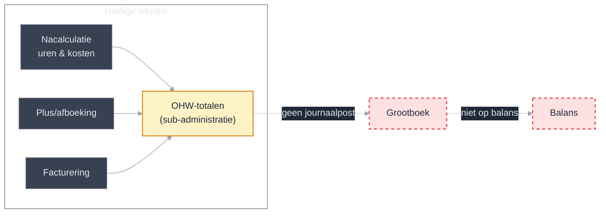
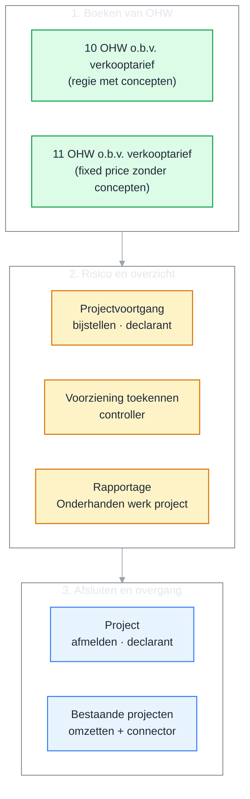
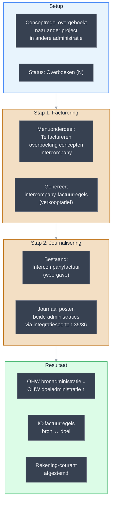
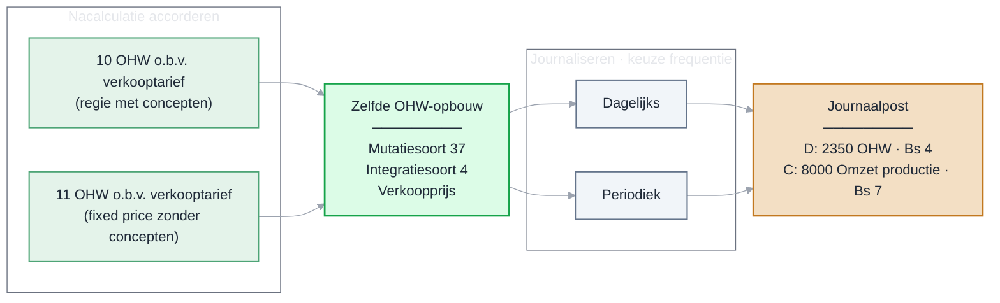
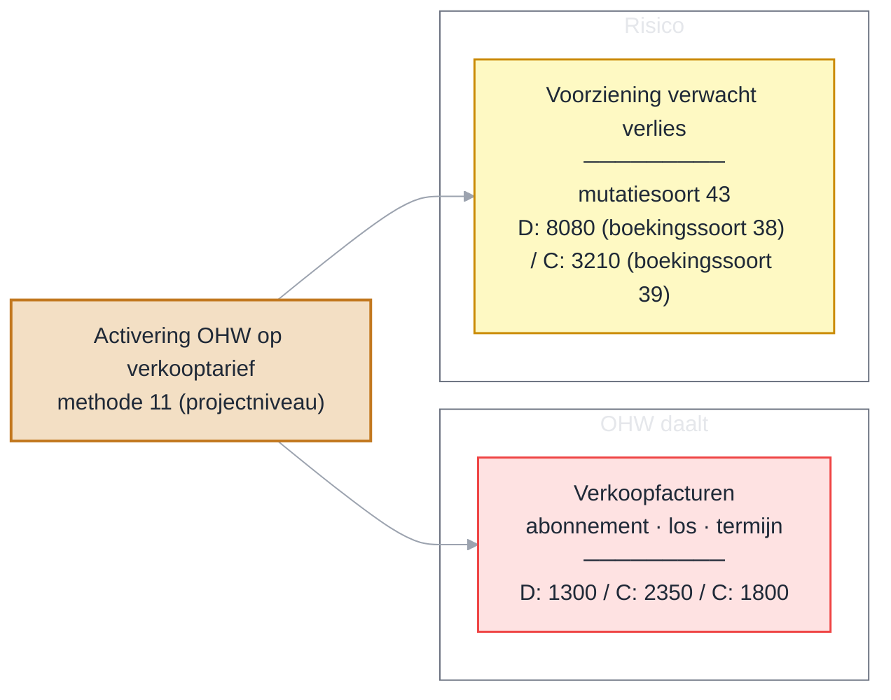
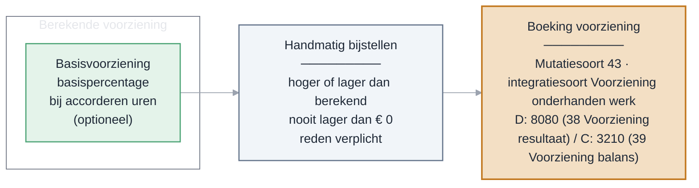
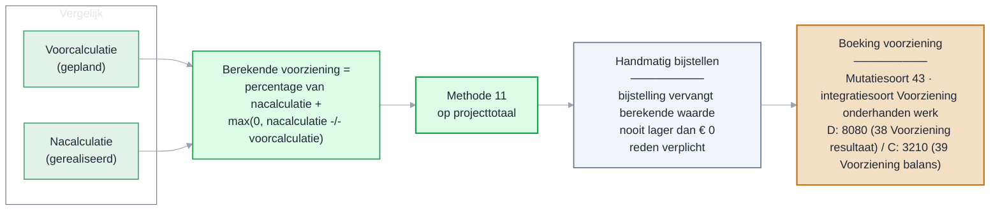
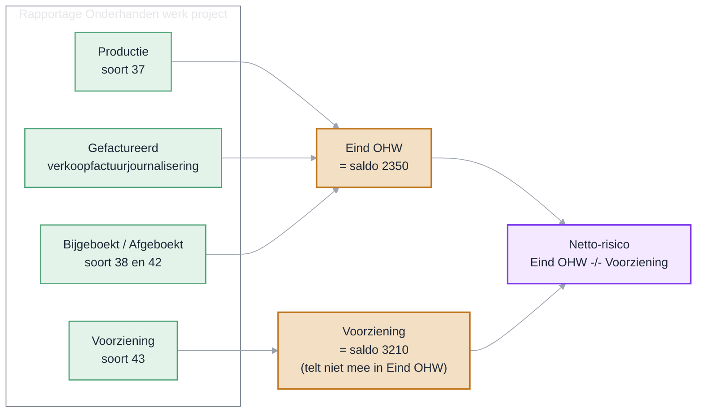
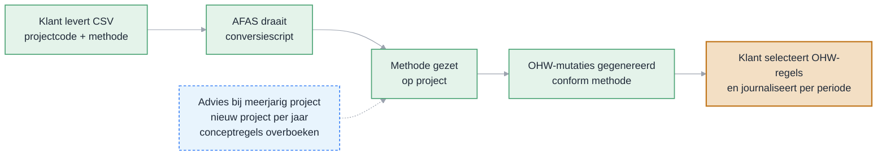

```mermaid
%%{init: {'theme':'base','themeVariables':{'background':'transparent','primaryColor':'#374151','primaryTextColor':'#e5e7eb','primaryBorderColor':'#6b7280','lineColor':'#9ca3af','textColor':'#e5e7eb','mainBkg':'#374151','clusterBkg':'transparent','clusterBorder':'#6b7280','edgeLabelBackground':'#1f2937','titleColor':'#e5e7eb','attributeBackgroundColorOdd':'#374151','attributeBackgroundColorEven':'#1f2937'}}}%%
flowchart LR
    EXT["Eigen model klant<br/>(buiten Profit)"] --> CONN["Update connector<br/>Projectvoortgang (PtPrognosisProject)<br/>veld Voorzieningprognose"]
    CONN --> TAB["Bestaande tabel Projectvoortgang<br/>project / datum"]
    TAB --> AFSL["Afsluiten periode<br/>journaliseren voorziening"]
    AFSL --> JP["Journaalpost<br/>D 8080 / C 3210"]

    classDef ext fill:#e8f4fd,stroke:#3b82f6,color:#1f2937,stroke-width:1.5px;
    classDef stap fill:#e4f3ea,stroke:#4da476,color:#1f2937,stroke-width:1.5px;
    classDef doel fill:#f3dfc4,stroke:#c2781f,color:#1f2937,stroke-width:2px;

    class EXT ext;
    class CONN,TAB stap;
    class AFSL,JP doel;
```

# Ontwerp RPT00750 – OHW totalen accountancy: Financieel maken

| Gegeven | Waarde |
| --- | --- |
| Projectcode | RPT00750 |
| Projectnaam | OHW totalen accountancy: Financieel maken |
| Status | Gebrieft |
| Versie | 0175 |
| Datum | 15-09-2026 |
| Auteur | Eric Zaal |

## Versiehistorie

De volledige versiehistorie staat in [Bijlage E – Versiehistorie](#bijlage-e--versiehistorie).

---

## 1. Inleiding

Dit ontwerp maakt onderhanden werk (OHW) zichtbaar in het grootboek. De praatplaat hieronder toont eerst het probleem in één beeld. Daarna lees je de aanleiding, het vooronderzoek en de gekozen oplossing.

#### Praatplaat 1 — De aanleiding

OHW-mutaties zijn alleen zichtbaar in de sub-administratie. Er komt geen journaalpost in het grootboek.



**Gevolgen:**

- Handmatige correcties nodig om het grootboek te laten aansluiten.
- Geen drill-down van journaalpost naar bronregel.
- Niet te verklaren waar OHW-bedragen vandaan komen.

&nbsp;

---

### 1.1 Aanleiding

Accountantskantoren gebruiken OHW-totalen met concepten om onderhanden werk te volgen. Bij deze werkwijze is OHW de waarde van uitgevoerd maar nog niet gefactureerd werk: het saldo van de openstaande conceptregels op verkoopprijs. Profit houdt de OHW-totalen bij in de tabel Onderhanden werk periodetotalen. Elke actie die het onderhanden werk beïnvloedt, werkt deze tabel bij.

Daarnaast factureren accountantskantoren hun opdrachten steeds vaker op basis van **fixed price**: een vaste prijs vooraf in plaats van nacalculatie. Daardoor kan het uitgevoerde werk hoger uitvallen dan de afgesproken prijs. Voor een verwacht verlies treffen zij een **voorziening**. Deze voorziening geldt voor beide werkwijzen: bij nacalculatie op basis van concepten als afwaardering van het onderhanden werk, en bij fixed price als verliesvoorziening. Zo is het verlies direct in de cijfers zichtbaar.

Het probleem: de huidige OHW-totalen genereren alleen opbrengstregels die direct in de winst-en-verliesrekening komen. Er wordt **geen financiële journaalpost** aangemaakt. De OHW-mutaties zijn daardoor alleen zichtbaar in de sub-administratie en niet in het grootboek.

Accountantskantoren hebben behoefte aan journaalposten voor elke OHW-mutatie, zodat het onderhanden werk ook op de balans zichtbaar is. Denk aan rekeningen als "Onderhanden werk" (2350) en "Nog te factureren".

**Waarom accountants dit nu willen.** Uit de klantgesprekken blijkt dat het ontbreken van een journaalpost geen theoretisch probleem is, maar dagelijkse overlast geeft. Schuitendam bouwt het OHW-overzicht nu zelf na in Power BI omdat termijn- en abonnementsfacturatie niet via concepten loopt en dus niet in de standaardrapportage terechtkomt — een tijdrovende maandelijkse exercitie. Meerdere kantoren (aaff, Unia, Newton) willen bovendien vaker dan nu financieel kunnen sturen: idealiter twee- tot vierwekelijks in plaats van pas bij de jaarafsluiting, zodat afwijkingen vroeg zichtbaar zijn in plaats van als grote correctie achteraf. Daarnaast willen ze functiescheiding aanbrengen: de projectverantwoordelijke blijft inhoudelijk eigenaar, maar finance krijgt een controlerende rol op de balanspost (management by exception). Deze wensen zijn de kern van de businessdrijfveer achter dit ontwerp.

> **Jaarrekening.** Accountantswerk wordt uitgevoerd *in opdracht van derden*. In de jaarrekening is de balanspost daarom een **onderhanden project** (BW 2 Titel 9, RJ 221), gewaardeerd tegen de opbrengstwaarde met — waar nodig — een afwaardering of een verliesvoorziening. De Profit-functionaliteit blijft "onderhanden werk (OHW)" heten; dit ontwerp gebruikt de jaarrekeningterm alleen waar het over de balanspresentatie en de voorziening gaat.

&nbsp;

---

### 1.2 Vooronderzoek

**Oplossingsrichtingen**

Er zijn twee oplossingsrichtingen onderzocht:

1. **Bestaande rapportage journaliseren** — De huidige OHW-periodetotalen voorzien van journaalposten. Voordeel: relatief eenvoudig. Nadeel: geen drill-down naar brongegevens. De herkomst van bedragen is moeilijk te verklaren.

1. **Uitbreiding bestaande mutatietabel op basis van conceptregels**

- We breiden de bestaande mutatietabel onderhanden werk (`AfasFbMutations`) uit met nieuwe mutatiesoorten voor OHW-concepten.
- Profit bepaalt per periode het saldo van openstaande conceptregels als onderhanden werk.
- De mutaties verwijzen naar de conceptregels; de conceptregels verwijzen naar nacalculatieregels en andere bronnen.
- De gebruiker kan daardoor vanuit een journaalpost doordrillen naar het detail.
- Deze aanpak sluit aan op het bestaande mutatiepatroon: methode 1-8 gebruiken dezelfde tabel.
- De aanpak gebruikt ook de conceptendatabase, die al 20 jaar stabiel is.

Gekozen: **oplossingsrichting 2**. De nieuwe mutatiesoorten worden toegevoegd aan de bestaande mutatietabel onderhanden werk (`AfasFbMutations`), conform het patroon van de andere OHW-methodes.

| Keuze | Besluit en reden |
| --- | --- |
| Bestaande mutatietabel uitbreiden | We voegen mutaties voor conceptregels toe aan de bestaande mutatietabel. Daardoor blijft drill-down naar conceptregels en de onderliggende brongegevens mogelijk. |


### 1.3 De oplossing

De oplossing bestaat uit twee nieuwe financiële integratiemethodes en functies die daarop aansluiten. De twee praatplaten hieronder tonen eerst de onderdelen in het kort en daarna de scope met de user stories in bouwvolgorde.

#### Praatplaat 2 — De features in het kort

Drie onderdelen. Lees van boven naar beneden: eerst boek je het OHW, daarna bewaak je het risico en het overzicht, en tot slot sluit je een project af of zet je het om naar de nieuwe methode.



**10 OHW o.b.v. verkooptarief (regie met concepten).** De nacalculatie bouwt het onderhanden werk op bij accordering, op verkooptarief. Conceptmutaties (bij-/afboeken, factureren, verplaatsen, overboeken) werken het OHW automatisch bij. Bij oud of risicovol OHW stel je een afwaardering in via de Basisvoorziening.

**11 OHW o.b.v. verkooptarief (fixed price zonder concepten).** Ook bij vaste-prijs-projecten bouwt de nacalculatie het OHW op bij accordering, op verkooptarief. De facturering loopt via termijnen, abonnements- of projectfacturen; elke verkoopfactuur verlaagt het OHW automatisch. Als de verwachte nacalculatie de voorcalculatie overschrijdt (verwacht verlies), tref je een verliesvoorziening op projectniveau.

Beide methodes zijn alleen beschikbaar als de activering **Onderhanden werk op basis van verkooptarief** aanstaat.

&nbsp;

#### Overzicht — Scope en user stories

De user stories staan in bouwvolgorde. Dit overzicht is bedoeld voor traceerbaarheid; de procesplaten bij de afzonderlijke user stories tonen de werking.

| Onderdeel | User stories | Afhankelijk van |
| --- | --- | --- |
| Fundament | US01 Methodes selecteren; US02 Boekingsfundament | — |
| OHW boeken via concepten | US03 OHW-opbouw; US04 Conceptmutaties; US04a Intercompany-overboeking | Fundament |
| OHW boeken bij vaste prijs | US05 Gedeelde journalisering; US05b Facturering vaste prijs | Fundament |
| Voorziening beheren | US06 Centraal overzicht; US07 Basisvoorziening; US08 Berekening; US09 en US09b Bijstellen; US10 en US10b Inzien; US12 Periode afsluiten | OHW boeken |
| Afronden en aansluiten | US11 Project afmelden; US13 Journaliseren; US14 Rapportage; US15 Conversie; US16 Connector | Voorziening beheren |

&nbsp;

---

### 1.4 Resultaat

Na realisatie van dit project:

- Genereren OHW-totalen journaalposten in het grootboek bij elke relevante mutatie.
- Is het onderhanden werk zichtbaar op de balans (rekening 2350 of vergelijkbaar).
- Sluit het grootboek aan op de sub-administratie zonder handmatige correcties.

### 1.5 Afbakening

| In scope | Toelichting |
| --- | --- |
| Journaalposten bij OHW-totalen mutaties | Nacalculatie, plus/afboeking, facturering, afsluiten |
| 10 OHW o.b.v. verkooptarief (regie met concepten) | Nieuwe OHW-methode voor accountantskantoren (US01–US09) |
| 11 OHW o.b.v. verkooptarief (fixed price zonder concepten) | Nieuwe OHW-methode voor vaste prijs-projecten: verliesvoorziening op projectniveau (US05b en US08) |
| Afsluiten project met OHW-verwerking | Resterend OHW op nul boeken bij afmelden (US11) |
| Voorschotfacturering en negatief OHW | Ondersteuning van voorschotten via abonnementen en handmatige projectfacturen |
| Termijn- en abonnementsprojecten in OHW-rapportage (alleen methode 11) | Deze projecten komen standaard in de OHW-totalen |

**Randvoorwaarden:**

- De hele nieuwe functionaliteit (methode 10 én 11) is alleen zichtbaar als de activering **Onderhanden werk op basis van verkooptarief** aanstaat, parallel aan de bestaande activering Omzettoekenning.
- Methode 10 is alleen beschikbaar als de activering **Onderhanden werk op basis van verkooptarief** aanstaat én in het scherm Facturering **Factureren op basis van concepten** aanstaat (tabblad Algemeen). Methode 10 werkt op verkoopprijs. De 4-kantscontrole wordt functioneel afgedwongen via verschilregels en mutatietriggers op conceptregels; daarmee blijft de oplossing robuust als de systeeminstelling Vierkantscontrole op aantal en bedrag uitstaat.
- Methode 11 is alleen beschikbaar als de activering **Onderhanden werk op basis van verkooptarief** aanstaat.

**Autorisatie:**

De nieuwe functionaliteit volgt de bestaande autorisatiestructuur voor projecten en OHW. Er komt geen aparte autorisatielaag: wie vandaag projecten, nacalculatie en OHW mag verwerken, kan ook de nieuwe methodes 10 en 11 gebruiken. Concreet:

- De nieuwe journaliseringsstappen vallen onder de bestaande autorisatie op de financiële integratie en het journaliseren.
- Het nieuwe menu-item **Voorziening toekennen** (US06) is een **nieuw, apart te autoriseren** menu-item, opgezet vergelijkbaar met **Omzettoekenning projecten**. Je autoriseert het menu-item en de acties Aanmaken, Actualiseren en Afsluiten periode afzonderlijk.
- Filterautorisatie geldt gelijk aan Omzettoekenning projecten: de gebruiker ziet alleen projecten van de administraties waarvoor hij is geautoriseerd.
- De update connector Projectvoortgang (US16) volgt de bestaande connector-autorisatie.

#### Autorisatietabel: rollen en acties bij Voorziening toekennen

Het nieuwe scherm **Voorziening toekennen** (US06) vereist expliciete autorisatie per actie. Autoriseer de acties afzonderlijk:

| Rol | Actie | Scherm | Beschrijving |
| --- | --- | --- | --- |
| Financieel beheerder | Weergave | Voorziening toekennen | Lezen van alle periodes en projecten |
| Financieel beheerder | Aanmaken periode | Voorziening toekennen | Eerste voorzieningsreeks per periode aanmaken |
| Financieel beheerder | Actualiseren periode | Voorziening toekennen | Periodetotaal en voorzieningsstand bijwerken |
| Financieel beheerder | Afsluiten periode | Vorisicoorziening toekennen | Periode vergrendelen en voorzieningmutatie klaarzetten (US12) |
| Controller / Declarant | Bijstellen (handmatig) | Voorziening toekennen > Bijstellen toekenning voorziening | Voorzieningprognose wijzigen met reden |
| Controller | Afmelden project | Voorziening toekennen | Afmelden wizard starten (US11) |
| Projectleider (InSite) | Weergave | Voorziening toekennen – InSite | Lezen voorzieningsstand per project zonder acties (US10b) |
| Declarant (InSite) | Bijstellen voortgang | Projectvoortgang – InSite | Voorzieningsgegevens zien bij projectvoortgang bijstelling (US09b) |

Je kunt autorisatie per administratie filteren (bestaande praktijk). Standaardrol aanpassing: **geen nieuwe rollen**, maar nieuwe menuopties en acties aan bestaande rollen toevoegen.

### 1.6 Raakvlakken

- **RPT00699** — Verdichten journaalposten uit financiële integraties. De journaalposten uit RPT00750 kunnen ook verdicht worden.
- **RPT00702** — Journaliseren omzet in eerste niet geblokkeerde periode. Relevant als financiële periodes geblokkeerd zijn.
- **Bestaande OHW-inrichting** — De pagina [Overzicht OHW](https://docs.afas.dev/profit/erp/functionaliteit/onderhanden%20werk/overzicht) legt de bestaande methodes (0 t/m 8), boekingssoorten (1 t/m 29) en mutatiesoorten (9 t/m 34) vast. De nieuwe methodes 10 en 11 en mutatiesoorten 37 t/m 43 breiden die reeks uit. Dit ontwerp hergebruikt boekingssoorten 7 en 8 en voegt boekingssoorten 36, 37, 38 en 39 toe.

### 1.7 Begrippen

De methode-, boekingssoort- en mutatiesoortnummering in dit ontwerp sluit aan op de bestaande OHW-inrichting van Profit. De pagina [Overzicht OHW](https://docs.afas.dev/profit/erp/functionaliteit/onderhanden%20werk/overzicht) legt die basis vast: methodes 0 t/m 8, boekingssoorten 1 t/m 29 met vaste rekeningen (onder meer 8000 opbrengst, 2350 OHW en 3400 OHW opbrengst) en mutatiesoorten 9 t/m 34. De nieuwe methodes 10 en 11 en de nieuwe mutatiesoorten 37 t/m 43 breiden deze reeks uit. Elke journaalpostregel gebruikt de boekingssoort van zijn rekening: hergebruik van boekingssoort 8 (OHW opbrengst, 2350) en 7 (Projectopbrengst, 8000), plus boekingssoorten 36 (Omzet OHW afboeking), 38 (Voorziening resultaat), 39 (Voorziening balans) en 37 (Afgemelde omzet). Het ontwerp hergebruikt de bestaande integratiesoorten 4 (OHW integratie) en 5 (OHW afmelden).

| Begrip | Uitleg |
| --- | --- |
| OHW | Onderhanden werk — de waarde van uitgevoerd maar nog niet gefactureerd werk. Dit is de Profit-productterm (tabellen, methodes, weergave). In de jaarrekening heet deze balanspost **onderhanden projecten** (zie hieronder). |
| Onderhanden projecten | De jaarrekeningterm (BW 2 Titel 9, RJ 221) voor werk **in opdracht van derden** dat nog niet is opgeleverd/gefactureerd. Accountantswerk valt hieronder. Waar dit ontwerp de balanspresentatie of waardering beschrijft, gebruiken we deze term; de Profit-functionaliteit blijft "onderhanden werk (OHW)" heten. |
| Afwaardering onderhanden werk | Het waarderen van het OHW onder de opbrengstwaarde omdat je verwacht het niet (volledig) te kunnen declareren. Géén voorziening in de zin van BW 2, maar een waarderingscorrectie op het OHW zelf. Bij methode 10 (Basisvoorziening; de aanvullende Risicovoorziening op ouderdom/bedrag valt buiten scope, zie [Bijlage D](#bijlage-d--buiten-scope)). |
| Verliesvoorziening | De voorziening voor verwachte verliezen op onderhanden projecten (RJ 221.311): zodra je verwacht dat een vaste-prijs-project verlies oplevert (nacalculatie hoger dan voorcalculatie), neem je dat verlies direct en volledig. Bij methode 11 (methode 12 is buiten scope). |
| OHW-totalen | De tabel waarin Profit per project per periode de OHW-stand bijhoudt |
| Concept | Een tussenversie van een factuur die je controleert voordat de definitieve factuur wordt aangemaakt |
| Plusboeking | Een handmatige toevoeging op een concept om het OHW te verhogen |
| Afboeking | Een correctie op een concept om het OHW te verlagen |
| Methode 5 | Bestaande OHW-methode "Omzettoekenning o.b.v. nacalculatie". De oorspronkelijke basis voor dit ontwerp. |
| Methode 10 | **10 OHW o.b.v. verkooptarief (regie met concepten)**. Werkt op verkoopprijs. |
| Methode 11 | **11 OHW o.b.v. verkooptarief (fixed price zonder concepten)**. De voorziening wordt op projecttotaal berekend. Werkt op verkoopprijs. |
| Methode 12 | Latere OHW-methode "Voorzieningtoekenning o.b.v. overschrijding voorcalculatie (werksoort)" (fixed price). De voorziening wordt per werksoort berekend. **Buiten scope** van dit ontwerp; zie [Bijlage D](#bijlage-d--buiten-scope). Werkt op verkoopprijs. |
| Verwerkingsmethode (vaPr) | De methode waarmee een conceptregel wordt verwerkt, bijvoorbeeld Factureren, Afboeken of Doorschuiven |
| Doorbelasten | Instelling op de projectfase en op de nacalculatieregel die bepaalt of het werk wordt doorbelast. Bij een methode-11-project staat Doorbelasten op de nacalculatieregel dwingend uit. Op een fase van een methode-11-project is Doorbelasten aan niet toegestaan. Zo gebruikt ieder project uitsluitend methode 10 of uitsluitend methode 11. |
| Factureren op basis van concepten | Instelling in het scherm Facturering (tabblad Algemeen) die conceptfacturen aanzet. Voorwaarde voor methode 10 |
| Activering | Een instelling die een klant aanzet om nieuwe of aanvullende functionaliteit in Profit te ontsluiten |
| Onderhanden werk op basis van verkooptarief | De nieuwe activering met de volgende omschrijvingen: **10 OHW o.b.v. verkooptarief (regie met concepten)** en **11 OHW o.b.v. verkooptarief (fixed price zonder concepten)**. De activering ontsluit ook de journalisering naar het grootboek en — waar nodig — een voorziening. Staat parallel aan de bestaande activering Omzettoekenning |
| Financieel maken | Het aanmaken van journaalposten in het grootboek op basis van OHW-mutaties |

### 1.8 Bijlagen

| Bijlage | Inhoud |
| --- | --- |
| [Bijlage A – Boekingsschema's](#bijlage-a--boekingsschemas) | Leidende boekingsschema's voor methode 10 en 11. |
| [Bijlage B – Open punten](#bijlage-b--open-punten) | Open onderzoekspunt dat nog besluitvorming vraagt. |
| [Bijlage E – Versiehistorie](#bijlage-e--versiehistorie) | Volledige versiehistorie van het ontwerp. |

Een aparte bijlage met testscenario's is voor dit ontwerp niet van toepassing. De genummerde acceptatiecriteria vormen de toetsbare basis; de verdere testuitwerking vindt buiten het ontwerp plaats.

---

## 2. Globale beschrijving

Dit hoofdstuk legt in gewone taal uit wat dit project oplevert. Het doel is dat iedereen snel begrijpt wat er verandert, wie ermee werkt en wat het resultaat is in de praktijk.

### 2.1 Wat realiseren we met dit project?

Met dit project maken we onderhanden werk (OHW) financieel zichtbaar in het grootboek. Vandaag staat OHW vooral in de sub-administratie. Na realisatie komen de OHW-mutaties ook als journaalpost terug in Financieel.

Dat doen we met:

- Twee nieuwe OHW-methodes: 10 OHW o.b.v. verkooptarief (regie met concepten) en 11 OHW o.b.v. verkooptarief (fixed price zonder concepten).
- Het menu-item en de weergave **Voorziening toekennen** voor aanmaken, actualiseren, bijstellen, afsluiten en afmelden.
- Voorzieninglogica per periode, inclusief handmatige bijstelling met reden.
- Doorlopende verwerking naar journaalposten via de bestaande wizard Journaliseren.
- Inzicht op projectniveau in Profit en in InSite (weergave zonder acties).

### 2.2 Wat merken gebruikers hiervan?

Gebruikers merken vooral dat OHW en voorziening niet meer los naast Financieel bestaan, maar onderdeel worden van dezelfde financiële keten.

- De financieel beheerder kan de periodevoorziening centraal beheren.
- De declarant kan in Projectvoortgang de voorzieningprognose bijstellen.
- De controller kan een formele periodebijstelling vastleggen met toelichting.
- De projectleider en financieel beheerder kunnen dezelfde voorzieningsstand ook in InSite bekijken.

Hierdoor sluit het beeld tussen projectadministratie en grootboek beter op elkaar aan en wordt uitleg naar audit en jaarrekening eenvoudiger.

### 2.3 Werken van project tot grootboek

Deze beschrijving volgt de handelingen die gebruikers en testers in Profit uitvoeren. De route start bij de inrichting van een project en eindigt met de journaalpost in Financieel. Profit voert de OHW-opbouw en de berekeningen tussen de handelingen automatisch uit.

#### Stap 1 - Richt de financiële integratie en methode in

De financieel beheerder opent eerst **Projecten > Integratie financieel**. Op tabblad **Grondslagen 2** richt de beheerder onder **Onderhanden werk op basis van verkooptarief** de grondslagen in voor boekingssoorten 36 Conceptwijzigingen, 37 Afgemelde omzet, 38 Voorziening resultaat en 39 Voorziening balans.

Daarna controleert de financieel beheerder de bestaande integratierekeningen. De OHW-mutaties gebruiken de OHW-balansrekening 2350. De omzetrekening blijft per verwerkingsmethode instelbaar via de bestaande integratierekening. Voor de voorziening richt de beheerder rekening 8080 in voor het resultaat en rekening 3210 voor de balans.

De verwerking gebruikt vervolgens deze integratiesoorten:

- **4 OHW integratie** voor OHW-opbouw en conceptmutaties.
- **5 OHW afmelden** voor het resterende OHW bij het afmelden van een project.
- **Voorziening onderhanden werk** voor de periodetoekenning en vrijval van de voorziening.

De financieel beheerder zet daarna de activering **Onderhanden werk op basis van verkooptarief** aan. Voor methode 10 zet de financieel beheerder ook **Factureren op basis van concepten** aan in **Facturering > Algemeen**.

Daarna kiest de financieel beheerder op het project de methode financiële integratie:

- Kies **methode 10** als het project via concepten factureert.
- Kies **methode 11** als het een vaste-prijs-project is. Op de nacalculatieregel staat Doorbelasten dan uit en het project werkt niet met concepten.

Zijn al OHW-mutaties op het project geboekt, dan blokkeert Profit een methodewijziging. De gebruiker brengt eerst de OHW-stand op nul voordat een andere methode kan worden gekozen.

#### Stap 2 - Registreer en accordeer het uitgevoerde werk

De medewerker registreert de nacalculatie op het project. De financieel beheerder of andere geautoriseerde gebruiker accordeert de nacalculatieregel. Na het accorderen bouwt Profit automatisch OHW op tegen verkoopprijs en maakt Profit een onverwerkte OHW-mutatie aan.

Bij methode 10 genereert en verwerkt de gebruiker daarna concepten. Bij- en afboeken, verplaatsen, overboeken en voorschotten werken het OHW automatisch bij op het moment dat de conceptregel wordt verwerkt. Een bedragwijziging op een concept leidt tot een verschilregel, zodat de oorspronkelijke regel herleidbaar blijft.

Bij methode 11 factureert de gebruiker zonder concept. Een abonnementsfactuur, losse projectfactuur of termijnfactuur verlaagt het OHW automatisch met het gefactureerde bedrag.

#### Stap 3 - Maak de voorzieningsperiode aan en actualiseer deze

De financieel beheerder opent **Projecten > Onderhanden werk > Voorziening toekennen**. Dit is het centrale scherm voor de periodeverwerking.

1. Selecteer de projecten en de periode.
2. Kies **Aanmaken periode**. Profit maakt de voorzieningsperiode aan en bepaalt de eerste stand.
3. Kies **Actualiseren periode** nadat nieuwe nacalculatie, facturering of een bijstelling is verwerkt. Profit berekent de voorziening opnieuw.
4. Controleer per project de kolommen **Eind OHW**, **Berekende voorziening**, **Geboekte voorziening** en **Mutatie voorziening**.

De weergave toont alleen projecten met methode 10 of 11 waarvoor OHW of een voorziening aanwezig is. Een afgesloten periode kan niet meer worden geactualiseerd.

#### Stap 4 - Leg een risico-inschatting vast als de berekening niet passend is

De declarant selecteert een projectregel in **Voorziening toekennen** en kiest **Toevoegen projectvoortgang**. Profit opent het scherm **Projectvoortgang**.

1. Vul de datum in waarop de inschatting geldt.
2. Vul **Voorzieningprognose** in als absoluut bedrag.
3. Leg een reden vast en voeg zo nodig een bijlage toe.
4. Sla de projectvoortgang op.
5. Ga terug naar **Voorziening toekennen** en kies **Actualiseren periode**.

De voorzieningprognose van de declarant maakt nog geen journaalpost. De controller kan daarna, door te dubbelklikken op de perioderegel, in **Bijstellen toekenning voorziening** een formele **Bijstelling periodevoorziening** vastleggen. Deze formele bijstelling heeft voor die periode voorrang op de voorzieningprognose.

#### Stap 5 - Sluit de periode af

De financieel beheerder selecteert in **Voorziening toekennen** de regels van de af te sluiten periode en kiest **Afsluiten periode**. Na de bevestiging verwerkt Profit de mutatie voorziening en vergrendelt Profit de periode.

Bij methode 10 controleert Profit vooraf of de vierkantscontrole aansluit. Sluit deze niet aan, dan blokkeert Profit het afsluiten. De gebruiker herstelt eerst het verschil en sluit de periode daarna opnieuw af.

#### Stap 6 - Journaliseer naar Financieel

De financieel beheerder opent **Projecten > Facturering > Journaliseren**. De gebruiker verwerkt de onverwerkte OHW-mutaties samen met de overige financiële integraties.

Profit maakt per mutatie de journaalpost op basis van de ingestelde grondslag en markeert de mutatie daarna als verwerkt. Verkoopfacturen worden vanuit de factuurregel gejournaliseerd. In Financieel zijn daarna het OHW op rekening 2350 en de voorziening op rekening 3210 zichtbaar.

Is de financiële periode geblokkeerd, dan verschuift Profit de boeking naar de eerste vrije periode als die instelling aanstaat. Anders blokkeert Profit het journaliseren.

#### Stap 7 - Meld een project af wanneer het werk is afgerond

De financieel beheerder opent opnieuw **Projecten > Onderhanden werk > Voorziening toekennen**, selecteert één projectregel en kiest **Afmelden project**. In de wizard **Afmelden onderhanden werk projecten** vult de gebruiker de boekingsdatum in. Bij methode 10 kiest de gebruiker ook een verplichte reden afboeking.

Profit controleert eerst de blokkades. Bij methode 10 moeten geopende concepten zijn gesloten. Bij methode 11 mogen geen te factureren termijnen of abonnementen meer bestaan. Na een succesvolle afronding boekt Profit het resterende OHW naar nul, laat een eventuele voorziening vrijvallen en krijgt het project de status **Afgemeld**.

#### Controlepunten voor testers

Testers volgen dezelfde route en controleren na iedere stap het resultaat:

| Na deze stap | Controleer dit resultaat |
| --- | --- |
| Financiële integratie inrichten | De grondslagen, integratierekeningen en integratiesoorten voor OHW en voorziening zijn ingericht. |
| Nacalculatie accorderen | Een OHW-mutatie op verkoopprijs bestaat voor het project. |
| Concept verwerken of verkoopfactuur boeken | Het OHW verandert volgens methode 10 of 11. |
| Periode aanmaken of actualiseren | Voorziening toekennen toont de actuele berekende voorziening en mutatie. |
| Voorziening bijstellen | De reden is vastgelegd en de nieuwe voorziening geldt bij de volgende actualisatie. |
| Periode afsluiten | De periode is vergrendeld en de voorzieningmutatie is verwerkt. |
| Journaliseren | De mutatie staat op verwerkt en de journaalpost is zichtbaar in Financieel. |
| Project afmelden | OHW is nul, een eventuele voorziening is vrijgevallen en de projectstatus is Afgemeld. |

### 2.4 Mockups die dit verhaal ondersteunen

De drie mockups hieronder laten de kern van de nieuwe werkwijze zien: centraal beheren, per project bijstellen en overal inzien. De detail-wizards (Actualiseren periode, Bijstellen toekenning voorziening, Afsluiten periode, projecttabblad) staan bij de bijbehorende user stories.

**Mockup A — Voorziening toekennen: menu-item en weergave.** De financieel beheerder ziet per project en periode de stand van het onderhanden werk en de voorziening, met de acties erboven.

<div style="font-family:Roboto,Segoe UI,sans-serif;background:#eef1f5;border:1px solid #d7dde5;border-radius:8px;padding:16px;color:#1f2937;">
<div style="font-size:13px;color:#5b6b7d;margin-bottom:4px;">Home &rsaquo; Projecten &rsaquo; Onderhanden werk &rsaquo; <span style="color:#1c6ce1;">Voorziening toekennen</span></div>
<div style="font-size:20px;font-weight:700;margin-bottom:12px;">Voorziening toekennen</div>
<div style="display:flex;flex-wrap:wrap;gap:8px;margin-bottom:14px;">
<span style="background:#1c6ce1;color:#fff;border-radius:4px;padding:7px 12px;font-size:13px;">Aanmaken periode</span>
<span style="background:#fff;color:#1c6ce1;border:1px solid #1c6ce1;border-radius:4px;padding:7px 12px;font-size:13px;">Actualiseren periode</span>
<span style="background:#fff;color:#1c6ce1;border:1px solid #1c6ce1;border-radius:4px;padding:7px 12px;font-size:13px;">Toevoegen projectvoortgang</span>
<span style="background:#fff;color:#1c6ce1;border:1px solid #1c6ce1;border-radius:4px;padding:7px 12px;font-size:13px;">Afsluiten periode</span>
<span style="background:#fff;color:#1c6ce1;border:1px solid #1c6ce1;border-radius:4px;padding:7px 12px;font-size:13px;">Afmelden project</span>
<span style="background:#fff;color:#5b6b7d;border:1px solid #cbd5e1;border-radius:4px;padding:7px 12px;font-size:13px;">Meer acties &#9662;</span>
</div>
<div style="overflow-x:auto;background:#fff;border:1px solid #e2e8f0;border-radius:8px;">
<table style="border-collapse:collapse;font-size:12px;min-width:1420px;width:100%;white-space:nowrap;">
<thead>
<tr style="background:#f5f7fa;text-align:left;">
<th style="padding:8px 10px;border-bottom:1px solid #e2e8f0;color:#33475b;font-weight:700;">Project</th>
<th style="padding:8px 10px;border-bottom:1px solid #e2e8f0;color:#33475b;font-weight:700;">Jaar</th>
<th style="padding:8px 10px;border-bottom:1px solid #e2e8f0;color:#33475b;font-weight:700;">Periode</th>
<th style="padding:8px 10px;border-bottom:1px solid #e2e8f0;color:#33475b;font-weight:700;text-align:right;">Omzet gepland</th>
<th style="padding:8px 10px;border-bottom:1px solid #e2e8f0;color:#33475b;font-weight:700;text-align:right;">Omzet gerealiseerd</th>
<th style="padding:8px 10px;border-bottom:1px solid #e2e8f0;color:#33475b;font-weight:700;text-align:right;">Basispercentage</th>
<th style="padding:8px 10px;border-bottom:1px solid #e2e8f0;color:#33475b;font-weight:700;text-align:right;">Basisvoorziening</th>
<th style="padding:8px 10px;border-bottom:1px solid #e2e8f0;color:#33475b;font-weight:700;text-align:right;">Overschrijding voorcalculatie</th>
<th style="padding:8px 10px;border-bottom:1px solid #e2e8f0;color:#33475b;font-weight:700;text-align:right;">Eind OHW</th>
<th style="padding:8px 10px;border-bottom:1px solid #e2e8f0;color:#33475b;font-weight:700;text-align:right;">Geboekte voorziening</th>
<th style="padding:8px 10px;border-bottom:1px solid #e2e8f0;color:#33475b;font-weight:700;text-align:right;">Berekende voorziening</th>
<th style="padding:8px 10px;border-bottom:1px solid #e2e8f0;color:#33475b;font-weight:700;text-align:right;">Voorzieningprognose</th>
<th style="padding:8px 10px;border-bottom:1px solid #e2e8f0;color:#33475b;font-weight:700;text-align:right;">Bijstelling periodevoorziening</th>
<th style="padding:8px 10px;border-bottom:1px solid #e2e8f0;color:#33475b;font-weight:700;text-align:right;">Voorziening in periode</th>
<th style="padding:8px 10px;border-bottom:1px solid #e2e8f0;color:#33475b;font-weight:700;text-align:right;">Mutatie voorziening</th>
<th style="padding:8px 10px;border-bottom:1px solid #e2e8f0;color:#33475b;font-weight:700;">Reden</th>
</tr>
</thead>
<tbody>
<tr style="border-top:2px solid #94a3b8;">
<td style="padding:8px 10px;">2026.0012 Jaarrekening Aaff BV</td>
<td style="padding:8px 10px;">2026</td>
<td style="padding:8px 10px;">05</td>
<td style="padding:8px 10px;text-align:right;">&euro; 12.000</td>
<td style="padding:8px 10px;text-align:right;">&euro; 14.500</td>
<td style="padding:8px 10px;text-align:right;">5 %</td>
<td style="padding:8px 10px;text-align:right;">&euro; 410</td>
<td style="padding:8px 10px;text-align:right;color:#94a3b8;">&ndash;</td>
<td style="padding:8px 10px;text-align:right;">&euro; 8.200</td>
<td style="padding:8px 10px;text-align:right;">&euro; 3.200</td>
<td style="padding:8px 10px;text-align:right;">&euro; 4.100</td>
<td style="padding:8px 10px;text-align:right;color:#94a3b8;">&ndash;</td>
<td style="padding:8px 10px;text-align:right;color:#94a3b8;">&ndash;</td>
<td style="padding:8px 10px;text-align:right;font-weight:700;">&euro; 4.100</td>
<td style="padding:8px 10px;text-align:right;font-weight:700;color:#2f855a;">&euro; 900</td>
<td style="padding:8px 10px;color:#94a3b8;">&ndash;</td>
</tr>
<tr style="border-top:2px solid #94a3b8;">
<td style="padding:8px 10px;">2026.0031 Controle XYZ BV</td>
<td style="padding:8px 10px;">2026</td>
<td style="padding:8px 10px;">05</td>
<td style="padding:8px 10px;text-align:right;">&euro; 7.000</td>
<td style="padding:8px 10px;text-align:right;">&euro; 8.600</td>
<td style="padding:8px 10px;text-align:right;">5 %</td>
<td style="padding:8px 10px;text-align:right;">&euro; 430</td>
<td style="padding:8px 10px;text-align:right;">&euro; 1.600</td>
<td style="padding:8px 10px;text-align:right;">&euro; 8.600</td>
<td style="padding:8px 10px;text-align:right;">&euro; 500</td>
<td style="padding:8px 10px;text-align:right;">&euro; 2.030</td>
<td style="padding:8px 10px;text-align:right;">&euro; 400</td>
<td style="padding:8px 10px;text-align:right;color:#94a3b8;">&ndash;</td>
<td style="padding:8px 10px;text-align:right;font-weight:700;">&euro; 400</td>
<td style="padding:8px 10px;text-align:right;font-weight:700;color:#d11f43;">-&euro; 100</td>
<td style="padding:8px 10px;color:#94a3b8;">&ndash;</td>
</tr>
<tr style="border-top:2px solid #94a3b8;">
<td style="padding:8px 10px;">2026.0047 Advies Delta BV</td>
<td style="padding:8px 10px;">2026</td>
<td style="padding:8px 10px;">05</td>
<td style="padding:8px 10px;text-align:right;">&euro; 20.000</td>
<td style="padding:8px 10px;text-align:right;">&euro; 18.000</td>
<td style="padding:8px 10px;text-align:right;">5 %</td>
<td style="padding:8px 10px;text-align:right;">&euro; 1.000</td>
<td style="padding:8px 10px;text-align:right;color:#94a3b8;">&ndash;</td>
<td style="padding:8px 10px;text-align:right;">&euro; 20.000</td>
<td style="padding:8px 10px;text-align:right;">&euro; 1.800</td>
<td style="padding:8px 10px;text-align:right;">&euro; 1.000</td>
<td style="padding:8px 10px;text-align:right;color:#94a3b8;">&ndash;</td>
<td style="padding:8px 10px;text-align:right;">&euro; 2.200</td>
<td style="padding:8px 10px;text-align:right;font-weight:700;">&euro; 2.200</td>
<td style="padding:8px 10px;text-align:right;font-weight:700;color:#2f855a;">&euro; 400</td>
<td style="padding:8px 10px;">Meer tijd nodig door verkeerde inschatting</td>
</tr>
</tbody>
</table>
</div>
<div style="font-size:12px;color:#5b6b7d;margin-top:8px;">Voorziening in periode = de Bijstelling periodevoorziening (deze periode) als de controller die heeft vastgelegd; anders de voorzieningprognose; anders de berekende voorziening. Ondergrens &euro; 0. Mutatie = Voorziening in periode -/- geboekte voorziening.</div>
</div>

**Mockup B — De voorziening bijstellen (declarant).** Via Toevoegen projectvoortgang legt de declarant een voorzieningprognose vast met reden en bijlage. Profit berekent de nieuwe voorziening en de mutatie.

<div style="font-family:Roboto,Segoe UI,sans-serif;background:#eef1f5;border:1px solid #d7dde5;border-radius:8px;padding:16px;color:#1f2937;">
<div style="font-size:13px;color:#5b6b7d;margin-bottom:4px;">Voorziening toekennen &rsaquo; <span style="color:#1c6ce1;">Projectvoortgang</span></div>
<div style="font-size:20px;font-weight:700;margin-bottom:16px;">Projectvoortgang</div>
<div style="display:flex;flex-wrap:wrap;gap:16px;align-items:flex-start;">
<div style="background:#fff;border:1px solid #e2e8f0;border-radius:8px;padding:16px;width:320px;box-sizing:border-box;">
<div style="font-weight:700;margin-bottom:12px;">Algemeen</div>
<div style="font-size:13px;"><div style="color:#33475b;margin-bottom:4px;">Datum</div><div style="border:1px solid #cbd5e1;border-radius:4px;padding:6px 8px;">31-05-2026</div></div>
</div>
<div style="background:#fff;border:1px solid #e2e8f0;border-radius:8px;padding:16px;width:420px;box-sizing:border-box;">
<div style="font-weight:700;margin-bottom:12px;">Voorziening</div>
<div style="display:flex;align-items:center;margin-bottom:8px;font-size:13px;"><div style="width:190px;color:#33475b;">Omzet productie gepland</div><div style="flex:1;border:1px solid #e2e8f0;background:#f5f7fa;color:#5b6b7d;border-radius:4px;padding:6px 8px;text-align:right;">&euro; 3.000</div></div>
<div style="display:flex;align-items:center;margin-bottom:8px;font-size:13px;"><div style="width:190px;color:#33475b;">Omzet productie gerealiseerd</div><div style="flex:1;border:1px solid #e2e8f0;background:#f5f7fa;color:#5b6b7d;border-radius:4px;padding:6px 8px;text-align:right;">&euro; 3.700</div></div>
<div style="display:flex;align-items:center;margin-bottom:8px;font-size:13px;"><div style="width:190px;color:#33475b;">Geboekte voorziening</div><div style="flex:1;border:1px solid #e2e8f0;background:#f5f7fa;color:#5b6b7d;border-radius:4px;padding:6px 8px;text-align:right;">&euro; 500</div></div>
<div style="display:flex;align-items:center;margin-bottom:8px;font-size:13px;"><div style="width:190px;color:#33475b;">Berekende voorziening</div><div style="flex:1;border:1px solid #e2e8f0;background:#f5f7fa;color:#5b6b7d;border-radius:4px;padding:6px 8px;text-align:right;">&euro; 700</div></div>
<div style="display:flex;align-items:center;margin-bottom:8px;font-size:13px;"><div style="width:190px;color:#33475b;">Voorzieningprognose</div><div style="flex:1;border:1px solid #1c6ce1;border-radius:4px;padding:6px 8px;text-align:right;">&euro; 400</div></div>
<div style="display:flex;align-items:center;margin-bottom:8px;font-size:13px;"><div style="width:190px;color:#33475b;">Voorziening (nieuw)</div><div style="flex:1;border:1px solid #e2e8f0;background:#f5f7fa;color:#1f2937;font-weight:700;border-radius:4px;padding:6px 8px;text-align:right;">&euro; 400</div></div>
<div style="display:flex;align-items:center;margin-bottom:12px;font-size:13px;"><div style="width:190px;color:#33475b;">Mutatie voorziening</div><div style="flex:1;border:1px solid #e2e8f0;background:#f5f7fa;color:#d11f43;font-weight:700;border-radius:4px;padding:6px 8px;text-align:right;">-&euro; 100</div></div>
<div style="margin-bottom:10px;font-size:13px;"><div style="color:#33475b;margin-bottom:4px;">Opmerking</div><div style="border:1px solid #cbd5e1;border-radius:4px;padding:6px 8px;">Lagere risico-inschatting na beoordeling</div></div>
<div style="font-size:13px;"><div style="color:#33475b;margin-bottom:4px;">Bijlage</div><div style="border:1px solid #cbd5e1;border-radius:4px;padding:6px 8px;color:#5b6b7d;">Kies bestand&hellip;</div></div>
</div>
</div>
<div style="display:flex;justify-content:flex-end;gap:8px;margin-top:16px;">
<span style="background:#fff;color:#5b6b7d;border:1px solid #cbd5e1;border-radius:4px;padding:7px 16px;">Annuleren</span>
<span style="background:#1c6ce1;color:#fff;border-radius:4px;padding:7px 16px;">Opslaan</span>
</div>
</div>

**Mockup C — Inzage in InSite (projectleider en financieel beheerder).** Dezelfde periode-informatie is buiten Profit Windows zichtbaar in InSite, als weergave zonder acties.

<div style="font-family:Roboto,Segoe UI,sans-serif;background:#f4f6f9;border:1px solid #d7dde5;border-radius:8px;overflow:hidden;color:#1f2937;">
<div style="background:#1c6ce1;color:#fff;padding:10px 16px;font-size:13px;">InSite &nbsp;&rsaquo;&nbsp; Mijn projecten &nbsp;&rsaquo;&nbsp; <span style="font-weight:700;">Voorziening toekennen</span></div>
<div style="padding:14px 16px;">
<div style="font-size:16px;font-weight:700;">2026.0012 &mdash; Jaarrekening Aaff BV</div>
<div style="font-size:12px;color:#5b6b7d;margin:2px 0 12px;">Methode 10 &nbsp;|&nbsp; Interne projectleider: J. Jansen &nbsp;|&nbsp; Weergave &mdash; geen acties</div>
<div style="background:#fff;border:1px solid #e2e8f0;border-radius:6px;overflow-x:auto;">
<table style="border-collapse:collapse;font-size:12px;min-width:1000px;width:100%;white-space:nowrap;">
<thead>
<tr>
<th style="padding:8px 10px;background:#f5f7fa;color:#33475b;border-bottom:1px solid #e2e8f0;text-align:left;">Fase</th>
<th style="padding:8px 10px;background:#f5f7fa;color:#33475b;border-bottom:1px solid #e2e8f0;text-align:left;">Jaar</th>
<th style="padding:8px 10px;background:#f5f7fa;color:#33475b;border-bottom:1px solid #e2e8f0;text-align:left;">Periode</th>
<th style="padding:8px 10px;background:#f5f7fa;color:#33475b;border-bottom:1px solid #e2e8f0;text-align:right;">Eind OHW</th>
<th style="padding:8px 10px;background:#f5f7fa;color:#33475b;border-bottom:1px solid #e2e8f0;text-align:right;">Berekende voorziening</th>
<th style="padding:8px 10px;background:#f5f7fa;color:#33475b;border-bottom:1px solid #e2e8f0;text-align:right;">Voorzieningprognose</th>
<th style="padding:8px 10px;background:#f5f7fa;color:#33475b;border-bottom:1px solid #e2e8f0;text-align:right;">Bijstelling periodevoorziening</th>
<th style="padding:8px 10px;background:#f5f7fa;color:#33475b;border-bottom:1px solid #e2e8f0;text-align:right;">Voorziening in periode</th>
<th style="padding:8px 10px;background:#f5f7fa;color:#33475b;border-bottom:1px solid #e2e8f0;text-align:right;">Mutatie</th>
<th style="padding:8px 10px;background:#f5f7fa;color:#33475b;border-bottom:1px solid #e2e8f0;text-align:center;">Afgesloten</th>
<th style="padding:8px 10px;background:#f5f7fa;color:#33475b;border-bottom:1px solid #e2e8f0;text-align:center;">Gejourn.</th>
</tr>
</thead>
<tbody>
<tr style="background:#fff8e6;">
<td style="padding:8px 10px;color:#94a3b8;">&ndash;</td>
<td style="padding:8px 10px;color:#1f2937;">2026</td>
<td style="padding:8px 10px;color:#1f2937;">05</td>
<td style="padding:8px 10px;text-align:right;color:#1f2937;">&euro; 8.200</td>
<td style="padding:8px 10px;text-align:right;color:#1f2937;">&euro; 4.100</td>
<td style="padding:8px 10px;text-align:right;color:#94a3b8;">&ndash;</td>
<td style="padding:8px 10px;text-align:right;color:#94a3b8;">&ndash;</td>
<td style="padding:8px 10px;text-align:right;font-weight:700;color:#1f2937;">&euro; 4.100</td>
<td style="padding:8px 10px;text-align:right;font-weight:700;color:#2f855a;">&euro; 900</td>
<td style="padding:8px 10px;text-align:center;color:#1f2937;">&#9744;</td>
<td style="padding:8px 10px;text-align:center;color:#1f2937;">&#9744;</td>
</tr>
</tbody>
</table>
</div>
</div>
<div style="font-size:12px;color:#5b6b7d;margin-top:8px;">Weergave zonder acties. Aanmaken, actualiseren, afsluiten en journaliseren gebeurt centraal in Profit via Voorziening toekennen.</div>
</div>

**De detail-wizards** staan bij de user stories:

- Wizard **Actualiseren periode** en **Bijstellen toekenning voorziening**: [US06](#us06--voorziening-toekennen-centraal-menu-en-weergave).
- Wizard **Afsluiten periode**: [US12](#us12--wizard-afsluiten-periode).
- Projecttabblad **Voorziening toekennen** in Profit: [US10](#us10--voorziening-toekennen-projecttabblad).

### 2.5 Samenvatting voor alle lezers

Dit project zorgt dat OHW, voorziening en financiële verwerking één samenhangend proces vormen. De oplossing geeft meer grip op risico's, maakt bedragen beter uitlegbaar en biedt zichtbaarheid voor verschillende rollen in zowel Profit als InSite.

De detailuitwerking staat in de user stories in hoofdstuk 3.

## 3. User stories

### 3.1 Overzicht en bouwvolgorde


| Nr | User story | Methode | Bouwt op | Kern |
| --- | --- | --- | --- | --- |
| US01 | Methodes 10 en 11 definiëren en selecteren | 10 + 11 | — | Activering, voorwaarden, fasegedrag en blokkeren van methodewijziging |
| US02 | Boekingsfundament: mutatiesoorten, grondslagen en integratierekening | 10 + 11 | US01 | Mutatiesoorten 37–43, OHW-grondslagen, integratiesoorten en integratierekeningen |
| US03 | OHW-opbouw bij geaccordeerde nacalculatie (methode 10 en 11) | 10 + 11 | US02 | Opbouw op verkoopprijs (soort 37) |
| US04 | Conceptmutaties: bij-/afboeken, factureren en verplaatsen (methode 10) | 10 | US03 | Soort 38 voor bij-/afboeken, soort 39 voor overboeken, soort 40 voor verplaatsen en soort 41 voor voorschotten; facturering via verkoopfacturen |
| US04a | Overboeken concept naar andere administratie (methode 10) | 10 | US04 | Soort 39 via intercompany-route, Intercompany projecten, extra intercompany-factuurregels, IC-inrichting |
| US05 | Journalisering OHW-productie (gedeeld) | 10 + 11 | US02 | Zelfde boekingslogica voor de OHW-productie bij methode 10 en 11 |
| US05b | Methode 11: OHW-opbouw en facturering | 11 | US02, US05 | Opbouw (soort 37), facturering incl. termijnen en abonnementen (journalisatie via verkoopfacturen) |
| US06 | Voorziening toekennen: centraal menu en weergave | 10 + 11 | US05, US05b | Centraal menu en weergave; acties aanmaken, actualiseren, bijstellen en afsluiten per periode |
| US07 | Basisvoorziening instellen op het project (methode 10 en 11) | 10 + 11 | US06 | Basisvoorziening aan/uit en basispercentage per project |
| US08 | Berekeningen voorziening (methode 10 én 11) | 10 + 11 | US06, US07 | Berekening: Basisvoorziening (methode 10) en verliesvoorziening (methode 11) |
| US09 | De voorziening bijstellen via Toevoegen projectvoortgang | 10 + 11 | US06, US08 | Scherm Projectvoortgang: Voorzieningprognose |
| US09b | De voorziening bijstellen via Toevoegen projectvoortgang: InSite-pagina's | 10 + 11 | US09 | InSite-pagina's Aanmaken, Aanmaken per fase en Aanpassen Projectvoortgang met voorzieningvelden |
| US10 | Voorziening toekennen: projecttabblad | 10 + 11 | US06 | Weergave per periode op het project zelf (zonder acties) |
| US10b | Voorziening toekennen: InSite-overzichtpagina | 10 + 11 | US06, US10 | Dezelfde weergave per periode op een InSite-overzichtpagina bij het project (zonder acties), voor projectleider en financieel beheerder |
| US11 | Wizard afmelden project (methode 10 en 11) | 10 + 11 | US04, US05b, US06, US08 | Eén afmeldroute via Voorziening toekennen; methode 10 boekt open conceptregels af via soort 38 en integratiesoort 4, methode 11 controleert te factureren termijnen/abonnementen; resterend OHW via soort 42 en integratiesoort 5, voorzieningsvrijval via soort 43 en integratiesoort Voorziening onderhanden werk |
| US12 | Wizard afsluiten periode | 10 + 11 | US06, US08 | Afsluiten periode via actie in Voorziening toekennen; de voorziening is bij periodetoekenning geboekt (soort 43, integratiesoort Voorziening onderhanden werk) en de periode wordt vergrendeld |
| US13 | Journaliseren: OHW-mutaties verwerken tot journaalposten | 10 + 11 | US02, US03, US04, US04a, US05, US05b | Onverwerkte mutaties (`AfasFbMutations`) via wizard Journaliseren → journaalposten; integratiesoorten 4, 5 en OHW voorziening |
| US14 | Onderhanden werk project-rapportage uitbreiden | 10 + 11 | US05, US08 | Methode 11 en kolom Voorziening in de bestaande rapportage |
| US15 | Conversie project van methode 0 naar 10 of 11 | 10 + 11 | US02 | CSV + conversiescript, klant journaliseert zelf |
| US16 | Voorziening bijstellen via update connector Projectvoortgang | 10 + 11 | US09 | Veld Voorzieningprognose op `PtPrognosisProject` |

De overzichtsplaat met de afhankelijkheden staat in [Praatplaat 3](#praatplaat-3--scope-en-user-stories-bouwvolgorde).

---

### US01 – Methodes 10 en 11 definiëren en selecteren

#### User story

**Als** financieel beheerder
**wil ik** de nieuwe methodes 10 (OHW o.b.v. verkooptarief, regie met concepten) en 11 (OHW o.b.v. verkooptarief, fixed price zonder concepten) kunnen activeren en per project selecteren onder de juiste voorwaarden
**zodat** elk project met de juiste OHW-methode start en de OHW-stand betrouwbaar blijft.

#### Ontwerpkeuzen

| Keuze | Besluit en reden |
| --- | --- |
| Eén centrale activering | De activering **Onderhanden werk op basis van verkooptarief** ontsluit methode 10 en 11. Daarmee blijft de functionaliteit buiten beeld bij klanten die deze niet gebruiken. |
| Regie of fixed price | Methode 10 is voor regie met concepten en ruimte om meerwerk achteraf te beoordelen. Methode 11 is voor vaste prijzen. Voor door te belasten meerwerk bij een fixed-price-opdracht maak je een nieuw project met methode 10. Een projectprofiel geeft nieuwe projecten een passende standaardmethode. |
| Fixed price zonder concepten | Bij methode 11 staat Doorbelasten op de nacalculatieregel uit. Daardoor ontstaan geen concepten. |
| Eén methode per project | Een project gebruikt uitsluitend methode 10 of uitsluitend methode 11. Projectfasen kunnen die methode niet wijzigen. Dit houdt de afmeldroute eenduidig. |
| Methode na gebruik vastzetten | Zodra OHW-mutaties bestaan, kan de gebruiker de methode niet meer wijzigen. Dit houdt de OHW-stand en het grootboek in samenhang. |

#### Functionele uitwerking

**Methode 10** is selecteerbaar als deze voorwaarden gelden:

Je stelt de methode in via ** Eigenschappen project > Financiële integratie**.

- Activering **Onderhanden werk op basis van verkooptarief** in het scherm **Activering**
- **Factureren op basis van concepten** (scherm Facturering → Algemeen)
- 4-kantscontrole conceptregels in ingesteld op 'Aantal en bedrag' (verschilregel bij bedragwijziging) (menu):Uren/Declaratie/Instellingen/Facturering/Concepten)
- **Termijnfacturen** staat op het project uit

Voldoet één voorwaarde niet, dan toont Profit methode 10 niet in het keuzeveld.

**4-kantscontrole bewaking:** wijzig je het bedrag op een conceptregel, dan maakt Profit altijd een nieuwe conceptregel met het bedragverschil. Zo blijft het spoor sluitend zonder afhankelijkheid van de systeeminstelling Vierkantscontrole.

**Methode 11** is selecteerbaar als activering **Onderhanden werk op basis van verkooptarief** aanstaat. Stel **Projectvoortgang per** in op Project of Projectfase.

**Fixed price kent geen concepten:**

- Doorbelasten op de nacalculatieregel staat bij methode 11 dwingend uit.
- Je kunt voor een project met methode 11 geen concept maken. Profit toont dan de melding: *"Je kunt voor project [projectcode] geen concept maken. Dit project gebruikt methode 11 (OHW o.b.v. verkooptarief, fixed price zonder concepten). Gebruik voor dit project termijnfacturen, abonnementsfacturen of projectfacturen."*
- Een niet-doorbelaste regel gaat nooit naar een concept.
- De regel bouwt wél OHW op (soort 37); facturering verlaagt via termijnen (journalisatie via verkoopfacturen, zie US05b).
- Doorbelasten aan op een projectfase is bij methode 11 niet toegestaan. Voor door te belasten meerwerk maakt de gebruiker een nieuw project met methode 10.
- Doorbelasten staat uit ongeacht wat er normaal bepalend is (het vinkje op het project, de instelling op de projectfase of op de werksoort, de kostenpost of het artikel) en het veld is niet wijzigbaar. Dit geldt in het boekingsprogramma Nacalculatie in Profit Windows, in de urenregistratie in InSite en in de weekkalender en de matrix.
- Stuurt een import of de UpdateConnector Doorbelasten toch mee met *Ja* op een methode-11-project, dan zet Profit het zonder foutmelding terug op *Nee*; de regel wordt gewoon geboekt.

**Integriteitsregels bij opslaan:**

- **Methode 10 zonder termijnfacturen.** Bij opslaan van een project controleert Profit of Methode financiële integratie = 10 en Termijnfacturen aanstaat. Is dat zo, dan blokkeert Profit het opslaan met de foutmelding: *"Je kunt methode 10 niet gebruiken als termijnfacturen aanstaan. Zet termijnfacturen uit of kies methode 11 OHW o.b.v. verkooptarief (fixed price zonder concepten)."*
- **Methode 11 zonder door te belasten meerwerk.** Bij opslaan van een projectfase controleert Profit of het project Methode financiële integratie = 11 en Doorbelasten op de fase aanstaat. Is dat zo, dan blokkeert Profit het opslaan met de foutmelding: *"Je kunt bij methode 11 geen door te belasten meerwerkfase gebruiken. Maak voor meerwerk een nieuw project met methode 10."*

**Methodewijziging blokkeren:** je kunt de methode niet wijzigen als er al OHW-mutaties bestaan. Profit toont de melding: *"Kan methode OHW niet wijzigen omdat er al nacalculatie of opbrengst is geboekt op dit project."* Breng de OHW-stand op nul om een andere methode te kunnen kiezen.

#### Uitwerking voor realisatie

- **Voorwaarde methode 10.** Het keuzeveld is beschikbaar als de activering `Onderhanden werk op basis van verkooptarief` en de instelling `Factureren op basis van concepten` aanstaan.
- **Termijnfacturen blokkeren bij methode 10.** Bij opslaan van een project met `AfasPtMethodOHW` = 10 en termijnfacturen aan blokkeert Profit het opslaan met een foutmelding.
- **Verschilregel bij wijziging.** Bedragwijziging op een conceptregel resulteert altijd in een extra conceptregel met alleen het bedragverschil.
- **Trigger op mutatie.** Ontstaat er toch direct een conceptmutatie, dan maakt een trigger altijd een OHW-mutatieregel in `AfasFbMutations` met de bijbehorende mutatiesoort.
- **Voorwaarde methode 11.** Alleen activering Onderhanden werk op basis van verkooptarief vereist.
- **Doorbelasten dwingend uit (methode 11).** `AfasPtChargeable` dwingend uit; aanzetten niet toegestaan, ongeacht de bepalende instelling (project, projectfase, werksoort, kostenpost of artikel). Niet wijzigbaar in boekingsprogramma Nacalculatie (Profit Windows), urenregistratie InSite, weekkalender en matrix.
- **Import en UpdateConnector.** Wordt `AfasPtChargeable` = *Ja* aangeleverd op een methode-11-project, dan overschrijft Profit dit stil naar *Nee* (geen foutmelding); bij overige methodes blijft een aangeleverde *Ja* ongewijzigd.
- **Door te belasten fase blokkeren bij methode 11.** Bij opslaan van een projectfase van een project met `AfasPtMethodOHW` = 11 en Doorbelasten = *Ja* blokkeert Profit het opslaan met een foutmelding.
- **Methodewijziging blokkeren.** Hergebruik de bestaande controle op wijziging van de OHW-methode.

#### Acceptatiecriteria

1. Methode 10 is alleen selecteerbaar als Onderhanden werk op basis van verkooptarief aanstaat én Factureren op basis van concepten aanstaat (tabblad Algemeen).
2. Staat één van deze twee voorwaarden niet aan, dan is methode 10 niet selecteerbaar. Profit toont een melding: "Methode OHW onderhanden werk o.b.v. nacalculatie via concepten vereist (a) activering Onderhanden werk op basis van verkooptarief én (b) instelling Factureren op basis van concepten. Controleer deze instellingen in [Facturering → Algemeen]." Het keuzeveld toont de methode als niet-selecteerbaar.
3. Sla je een project op met methode 10 en Termijnfacturen aan, dan blokkeert Profit het opslaan met de melding "Je kunt methode 10 niet gebruiken als termijnfacturen aanstaan. Zet termijnfacturen uit of kies methode 11 OHW o.b.v. verkooptarief (fixed price zonder concepten)."
4. Wijzig je het bedrag op een conceptregel, dan maakt Profit automatisch een extra conceptregel met het bedragverschil (functionele 4-kantscontrole).
5. Methode 11 is alleen selecteerbaar als de activering Onderhanden werk op basis van verkooptarief aanstaat. Staat die uit, dan toont Profit methode 11 niet.
6. Bij methode 11 is Projectvoortgang per in te stellen op Project of Projectfase.
7. Bij methode 11 staat Doorbelasten op de nacalculatieregel altijd uit; aanzetten is niet mogelijk. Een niet-doorbelaste regel gaat nooit naar een concept. Dit geldt ongeacht het vinkje Doorbelasten op het project en de instelling Doorbelasten op de projectfase, de werksoort, de kostenpost of het artikel, en het veld is niet wijzigbaar in het boekingsprogramma Nacalculatie, de urenregistratie in InSite, de weekkalender en de matrix.
8. Levert een import of de UpdateConnector Doorbelasten = Ja aan op een methode-11-project, dan zet Profit dit zonder foutmelding op Nee; de regel wordt gewoon geboekt. Bij overige methodes blijft het bestaande gedrag ongewijzigd.
9. Sla je een projectfase van een methode-11-project op met Doorbelasten aan, dan blokkeert Profit het opslaan met de melding "Je kunt bij methode 11 geen door te belasten meerwerkfase gebruiken. Maak voor meerwerk een nieuw project met methode 10."
10. Probeert de gebruiker voor een methode-11-project een concept te maken, dan blokkeert Profit dit met de melding "Je kunt voor project [projectcode] geen concept maken. Dit project gebruikt methode 11 (OHW o.b.v. verkooptarief, fixed price zonder concepten). Gebruik voor dit project termijnfacturen, abonnementsfacturen of projectfacturen."
11. Een project gebruikt uitsluitend methode 10 of uitsluitend methode 11. Een projectfase kan de methode van het project niet wijzigen.
12. Methode 10 en 11 zijn niet wijzigbaar bij bestaande OHW-mutaties; Profit blokkeert met de melding "Kan methode OHW niet wijzigen omdat er al nacalculatie of opbrengst is geboekt op dit project." Breng OHW-stand op nul om de methode vrij te maken.
13. OHW-bedragen bij methode 10 en 11 zijn verkoopprijzen, niet kostprijzen.

---

### US02 – Boekingsfundament: mutatiesoorten, grondslagen en integratierekening

#### User story

**Als** financieel beheerder
**wil ik** dat de OHW-mutaties van methode 10 en 11 via de financiële integratie tot journaalposten leiden op de juiste grootboekrekening
**zodat** elke OHW-mutatie op de juiste grootboekrekening landt en het grootboek aansluit op de sub-administratie.

#### Ontwerpkeuze

| Keuze | Besluit en reden |
| --- | --- |
| Boekingssoort 8 op de OHW-balansrekening | Elke OHW-boeking van methode 10 en 11 gebruikt op rekening 2350 boekingssoort 8 (OHW opbrengst). Een dekkingsrekening is bij methode 10 en 11 niet nodig, omdat deze methodes alleen de OHW-opbrengst bijhouden en niet het OHW op kosten. Boekingssoort 4 (Dekking opbrengst) wordt daarom niet gebruikt.  |

#### Functionele uitwerking

**Journalisering** via de bestaande wizard **Projecten > Facturering > Journaliseren**:

- Mutatieregels ontstaan bij nacalculatie (US03/US05b), conceptmutaties (US04) en voorziening (US08). De journalisering van verkoopfacturen leest de factuurregels zelf.
- Per mutatieregel maakt de integratie op basis van de grondslag een journaalpost en markeert de mutatie als verwerkt.
- Geblokkeerde periode → als de instelling **Eerste vrije periode** aanstaat, verschuift de boeking naar de eerste vrije periode. Staat de instelling uit, dan blokkeert Profit de verwerking (RPT00702, bestaand gedrag).

**Integratiesoorten:**

- **4 OHW integratie** — nacalculatie (37), bij- en afboekingen (38), overboekingen (39), verplaatsingen (40) en voorschotten (41). De omzetwijziging uit een conceptmutatie wordt gejournaliseerd zodra het concept wordt gefactureerd.
- **5 OHW afmelden** — wegboeken van het resterende OHW bij afmelden (42).
- **OHW voorziening** *(nieuw, integratiesoort Voorziening onderhanden werk)* — voorziening bij periodetoekenning en vrijval bij afmelden; boekt buiten de Eind-OHW op rekening 3210 × 8080 via soort 43.
- **35 Intercompany overboeking concepten inkoop** — journaliseert de intercompany-factuurregel in de doeladministratie bij overboeking naar een andere administratie (US04a).
- **36 Intercompany overboeking concepten verkoop** — journaliseert de intercompany-factuurregel in de bronadministratie bij overboeking naar een andere administratie (US04a).

**Mutatiesoorten en grondslagen** (volledige tabel in [§4.4](#44-mutatiesoorten)):

| Mutatiesoort | Omschrijving | Grondslag | Methode | Boekingsschema |
| --- | --- | --- | --- | --- |
| 37 | Nacalculatie verkoopbedrag | OHW opbouw | 10 en 11 | [B1](#b1--ohw-opbouw) / [F1](#f1--fixed-price-ohw-opbouw) |
| 38 | Mutaties concepten: bij- en afboeken | OHW bij-/afboeking | 10 | [B3](#b3--ohw-bij-afboeking) |
| 39 | Mutaties concepten: overboekingen | OHW overboeking | 10 | [B6](#b6--ohw-overboeking-als-conceptmutatie) |
| 40 | Mutaties concepten: verplaatsingen | OHW verplaatsing | 10 | [B5](#b5--ohw-verplaatsing-als-conceptmutatie) |
| 41 | Mutaties concepten: voorschotten | OHW voorschot | 10 | [B4](#b4--ohw-facturering) |
| 42 | Afmelden nacalculatie verkoopbedrag | OHW afmelden | 10 en 11 | [B9](#b9--afsluiten-project-resterend-ohw) / [F4](#f4--afmelden-fixed-price) |
| 43 | OHW voorziening | OHW voorziening | 10 en 11 | [B7](#b7--ohw-voorziening) / [F3](#f3--fixed-price-voorziening) |

**Grondslagen voor de nieuwe boekingssoorten**

Op het tabblad **Grondslagen 2** komen onder het nieuwe kopje **Onderhanden werk op basis van verkooptarief** vier grondslagen voor de nieuwe boekingssoorten.

| Boekingssoort | Grondslag | Beschikbare niveaus |
| --- | --- | --- |
| 36 | Conceptwijzigingen | Dimensie 1, Dimensie 2, Dimensie 3, Dimensie 4, Dimensie 5, Integratie-/Artikelgroep of Item |
| 37 | Afgemelde omzet | Dimensie 1, Dimensie 2, Dimensie 3, Dimensie 4, Dimensie 5, Projectgroep of Project |
| 38 | Voorziening resultaat | Dimensie 1, Dimensie 2, Dimensie 3, Dimensie 4, Dimensie 5, Projectgroep of Project |
| 39 | Voorziening balans | Dimensie 1, Dimensie 2, Dimensie 3, Dimensie 4, Dimensie 5, Projectgroep of Project |

*Mockup — tabblad Grondslagen 2 met het nieuwe blok Onderhanden werk op basis van verkooptarief*

<div style="font-family:Roboto,Segoe UI,sans-serif;background:#f3f6fa;border:1px solid #d7dde5;border-radius:6px;overflow:hidden;color:#17233a;">
<div style="background:#101a2e;color:#fff;padding:10px 16px;font-size:13px;display:flex;justify-content:space-between;align-items:center;">
<span style="font-weight:700;">Integratie financieel</span>
<span style="color:#cbd5e1;">Profit</span>
</div>
<div style="background:#fff;border-bottom:1px solid #e2e8f0;padding:10px 16px;font-size:12px;color:#5b6b7d;">Projecten &rsaquo; <span style="color:#1c6ce1;">Integratie financieel</span></div>
<div style="background:#fff;padding:10px 16px;font-size:18px;font-weight:700;border-bottom:1px solid #e2e8f0;">Integratie financieel</div>
<div style="display:flex;min-height:480px;">
<div style="flex:0 0 210px;background:#fff;border-right:1px solid #d7dde5;padding:14px 12px;box-sizing:border-box;">
<div style="border:1px solid #9cc7ef;border-radius:4px;height:34px;margin-bottom:18px;background:#fff;"></div>
<div style="padding:8px 10px;font-size:13px;color:#33475b;">Integratie</div>
<div style="padding:8px 10px;font-size:13px;color:#33475b;">Grondslagen 1</div>
<div style="padding:8px 10px;font-size:13px;background:#087fd5;color:#fff;border-radius:4px;">Grondslagen 2</div>
</div>
<div style="flex:1;padding:16px;box-sizing:border-box;">
<div style="display:flex;gap:16px;align-items:flex-start;flex-wrap:wrap;">
<div style="flex:1 1 440px;min-width:320px;max-width:620px;">
<div style="background:#fff;border:1px solid #e5e9ef;border-radius:4px;padding:18px;max-width:620px;box-shadow:0 1px 3px rgba(15,23,42,0.08);margin-bottom:14px;">
<div style="font-size:15px;font-weight:700;margin-bottom:18px;">Grondslagen financiële integratie methode 2 (NTF)</div>
<div style="margin-bottom:14px;">
<label style="display:block;font-size:13px;margin-bottom:5px;" for="grondslag-15">15 - Grondslag voorlopige kostprijs</label>
<select id="grondslag-15" style="width:100%;height:36px;border:1px solid #d7dde5;border-radius:4px;background:#fff;padding:0 10px;color:#33475b;"><option selected>Integratie-/Artikelgroep</option></select>
</div>
<div style="margin-bottom:14px;">
<label style="display:block;font-size:13px;margin-bottom:5px;" for="grondslag-16">16 - Grondslag dekking OHW-kostprijs</label>
<select id="grondslag-16" style="width:100%;height:36px;border:1px solid #d7dde5;border-radius:4px;background:#fff;padding:0 10px;color:#33475b;"><option selected>Integratie-/Artikelgroep</option></select>
</div>
<div style="margin-bottom:14px;">
<label style="display:block;font-size:13px;margin-bottom:5px;" for="grondslag-17">17 - Grondslag nog te factureren opbrengst</label>
<select id="grondslag-17" style="width:100%;height:36px;border:1px solid #d7dde5;border-radius:4px;background:#fff;padding:0 10px;color:#33475b;"><option selected>Integratie-/Artikelgroep</option></select>
</div>
<div style="margin-bottom:14px;">
<label style="display:block;font-size:13px;margin-bottom:5px;" for="grondslag-18">18 - Grondslag voorlopige opbrengst</label>
<select id="grondslag-18" style="width:100%;height:36px;border:1px solid #d7dde5;border-radius:4px;background:#fff;padding:0 10px;color:#33475b;"><option selected>Integratie-/Artikelgroep</option></select>
</div>
<div>
<label style="display:block;font-size:13px;margin-bottom:5px;" for="grondslag-19">19 - Grondslag dekking OHW-opbrengst</label>
<select id="grondslag-19" style="width:100%;height:36px;border:1px solid #d7dde5;border-radius:4px;background:#fff;padding:0 10px;color:#33475b;"><option selected>Integratie-/Artikelgroep</option></select>
</div>
</div>
<div style="background:#fff;border:1px solid #e5e9ef;border-radius:4px;padding:18px;max-width:620px;box-shadow:0 1px 3px rgba(15,23,42,0.08);margin-bottom:14px;">
<div style="font-size:15px;font-weight:700;margin-bottom:18px;">Grondslagen financiële integratie methode 3 (POC)</div>
<div style="margin-bottom:14px;">
<label style="display:block;font-size:13px;margin-bottom:5px;" for="grondslag-20">20 - Grondslag OHW tussentijds resultaat</label>
<select id="grondslag-20" style="width:100%;height:36px;border:1px solid #d7dde5;border-radius:4px;background:#fff;padding:0 10px;color:#33475b;"><option selected>Projectgroep</option></select>
</div>
<div>
<label style="display:block;font-size:13px;margin-bottom:5px;" for="grondslag-21">21 - Grondslag dekking tussentijds resultaat</label>
<select id="grondslag-21" style="width:100%;height:36px;border:1px solid #d7dde5;border-radius:4px;background:#fff;padding:0 10px;color:#33475b;"><option selected>Projectgroep</option></select>
</div>
</div>
</div>
<div style="background:#fff;border:2px solid #087fd5;border-radius:4px;padding:17px;flex:1 1 440px;min-width:320px;max-width:620px;box-sizing:border-box;box-shadow:0 0 0 3px rgba(8,127,213,0.12),0 3px 8px rgba(15,23,42,0.12);">
<div style="font-size:15px;font-weight:700;margin-bottom:18px;">Onderhanden werk op basis van verkooptarief</div>
<div style="margin-bottom:14px;">
<label style="display:block;font-size:13px;margin-bottom:5px;" for="grondslag-36">36 - Conceptwijzigingen</label>
<select id="grondslag-37" style="width:100%;height:36px;border:1px solid #d7dde5;border-radius:4px;background:#fff;padding:0 10px;color:#33475b;">
<option>Dimensie 1</option><option>Dimensie 2</option><option>Dimensie 3</option><option>Dimensie 4</option><option>Dimensie 5</option><option selected>Integratie-/Artikelgroep</option><option>Item</option>
</select>
</div>
<div style="margin-bottom:14px;">
<label style="display:block;font-size:13px;margin-bottom:5px;" for="grondslag-37">37 - Afgemelde omzet</label>
<select id="grondslag-38" style="width:100%;height:36px;border:1px solid #d7dde5;border-radius:4px;background:#fff;padding:0 10px;color:#33475b;">
<option>Dimensie 1</option><option>Dimensie 2</option><option>Dimensie 3</option><option>Dimensie 4</option><option>Dimensie 5</option><option selected>Projectgroep</option><option>Project</option>
</select>
</div>
<div style="margin-bottom:14px;">
<label style="display:block;font-size:13px;margin-bottom:5px;" for="grondslag-38">38 - Voorziening resultaat</label>
<select id="grondslag-39" style="width:100%;height:36px;border:1px solid #d7dde5;border-radius:4px;background:#fff;padding:0 10px;color:#33475b;">
<option>Dimensie 1</option><option>Dimensie 2</option><option>Dimensie 3</option><option>Dimensie 4</option><option>Dimensie 5</option><option selected>Projectgroep</option><option>Project</option>
</select>
</div>
<div>
<label style="display:block;font-size:13px;margin-bottom:5px;" for="grondslag-39">39 - Voorziening balans</label>
<select id="grondslag-40" style="width:100%;height:36px;border:1px solid #d7dde5;border-radius:4px;background:#fff;padding:0 10px;color:#33475b;">
<option>Dimensie 1</option><option>Dimensie 2</option><option>Dimensie 3</option><option>Dimensie 4</option><option>Dimensie 5</option><option selected>Projectgroep</option><option>Project</option>
</select>
</div>
</div>
</div>
</div>
</div>
</div>

De OHW-balansrekening is 2350; omzetrekening verschilt per verwerkingsmethode.

#### Uitwerking voor realisatie

| Verwerkingsmethode | Boekingssoort | Omzetrekening (voorbeeld) |
| --- | --- | --- |
| Nacalculatie (opbouw) | OHW opbouw | 8000 Omzet OHW nacalculatie |
| Afgeboekt (B/PB/VB) | OHW bij-/afboeking | 2350 OHW ↔ 8010 Omzetwijziging concept, boekingssoort 8 / 37 |
| Verplaatste conceptregel (M) | OHW verplaatsing | 2350 OHW, boekingssoort 8 |
| Overboeken (N), Overgeboekt (O) | OHW overboeking | 2350 OHW, boekingssoort 8 |

Bij facturering van een OHW-concept (G, Q, W) zonder het vinkje **Voorschotfactuur**: boeking via Debiteuren, OHW en BTW. Alleen het OHW wordt bijgewerkt; er is geen aparte omzetboeking. Een verkoopfactuur met het vinkje **Voorschotfactuur** volgt de directe omzetboeking zoals hieronder beschreven.

- **Kostenplaats.** OHW- en R/C-balansregels krijgen de bestaande kostenplaatsverbijzondering. Dit is geen nieuwe blokkeerregel voor de journalisering.

#### Acceptatiecriteria

1. OHW-mutaties gebruiken soorten 37–43 met de OHW-grondslagen in `AfasFbMutations`.
2. Lopende mutaties gebruiken integratiesoort 4. Het resterende OHW bij afmelden gebruikt mutatiesoort 42 en integratiesoort 5. Voorzieningsvrijval gebruikt mutatiesoort 43 en integratiesoort Voorziening onderhanden werk.
3. Omzetrekening per verwerkingsmethode instelbaar via bestaande integratierekening; wizard en weergave Integratierekeningen wijzigen niet.
4. Mutatieregel gemarkeerd als verwerkt na journaliseren; verdichtingslogica (RPT00699) en geblokkeerde periodes (RPT00702) gelden.
5. OHW-bedragen zijn verkoopprijzen.
6. Voorziening (soort 43, integratiesoort Voorziening onderhanden werk) boekt bij periodetoekenning: debet 8080 met boekingssoort 38 Voorziening resultaat en credit 3210 met boekingssoort 39 Voorziening balans. De boeking telt niet mee in Eind OHW (saldo 2350).
7. Bij-/afboekingen, overboekingen, verplaatsingen en voorschotten leiden respectievelijk eenmaal tot mutatiesoort 38, 39, 40 en 41 in `AfasFbMutations`; de wizard Journaliseren verwerkt deze via integratiesoort 4. Iedere mutatie blijft herleidbaar naar de bronregel.
8. Intercompany-factuurregels bij overboeking naar een andere administratie gebruiken integratiesoort 35 in de doeladministratie en integratiesoort 36 in de bronadministratie. De verwerking loopt via het bestaande menuonderdeel Intercompanyfactuur (US04a).
9. Op het tabblad Grondslagen 2 staat onder het kopje Onderhanden werk op basis van verkooptarief voor boekingssoorten 36, 37, 38 en 39 een grondslag met de niveaus uit de tabel Grondslagen voor de nieuwe boekingssoorten.
10. De OHW-balansregel op rekening 2350 gebruikt bij mutatiesoort 37, 38, 39, 40, 41 en 42 boekingssoort 8 (OHW opbrengst). Boekingssoort 4 (Dekking opbrengst) komt bij methode 10 en 11 niet voor, ook niet bij intercompany-overboeking, omdat voor deze methodes geen dekkingsrekening nodig is.

---

### US03 – OHW-opbouw bij geaccordeerde nacalculatie (methode 10 en 11)

#### User story

**Als** financieel beheerder
**wil ik** dat methode 10 en 11 bij het accorderen van de nacalculatie automatisch OHW opbouwen op verkoopprijs
**zodat** het onderhanden werk actueel op de balans staat zonder handmatige correcties.

#### Functionele uitwerking

**Trigger:** accorderen van de nacalculatieregel — niet het genereren van een concept.

Per geaccordeerde regel maakt Profit één OHW-mutatie aan met **mutatiesoort 37 – Nacalculatie verkoopbedrag**. Het bedrag is de verkoopprijs en komt in de kolom Productie. Bij het journaliseren gebruikt Profit integratiesoort 4:

| Debet | Boekingssoort | Credit | Boekingssoort |
| --- | --- | --- | --- |
| 2350 OHW | 4 | 8000 Omzet productie | 7 |

Bij het genereren van een concept ontstaat geen tweede OHW-mutatie.

**Voorwaarde voor OHW-opbouw:**

| Methode | Voorwaarde | OHW-opbouw |
| --- | --- | --- |
| 10 | `AfasPtChargeable` = doorbelast en verkoopbedrag > 0 | Ja |
| 10 | `AfasPtChargeable` = niet doorbelast | Nee |
| 11 | `AfasPtChargeable` = doorbelast of niet doorbelast en verkoopbedrag > 0 | Ja |
| 10 en 11 | Verkoopbedrag = 0 | Nee |

Accorderen ongedaan maken maakt een tegengestelde mutatie aan. Dit kan niet nadat de regel naar het concept is klaargezet.

**Bedrijfsregel – saldobijwerking Onderhanden werk per dimensie**

- **Context:** Profit verwerkt geaccordeerde nacalculatie voor een project met methode 10 of 11.
- **Regel:** Profit werkt **Opbrengst geboekt** bij met het verkoopbedrag. Profit vult **Geboekte kostprijs** bij methode 10 en 11 niet, omdat deze methoden het onderhanden werk op verkoopprijs bijhouden.
- **Foutmelding of waarschuwing:** Niet van toepassing; dit is automatische verwerking.
- **Resultaat bij akkoord:** De tabel **Onderhanden werk per dimensie** (`AfasFbWipDimension`) bevat het actuele opbrengstsaldo. Het veld Geboekte kostprijs blijft leeg.

#### Uitwerking voor realisatie

- De mutatie ontstaat bij accorderen van de nacalculatie en gebruikt het verkoopbedrag.
- De mutatie valt onder integratiesoort 4 en wordt volgens de bestaande journaliseringsfrequentie verwerkt.
- De datum bepaalt de periode voor de kolom Productie.
- Bij het verwerken van de nacalculatie werkt Profit in `AfasFbWipDimension` het veld Opbrengst geboekt bij. Profit vult het veld Geboekte kostprijs bij methode 10 en 11 niet.

#### Acceptatiecriteria

1. Bij accorderen maakt Profit een mutatieregel aan met soort 37 (verkoopprijs, niet kostprijs).
2. Niet-geaccordeerde regels verhogen het OHW niet.
3. De mutatieregel verwijst naar de nacalculatieregel.
4. Bij conceptgeneratie ontstaat geen nieuwe mutatieregel.
5. Methode 10 bouwt alleen OHW op als `AfasPtChargeable` = doorbelast en het verkoopbedrag groter is dan € 0. Methode 11 bouwt OHW op bij doorbelaste en niet-doorbelaste regels als het verkoopbedrag groter is dan € 0. Bij een verkoopbedrag van € 0 ontstaat bij geen van beide methodes OHW-opbouw.
6. Bij ongedaan maken accordering maakt Profit een tegengestelde mutatie aan; dit kan niet nadat de regel naar het concept is klaargezet.
7. Bij het verwerken van geaccordeerde nacalculatie voor methode 10 en 11 werkt Profit Opbrengst geboekt in Onderhanden werk per dimensie bij met het verkoopbedrag.
8. Profit vult Geboekte kostprijs in Onderhanden werk per dimensie bij methode 10 en 11 niet.

---

### US04 – Conceptmutaties: bij-/afboeken, factureren, verplaatsen en overboeken (methode 10)

#### User story

**Als** financieel beheerder
**wil ik** dat elke conceptmutatie (bij-/afboeken, factureren, verplaatsen en overboeken) — mits binnen dezelfde administratie — automatisch de juiste OHW-mutatie en journaalpost oplevert
**zodat** het onderhanden werk bij elke bewerking op het concept sluitend meebeweegt.

Deze user story bouwt op de opbouw uit US03 en gebruikt het boekingsfundament uit US02. De boekingsschema's staan in [Bijlage A](#bijlage-a--boekingsschemas).

#### Ontwerpkeuzen

| Keuze | Besluit en reden |
| --- | --- |
| Wijziging als verschilregel | Profit wijzigt een bestaand conceptbedrag niet stilzwijgend, maar legt het verschil vast als nieuwe regel. Dit houdt de wijziging herleidbaar. |
| Termijnfactuur niet als voorschot | We passen termijnfacturen niet aan voor voorschotfacturering. Abonnementen en handmatige projectfacturen ondersteunen voorschotten al voldoende. |

#### Overzicht — Bijwerken OHW-totalen

De onderstaande tabel vervangt de uitgebreide procesplaat. Hij laat per herkenbare gebeurtenis zien wanneer Profit bijwerkt. De volledige verwerking per methode staat in de timingtabel hieronder.

| Gebeurtenis | Verwerkingsmethodes | Resultaat |
| --- | --- | --- |
| Nacalculatie accorderen | Productie | OHW-opbouw en mutatie op realisatiedatum |
| Concept genereren of wijzigen | Factureren, plusregel | Geen mutatie; bedragwijziging loopt via een verschilregel |
| Voorschot vastleggen | Voorschotregel | Bijwerking OHW op factuurdatum |
| Conceptregel verwerken | Afgeboekt, verplaatsen, overboeken | Bijwerking OHW en mutatie op datum conceptregel |
| Verkoopfactuur journaliseren | Gefactureerd, plusregel, voorschotregel | Bijwerking OHW en journaalpost vanuit de factuurregel |
| Concept doorschuiven | Doorschuiven, plusregel, voorschotregel | Geen mutatie en geen periodebijwerking |

#### Functionele uitwerking

##### 4-kantscontrole via verschilregel

Wijzig je een bestaand conceptbedrag, dan past Profit de oorspronkelijke conceptregel niet stilzwijgend aan. Profit maakt altijd een **nieuwe conceptregel** met alleen het bedragverschil. Daardoor blijft de wijziging herleidbaar en blijft de 4-kantscontrole functioneel geborgd in de verwerking van conceptregels.

Ontstaat er toch direct een mutatie op een conceptregel (bijvoorbeeld via een uitzonderingspad), dan zorgt de trigger dat er altijd een OHW-mutatieregel ontstaat. Die mutatieregel volgt de verwerkingsmethode en gebruikt de bijbehorende mutatiesoort bij het boeken.

De mutatieverwerking verwerkt ook deze nieuwe conceptregels bij het genereren van de factuur van het concept:

| Aanleiding | Nieuwe regel |
| --- | --- |
| Afrondingsregel | Nieuwe conceptregel |
| Bedragwijziging | Nieuwe conceptregel met het verschil |
| 4-kantscontrole | Nieuwe conceptregel met het verschil |

##### Bijwerken OHW-totalen en mutaties per verwerkingsmethode

Een wijziging op een conceptregel werkt de bestaande OHW-periodetotalen (`AfasFbOhwCum`), de mutatietabel (`AfasFbMutations`) of beide bij. Dat verschilt per verwerkingsmethode. Beide tabellen gebruiken hetzelfde datumveld voor de periodebepaling. Deze tabel is de referentie voor de **timing**; de bijbehorende journaalposten staan hieronder onder Journaalpost per verwerkingsmethode en in [Bijlage A](#bijlage-a--boekingsschemas).

| Methode verwerking | Omschrijving | Datumveld periodebepaling | Kolom in OHW Totalen (`AfasFbOhwCum`) | Mutatiesoort `AfasFbMutations` | Boekingssoort debet | Boekingssoort credit | Grootboekrekening debet | Grootboekrekening credit | Moment van bijwerken |
| --- | --- | --- | --- | --- | --- | --- | --- | --- | --- |
| F | Factureren | Datum conceptregel | Te factureren concepten | — (geen mutatie; bedragwijziging loopt via verschilregel) | — | — | — | — | Bij genereren/wijzigen concept (geen mutatie) |
| P | Plusregel factureren | Datum conceptregel | Te factureren concepten | — (geen mutatie; bedragwijziging loopt via verschilregel) | — | — | — | — | Bij genereren/wijzigen concept (geen mutatie) |
| V | Voorschotregel factureren | Datum factuurregel | Te factureren concepten | 41 (Mutaties concepten: voorschotten) | 36 | 4 | 1825 Tussenrekening te verrekenen voorschot | 2350 OHW | Bij factureren van de conceptvoorschotregel |
| V → W | Voorschot gefactureerd | Datum factuurregel | Voorschot verrekend | 41 (Mutaties concepten: voorschotten) | 4 | 36 | 2350 OHW | 1825 Tussenrekening te verrekenen voorschot | Bij journaliseren factuur |
| V → VB | Voorschot afgeboekt | Datum conceptregel | — | 41 (Mutaties concepten: voorschotten) | 4 | 36 | 2350 OHW | 1825 Tussenrekening te verrekenen voorschot | Bij status afgeboekt |
| A | Afboeken | Datum conceptregel | — | — (geen mutatie, zie B12) | — | — | — | — | Pas bij status "afgeboekt" (B) |
| PA | Plusregel afboeken | Datum conceptregel | — | — (geen mutatie, zie B12) | — | — | — | — | Pas bij status "afgeboekt" (PB) |
| VA | Voorschotregel afboeken | Datum conceptregel | — | — (geen mutatie, zie B12) | — | — | — | — | Pas bij status "afgeboekt" (VB) |
| B | Afgeboekt (positief) | Datum conceptregel | Bijgeboekt | 38 (Mutaties concepten: bij- en afboeken) | 4 | 37 | 2350 OHW | 8010 Omzetwijziging concept | Bij overgang A → B |
| B | Afgeboekt (negatief) | Datum conceptregel | Afgeboekt | 38 (Mutaties concepten: bij- en afboeken) | 37 | 4 | 8010 Omzetwijziging concept | 2350 OHW | Bij overgang A → B |
| PB | Plusregel afgeboekt | Datum conceptregel | — | 38 (Mutaties concepten: bij- en afboeken) | 4 | 37 | 2350 OHW | 8010 Omzetwijziging concept | Bij overgang P → Q |
| VB | Voorschotregel afgeboekt | Datum conceptregel | Te factureren concepten | 38 (Mutaties concepten: bij- en afboeken) | 4 | 37 | 2350 OHW | 8010 Omzetwijziging concept | Bij status afgeboekt |
| G | Gefactureerd | Datum factuurregel | Gefactureerd | — (journaalpost wordt bepaald vanuit de factuurregel) | Bestaand: debiteuren | Bestaand: btw; 4 voor OHW | 1300 Debiteuren | 1800 Te betalen btw; 2350 Onderhanden werk | Bij genereren van factuur van concept |
| Q | Gefactureerde plusregel | Datum factuurregel | Gefactureerd | — (journaalpost wordt bepaald vanuit de factuurregel) | Bestaand: debiteuren | Bestaand: btw; 4 voor OHW | 1300 Debiteuren | 1800 Te betalen btw; 2350 Onderhanden werk | Bij genereren van factuur van concept |
| W | Gefactureerde voorschotregel | Datum factuurregel | Voorschot verrekend | — (journaalpost wordt bepaald vanuit de factuurregel) | Bestaand: debiteuren | Bestaand: btw; 4 voor OHW | 1300 Debiteuren | 1800 Te betalen btw; 2350 Onderhanden werk | Bij genereren van factuur van concept |
| M | Verplaatste conceptregel (bron) | Datum conceptregel | Verplaatst af | 40 (Mutaties concepten: verplaatsingen) | — | 4 | — | 2350 OHW | Bij ontstaan M |
| M | Verplaatste conceptregel (doel) | Datum conceptregel | Verplaatst bij | 40 (Mutaties concepten: verplaatsingen) | 4 | — | 2350 OHW | — | Bij ontstaan M |
| N | Overboeken | Datum conceptregel | — | 39 (Mutaties concepten: overboekingen) | — | 4 | — | 2350 OHW | Bij ontstaan N |
| O | Overgeboekt | Datum doelconcept | Overgeboekt af / Overgeboekt bij | 39 (Mutaties concepten: overboekingen) | 4 | — | 2350 OHW | — | Bij ontstaan O |
| D | Doorschuiven | — | — | — (geen mutatie) | — | — | — | — | — |
| PD | Plusregel doorschuiven | — | — | — (geen mutatie) | — | — | — | — | — |
| VD | Voorschotregel doorschuiven | — | — | — (geen mutatie) | — | — | — | — | — |

##### Mutatieverwerking en journalisering

Een afgeronde wijziging van een conceptregel leidt eenmaal tot een herleidbare conceptmutatie in `AfasFbMutations`, met soort 38, 39, 40 of 41 voor respectievelijk bij-/afboeken, overboeken, verplaatsen of voorschotten. De bestaande wizard **Projecten > Facturering > Journaliseren** verwerkt deze mutatieregel daarna via integratiesoort 4 tot een journaalpost. De technische verwerkingswijze staat in het technisch ontwerp.

- de **nacalculatieregels** (opbouw bij accorderen, mutatiesoort 37, US03);
- de **projectopbrengstregels**;
- en — nieuw in dit ontwerp — de **conceptregels** (bij-/afboeken, factureren, verplaatsen, overboeken en voorschotten).

De timingtabel hierboven toont per verwerkingsmethode wanneer de mutatie ontstaat. Bij M, N en O is dat het moment waarop de verplaatsing of overboeking ontstaat. De factuurjournalisering gebruikt voor G, Q en W de factuurregel als bron van de journaalpost.

##### Journaalpost per verwerkingsmethode

De journaalpost van een verkoopfactuur wordt bepaald vanuit de factuurregel. Methodes zonder journaalpost (Afboeken A/PA/VA en Doorschuiven D/PD/VD) staan niet in deze tabel. De volledige, leidende schema's staan in [Bijlage A](#bijlage-a--boekingsschemas).

| Methode | Mutatiesoort | Debet | Credit | Boekingsschema |
| --- | --- | --- | --- | --- |
| Nacalculatie (US03) | Nacalculatie verkoopbedrag (37) | 2350 Onderhanden werk | 8000 Omzet OHW nacalculatie | [B1](#b1--ohw-opbouw) |
| Afgeboekt (B) (positief) | Mutaties concepten (38) | 2350 OHW | 8010 Omzetwijziging concept, boekingssoort 36 | [B3](#b3--ohw-bij-afboeking) |
| Afgeboekt (B) (negatief) | Mutaties concepten (38) | 8000 Omzet OHW<br/>8010 Omzetwijziging concept, boekingssoort 36 | 2350 OHW | [B3](#b3--ohw-bij-afboeking) |
| Plusregel afgeboekt (PB) | Mutaties concepten (38) | 2350 OHW | 8010 Omzetwijziging concept, boekingssoort 36 | [B3](#b3--ohw-bij-afboeking) |
| Voorschotregel afgeboekt (VB) | Mutaties concepten (38) | 2350 OHW | 8010 Omzetwijziging concept, boekingssoort 36 | [B3](#b3--ohw-bij-afboeking) |
| Gefactureerd (G) | Verkoopfactuur | 1300 Debiteuren | 1800 BTW<br/>boekingssoort 8: OHW | [B4](#b4--ohw-facturering) |
| Gefactureerde plusregel (Q) | Verkoopfactuur | 1300 Debiteuren | 1800 BTW<br/>boekingssoort 8: OHW | [B4](#b4--ohw-facturering) |
| Gefactureerde voorschotregel (W) | Verkoopfactuur | 1300 Debiteuren | 1800 BTW<br/>boekingssoort 8: OHW | [B4](#b4--ohw-facturering) |
| Verkoopfactuur met vinkje Voorschotfactuur (methode 10) | Verkoopfactuur | 1300 Debiteuren | 1800 BTW<br/>boekingssoort 1: Omzet | Omzetjournalisering zonder projectintegratie|
| Verplaatste conceptregel (M) (bron) | Mutaties concepten: verplaatsingen (40) | 2350 OHW | 2350 OHW | [B5](#b5--ohw-verplaatsing-als-conceptmutatie) |
| Verplaatste conceptregel (M) (doel) | Mutaties concepten: verplaatsingen (40) | 2350 OHW | 2350 OHW | [B5](#b5--ohw-verplaatsing-als-conceptmutatie) |
| Overboeken (N) (bron) | Mutaties concepten: overboekingen (39) | 2350 OHW | 2350 OHW | [B6](#b6--ohw-overboeking-als-conceptmutatie) |
| Overgeboekt (O) (doel) | Mutaties concepten: overboekingen (39) | 2350 OHW | 2350 OHW | [B6](#b6--ohw-overboeking-als-conceptmutatie) |

##### Bij-/afboeking op een concept

Een **plusregel** verhoogt het OHW (D 2350 / C 8010 Omzetwijziging concept, boekingssoort 36). Een afboeking verlaagt het OHW via dezelfde rekeningen in omgekeerde richting. De mutatie gebruikt soort 38.

**Voorbeeld:**

- Plusregel € 750: Debet 2350 € 750, Credit 8010 € 750.
- Afboeking: Debet 8000 Omzet OHW en 8010 Omzetwijziging concepten, Credit 2350 OHW.

De verwerkingsmethodes A/PA/VA zelf leveren geen boeking op (zie [B2](#b2--ohw-afboeking)); pas bij status afgeboekt (B/PB/VB) ontstaat mutatiesoort 38. Boekingsschema: [B3 – OHW bij-/afboeking](#b3--ohw-bij-afboeking).

##### Facturering en journalisering van de verkoopfactuur

**Integriteitsregel – projectfactuur bij methode 10**

- **Trigger:** De gebruiker slaat een handmatig toegevoegde projectfactuur op.
- **Validatie:** Als een factuurregel verwijst naar een project met methode 10, moet de factuur uit een concept komen of moet **Voorschotfactuur** aanstaan.
- **Melding:**

    *Kan de projectfactuur niet opslaan.*  
    *Het project gebruikt methode 10 en de factuur is geen voorschotfactuur.*

    *Voeg de factuur toe via Concept toevoegen.*
- **Gedrag:** Fout. Profit slaat de projectfactuur niet op.

Met deze controle loopt reguliere omzet bij methode 10 altijd via concepten. Daardoor blijven de omzet en de ontwikkeling van het onderhanden werk samen herleidbaar. Een factuur die Profit vanuit een concept genereert, valt niet onder deze blokkade. Een projectfactuur met **Voorschotfactuur** aan blijft toegestaan en volgt de directe omzetboeking.

Bij het journaliseren van een verkoopfactuur bepaalt Profit de omzetrekening volgens onderstaande beslisboom. De stappen worden van boven naar beneden doorlopen en stoppen zodra een rekening is bepaald.

1. **Rekening op de factuurregel.** `FbJouInSalesInvoiceHandler` leest eerst `AcNr` van de factuurregel. Is dit veld gevuld, dan is de rekening daarmee bepaald. Bij een Flex-declaratiefactuur wordt de rekening opnieuw opgehaald via boekingssoort 13 (Declaratie omzet balans). Bij een intercompany-verkoopfactuur uit ordermanagement wordt de projectrekeningzoeking overgeslagen.
2. **Boekingssoort bepalen.** Deze stap wordt alleen uitgevoerd als geen rekening op de factuurregel staat en een project bij de factuur betrokken is. `FbJouInAccountLookupHelper.GetSalesInvoiceLineProjectAccount` bepaalt de boekingssoort in deze volgorde: boekingssoort 10 bij intercompany-verkoopfacturen voor projecten; boekingssoort 1 als de OHW-integratie uitstaat of het project niet aan OHW deelneemt; boekingssoort 1 bij methode 8 als de factuur niet uit de nacalculatie komt; boekingssoort 8 bij methode 10 of 11; boekingssoort 5 als **Dekking opbrengst splitsen** aanstaat; en in alle overige gevallen boekingssoort 4.
3. **Rekening bij de boekingssoort zoeken.** `GetAccountProject` corrigeert eerst de boekingssoort op basis van de systeemparameters. Daarna zoekt Profit de grondslag, leest de grondslagwaarde van de factuurregel en zoekt de passende Integratierekening. De grondslagwaarde staat voor boekingssoort 1 t/m 9 in `BaV#`, 10 t/m 19 in `BaW#`, 20 t/m 29 in `BaX#` en 30 t/m 39 in `BaY#`. Voor een artikel, samenstelling of cursus gebruikt Profit het alternatieve veld `BaA#` respectievelijk `BaD#`. Ontbreekt een passende grondslagwaarde, dan gebruikt Profit de algemene Integratierekening van dezelfde boekingssoort met een lege grondslagwaarde.
4. **Terugval via de groep.** Levert de Integratierekening geen rekening op, dan gebruikt Profit de opbrengstrekening van de groep: de Artikelgroep voor een artikel, samenstelling of cursus en anders de Integratiegroep. Ontbreekt ook die rekening, dan stopt het journaliseren met de melding dat geen integratierekening is gevonden voor de betreffende boekingssoort en groep.

Staat het vinkje **Voorschotfactuur** aan bij een project met methode 10, dan is trap 2 niet van toepassing. De verkoopfactuur is een directe omzetboeking met boekingssoort 1 (Omzet) en valt buiten de financiële projectintegratie. De projectrekeningzoeking wordt niet gestart. Een gevulde `AcNr` blijft daarbij leidend volgens trap 1. Dit staat los van een voorschotregel binnen een OHW-concept; die blijft de bestaande OHW-route volgen.

Bij een factuur die uit een OHW-concept ontstaat, blijft de standaard factuurjournalisering van Profit van toepassing. De OHW-stand wordt dan verwerkt via de bestaande boekingsroute; er komt geen extra factuurregel-variant met een afzonderlijk OHW-mutatiesoort bij.

**Ontwerpregel – geen wijziging aan een reeds gefactureerde factuurregel:** Een factuurregel die al is verwerkt, blijft gesloten. Wijzigingen op het onderliggende concept worden verwerkt via een nieuwe correctieregel, een nieuwe conceptregel of een volgende factuurcyclus. De bestaande factuurregel blijft intact als bron van de eerder geboekte journaalpost.

##### Voorschotfactuur en OHW-conceptvoorschot

Een verkoopfactuur bij een project met methode 10 en met het vinkje **Voorschotfactuur** is een directe omzetboeking. Profit boekt de factuur op de omzetrekening met boekingssoort 1. Deze factuur valt buiten de financiële projectintegratie en verlaagt het OHW niet.

Dit staat los van een **voorschotregel** in een OHW-concept. De verwerkingsmethodes V en W beschrijven alleen de interne OHW-verrekening van een voorschotregel. Als zo'n conceptregel wordt verwerkt, blijft de bestaande OHW-route via mutatiesoort 41 en integratiesoort 4 gelden. Binnen methode 10 verandert de aanwezigheid van een project de directe omzetboeking van een verkoopfactuur met het vinkje **Voorschotfactuur** niet.

Een termijnfactuur is bij methode 10 geen voorschotregel. Termijnen zetten geen voorschotregel in het concept.

#### Uitwerking voor realisatie

- **Mutatiesoort.** 38 (conceptmutaties), voor bij-/afboeken, verplaatsen en overboeken. Zie US02 en [§4.4](#44-mutatiesoorten).
- **Opslagcontrole projectfactuur.** Bij het opslaan controleert Profit per factuurregel of het gekoppelde project methode 10 gebruikt. Een handmatig toegevoegde projectfactuur zonder **Voorschotfactuur** wordt geblokkeerd. Een factuur uit een concept en een projectfactuur met **Voorschotfactuur** aan blijven toegestaan.
- **Factuurregel.** Bij een verkoopfactuur met het vinkje **Voorschotfactuur** blijft de standaard omzetboeking van Profit van toepassing; de financiële projectintegratie is dan niet bepalend.
- **Gesloten factuurregel.** Een factuurregel die al is verwerkt, blijft gesloten. Wijzigingen op het onderliggende concept na facturering worden verwerkt via een nieuwe correctieregel, een nieuwe conceptregel of een volgende factuurcyclus.
- **Verschilregel.** Bij bedragwijziging op een conceptregel maakt Profit een nieuwe conceptregel met alleen het bedragverschil.
- **Fallback-trigger.** Ontstaat direct een conceptmutatie, dan maakt de trigger alsnog een OHW-mutatieregel met de juiste mutatiesoort.
- **Datumveld per methode.** De periodebepaling gebruikt het datumveld uit de timingtabel (conceptregel, factuurregel of doelconcept).
- **Mutatieverwerking.** Verplaatsen (M) legt eenmaal mutatiesoort 40 vast, overboeken (N→O) mutatiesoort 39 en voorschotmutaties mutatiesoort 41 in `AfasFbMutations`. De wizard Journaliseren verwerkt deze regels via integratiesoort 4; elke regel blijft herleidbaar naar de conceptregel.
- **Tariefbasis.** Overboeken (N→O) gebruikt verkooptarief (verkoopprijs), niet kostprijstarief.
- **Voorschot.** Bij methode 10 bepaalt het vinkje **Voorschotfactuur** op de verkoopfactuur de directe omzetboeking met boekingssoort 1. Deze factuur valt buiten de financiële projectintegratie. Een interne voorschotregel (vaPr V/W) blijft een afzonderlijke OHW-route.
- **Kostenplaats.** De OHW- en R/C-balansregels krijgen de bestaande kostenplaatsverbijzondering. Dit is geen nieuwe blokkeerregel voor de journalisering.

#### Acceptatiecriteria

1. Bij een plusboeking op een concept stijgt de OHW-balansrekening (mutatiesoort 38, B3).
2. Bij status afgeboekt op een concept daalt de OHW-balansrekening (mutatiesoort 38, B3). De verwerkingsmethodes A/PA/VA leveren zelf geen boeking op.
3. Bij het journaliseren van een factuur zonder het vinkje **Voorschotfactuur** die uit een OHW-concept komt, daalt de OHW-balansrekening met het gefactureerde bedrag; de journaalpost wordt bepaald vanuit de factuurregel en niet vanuit een OHW-mutatiesoort.
4. Bij het journaliseren van een verkoopfactuur bij een project met methode 10 en met het vinkje **Voorschotfactuur** gebruikt Profit boekingssoort 1 (Omzet), valt de factuur buiten de financiële projectintegratie en wijzigt het OHW niet.
5. De mutatieregel verwijst naar de conceptregel via Conceptregel-GUID.
6. Vanuit een niet-voorschotfactuurregel zijn Verwerkingsmethode en Bron conceptregel beschikbaar; daarmee bepaalt Profit bij methode 10 de boekingssoort voor G, Q en W. Deze velden bepalen niet de rekening bij een verkoopfactuur met het vinkje Voorschotfactuur.
7. Verplaatsen (M) legt op bron en doel mutatiesoort 40 vast en overboeken (N→O) mutatiesoort 39 in `AfasFbMutations`; de wizard Journaliseren verwerkt deze via integratiesoort 4 op rekening 2350.
8. Het ongedaan maken van accordering na journalisering maakt een tegengestelde OHW-mutatie aan.
9. De OHW- en R/C-balansregels krijgen de bestaande kostenplaatsverbijzondering van het bron- of doelproject. De journalisering volgt hiervoor de bestaande werking.
10. Een wijziging op een conceptregel werkt de juiste kolom in de OHW-periodetotalen (`AfasFbOhwCum`) en/of de mutatietabel bij volgens de timingtabel. Bij doorschuiven (D, PD, VD) ontstaat geen mutatie en geen periodebijwerking.
11. De periodebepaling gebruikt het datumveld uit de timingtabel.
12. Is de financiële periode geblokkeerd en staat de instelling **Eerste vrije periode** aan, dan verschuift de OHW-boeking naar de eerste vrije periode. Staat de instelling uit, dan blokkeert Profit de verwerking (bestaand gedrag, RPT00702).
13. Bij bedragwijziging op een conceptregel maakt Profit een verschilregel. Ontstaat er toch direct een conceptmutatie, dan legt de trigger altijd een OHW-mutatieregel vast met de bijbehorende mutatiesoort 38, 39, 40 of 41.
14. Een factuurregel in status **G/Q/W** is gesloten en niet wijzigbaar. Het ontwerp blokkeert wijziging van deze regel volledig: er wordt niets aangepast aan de bestaande gefactureerde factuurregel. Wijzigingen op het onderliggende concept na facturering lopen via een nieuwe correctieregel, nieuwe conceptregel of volgende factuurcyclus. De bestaande factuurregel blijft intact als bron van de eerder geboekte journaalpost. Dit is de huidige werking in Profit.
15. Bij het opslaan van een handmatig toegevoegde projectfactuur blokkeert Profit de verwerking als een factuurregel verwijst naar een project met methode 10 en **Voorschotfactuur** uitstaat. Profit verwijst de gebruiker naar **Concept toevoegen**. Een factuur uit een concept en een projectfactuur met **Voorschotfactuur** aan blijven toegestaan.

---

### US04a – Overboeken concept naar andere administratie (methode 10)

#### User story

**Als** financieel beheerder
**wil ik** dat overboeken van conceptregels naar een ander project in een andere administratie de OHW-totalen op beide administraties bijwerkt en intercompany-factuurregels genereert
**zodat** het OHW en de intercompany-afstemming tussen beide administraties sluitend blijven.

#### Ontwerpkeuze

| Keuze | Besluit en reden |
| --- | --- |
| Bestaande intercompany-route hergebruiken | Overboeken volgt de bestaande route via Intercompany projecten en maakt gebruik van dezelfde activering 'Incompany projecten', rekening-courant en Intercompanyfactuur. Dit houdt beide administraties gekoppeld en voorkomt een tweede intercompany-proces. |

#### Praatplaat — Overboeken naar andere administratie via expliciete facturering en journalisering

Deze praatplaat toont de intercompany-flow bij overboeking van een conceptregel naar een project in een andere administratie. De overboeking loopt via twee expliciete stappen: (1) facturering van het OHW-bedrag via het nieuwe menuonderdeel "Te factureren overboeking concepten intercompany", en (2) journalisering van de gegenereerde intercompany-factuurregels via de bestaande weergave "Intercompanyfactuur" met de nieuwe integratiesoorten 35/36.



#### Functionele uitwerking

**Verschil met US04 (overboeken binnen dezelfde administratie):**

- Bij US04 worden conceptregels overgeboekt naar een ander project **in dezelfde administratie**. De OHW-boeking volgt mutatiesoort 39 (Mutaties concepten: overboekingen). De mutatieverwerking legt voor bron en doel ieder één herleidbare mutatieregel vast; de wizard Journaliseren verwerkt beide projecten.
- Bij US04a worden conceptregels overgeboekt naar een project **in een andere administratie**. De overboeking leidt via facturering en journalisering tot één herleidbare financiële verwerking per administratie. De conceptregels gebruiken verkooptarief (niet kostprijstarief).

**Stap 1: Facturering via "Te factureren overboeking concepten intercompany"**

Nieuw menuonderdeel (UI) onder Projecten > Intercompany, gebaseerd op **Conceptregels** met filter: `Administratie doel ≠ Administratie bron`.

- Toont conceptregels die naar een ander administratie gaan.
- Kolommen: Datum | Project | Doelproject | Adm. van | Adm. naar | Verkoopprijs | Verkoopbedrag | Omschrijving | ...
- Gebruiker selecteert regels en voert facturering uit (gelijk aan bestaande "Te factureren intercompany").
- Resultaat: intercompany-factuurregels per administratie (via methode **Intercompany facturen**).

**Stap 2: Journalisering via bestaand "Intercompanyfactuur" met integratiesoorten 35/36**

Bestaand menuonderdeel "Intercompanyfactuur" (Financieel > Intercompany) toont de gegenereerde intercompany-factuurregels.

- Nieuwe kolom **"Integratiesoort"** toegevoegd als 2e kolom in alle 3 weergaven (1. Niet verwerkte facturen | 2. Alle facturen | 3. Alle factuurregels).
- Filter uitgebreid: `Integratiesoort = 15 (bestaand: Intercompany projecten verkoop) OR Integratiesoort IN (35, 36) (nieuw: Intercompany overboeking concepten)`.
- Journalisering loopt via integratiesoorten:
  - **Integratiesoort 35**: Intercompany overboeking concepten inkoop (doeladministratie)
  - **Integratiesoort 36**: Intercompany overboeking concepten verkoop (bronadministratie)
- Resultaat: OHW-boekingen en intercompany-tegenboekingen in beide administraties.

**Intercompany-inrichting (voorwaarde):**

- Beide projecten moeten gekoppeld zijn via **Intercompany projecten** (Projecten > Inrichting).
- De administraties moeten gekoppeld zijn via **Rekening-courant** (Financieel > Inrichting, tabel `AfasFiCurrentAccountLink`).
- OHW- en IC-rekeningen moeten kostenplaats toestaan.

**Tariefbasis:**

Overboeking naar een andere administratie gebruikt **verkooptarief** (verkoopprijs), niet kostprijstarief.

#### Uitwerking voor realisatie

- **Mutatiesoort.** 39 (Mutaties concepten: overboekingen), gelijk aan US04. Zie US02 en [§4.4](#44-mutatiesoorten).
- **Boekingssoort.** De OHW-regels in de bron- en doeladministratie gebruiken op rekening 2350 boekingssoort **8 (OHW opbrengst)**, gelijk aan alle andere OHW-mutaties in dit ontwerp.
- **Functionele mutatiegarantie.** Iedere afgeronde overboeking leidt eenmaal tot een herleidbare verwerking voor bron- en doeladministratie. De technische keuze voor synchrone verwerking of een wachtrij staat in het technisch ontwerp.
- **Workflow.** Na de overboeking volgen:
  1. **Facturering**: menuonderdeel "Te factureren overboeking concepten intercompany" (gebaseerd op Conceptregels-weergave).
  2. **Journalisering**: via bestaand menuonderdeel "Intercompanyfactuur" met integratiesoorten 35 en 36.
- **Intercompany-routing.** Dezelfde routing als bestaande intercompany-facturen: bepaling IC-project via `AfasFbIntercompanyProjects`, bepaling tegenrekening via `AfasFiCurrentAccountLink`.
- **Integratiesoorten.** Twee nieuwe integratiesoorten voor journalisering:
  - **35**: Intercompany overboeking concepten inkoop (doeladministratie)
  - **36**: Intercompany overboeking concepten verkoop (bronadministratie)
- **UI-kolom "Integratiesoort".** Menuonderdeel "Intercompanyfactuur" (Financieel > Intercompany) krijgt kolom "Integratiesoort" als 2e kolom in alle drie weergaven. Filter uitgebreid naar: `Integratiesoort = 15 (bestaand) OR Integratiesoort IN (35, 36) (nieuw)`.
- **Datumveld.** Periodebepaling op basis van factuurregel.
- **Kostenplaats.** Intercompany-regels volgen de bestaande IC-bepaling.
- **Voorwaarden.** Intercompany-inrichting (IC-projectkoppeling, C/A-link) moet compleet zijn. Ontbreekt iets, dan blokkeert Profit facturering met duidelijke foutmelding.

#### Acceptatiecriteria

1. Menuonderdeel "Te factureren overboeking concepten intercompany" toont alleen conceptregels waarbij `Administratie doel ≠ Administratie bron` en bevat kolommen: Adm. van | Adm. naar | Verkoopprijs | Verkoopbedrag.
2. Na facturering (stap 1) ontstaan intercompany-factuurregels in beide administraties via methode **Intercompany facturen**.
3. De gegenereerde intercompany-factuurregels zijn zichtbaar in het bestaande menuonderdeel "Intercompanyfactuur" (Financieel > Intercompany).
4. Kolom "Integratiesoort" is aanwezig als 2e kolom in alle drie weergaven van "Intercompanyfactuur" (1. Niet verwerkte facturen | 2. Alle facturen | 3. Alle factuurregels).
5. Filter in "Intercompanyfactuur" bevat: `Integratiesoort = 15 (bestaand) OR Integratiesoort IN (35, 36) (overboeking concepten)`.
6. Journalisering van intercompany-overboeking-factuurregels gebruikt integratiesoort 35 (inkoop, doeladministratie) of 36 (verkoop, bronadministratie).
7. OHW-bedrag verlaagt in bronadministratie, stijgt in doeladministratie (via journalisering in stap 2).
8. Overboeking naar andere administratie gebruikt verkooptarief (verkoopprijs), niet kostprijstarief.
9. Afstemming loopt via **Rekening-courant** (`AfasFiCurrentAccountLink`).
10. Intercompany-inrichting (IC-projectkoppeling en C/A-link) is verplicht; ontbreken ervan blokkeert facturering met duidelijke foutmelding. De kostenplaats volgt de bestaande verbijzondering.
11. Integratiesoorten 35 en 36 zijn beschikbaar in journalisering.
12. Iedere afgeronde intercompany-overboeking wordt eenmaal verwerkt en blijft herleidbaar naar de conceptregel; alle financiële mutaties ontstaan expliciet via facturering en journalisering.
13. Het boekingsverloop voor een overboeking van € 800 naar een andere administratie is:

- administratie 1: debet 1300 Debiteuren, credit 2350 OHW met boekingssoort 8;
- administratie 2: debet 2350 OHW met boekingssoort 8, credit 1600 Crediteuren;
- intercompany: debet 1600 Crediteuren, credit 1450 Rekening-courant.

1. Rekeningnummers en bedragen zijn instelbaar; boekingsrichting, administratiekoppeling en herleidbaarheid naar de conceptregel blijven verplicht.

---

### US05 – Journalisering OHW-productie (gedeeld methode 10 en 11)

#### User story

**Als** financieel beheerder
**wil ik** dat de OHW-productie bij methode 10 en 11 op dezelfde wijze wordt gejournaliseerd
**zodat** ik één eenduidige boekingslogica heb, ongeacht de gekozen methode.

#### Praatplaat — Zelfde journalisering voor methode 10 en 11

De werking van de gedeelde productieboeking staat in US03. Methode 10 en 11 gebruiken dezelfde boeking.



#### Functionele uitwerking

De volledige werking en de boeking staan in [US03](#us03--ohw-opbouw-bij-geaccordeerde-nacalculatie-methode-10-en-11). De bestaande journaliseringsfrequentie geldt voor beide methodes.

| Mutatiesoort | Boekingssoort | Rekening | Omschrijving | Debet | Credit |
| --- | --- | --- | --- | --- | --- |
| Nacalculatie verkoopbedrag (37) | 4 | 2350 | OHW | € 1.000 | <br> |
| Nacalculatie verkoopbedrag (37) | 7 | 8000 | Omzet productie | <br> | € 1.000 |

De boeking ontstaat bij het journaliseren van de mutatie.

#### Uitwerking voor realisatie

- **Gedeelde opbouw.** Mutatiesoort 37 en integratiesoort 4, identiek voor methode 10 en 11 (zie US03).
- **Frequentie.** De bestaande journaliseringsfrequentie geldt voor beide methodes.

#### Acceptatiecriteria

1. Methode 10 en 11 gebruiken dezelfde journalisering van de geaccordeerde nacalculatie.
2. De bestaande journaliseringsfrequentie geldt voor beide methodes.

---

### US05b – Methode 11: OHW-opbouw en facturering

#### User story

**Als** financieel beheerder van een accountantskantoor
**wil ik** dat elke verkoopfactuur het OHW van een fixed-price-project zonder concepten verlaagt
**zodat** het onderhanden werk van een fixed-price-project juist op de balans staat.

Deze user story beschrijft de facturering die specifiek is voor methode 11. De OHW-opbouw (mutatiesoort 37, geaccordeerde nacalculatie op verkooptarief) is beschreven in [US05](#us05--ohw-productie-gedeeld-fundament-methode-10-en-11); de boekingsbasis staat in [US02](#us02--boekingsfundament-en-mutatiesoorten). De methodekeuze, de activering Onderhanden werk op basis van verkooptarief, de regel "geen concepten" en de scheiding tussen methode 10 en 11 staan in [US01](#us01--methodes-10-en-11-definiëren-en-selecteren). De berekeningen van de voorziening (afwaardering én verliesvoorziening) staan in [US08](#us08--berekeningen-voorziening-methode-10-en-11); de journaalpost bij het afsluiten van de periode in [US12](#us12--wizard-afsluiten-periode); het centrale scherm van waaruit je toekent in [US06](#us06--voorziening-toekennen-centraal-menu-en-weergave).

#### Ontwerpkeuze

| Keuze | Besluit en reden |
| --- | --- |
| Alle verkoopfacturen verlagen OHW | Abonnementsfacturen, losse projectfacturen en termijnfacturen verlagen het OHW bij methode 11. Zo blijft de OHW-stand aansluiten op alle vormen van facturering bij een vaste prijs. |

#### Praatplaat — Facturering bij methode 11

Deze praatplaat toont de factureringsmechaniek bij methode 11. Alle verkoopfacturen — abonnement, los en termijn — verlagen het OHW. Bij verwacht verlies tref je een voorziening (soort 43, US08). De OHW-opbouw (soort 37) is beschreven in US05. Methode 11 is alleen beschikbaar als de activering Onderhanden werk op basis van verkooptarief aanstaat (US01).



#### Functionele uitwerking

De OHW-opbouw via geaccordeerde nacalculatie (mutatiesoort 37) is beschreven in [US03](#us03--ohw-opbouw-bij-geaccordeerde-nacalculatie-methode-10-en-11). Deze user story beschrijft alleen de facturering.

Bij methode 11 verlaagt **elke verkoopfactuur het OHW**: abonnementsfacturen, losse projectfacturen én termijnfacturen. Bij verwacht verlies tref je een **voorziening** (soort 43, uitgewerkt in [US08](#us08--berekeningen-voorziening-methode-10-en-11)).

#### Uitwerking voor realisatie

##### Methodenummer en mutatiesoorten

De nieuwe methode krijgt nummer **11: OHW o.b.v. verkooptarief (fixed price zonder concepten)**. De methode gebruikt deze mutatiesoorten:

| Gebeurtenis | Mutatiesoort | Grondslag | Bedrag | Boekingsschema |
| --- | --- | --- | --- | --- |
| Factuur boeken (abonnement, losse factuur, termijn) | — | — | Gefactureerd bedrag | [F2](#f2--fixed-price-termijnfacturering) |
| Voorziening verwacht verlies (US08) | 43 OHW voorziening | OHW voorziening | Berekende voorziening | [F3](#f3--fixed-price-voorziening) |

Mutatiesoort 37 (nacalculatie verkoopbedrag) is beschreven in [US03](#us03--ohw-opbouw-bij-geaccordeerde-nacalculatie-methode-10-en-11). Alle bedragen zijn verkoopprijzen.

##### Facturering (abonnement, losse projectfactuur, termijn)

Bij methode 11 verlaagt **elke** verkoopfactuur het OHW. De debiteuren- en OHW-boeking zitten in één journaalpost:

| Mutatiesoort | Boekingssoort | Rekening | Omschrijving | Debet | Credit |
| --- | --- | --- | --- | --- | --- |
| <br> | <br> | 1300 | Debiteuren | € 968 | <br> |
| <br> | OHW opbrengst (8) | 2350 | Onderhanden werk | <br> | € 800 |
| <br> | <br> | 1800 | BTW | <br> | € 168 |

Voorbeeld: factuur € 968 (€ 800 + 21% BTW). Het OHW daalt met € 800. Boekingsschema: [F2](#f2--fixed-price-termijnfacturering).

#### Acceptatiecriteria

1. Elke verkoopfactuur (abonnement, losse projectfactuur of termijn) verlaagt het OHW met het gefactureerde bedrag.
2. Alle bedragen zijn verkoopprijzen, niet kostprijzen.

---

### US06 – Voorziening toekennen: centraal menu en weergave

#### User story

**Als** financieel beheerder van een accountantskantoor
**wil ik** de voorziening op onderhanden werk per periode toekennen vanuit een centraal menu-item met weergave
**zodat** ik alle projecten met een voorziening op één plek beheer, net als bij Omzettoekenning projecten.

Dit is het **centrale startpunt** voor de voorzieningtoekenning: vanuit dit scherm maak je per periode een voorziening aan, actualiseer je de gegevens, stel je de voorziening bij, sluit je de periode af en meld je een project af. Alle andere user stories in dit blok sluiten hierop aan. De weergave rekent zelf niet; ze toont de uitkomst en start de acties. De projectinstelling voor de Basisvoorziening staat in [US07](#us07--basisvoorziening-instellen-op-het-project-methode-10); de voorzieningberekening in [US08](#us08--berekeningen-voorziening-methode-10-en-11); het afsluiten van de periode in [US12](#us12--wizard-afsluiten-periode); het bijstellen via het scherm Projectvoortgang in [US09](#us09--de-voorziening-bijstellen-via-toevoegen-projectvoortgang); het projecttabblad in [US10](#us10--voorziening-toekennen-projecttabblad) en de InSite-pagina in US10b; het afmelden in [US11](#us11--wizard-afmelden-project-methode-10-en-11).

#### Functionele uitwerking

##### Centrale weergave Voorziening toekennen

Vandaag ken je de omzet toe via de weergave **Omzettoekenning projecten**. Voor de voorziening komt een vergelijkbare weergave **Voorziening toekennen** (`Projecten > Onderhanden werk > Voorziening toekennen`). Je ziet per project en periode de stand van het onderhanden werk (Eind OHW), de berekende voorziening (US08), de geboekte voorziening en het verschil (de mutatie). Vanuit de weergave maak je een periode aan, actualiseer je de berekende voorziening en sluit je de periode af. Bij periodetoekenning boekt Profit de voorziening (mutatiesoort 43, integratiesoort Voorziening onderhanden werk, D 8080 met boekingssoort 38 Voorziening resultaat en C 3210 met boekingssoort 39 Voorziening balans). Dit is de werkplek van de controller.

##### Bijstellen per periode via dubbelklik

De controller kan **dubbelklikken** op een regel in de weergave. Dan opent het scherm **Bijstellen toekenning voorziening**, waarin de controller voor die ene periode één formele **Bijstelling periodevoorziening** vastlegt. Dit werkt net als **Bijstellen omzettoekenning** bij Omzettoekenning projecten. Het verschil met de bijstelling in Projectvoortgang (US09):

- **Voorzieningprognose** (scherm Projectvoortgang, US09) — de declarant legt doorlopend, op datum, meerdere bijstellingen vast. Boekt niets.
- **Bijstelling periodevoorziening** (scherm Bijstellen toekenning voorziening) — de controller legt per periode **één** formele bijstelling vast die **alleen voor die periode** geldt. Deze bepaalt samen met de voortgang-bijstelling en de berekende voorziening de Voorziening in periode (voorrang: formele bijstelling controller, anders bijstelling declarant, anders berekende voorziening).

##### Wanneer rekent en boekt Profit de voorziening

| Moment | Wat gebeurt er | Waar |
| --- | --- | --- |
| **Bij voortgang (doorlopend)** | De declarant stelt de voorziening handmatig bij op een datum, met reden en bijlage. Legt alleen de voortgang-bijstelling vast; nog geen boeking. | Scherm Projectvoortgang (US09) — veld Voorzieningprognose |
| **Bij bijstellen periode (formeel)** | De controller legt per periode één formele Bijstelling periodevoorziening vast die alleen voor die periode geldt. Nog geen journaalpost. | Scherm Bijstellen toekenning voorziening — dubbelklik |
| **Bij aanmaken/actualiseren periode** | Profit (her)berekent de berekende voorziening voor de periode op basis van de laatste nacalculatie en de bijstellingen. Nog geen journaalpost. | Weergave Voorziening toekennen — acties Aanmaken/Actualiseren periode |
| **Bij periodetoekenning** | Profit boekt de mutatie voorziening (mutatiesoort 43, integratiesoort Voorziening onderhanden werk): D 8080 met boekingssoort 38 Voorziening resultaat en C 3210 met boekingssoort 39 Voorziening balans. | Weergave Voorziening toekennen |

De **berekening** loopt mee met de voortgang en het actualiseren; de **boeking** ontstaat bij periodetoekenning. Zo houdt de controller grip op het boekmoment, net als bij Omzettoekenning projecten.

#### Praatplaat


#### Uitwerking voor realisatie

##### Centraal menu-item

| Onderdeel | Waarde |
| --- | --- |
| Menupad | Projecten \> Onderhanden werk \> Voorziening toekennen |
| Sneltoets | V (1e letter van "Voorziening"; te toetsen op bezetting binnen de groep Onderhanden werk) |
| Conditie / activering | Zichtbaar als de activering 'Onderhanden werk op basis van verkooptarief' aan staat |
| Autorisatie | Nieuw, apart te autoriseren menu-item, opgezet vergelijkbaar met **Omzettoekenning projecten**. Het menu-item en de acties Aanmaken, Actualiseren en Afsluiten periode zijn afzonderlijk autoriseerbaar |

##### Centrale weergave (via het menu-item)

- **Gegevensverzameling** — Onderhanden werk voorziening periodetotalen. Bouwt op de OHW-periodetotalen (`AfasFbOhwCum`) en de voorzieningmutaties (mutatiesoort 43).
- **Filter** — alleen projecten met methode 10 of 11 die een openstaand OHW of een voorziening hebben. Periodes zonder voorziening en zonder OHW toont de weergave niet.
- **Filterautorisatie** — ja, gelijk aan Omzettoekenning projecten. De bestaande filterautorisatie op projecten werkt door op deze weergave: staat er filterautorisatie op projecten ingesteld, dan ziet de gebruiker alleen de projecten (en bijbehorende administraties) waarvoor hij is geautoriseerd. Er komt geen aparte filterlaag voor deze weergave.
- **Sortering** — standaard op Project, daarna op Jaar en Periode (oplopend).

**Kolommen (standaard uitgeleverd):**

| Kolom | Toelichting |
| --- | --- |
| Project | Het project. |
| Jaar | Boekjaar van de periode. |
| Periode | De periode. |
| Omzet productie gepland t/m huidige periode | Voorcalculatie tegen verkoopprijs, cumulatief tot en met de geselecteerde periode. |
| Omzet productie gerealiseerd t/m huidige periode | Nacalculatie tegen verkoopprijs, cumulatief tot en met de geselecteerde periode. |
| Basispercentage | Het percentage van de Basisvoorziening zoals ingesteld op het project. Alleen gevuld als Basisvoorziening gebruiken aanstaat. |
| Overschrijding voorcalculatie t/m huidige periode | Het positieve verschil tussen de gerealiseerde nacalculatie en de geplande omzet, cumulatief tot en met de geselecteerde periode. Alleen gevuld bij methode 11; bij een negatieve voorcalculatie is de waarde € 0. |
| Eind OHW huidige periode | De stand van het onderhanden werk aan het einde van de geselecteerde periode (saldo rekening 2350). |
| Grondslag voorziening | De bijdrage van de Basisvoorziening aan de berekende voorziening: het Basispercentage toegepast op het relevante bedrag. Bij methode 10 is dit het OHW; bij methode 11 de gerealiseerde nacalculatie. Ondergrens € 0. |
| Geboekte voorziening t/m vorige periode | De voorziening die aan het einde van de vorige periode op de balans staat (saldo rekening 3210). |
| Berekende voorziening t/m huidige periode | Totaal van de zichtbare berekeningscomponenten tot en met de geselecteerde periode: bij methode 10 de Basisvoorziening; bij methode 11 de Basisvoorziening plus de Overschrijding voorcalculatie. De waarde is nooit lager dan € 0. |
| Voorzieningprognose | De voorzieningprognose van de declarant (absoluut bedrag), indien ingevuld. |
| Bijstelling periodevoorziening | Formele bijstelling voor deze periode (absoluut bedrag), vastgelegd via Bijstellen toekenning voorziening. |
| Voorziening in huidige periode | De Bijstelling periodevoorziening als deze is ingevuld; anders de voorzieningprognose; anders de berekende voorziening. Ondergrens € 0. |
| Mutatie voorziening huidige periode | Voorziening in huidige periode -/- geboekte voorziening t/m vorige periode. Kan negatief zijn. |
| Reden | Reden van de handmatige bijstelling (verplicht bij bijstelling). |

**Voorbeeld van de berekening:**

- **Methode 10:** Eind OHW € 8.200 en Basispercentage 5%. De Basisvoorziening is 5% × € 8.200 = € 410. De Overschrijding voorcalculatie blijft leeg. De Berekende voorziening is € 410.
- **Methode 11:** Omzet productie gerealiseerd € 8.600, Omzet productie gepland € 7.000 en Basispercentage 5%. De Basisvoorziening is 5% × € 8.600 = € 430. De Overschrijding voorcalculatie is € 8.600 -/- € 7.000 = € 1.600. De Berekende voorziening is € 430 + € 1.600 = € 2.030.

De weergave toont de berekening in dezelfde volgorde als Profit die toepast. Bij methode 10 zijn Basispercentage en Basisvoorziening gevuld en blijft Overschrijding voorcalculatie leeg. Bij methode 11 zijn Basispercentage, Basisvoorziening en Overschrijding voorcalculatie gevuld. De kolom Berekende voorziening is altijd de som van de relevante componenten. De Voorziening in periode gebruikt daarna de vastgelegde prioriteit: formele Bijstelling periodevoorziening, anders Voorzieningprognose, anders Berekende voorziening.

**Acties boven de weergave:**

| Actie | Beschrijving | Primaire actie? | Autorisatie | Regelgebonden? | Uitzonderingen |
| --- | --- | --- | --- | --- | --- |
| Aanmaken periode | Maakt de voorzieningsperiode aan voor de geselecteerde projecten en berekent de voorziening voor die periode (US08). | Ja | Wel autoriseerbaar (Projecten \> Onderhanden werk \> Voorziening toekennen \> Aanmaken periode) | Ja, meerdere of enkele regels | De periode bestaat al: melding "De voorzieningsperiode bestaat al voor dit project." |
| Actualiseren periode | Herberekent de berekende voorziening op basis van de laatste nacalculatie en bijstellingen (US08). | Ja | Wel autoriseerbaar (… \> Actualiseren periode) | Ja, meerdere of enkele regels | De periode is al afgesloten: melding "De periode is afgesloten en kan niet worden geactualiseerd." |
| Toevoegen projectvoortgang | Opent het bestaande scherm **Projectvoortgang**. Bij methode 10 en 11 toont het scherm de voorzieningvelden en stelt de gebruiker de voorziening op een datum handmatig bij, met reden en bijlage (US09). | Ja | Wel autoriseerbaar (… \> Toevoegen projectvoortgang) | Ja, enkele regel | Het project heeft geen methode 10 of 11: melding "Projectvoortgang is alleen mogelijk bij methode 10 of 11." |
| Afsluiten periode | Sluit de periode af; de voorziening is bij periodetoekenning geboekt (mutatiesoort 43, integratiesoort Voorziening onderhanden werk) ([US12](#us12--wizard-afsluiten-periode)). | Ja | Wel autoriseerbaar (… \> Afsluiten periode) | Ja, meerdere of enkele regels | De vierkantscontrole sluit niet aan (methode 10): melding "De periode kan niet worden afgesloten. De aantallen en bedragen sluiten niet aan." |
| Afmelden project | Meldt het geselecteerde project af: boekt het resterende OHW op nul en laat een eventuele voorziening vrijvallen via mutatiesoort 43 en integratiesoort Voorziening onderhanden werk. Zet daarna de status op Afgemeld ([US11](#us11--wizard-afmelden-project-methode-10-en-11)). Start de wizard Afmelden onderhanden werk projecten. | Ja | Wel autoriseerbaar (… \> Afmelden project) | Ja, enkele regel | Bij methode 10: een concept van het project staat nog open in een gebruikerssessie; Profit toont de blokkerende conceptnummers. Bij methode 11: het project heeft nog te factureren termijnen of abonnementen. In beide gevallen blokkeert Profit het afmelden (US11). |
| Project | Opent het geselecteerde project. | Nee (onder Meer acties) | Niet autoriseerbaar | Ja, enkele regel | — |

##### Scherm- en wizardspecificaties

| Actie | Paginatype | Stappen en velden | Resultaat |
| --- | --- | --- | --- |
| Aanmaken periode | Wizard | Administratie, Jaar en Periode. Profit vult Administratie vanuit de selectie; Jaar en Periode bepalen de nieuwe voorzieningsperiode. | Maakt voor de geselecteerde projecten de voorzieningsperiode aan en berekent de eerste stand. |
| Actualiseren periode | Wizard | Administratie, Laatst aangemaakte periode en Te actualiseren jaar/periode. De velden zijn alleen-lezen en door Profit gevuld. | Herberekent de voorziening voor een bestaande, niet-afgesloten periode. |
| Afsluiten periode | Bevestigingsvenster | Bevestiging met Ja en Nee voor de geselecteerde regels. | Journaliseert de mutatie voorziening en vergrendelt de periode (US12). |
| Afmelden project | Wizard | Administratie, Datum boeking en bij methode 10 Reden afboeking. | Boekt het resterende OHW op nul, laat een eventuele voorziening via soort 43 vrijvallen en meldt het project af (US11). |
| Bijstellen toekenning voorziening | Wizard, twee stappen | Stap 1: Project, Jaar, Periode en Berekende voorziening alleen-lezen; Bijstelling periodevoorziening wijzigbaar. Stap 2: Toelichting verplicht. | Slaat één formele bijstelling voor de gekozen periode op. |

#### Mockups

*Mockup 1 — weergave Voorziening toekennen*

De weergave toont per project en periode de stand van het onderhanden werk en de voorziening. De regels zijn gegroepeerd per project met een scheidingslijn. Boven de weergave staan de acties. Het voorbeeld toont een project met methode 10 (maandfacturering) en een project met methode 11 (op projecttotaal, met een handmatige bijstelling).

<div style="font-family:Roboto,Segoe UI,sans-serif;background:#eef1f5;border:1px solid #d7dde5;border-radius:8px;padding:16px;color:#1f2937;">
<div style="font-size:13px;color:#5b6b7d;margin-bottom:4px;">Home &rsaquo; Projecten &rsaquo; Onderhanden werk &rsaquo; <span style="color:#1c6ce1;">Voorziening toekennen</span></div>
<div style="font-size:20px;font-weight:700;margin-bottom:12px;">Voorziening toekennen</div>
<div style="display:flex;flex-wrap:wrap;gap:8px;margin-bottom:14px;">
<span style="background:#1c6ce1;color:#fff;border-radius:4px;padding:7px 12px;font-size:13px;">Aanmaken periode</span>
<span style="background:#fff;color:#1c6ce1;border:1px solid #1c6ce1;border-radius:4px;padding:7px 12px;font-size:13px;">Actualiseren periode</span>
<span style="background:#fff;color:#1c6ce1;border:1px solid #1c6ce1;border-radius:4px;padding:7px 12px;font-size:13px;">Toevoegen projectvoortgang</span>
<span style="background:#fff;color:#1c6ce1;border:1px solid #1c6ce1;border-radius:4px;padding:7px 12px;font-size:13px;">Afsluiten periode</span>
<span style="background:#fff;color:#1c6ce1;border:1px solid #1c6ce1;border-radius:4px;padding:7px 12px;font-size:13px;">Afmelden project</span>
<span style="background:#fff;color:#5b6b7d;border:1px solid #cbd5e1;border-radius:4px;padding:7px 12px;font-size:13px;">Meer acties &#9662;</span>
</div>
<div style="overflow-x:auto;background:#fff;border:1px solid #e2e8f0;border-radius:8px;">
<table style="border-collapse:collapse;font-size:12px;min-width:1420px;width:100%;white-space:nowrap;">
<thead>
<tr style="background:#f5f7fa;text-align:left;">
<th style="padding:8px 10px;border-bottom:1px solid #e2e8f0;color:#33475b;font-weight:700;">Project</th>
<th style="padding:8px 10px;border-bottom:1px solid #e2e8f0;color:#33475b;font-weight:700;">Jaar</th>
<th style="padding:8px 10px;border-bottom:1px solid #e2e8f0;color:#33475b;font-weight:700;">Periode</th>
<th style="padding:8px 10px;border-bottom:1px solid #e2e8f0;color:#33475b;font-weight:700;text-align:right;">Omzet gepland</th>
<th style="padding:8px 10px;border-bottom:1px solid #e2e8f0;color:#33475b;font-weight:700;text-align:right;">Omzet gerealiseerd</th>
<th style="padding:8px 10px;border-bottom:1px solid #e2e8f0;color:#33475b;font-weight:700;text-align:right;">Basispercentage</th>
<th style="padding:8px 10px;border-bottom:1px solid #e2e8f0;color:#33475b;font-weight:700;text-align:right;">Basisvoorziening</th>
<th style="padding:8px 10px;border-bottom:1px solid #e2e8f0;color:#33475b;font-weight:700;text-align:right;">Overschrijding voorcalculatie</th>
<th style="padding:8px 10px;border-bottom:1px solid #e2e8f0;color:#33475b;font-weight:700;text-align:right;">Eind OHW</th>
<th style="padding:8px 10px;border-bottom:1px solid #e2e8f0;color:#33475b;font-weight:700;text-align:right;">Geboekte voorziening</th>
<th style="padding:8px 10px;border-bottom:1px solid #e2e8f0;color:#33475b;font-weight:700;text-align:right;">Berekende voorziening</th>
<th style="padding:8px 10px;border-bottom:1px solid #e2e8f0;color:#33475b;font-weight:700;text-align:right;">Voorzieningprognose</th>
<th style="padding:8px 10px;border-bottom:1px solid #e2e8f0;color:#33475b;font-weight:700;text-align:right;">Bijstelling periodevoorziening</th>
<th style="padding:8px 10px;border-bottom:1px solid #e2e8f0;color:#33475b;font-weight:700;text-align:right;">Voorziening in periode</th>
<th style="padding:8px 10px;border-bottom:1px solid #e2e8f0;color:#33475b;font-weight:700;text-align:right;">Mutatie voorziening</th>
<th style="padding:8px 10px;border-bottom:1px solid #e2e8f0;color:#33475b;font-weight:700;">Reden</th>
</tr>
</thead>
<tbody>
<tr style="border-top:2px solid #94a3b8;">
<td style="padding:8px 10px;">2026.0012 Jaarrekening Aaff BV</td>
<td style="padding:8px 10px;">2026</td>
<td style="padding:8px 10px;">05</td>
<td style="padding:8px 10px;text-align:right;">&euro; 12.000</td>
<td style="padding:8px 10px;text-align:right;">&euro; 14.500</td>
<td style="padding:8px 10px;text-align:right;">5 %</td>
<td style="padding:8px 10px;text-align:right;">&euro; 410</td>
<td style="padding:8px 10px;text-align:right;color:#94a3b8;">&ndash;</td>
<td style="padding:8px 10px;text-align:right;">&euro; 8.200</td>
<td style="padding:8px 10px;text-align:right;">&euro; 3.200</td>
<td style="padding:8px 10px;text-align:right;">&euro; 4.100</td>
<td style="padding:8px 10px;text-align:right;color:#94a3b8;">&ndash;</td>
<td style="padding:8px 10px;text-align:right;color:#94a3b8;">&ndash;</td>
<td style="padding:8px 10px;text-align:right;font-weight:700;">&euro; 4.100</td>
<td style="padding:8px 10px;text-align:right;font-weight:700;color:#2f855a;">&euro; 900</td>
<td style="padding:8px 10px;color:#94a3b8;">&ndash;</td>
</tr>
<tr style="border-top:2px solid #94a3b8;">
<td style="padding:8px 10px;">2026.0031 Controle XYZ BV</td>
<td style="padding:8px 10px;">2026</td>
<td style="padding:8px 10px;">05</td>
<td style="padding:8px 10px;text-align:right;">&euro; 7.000</td>
<td style="padding:8px 10px;text-align:right;">&euro; 8.600</td>
<td style="padding:8px 10px;text-align:right;">5 %</td>
<td style="padding:8px 10px;text-align:right;">&euro; 430</td>
<td style="padding:8px 10px;text-align:right;">&euro; 1.600</td>
<td style="padding:8px 10px;text-align:right;">&euro; 8.600</td>
<td style="padding:8px 10px;text-align:right;">&euro; 500</td>
<td style="padding:8px 10px;text-align:right;">&euro; 2.030</td>
<td style="padding:8px 10px;text-align:right;">&euro; 400</td>
<td style="padding:8px 10px;text-align:right;color:#94a3b8;">&ndash;</td>
<td style="padding:8px 10px;text-align:right;font-weight:700;">&euro; 400</td>
<td style="padding:8px 10px;text-align:right;font-weight:700;color:#d11f43;">-&euro; 100</td>
<td style="padding:8px 10px;color:#94a3b8;">&ndash;</td>
</tr>
<tr style="border-top:2px solid #94a3b8;">
<td style="padding:8px 10px;">2026.0047 Advies Delta BV</td>
<td style="padding:8px 10px;">2026</td>
<td style="padding:8px 10px;">05</td>
<td style="padding:8px 10px;text-align:right;">&euro; 20.000</td>
<td style="padding:8px 10px;text-align:right;">&euro; 18.000</td>
<td style="padding:8px 10px;text-align:right;">5 %</td>
<td style="padding:8px 10px;text-align:right;">&euro; 1.000</td>
<td style="padding:8px 10px;text-align:right;color:#94a3b8;">&ndash;</td>
<td style="padding:8px 10px;text-align:right;">&euro; 20.000</td>
<td style="padding:8px 10px;text-align:right;">&euro; 1.800</td>
<td style="padding:8px 10px;text-align:right;">&euro; 1.000</td>
<td style="padding:8px 10px;text-align:right;color:#94a3b8;">&ndash;</td>
<td style="padding:8px 10px;text-align:right;">&euro; 2.200</td>
<td style="padding:8px 10px;text-align:right;font-weight:700;">&euro; 2.200</td>
<td style="padding:8px 10px;text-align:right;font-weight:700;color:#2f855a;">&euro; 400</td>
<td style="padding:8px 10px;">Meer tijd nodig door verkeerde inschatting</td>
</tr>
</tbody>
</table>
</div>
<div style="font-size:12px;color:#5b6b7d;margin-top:8px;">Voorziening in periode = de Bijstelling periodevoorziening (deze periode) als de controller die heeft vastgelegd; anders de voorzieningprognose; anders de berekende voorziening. Ondergrens &euro; 0. Mutatie = Voorziening in periode -/- geboekte voorziening.</div>
</div>

*Mockup 2 — melding Afsluiten periode*

Zie [US12 – Wizard afsluiten periode](#us12--wizard-afsluiten-periode) voor de wizardbeschrijving en mockup.

*Mockup 3 — wizard Actualiseren periode*

De actie Actualiseren periode opent een wizard, identiek aan de bestaande wizard Actualiseren periode van **Omzettoekenning projecten**. De wizard heeft drie groepen: **Administratie**, **Laatst aangemaakte periode** (Jaar en Periode) en **Te actualiseren jaar / periode** (Jaar en Periode). De velden zijn niet wijzigbaar; Profit vult ze automatisch. Je bevestigt met Voltooien; Profit herberekent dan de berekende voorziening (US08). Is er nog geen periode aangemaakt, dan toont Profit: "Er is geen periode geselecteerd. Maak de periode eerst aan."

<div style="font-family:Roboto,Segoe UI,sans-serif;background:rgba(15,23,42,0.35);border-radius:8px;padding:24px;">
<div style="background:#fff;border:1px solid #d7dde5;border-radius:8px;max-width:440px;margin:0 auto;overflow:hidden;">
<div style="background:#1c6ce1;color:#fff;padding:12px 16px;font-weight:700;font-size:15px;">Actualiseren periode</div>
<div style="padding:16px;color:#1f2937;font-size:13px;">
<div style="color:#33475b;margin-bottom:4px;">Administratie</div>
<div style="border:1px solid #e2e8f0;background:#f5f7fa;color:#5b6b7d;border-radius:4px;padding:7px 10px;margin-bottom:14px;">1 Accountantskantoor BV</div>
<div style="font-weight:700;margin-bottom:8px;">Laatst aangemaakte periode</div>
<div style="display:flex;gap:12px;margin-bottom:14px;">
<div style="flex:1;"><div style="color:#33475b;margin-bottom:4px;">Jaar</div><div style="border:1px solid #e2e8f0;background:#f5f7fa;color:#5b6b7d;border-radius:4px;padding:7px 10px;">2026</div></div>
<div style="flex:1;"><div style="color:#33475b;margin-bottom:4px;">Periode</div><div style="border:1px solid #e2e8f0;background:#f5f7fa;color:#5b6b7d;border-radius:4px;padding:7px 10px;">05</div></div>
</div>
<div style="font-weight:700;margin-bottom:8px;">Te actualiseren jaar / periode</div>
<div style="display:flex;gap:12px;margin-bottom:18px;">
<div style="flex:1;"><div style="color:#33475b;margin-bottom:4px;">Jaar</div><div style="border:1px solid #e2e8f0;background:#f5f7fa;color:#5b6b7d;border-radius:4px;padding:7px 10px;">2026</div></div>
<div style="flex:1;"><div style="color:#33475b;margin-bottom:4px;">Periode</div><div style="border:1px solid #e2e8f0;background:#f5f7fa;color:#5b6b7d;border-radius:4px;padding:7px 10px;">05</div></div>
</div>
<div style="display:flex;justify-content:flex-end;gap:8px;">
<span style="background:#fff;color:#5b6b7d;border:1px solid #cbd5e1;border-radius:4px;padding:7px 18px;">Annuleren</span>
<span style="background:#1c6ce1;color:#fff;border-radius:4px;padding:7px 18px;">Voltooien</span>
</div>
</div>
</div>
</div>

Het scherm Projectvoortgang dat je opent met de actie **Toevoegen projectvoortgang** staat als mockup in [US09](#us09--de-voorziening-bijstellen-via-toevoegen-projectvoortgang).

*Mockup 5 — scherm Bijstellen toekenning voorziening (via dubbelklik)*

Dubbelklik je in de centrale weergave op een regel, dan opent het scherm **Bijstellen toekenning voorziening**, waarin de controller voor die ene periode één formele **Bijstelling periodevoorziening** vastlegt. Dit werkt hetzelfde als **Bijstellen omzettoekenning**. De bijstelling geldt alleen voor de gekozen periode en overschrijft de berekende voorziening en de voorzieningprognose. Het scherm is een wizard van twee stappen:

- **Stap 1 van 2** — de controller legt de **Bijstelling periodevoorziening** vast (bedrag). Project, jaar, periode en de berekende voorziening staan alleen-lezen.
- **Stap 2 van 2** — na **Volgende** verschijnt het scherm **Toelichting**: een tekstveld waarin de controller de reden vastlegt. Met **Voltooien** slaat Profit de bijstelling en de toelichting op.

<div style="font-family:Roboto,Segoe UI,sans-serif;background:rgba(15,23,42,0.35);border-radius:8px;padding:24px;display:flex;flex-wrap:wrap;gap:16px;justify-content:center;">
<div style="background:#fff;border:1px solid #d7dde5;border-radius:8px;width:320px;overflow:hidden;">
<div style="background:#1c6ce1;color:#fff;padding:12px 16px;font-weight:700;font-size:15px;">Bijstellen toekenning voorziening <span style="font-weight:400;font-size:12px;">&mdash; Stap 1 van 2</span></div>
<div style="padding:16px;color:#1f2937;font-size:13px;">
<div style="display:flex;gap:12px;margin-bottom:14px;">
<div style="flex:2;"><div style="color:#33475b;margin-bottom:4px;">Project</div><div style="border:1px solid #e2e8f0;background:#f5f7fa;color:#5b6b7d;border-radius:4px;padding:7px 10px;">2026.0031 Controle XYZ BV</div></div>
</div>
<div style="display:flex;gap:12px;margin-bottom:14px;">
<div style="flex:1;"><div style="color:#33475b;margin-bottom:4px;">Jaar</div><div style="border:1px solid #e2e8f0;background:#f5f7fa;color:#5b6b7d;border-radius:4px;padding:7px 10px;">2026</div></div>
<div style="flex:1;"><div style="color:#33475b;margin-bottom:4px;">Periode</div><div style="border:1px solid #e2e8f0;background:#f5f7fa;color:#5b6b7d;border-radius:4px;padding:7px 10px;">05</div></div>
</div>
<div style="margin-bottom:14px;"><div style="color:#33475b;margin-bottom:4px;">Berekende voorziening</div><div style="border:1px solid #e2e8f0;background:#f5f7fa;color:#5b6b7d;border-radius:4px;padding:7px 10px;text-align:right;">&euro; 700</div></div>
<div style="margin-bottom:18px;"><div style="color:#33475b;margin-bottom:4px;">Bijstelling periodevoorziening</div><div style="border:1px solid #1c6ce1;border-radius:4px;padding:7px 10px;text-align:right;">&euro; 300</div></div>
<div style="display:flex;justify-content:flex-end;gap:6px;flex-wrap:wrap;">
<span style="background:#fff;color:#5b6b7d;border:1px solid #cbd5e1;border-radius:4px;padding:6px 12px;">Annuleren</span>
<span style="background:#fff;color:#9aa7b5;border:1px solid #e2e8f0;border-radius:4px;padding:6px 12px;">Vorige</span>
<span style="background:#fff;color:#1c6ce1;border:1px solid #1c6ce1;border-radius:4px;padding:6px 12px;">Volgende</span>
<span style="background:#1c6ce1;color:#fff;border-radius:4px;padding:6px 12px;">Voltooien</span>
</div>
</div>
</div>
<div style="background:#fff;border:1px solid #d7dde5;border-radius:8px;width:320px;overflow:hidden;">
<div style="background:#1c6ce1;color:#fff;padding:12px 16px;font-weight:700;font-size:15px;">Bijstellen toekenning voorziening <span style="font-weight:400;font-size:12px;">&mdash; Stap 2 van 2</span></div>
<div style="padding:16px;color:#1f2937;font-size:13px;">
<div style="font-weight:700;margin-bottom:10px;">Toelichting</div>
<div style="color:#33475b;margin-bottom:4px;">Toelichting</div>
<div style="border:1px solid #1c6ce1;border-radius:4px;padding:8px 10px;min-height:150px;color:#1f2937;margin-bottom:18px;">Formeel bijgesteld naar lagere risico-inschatting</div>
<div style="display:flex;justify-content:flex-end;gap:6px;flex-wrap:wrap;">
<span style="background:#fff;color:#5b6b7d;border:1px solid #cbd5e1;border-radius:4px;padding:6px 12px;">Annuleren</span>
<span style="background:#fff;color:#1c6ce1;border:1px solid #1c6ce1;border-radius:4px;padding:6px 12px;">Vorige</span>
<span style="background:#fff;color:#9aa7b5;border:1px solid #e2e8f0;border-radius:4px;padding:6px 12px;">Volgende</span>
<span style="background:#1c6ce1;color:#fff;border-radius:4px;padding:6px 12px;">Voltooien</span>
</div>
</div>
</div>
<div style="flex-basis:100%;font-size:12px;color:#cbd5e1;text-align:center;">Alleen-lezen velden staan grijs. Stap 1 legt de Bijstelling periodevoorziening vast; na Volgende komt stap 2 met de Toelichting. Voltooien slaat beide op.</div>
</div>

#### Acceptatiecriteria

1. Er is een nieuw menu-item **Voorziening toekennen** onder Projecten \> Onderhanden werk.
2. Het menu-item is een nieuw, apart te autoriseren item, opgezet vergelijkbaar met Omzettoekenning projecten; het menu-item en de acties Aanmaken, Actualiseren en Afsluiten periode zijn afzonderlijk autoriseerbaar.
3. De weergave toont per project en periode de kolommen Eind OHW, Geboekte voorziening, Berekende voorziening, Voorzieningprognose, Bijstelling periodevoorziening, Voorziening in periode en Mutatie voorziening.
4. De weergave toont projecten met methode 10 en 11 die een OHW of een voorziening hebben.
5. De weergave rekent zelf niet; de berekening komt uit US08 (Basisvoorziening methode 10, verliesvoorziening methode 11).
6. De actie Aanmaken periode maakt de voorzieningsperiode aan en berekent de voorziening.
7. De actie Actualiseren periode herberekent de berekende voorziening; een afgesloten periode kan niet worden geactualiseerd.
8. De actie Toevoegen projectvoortgang opent het bestaande scherm Projectvoortgang voor de geselecteerde regel; bij methode 10 en 11 toont het scherm de voorzieningvelden waarmee de gebruiker de voorziening bijstelt (US09). Deze actie is alleen mogelijk bij methode 10 of 11.
9. De voorziening wordt bij periodetoekenning geboekt met mutatiesoort 43 en integratiesoort Voorziening onderhanden werk: debet 8080 met boekingssoort 38 Voorziening resultaat en credit 3210 met boekingssoort 39 Voorziening balans.
10. Bij methode 10 kan de periode alleen worden afgesloten als de vierkantscontrole aansluit.
11. De bestaande filterautorisatie op projecten werkt door op de weergave: is er filterautorisatie op projecten actief, dan beperkt die de weergave tot de projecten (en administraties) waarvoor de gebruiker is geautoriseerd. Er is geen aparte filterautorisatie voor deze weergave.
12. Dubbelklikken op een regel in de centrale weergave opent het scherm **Bijstellen toekenning voorziening**, net zoals dubbelklikken in Omzettoekenning projecten het scherm Bijstellen omzettoekenning opent.
13. Het scherm Bijstellen toekenning voorziening is een wizard van twee stappen: in stap 1 legt de controller één **Bijstelling periodevoorziening** vast die alleen voor de gekozen periode geldt (absoluut bedrag, ondergrens € 0); in stap 2 legt de controller verplicht de **Toelichting** (reden) vast. Project, jaar, periode en berekende voorziening zijn alleen-lezen.
14. De Bijstelling periodevoorziening bepaalt de Voorziening in periode: is deze ingevuld, dan telt die; anders de voorzieningprognose; anders de berekende voorziening, ondergrens € 0.
15. Bij het afsluiten van de periode journaliseert Profit de mutatie voorziening op basis van de Voorziening in periode, ongeacht of die uit de periode-bijstelling, de voortgang-bijstelling of de berekening komt.
16. De actie **Afmelden project** meldt het geselecteerde project (methode 10 of 11) af via de wizard Afmelden onderhanden werk projecten; het afmelden loopt uitsluitend hier en niet via de conventionele functie Onderhanden werk afmelden. De boekingslogica staat in US11.

---

### US07 – Basisvoorziening instellen op het project (methode 10 en 11)

#### User story

**Als** financieel beheerder
**wil ik** per project de Basisvoorziening aan of uit zetten en een basispercentage vastleggen
**zodat** Profit bij methode 10 en 11 automatisch een vaste voorzieningslaag over het onderhanden werk berekent.

Deze user story regelt uitsluitend de **projectinstelling** voor de Basisvoorziening. Hoe de voorziening vervolgens wordt berekend staat in [US08](#us08--berekeningen-voorziening-methode-10-en-11); het afsluiten en journaliseren in [US12](#us12--wizard-afsluiten-periode); het toekennen per periode in [US06](#us06--voorziening-toekennen-centraal-menu-en-weergave); het handmatig bijstellen in [US09](#us09--de-voorziening-bijstellen-via-toevoegen-projectvoortgang).

#### Ontwerpkeuze

| Keuze | Besluit en reden |
| --- | --- |
| Instellen op het project, standaard vanuit projectprofiel | Elk diensttype kan een eigen uitgangspunt krijgen, terwijl een gebruiker per project kan afwijken. Nieuwe projecten nemen de standaardwaarden van het projectprofiel over. |

#### Functionele uitwerking

De Basisvoorziening is een vaste laag: een basispercentage van het OHW, direct bij het accorderen van de uren. Dit dient de voorzichtigheid en egaliseert het resultaat over de maanden. De Basisvoorziening is **optioneel** en geldt bij methode 10 en 11. Staat de Basisvoorziening uit, dan is de berekende voorziening nul en bepaalt de gebruiker de voorziening volledig handmatig (US09).

#### Uitwerking voor realisatie — instellingen op het project

De Basisvoorziening leg je vast met twee **nieuwe projectvelden** op het tabblad Financiële integratie, bij het bestaande veld Methode financiële integratie. De klant stelt deze per project in via de context (zie [§4.3](#43-bestaande-velden-gewijzigd)). Een projectprofiel is in Profit een projectrecord, dus je kunt de velden op een projectprofiel als standaardwaarde zetten die een nieuw project overneemt — net als de standaardmethode.

| Veld | Type | Omschrijving |
| --- | --- | --- |
| Basisvoorziening gebruiken | Ja/Nee | Zet de vaste laag aan. Bij methode 10 berekent Profit een basispercentage van het OHW; bij methode 11 een basispercentage van de nacalculatie. Alleen zichtbaar bij methode 10 en 11. |
| Basispercentage | Percentage | Het percentage voor de Basisvoorziening. Alleen actief als Basisvoorziening gebruiken aanstaat. |

#### Acceptatiecriteria

1. De Basisvoorziening (twee projectvelden: Basisvoorziening gebruiken en Basispercentage) leg je per project vast op het tabblad Financiële integratie.
2. De velden gelden uitsluitend voor een methode-10 en 11-projecten.
3. Bij aangezette Basisvoorziening berekent Profit een basispercentage van het OHW bij het accorderen van de uren (uitwerking in US08).
4. Staat de Basisvoorziening uit, dan is de berekende voorziening nul en bepaalt de gebruiker de voorziening volledig handmatig (US09).

---

### US08 – Berekeningen voorziening (methode 10 én 11)

#### User story

**Als** financieel beheerder van een accountantskantoor
**wil ik** dat Profit de voorziening op het onderhanden werk berekent
**zodat** het onderhanden werk juist gewaardeerd op de balans staat, voor zowel methode 10 als methode 11.

Deze user story beschrijft **wat** de voorziening is en **hoe** Profit haar berekent (beide methodes). Het aan- of uitzetten van de Basisvoorziening staat in [US07](#us07--basisvoorziening-instellen-op-het-project-methode-10); het handmatig bijstellen in [US09](#us09--de-voorziening-bijstellen-via-toevoegen-projectvoortgang); het toekennen en actualiseren per periode in [US06](#us06--voorziening-toekennen-centraal-menu-en-weergave); het afsluiten van de periode in [US12](#us12--wizard-afsluiten-periode).

#### Ontwerpkeuzen

| Keuze | Besluit en reden |
| --- | --- |
| Handmatige bijstelling heeft voorrang | De declarant of controller kan de berekende voorziening vervangen, met ondergrens € 0 en verplichte reden. Zo blijft professionele risico-inschatting mogelijk. |
| Methode 11 op projectniveau | Deze realisatie berekent de verliesvoorziening voor het gehele project. De variant per werksoort valt buiten scope. |

#### Aard van de voorziening

De voorziening staat bij beide methodes op dezelfde aparte balansrekening (3210), maar heeft een verschillende aard:

- **Methode 10 — afwaardering van het onderhanden werk.** Je waardeert het OHW onder de opbrengstwaarde omdat je verwacht het niet volledig te kunnen declareren. De berekende laag is de **Basisvoorziening** (US07).
- **Methode 11 — verliesvoorziening op onderhanden projecten** (RJ 221.311). Zodra je verwacht dat een vaste-prijs-project verlies oplevert, neem je dat verlies direct en volledig. De berekende voorziening bestaat uit een **basispercentage van de nacalculatie** (Basisvoorziening, US07) plus de **overschrijding van de voorcalculatie**.

Bij beide methodes kent de voorziening een **berekende** waarde en een **handmatig bijgestelde** waarde. De handmatig bijgestelde voorziening mag hoger of lager zijn dan de berekende waarde en is nooit lager dan € 0. Bij een handmatige bijstelling legt de gebruiker verplicht een reden vast (US09). Alle bedragen zijn verkoopprijzen, niet kostprijzen.

De gebruiker kiest per project hoe de voorziening tot stand komt: **handmatig** (de gebruiker voert zelf het bedrag in) of op basis van de **Basisvoorziening met bijstellingsmogelijkheid** (Profit doet een voorstel, de gebruiker kan het bijstellen). De declarant bepaalt de voorziening: hij kent de klant, de historie en de afspraken.

De voorziening-prioriteit bij het bepalen van de periodestand is: eerst een formele Bijstelling periodevoorziening door de controller (US06); is die er niet, dan de voorzieningprognose van de declarant (scherm Projectvoortgang, US09, of update connector); is ook die er niet, dan de berekende voorziening. De voorziening is nooit lager dan € 0.

#### Berekening methode 10 — Basisvoorziening

De berekende voorziening bij methode 10 is de Basisvoorziening: een vast percentage van het OHW, direct bij het accorderen van de uren (percentage per project, US07). Staat de Basisvoorziening uit, dan is de berekende voorziening nul en bepaalt de gebruiker de voorziening volledig handmatig.



> **Buiten scope.** Risicovoorziening bij concepten op basis van staffel op bedrag of ouderdom is geen onderdeel van dit ontwerp. Zie [Bijlage D – Buiten scope](#bijlage-d--buiten-scope).

#### Berekening methode 11 — verliesvoorziening

Methode 11 rekent de verliesvoorziening op **projecttotaal** (net als methode 6): een percentage van de **nacalculatie** plus de overschrijding van het verkoopbedrag uit de **voorcalculatie**.

- **Voorcalculatie** = het geplande bedrag op de opdrachtregel (omzet productie gepland).
- **Nacalculatie** = de werkelijk geschreven uren en kosten (omzet productie gerealiseerd).
- **Termijnfacturen** verlagen het OHW, maar raken deze berekening niet.
- **Negatieve voorcalculatie = geen voorziening.** Is de voorcalculatie van het project negatief, dan berekent Profit géén voorziening. Dit is ongebruikelijk en duidt meestal op een invoerfout.

**Berekening.** De berekende voorziening is `basispercentage × totale nacalculatie + max(0, totale nacalculatie - totale voorcalculatie)`. Het basispercentage (Basisvoorziening, US07) telt altijd mee; de tweede term alleen als de totale nacalculatie het verkoopbedrag uit de totale voorcalculatie overschrijdt. Staat de Basisvoorziening uit, dan telt alleen de overschrijdingsterm mee. De voorziening is nooit lager dan € 0.

Naast de gerealiseerde overschrijding kan de declarant een **verwachte** overschrijding vastleggen via de bijstelling in Projectvoortgang (US09), zodat het volledige verwachte verlies direct wordt genomen (RJ 221.311).



#### Acceptatiecriteria

1. De voorziening staat bij methode 10 en 11 op de aparte balansrekening 3210 (tegen 8080) en telt niet mee in de Eind OHW (saldo 2350). Alle bedragen zijn verkoopprijzen, niet kostprijzen.
2. Bij methode 10 is de berekende voorziening de Basisvoorziening: een basispercentage van het OHW bij het accorderen van de uren. Staat de Basisvoorziening uit, dan is de berekende voorziening nul.
3. Bij methode 11 is de berekende voorziening het basispercentage (Basisvoorziening, US07) van de nacalculatie plus het bedrag waarmee de totale nacalculatie de totale voorcalculatie overschrijdt, met een ondergrens van nul; blijft de totale nacalculatie onder de voorcalculatie, dan telt alleen het basispercentage mee. Staat de Basisvoorziening uit, dan telt alleen de overschrijdingsterm mee.
4. Termijnfacturen verlagen het OHW maar raken de voorzieningberekening niet.
5. Bij een negatieve voorcalculatie van het project berekent Profit geen voorziening.
6. Naast de gerealiseerde overschrijding kan de declarant een verwachte overschrijding vastleggen via de bijstelling in Projectvoortgang (US09), zodat het volledige verwachte verlies direct wordt genomen (RJ 221.311).
7. De voorziening is nooit lager dan € 0; een handmatige bijstelling (US09) mag hoger of lager zijn dan de berekende waarde en vervangt die dan. Is een bijstelling aanwezig, dan gebruikt Profit die waarde (voorrang: formele bijstelling controller, anders bijstelling declarant, anders berekende voorziening).
8. De berekende voorziening leidt bij periodetoekenning tot een boeking met mutatiesoort 43 en integratiesoort Voorziening onderhanden werk: debet 8080 met boekingssoort 38 Voorziening resultaat en credit 3210 met boekingssoort 39 Voorziening balans.

---

### US09 – De voorziening bijstellen via Toevoegen projectvoortgang

#### User story

**Als** declarant
**wil ik** de voorziening op een project handmatig bijstellen op een datum, met reden en bijlage
**zodat** ik de voorziening kan aanpassen aan mijn eigen inschatting van het risico of het verwachte verlies.

Deze user story beschrijft het **scherm Projectvoortgang** waarmee de declarant de voorziening bijstelt. Je opent het met de actie **Toevoegen projectvoortgang** vanuit de weergave Voorziening toekennen ([US06](#us06--voorziening-toekennen-centraal-menu-en-weergave)). De berekening van de voorziening staat in [US08](#us08--berekeningen-voorziening-methode-10-en-11); het afsluiten en journaliseren in [US12](#us12--wizard-afsluiten-periode); de formele bijstelling per periode door de controller loopt via Bijstellen toekenning voorziening (US06).

#### Ontwerpkeuze

| Keuze | Besluit en reden |
| --- | --- |
| Bestaand scherm Projectvoortgang uitbreiden | De declarant stelt de voorziening bij in een bekend scherm, niet in een nieuw scherm. Zo blijven uren bij methode 6/7 en bedragen bij methode 10/11 op één herkenbare plek. |

#### Uitwerking voor realisatie — bijstellen via het scherm Projectvoortgang

Het handmatig bijstellen loopt via het **bestaande onderdeel Projectvoortgang** (bekend van methode 6 en 7). Het scherm past zich aan de methode aan: bij methode 6 en 7 stel je de **uren** bij; bij methode 10 en 11 stel je een **bedrag** bij (de voorziening). De velden Kostprijs voorcalculatie, Kostprijs nacalculatie, Uren gepland, Uren besteed, Bijstelling uren, Prognose uren, % voortgang, Bijstelling en Prognose einde werk worden bij methode 10 en 11 niet getoond.

De declarant legt de **voorzieningprognose** vast: een **absoluut** bedrag (geen plus/min op de berekende voorziening). De overige bedragen zijn alleen-lezen. De controller kan later, per periode verwerken of één afwijkende formele bijstelling vast in **Bijstelling toekenning voorziening** (US06).

| Veldgroep | Veld | Invoer / alleen-lezen | Toelichting |
| --- | --- | --- | --- |
| Algemeen | Project | alleen-lezen | Het project. |
| Algemeen | Datum | invoer | Vanaf deze datum geldt de bijstelling. |
| Voorziening | Omzet productie gepland | alleen-lezen | Voorcalculatie tegen verkoopprijs. |
| Voorziening | Omzet productie gerealiseerd | alleen-lezen | Nacalculatie tegen verkoopprijs. |
| Voorziening | Geboekte voorziening | alleen-lezen | De voorziening die nu op de balans staat. |
| Voorziening | Berekende voorziening | alleen-lezen | Uitkomst van methode 11 (op projecttotaal). |
| Voorziening | Voorzieningprognose | invoer | Het absolute voorzieningbedrag naar eigen inschatting van de declarant — geen correctie op de berekende waarde, maar de gewenste eindstand. Zodra ingevuld, vervangt dit de berekende voorziening. Nooit lager dan € 0. |
| Voorziening | Voorziening (nieuw) | alleen-lezen | De voorzieningprognose als deze is ingevuld; anders de berekende voorziening. Nooit lager dan € 0. |
| Voorziening | Mutatie voorziening | alleen-lezen | Voorziening (nieuw) minus geboekte voorziening. Kan negatief zijn. |
| Voorziening | Opmerking | invoer (verplicht bij bijstelling) | Reden van de bijstelling. |
| Voorziening | Bijlage | invoer (optioneel) | Onderbouwing, bijvoorbeeld een berekening. |

Berekening:

- **Voorziening (nieuw)** = de voorzieningprognose als deze is ingevuld; anders de berekende voorziening. Ondergrens € 0.
- **Mutatie voorziening** = voorziening (nieuw) -/- geboekte voorziening. Een negatieve mutatie betekent dat een deel van de voorziening vrijvalt; de voorziening komt nooit onder € 0.
- De **periodestand** (Voorziening in periode) kan hierna nog afwijken: legt de controller in Bijstellen toekenning voorziening een Bijstelling periodevoorziening voor de periode vast, dan gaat die vóór (zie [US06](#us06--voorziening-toekennen-centraal-menu-en-weergave)).

Je kunt op meerdere datums bijstellen. Bij methode 11 stel je bij op projecttotaal; elke bijstelling (per datum) heeft een eigen opmerking en bijlage. Bij methode 10 komen de bedragen uit de Basisvoorziening (US07) en de handmatige bijstelling.

*Mockup — scherm Projectvoortgang (voorzieningvelden bij methode 10 en 11)*

Het scherm bestaat al voor methode 6 en 7 (uren bijstellen). Bij methode 10 en 11 toont hetzelfde scherm de voorzieningvelden. Het voorbeeld toont een bijstelling voor project 2026.0031 (methode 11, op projecttotaal). De bijstelling (&euro; 400) is lager dan de berekende voorziening (&euro; 700); de voorziening (nieuw) wordt daarom &euro; 400 en de mutatie -&euro; 100.

<div style="font-family:Roboto,Segoe UI,sans-serif;background:#eef1f5;border:1px solid #d7dde5;border-radius:8px;padding:16px;color:#1f2937;">
<div style="font-size:13px;color:#5b6b7d;margin-bottom:4px;">Voorziening toekennen &rsaquo; <span style="color:#1c6ce1;">Projectvoortgang</span></div>
<div style="font-size:20px;font-weight:700;margin-bottom:16px;">Projectvoortgang</div>
<div style="display:flex;flex-wrap:wrap;gap:16px;align-items:flex-start;">
<div style="background:#fff;border:1px solid #e2e8f0;border-radius:8px;padding:16px;width:320px;box-sizing:border-box;">
<div style="font-weight:700;margin-bottom:12px;">Algemeen</div>
<div style="margin-bottom:10px;font-size:13px;"><div style="color:#33475b;margin-bottom:4px;">Project</div><div style="border:1px solid #e2e8f0;background:#f5f7fa;color:#5b6b7d;border-radius:4px;padding:6px 8px;">2026.0031 Controle XYZ BV</div></div>
<div style="font-size:13px;"><div style="color:#33475b;margin-bottom:4px;">Datum</div><div style="border:1px solid #cbd5e1;border-radius:4px;padding:6px 8px;">31-05-2026</div></div>
</div>
<div style="background:#fff;border:1px solid #e2e8f0;border-radius:8px;padding:16px;width:420px;box-sizing:border-box;">
<div style="font-weight:700;margin-bottom:12px;">Voorziening</div>
<div style="display:flex;align-items:center;margin-bottom:8px;font-size:13px;"><div style="width:190px;color:#33475b;">Omzet productie gepland</div><div style="flex:1;border:1px solid #e2e8f0;background:#f5f7fa;color:#5b6b7d;border-radius:4px;padding:6px 8px;text-align:right;">&euro; 3.000</div></div>
<div style="display:flex;align-items:center;margin-bottom:8px;font-size:13px;"><div style="width:190px;color:#33475b;">Omzet productie gerealiseerd</div><div style="flex:1;border:1px solid #e2e8f0;background:#f5f7fa;color:#5b6b7d;border-radius:4px;padding:6px 8px;text-align:right;">&euro; 3.700</div></div>
<div style="display:flex;align-items:center;margin-bottom:8px;font-size:13px;"><div style="width:190px;color:#33475b;">Geboekte voorziening</div><div style="flex:1;border:1px solid #e2e8f0;background:#f5f7fa;color:#5b6b7d;border-radius:4px;padding:6px 8px;text-align:right;">&euro; 500</div></div>
<div style="display:flex;align-items:center;margin-bottom:8px;font-size:13px;"><div style="width:190px;color:#33475b;">Berekende voorziening</div><div style="flex:1;border:1px solid #e2e8f0;background:#f5f7fa;color:#5b6b7d;border-radius:4px;padding:6px 8px;text-align:right;">&euro; 700</div></div>
<div style="display:flex;align-items:center;margin-bottom:8px;font-size:13px;"><div style="width:190px;color:#33475b;">Voorzieningprognose</div><div style="flex:1;border:1px solid #1c6ce1;border-radius:4px;padding:6px 8px;text-align:right;">&euro; 400</div></div>
<div style="display:flex;align-items:center;margin-bottom:8px;font-size:13px;"><div style="width:190px;color:#33475b;">Voorziening (nieuw)</div><div style="flex:1;border:1px solid #e2e8f0;background:#f5f7fa;color:#1f2937;font-weight:700;border-radius:4px;padding:6px 8px;text-align:right;">&euro; 400</div></div>
<div style="display:flex;align-items:center;margin-bottom:12px;font-size:13px;"><div style="width:190px;color:#33475b;">Mutatie voorziening</div><div style="flex:1;border:1px solid #e2e8f0;background:#f5f7fa;color:#d11f43;font-weight:700;border-radius:4px;padding:6px 8px;text-align:right;">-&euro; 100</div></div>
<div style="margin-bottom:10px;font-size:13px;"><div style="color:#33475b;margin-bottom:4px;">Opmerking</div><div style="border:1px solid #cbd5e1;border-radius:4px;padding:6px 8px;">Lagere risico-inschatting na beoordeling</div></div>
<div style="font-size:13px;"><div style="color:#33475b;margin-bottom:4px;">Bijlage</div><div style="border:1px solid #cbd5e1;border-radius:4px;padding:6px 8px;color:#5b6b7d;">Kies bestand&hellip;</div></div>
</div>
</div>
<div style="display:flex;justify-content:flex-end;gap:8px;margin-top:16px;">
<span style="background:#fff;color:#5b6b7d;border:1px solid #cbd5e1;border-radius:4px;padding:7px 16px;">Annuleren</span>
<span style="background:#1c6ce1;color:#fff;border-radius:4px;padding:7px 16px;">Opslaan</span>
</div>
</div>

#### Acceptatiecriteria

1. Het handmatig bijstellen loopt via het bestaande scherm Projectvoortgang, geopend met de actie Toevoegen projectvoortgang vanuit de weergave Voorziening toekennen (US06).
2. Bij methode 10 en 11 toont het scherm de voorzieningvelden; de declarant legt een voorzieningprognose vast (absoluut bedrag, op een datum).
3. Is een voorzieningprognose aanwezig, dan is de voorziening (nieuw) gelijk aan die prognose; anders gelijk aan de berekende voorziening. Ondergrens € 0.
4. De mutatie voorziening is de voorziening (nieuw) minus de geboekte voorziening; de mutatie kan negatief zijn, de voorziening komt nooit onder € 0.
5. De gebruiker kan op meerdere datums bijstellen; elke bijstelling heeft een eigen opmerking en (optioneel) bijlage.
6. Bij een handmatige bijstelling legt de gebruiker verplicht een reden vast.
7. De periodestand (Voorziening in periode) kan afwijken van de voortgang-bijstelling als de controller een formele Bijstelling periodevoorziening voor de periode vastlegt (US06).

---

### US09b – De voorziening bijstellen via Toevoegen projectvoortgang: InSite-pagina's

#### User story

**Als** declarant
**wil ik** de voorziening ook vanuit InSite kunnen bijstellen via Toevoegen projectvoortgang
**zodat** ik de voorzieningvelden inzie en een bijstelling kan vastleggen zonder Profit Windows te openen.

Deze user story beschrijft de **InSite-pagina's voor Projectvoortgang**:

- Aanmaken projectvoortgang
- Aanmaken projectvoortgang per fase
- Aanpassen Projectvoortgang

Bij methode 10 en 11 tonen deze pagina's de vijf voorzieningvelden. De velden Kostprijs voorcalculatie, Kostprijs nacalculatie, Uren gepland, Uren besteed, Bijstelling uren, Prognose uren, % voortgang, Bijstelling en Prognose einde werk worden niet getoond. De Profit-uitwerking van dezelfde actie staat in [US09](#us09--de-voorziening-bijstellen-via-toevoegen-projectvoortgang).

#### Functionele uitwerking

De InSite-pagina's Aanmaken projectvoortgang en Aanpassen Projectvoortgang tonen bij methode 10 en 11 vijf extra velden in de sectie **Voorziening**:

| Veld | Invoer / alleen-lezen | Toelichting |
| --- | --- | --- |
| Geboekte voorziening | alleen-lezen | De voorziening die nu op de balans staat. |
| Berekende voorziening | alleen-lezen | Uitkomst van de voorzieningberekening (methode 10 of 11). |
| Voorzieningprognose | invoer | Het absolute voorzieningbedrag naar eigen inschatting van de declarant — geen correctie op de berekende waarde, maar de gewenste eindstand. Zodra ingevuld, vervangt dit de berekende voorziening. Nooit lager dan € 0. |
| Voorziening (nieuw) | alleen-lezen | De voorzieningprognose als ingevuld; anders de berekende voorziening. Ondergrens € 0. |
| Mutatie voorziening | alleen-lezen | Voorziening (nieuw) minus geboekte voorziening. Kan negatief zijn. |
| Opmerking | invoer (verplicht bij bijstelling) | Reden van de bijstelling; verplicht als een voorzieningprognose wordt opgeslagen. |
| Bijlage | invoer (optioneel) | Onderbouwing, bijvoorbeeld een berekening. |

Bij methode 6 en 7 (uren bijstellen) toont de pagina deze velden niet; de sectie Voorziening is dan niet aanwezig. De pagina Aanmaken projectvoortgang per fase werkt identiek voor projecten met fasen.

#### Mockup

*Mockup US09b — InSite-pagina Aanmaken projectvoortgang met voorzieningvelden (methode 10 en 11)*

<div style="font-family:Roboto,Segoe UI,sans-serif;background:#f4f6f9;border:1px solid #d7dde5;border-radius:8px;overflow:hidden;color:#1f2937;">
<div style="background:#1c6ce1;color:#fff;padding:10px 16px;font-size:13px;">InSite &nbsp;&rsaquo;&nbsp; Mijn projecten &nbsp;&rsaquo;&nbsp; <span style="font-weight:700;">Aanmaken projectvoortgang</span></div>
<div style="padding:14px 16px;">
<div style="font-size:16px;font-weight:700;margin-bottom:12px;">Projectvoortgang</div>
<div style="display:flex;flex-wrap:wrap;gap:16px;">
<div style="background:#fff;border:1px solid #e2e8f0;border-radius:8px;padding:16px;width:320px;box-sizing:border-box;">
<div style="font-weight:700;margin-bottom:12px;font-size:13px;">Algemeen</div>
<div style="margin-bottom:10px;font-size:13px;"><div style="color:#33475b;margin-bottom:4px;">Project</div><div style="border:1px solid #e2e8f0;background:#f5f7fa;color:#5b6b7d;border-radius:4px;padding:6px 8px;">2026.0031 Controle XYZ BV</div></div>
<div style="font-size:13px;"><div style="color:#33475b;margin-bottom:4px;">Datum</div><div style="border:1px solid #cbd5e1;border-radius:4px;padding:6px 8px;">31-05-2026</div></div>
</div>
<div style="background:#fff;border:1px solid #e2e8f0;border-radius:8px;padding:16px;width:420px;box-sizing:border-box;">
<div style="font-weight:700;margin-bottom:12px;font-size:13px;">Voorziening</div>
<div style="display:flex;align-items:center;margin-bottom:8px;font-size:13px;"><div style="width:210px;color:#33475b;">Geboekte voorziening</div><div style="flex:1;border:1px solid #e2e8f0;background:#f5f7fa;color:#5b6b7d;border-radius:4px;padding:6px 8px;text-align:right;">&euro; 500</div></div>
<div style="display:flex;align-items:center;margin-bottom:8px;font-size:13px;"><div style="width:210px;color:#33475b;">Berekende voorziening</div><div style="flex:1;border:1px solid #e2e8f0;background:#f5f7fa;color:#5b6b7d;border-radius:4px;padding:6px 8px;text-align:right;">&euro; 700</div></div>
<div style="display:flex;align-items:center;margin-bottom:8px;font-size:13px;"><div style="width:210px;color:#33475b;">Voorzieningprognose</div><div style="flex:1;border:1px solid #1c6ce1;border-radius:4px;padding:6px 8px;text-align:right;">&euro; 400</div></div>
<div style="display:flex;align-items:center;margin-bottom:8px;font-size:13px;"><div style="width:210px;color:#33475b;">Voorziening (nieuw)</div><div style="flex:1;border:1px solid #e2e8f0;background:#f5f7fa;color:#1f2937;font-weight:700;border-radius:4px;padding:6px 8px;text-align:right;">&euro; 400</div></div>
<div style="display:flex;align-items:center;margin-bottom:12px;font-size:13px;"><div style="width:210px;color:#33475b;">Mutatie voorziening</div><div style="flex:1;border:1px solid #e2e8f0;background:#f5f7fa;color:#d11f43;font-weight:700;border-radius:4px;padding:6px 8px;text-align:right;">-&euro; 100</div></div>
<div style="margin-bottom:10px;font-size:13px;"><div style="color:#33475b;margin-bottom:4px;">Opmerking</div><div style="border:1px solid #cbd5e1;border-radius:4px;padding:6px 8px;">Lagere risico-inschatting na beoordeling</div></div>
<div style="font-size:13px;"><div style="color:#33475b;margin-bottom:4px;">Bijlage</div><div style="border:1px solid #cbd5e1;border-radius:4px;padding:6px 8px;color:#5b6b7d;">Kies bestand&hellip;</div></div>
</div>
</div>
<div style="display:flex;justify-content:flex-end;gap:8px;margin-top:16px;">
<span style="background:#fff;color:#5b6b7d;border:1px solid #cbd5e1;border-radius:4px;padding:7px 16px;">Annuleren</span>
<span style="background:#1c6ce1;color:#fff;border-radius:4px;padding:7px 16px;">Opslaan</span>
</div>
</div>
</div>

#### Acceptatiecriteria

1. De InSite-pagina's Aanmaken projectvoortgang, Aanmaken projectvoortgang per fase en Aanpassen Projectvoortgang tonen bij methode 10 en 11 een sectie **Voorziening** met de velden Geboekte voorziening, Berekende voorziening, Voorzieningprognose, Voorziening (nieuw) en Mutatie voorziening. De velden Kostprijs voorcalculatie, Kostprijs nacalculatie, Uren gepland, Uren besteed, Bijstelling uren, Prognose uren, % voortgang, Bijstelling en Prognose einde werk worden niet getoond.
2. Geboekte voorziening, Berekende voorziening, Voorziening (nieuw) en Mutatie voorziening zijn alleen-lezen; Voorzieningprognose is invoerbaar.
3. Voorziening (nieuw) is gelijk aan de Voorzieningprognose als die is ingevuld; anders gelijk aan de Berekende voorziening. Ondergrens € 0.
4. Mutatie voorziening is Voorziening (nieuw) minus Geboekte voorziening; de waarde kan negatief zijn.
5. Bij methode 6 en 7 toont de pagina de sectie Voorziening niet.
6. De berekeningen en opgeslagen waarden zijn identiek aan de Profit-uitwerking in US09: de InSite-pagina schrijft naar hetzelfde gegevensmodel.
7. Bij het opslaan van een bijstelling (voorzieningprognose ingevuld) is een Opmerking verplicht; het opslaan blokkeert zonder reden (conform US09 en B15).

#### InSite

| Omschrijving | Gedrag | Inputparameters | Toelichting |
| --- | --- | --- | --- |
| Aanmaken projectvoortgang met voorziening | Aanmaken | projectcode (verplicht) | Gebaseerd op Aanmaken projectvoortgang, opstarten bij methode 10 en 11 en als 'Voortgang per' is niet per fase |
| Aanmaken projectvoortgang per fase met voorziening | Aanmaken | projectcode (verplicht), fasecode (verplicht) | Gebaseerd op Aanmaken projectvoortgang per fase, opstarten bij methode 10 en 11 en als 'Voortgang per' is per fase |
| Aanpassen projectvoortgang met voorziening | Aanpassen | projectcode (verplicht), voortgang-ID (verplicht) | Gebaseerd op Aanpassen projectvoortgang, opstarten bij methode 10 en 11. |
| Aanmaken projectvoortgang (bestaande pagina) | Aanmaken | projectcode (verplicht) | Deze pagina mag niet starten bij methode 10 en 11. |
| Aanmaken projectvoortgang per fase (bestaande pagina) | Aanmaken | projectcode (verplicht), fasecode (verplicht) | Deze pagina mag niet starten bij methode 10 en 11. |
| Aanpassen projectvoortgang (bestaande pagina) | Aanpassen | projectcode (verplicht), voortgang-ID (verplicht) | Deze pagina mag niet starten bij methode 10 en 11. |

---

### US10 – Voorziening toekennen: projecttabblad

#### User story

**Als** financieel beheerder
**wil ik** de per periode toegekende voorziening terugzien op een tabblad op het project zelf
**zodat** ik per project de voorziening per periode inzie, net als bij het tabblad Omzettoekenning.

Deze user story bouwt op de centrale weergave uit US06. Het tabblad toont dezelfde periodegegevens, maar zonder acties.

#### Functionele uitwerking

Naast de bestaande projecttabbladen **Tussentijds resultaat** en **Omzettoekenning** komt het tabblad **Voorziening toekennen**. Dit is een **weergave zonder acties**: je ziet per periode de toegekende voorziening voor dit ene project, maar je maakt of sluit geen periode af op het tabblad. Dat gebeurt centraal via het menu-item (US06). Zo werkt het tabblad hetzelfde als het tabblad Omzettoekenning. Het tabblad is beschikbaar bij projecten met methode 10 of 11.

De kolommen zijn: Fase, Jaar, Periode, Eind OHW, Berekende voorziening, Voorzieningprognose, Bijstelling periodevoorziening, Voorziening in periode, Mutatie voorziening, Afgesloten en Gejourn.

#### Mockup

*Mockup 4 — projecttabblad Voorziening toekennen (weergave, geen acties)*

<div style="font-family:Roboto,Segoe UI,sans-serif;background:#eef1f5;border:1px solid #d7dde5;border-radius:8px;padding:16px;color:#1f2937;">
<div style="font-size:13px;color:#5b6b7d;margin-bottom:4px;">Projecten &rsaquo; 1. Lopende projecten &rsaquo; <span style="color:#1c6ce1;">Eigenschappen project</span></div>
<div style="font-size:18px;font-weight:700;margin-bottom:2px;">2026.0012 (Jaarrekening Aaff BV)</div>
<div style="font-size:12px;color:#5b6b7d;margin-bottom:12px;">Verkooprelatie: Aaff BV &nbsp;|&nbsp; Interne projectleider: &ndash; &nbsp;|&nbsp; Begindatum: 01-01-2026</div>
<div style="display:flex;">
<div style="flex:0 0 190px;background:#fff;border:1px solid #e2e8f0;border-radius:6px 0 0 6px;font-size:13px;overflow:hidden;">
<div style="padding:8px 12px;color:#5b6b7d;">Team</div>
<div style="padding:8px 12px;color:#5b6b7d;">Voortgang</div>
<div style="padding:8px 12px;color:#5b6b7d;">Financiële integratie</div>
<div style="padding:8px 12px;color:#5b6b7d;">Projectvoortgang</div>
<div style="padding:8px 12px;color:#5b6b7d;">Tussentijds resultaat</div>
<div style="padding:8px 12px;color:#5b6b7d;">Omzettoekenning</div>
<div style="padding:8px 12px;background:#1c6ce1;color:#fff;">Voorziening toekennen</div>
<div style="padding:8px 12px;color:#5b6b7d;">Facturering</div>
</div>
<div style="flex:1;background:#fff;border:1px solid #e2e8f0;border-left:none;border-radius:0 6px 6px 0;overflow-x:auto;">
<div style="padding:10px 12px;font-weight:700;font-size:14px;border-bottom:1px solid #e2e8f0;">Voorziening toekennen <span style="font-weight:400;color:#5b6b7d;font-size:12px;">&mdash; 1 regel</span></div>
<table style="border-collapse:collapse;font-size:12px;min-width:1040px;width:100%;white-space:nowrap;">
<thead>
<tr style="text-align:left;">
<th style="padding:8px 10px;background:#f5f7fa;color:#33475b;border-bottom:1px solid #e2e8f0;font-weight:700;">Fase</th>
<th style="padding:8px 10px;background:#f5f7fa;color:#33475b;border-bottom:1px solid #e2e8f0;font-weight:700;">Jaar</th>
<th style="padding:8px 10px;background:#f5f7fa;color:#33475b;border-bottom:1px solid #e2e8f0;font-weight:700;">Periode</th>
<th style="padding:8px 10px;background:#f5f7fa;color:#33475b;border-bottom:1px solid #e2e8f0;font-weight:700;text-align:right;">Eind OHW</th>
<th style="padding:8px 10px;background:#f5f7fa;color:#33475b;border-bottom:1px solid #e2e8f0;font-weight:700;text-align:right;">Berekende voorziening</th>
<th style="padding:8px 10px;background:#f5f7fa;color:#33475b;border-bottom:1px solid #e2e8f0;font-weight:700;text-align:right;">Voorzieningprognose</th>
<th style="padding:8px 10px;background:#f5f7fa;color:#33475b;border-bottom:1px solid #e2e8f0;font-weight:700;text-align:right;">Bijstelling periodevoorziening</th>
<th style="padding:8px 10px;background:#f5f7fa;color:#33475b;border-bottom:1px solid #e2e8f0;font-weight:700;text-align:right;">Voorziening in periode</th>
<th style="padding:8px 10px;background:#f5f7fa;color:#33475b;border-bottom:1px solid #e2e8f0;font-weight:700;text-align:right;">Mutatie voorziening</th>
<th style="padding:8px 10px;background:#f5f7fa;color:#33475b;border-bottom:1px solid #e2e8f0;font-weight:700;text-align:center;">Afgesloten</th>
<th style="padding:8px 10px;background:#f5f7fa;color:#33475b;border-bottom:1px solid #e2e8f0;font-weight:700;text-align:center;">Gejourn.</th>
</tr>
</thead>
<tbody>
<tr style="background:#fff8e6;">
<td style="padding:8px 10px;color:#94a3b8;">&ndash;</td>
<td style="padding:8px 10px;">2026</td>
<td style="padding:8px 10px;">05</td>
<td style="padding:8px 10px;text-align:right;">&euro; 8.200</td>
<td style="padding:8px 10px;text-align:right;">&euro; 4.100</td>
<td style="padding:8px 10px;text-align:right;color:#94a3b8;">&ndash;</td>
<td style="padding:8px 10px;text-align:right;color:#94a3b8;">&ndash;</td>
<td style="padding:8px 10px;text-align:right;font-weight:700;">&euro; 4.100</td>
<td style="padding:8px 10px;text-align:right;font-weight:700;color:#2f855a;">&euro; 900</td>
<td style="padding:8px 10px;text-align:center;">&#9744;</td>
<td style="padding:8px 10px;text-align:center;">&#9744;</td>
</tr>
</tbody>
</table>
</div>
</div>
<div style="font-size:12px;color:#5b6b7d;margin-top:8px;">Weergave zonder acties. Voorziening in periode = de Bijstelling periodevoorziening (deze periode) als de controller die heeft vastgelegd; anders de voorzieningprognose; anders de berekende voorziening (ondergrens &euro; 0). Mutatie = Voorziening in periode -/- geboekte voorziening. Afsluiten en journaliseren gebeurt via het centrale menu-item Voorziening toekennen.</div>
</div>

#### Acceptatiecriteria

1. Er is een nieuw tabblad **Voorziening toekennen** op het project, naast de tabbladen Tussentijds resultaat en Omzettoekenning, zichtbaar bij methode 10 en 11.
2. Het projecttabblad is een weergave zonder acties: het toont per periode de toegekende voorziening voor dat project (Eind OHW, Berekende voorziening, Voorzieningprognose, Bijstelling periodevoorziening, Voorziening in periode, Mutatie voorziening, Afgesloten, Gejourn.). Aanmaken, actualiseren en afsluiten gebeurt via het centrale menu-item (US06).
3. De Voorziening in periode volgt de voorrang: de Bijstelling periodevoorziening (deze periode) als de controller die heeft vastgelegd; anders de voorzieningprognose; anders de berekende voorziening, met ondergrens € 0.

---

### US10b – Voorziening toekennen: InSite-overzichtpagina

#### User story

**Als** interne projectleider of financieel beheerder
**wil ik** de per periode toegekende voorziening ook in InSite terugzien bij het project
**zodat** ik de voorziening inzie zonder Profit Windows te openen.

Een InSite-overzichtpagina toont per periode dezelfde stand als het Profit-tabblad (US10): een **weergave zonder acties**, zichtbaar bij methode 10 en 11 als de activering **Onderhanden werk op basis van verkooptarief** aanstaat. Aanmaken, actualiseren, afsluiten en journaliseren blijven centraal in Profit (US06); de pagina hergebruikt de voorzieningsperiode-tabel ([§4.3](#43-nieuwe-tabel-voorzieningsperiode)) als enige bron.

#### Mockup

*Mockup 4b — InSite-overzichtpagina Voorziening toekennen (weergave, geen acties). Volledige portaalmockup:*[*CODE0*](afbeeldingen/portaal-voorziening-toekennen.html)

<div style="font-family:Roboto,Segoe UI,sans-serif;background:#f4f6f9;border:1px solid #d7dde5;border-radius:8px;overflow:hidden;color:#1f2937;">
<div style="background:#1c6ce1;color:#fff;padding:10px 16px;font-size:13px;">InSite &nbsp;&rsaquo;&nbsp; Mijn projecten &nbsp;&rsaquo;&nbsp; <span style="font-weight:700;">Voorziening toekennen</span></div>
<div style="padding:14px 16px;">
<div style="font-size:16px;font-weight:700;">2026.0012 &mdash; Jaarrekening Aaff BV</div>
<div style="font-size:12px;color:#5b6b7d;margin:2px 0 12px;">Methode 10 &nbsp;|&nbsp; Interne projectleider: J. Jansen &nbsp;|&nbsp; Weergave &mdash; geen acties</div>
<div style="background:#fff;border:1px solid #e2e8f0;border-radius:6px;overflow-x:auto;">
<table style="border-collapse:collapse;font-size:12px;min-width:1000px;width:100%;white-space:nowrap;">
<thead>
<tr>
<th style="padding:8px 10px;background:#f5f7fa;color:#33475b;border-bottom:1px solid #e2e8f0;text-align:left;">Fase</th>
<th style="padding:8px 10px;background:#f5f7fa;color:#33475b;border-bottom:1px solid #e2e8f0;text-align:left;">Jaar</th>
<th style="padding:8px 10px;background:#f5f7fa;color:#33475b;border-bottom:1px solid #e2e8f0;text-align:left;">Periode</th>
<th style="padding:8px 10px;background:#f5f7fa;color:#33475b;border-bottom:1px solid #e2e8f0;text-align:right;">Eind OHW</th>
<th style="padding:8px 10px;background:#f5f7fa;color:#33475b;border-bottom:1px solid #e2e8f0;text-align:right;">Berekende voorziening</th>
<th style="padding:8px 10px;background:#f5f7fa;color:#33475b;border-bottom:1px solid #e2e8f0;text-align:right;">Voorzieningprognose</th>
<th style="padding:8px 10px;background:#f5f7fa;color:#33475b;border-bottom:1px solid #e2e8f0;text-align:right;">Bijstelling periodevoorziening</th>
<th style="padding:8px 10px;background:#f5f7fa;color:#33475b;border-bottom:1px solid #e2e8f0;text-align:right;">Voorziening in periode</th>
<th style="padding:8px 10px;background:#f5f7fa;color:#33475b;border-bottom:1px solid #e2e8f0;text-align:right;">Mutatie</th>
<th style="padding:8px 10px;background:#f5f7fa;color:#33475b;border-bottom:1px solid #e2e8f0;text-align:center;">Afgesloten</th>
<th style="padding:8px 10px;background:#f5f7fa;color:#33475b;border-bottom:1px solid #e2e8f0;text-align:center;">Gejourn.</th>
</tr>
</thead>
<tbody>
<tr style="background:#fff8e6;">
<td style="padding:8px 10px;color:#94a3b8;">&ndash;</td>
<td style="padding:8px 10px;color:#1f2937;">2026</td>
<td style="padding:8px 10px;color:#1f2937;">05</td>
<td style="padding:8px 10px;text-align:right;color:#1f2937;">&euro; 8.200</td>
<td style="padding:8px 10px;text-align:right;color:#1f2937;">&euro; 4.100</td>
<td style="padding:8px 10px;text-align:right;color:#94a3b8;">&ndash;</td>
<td style="padding:8px 10px;text-align:right;color:#94a3b8;">&ndash;</td>
<td style="padding:8px 10px;text-align:right;font-weight:700;color:#1f2937;">&euro; 4.100</td>
<td style="padding:8px 10px;text-align:right;font-weight:700;color:#2f855a;">&euro; 900</td>
<td style="padding:8px 10px;text-align:center;color:#1f2937;">&#9744;</td>
<td style="padding:8px 10px;text-align:center;color:#1f2937;">&#9744;</td>
</tr>
</tbody>
</table>
</div>
</div>
</div>

#### Acceptatiecriteria

1. Er is een InSite-overzichtpagina **Voorziening toekennen** bij het project, zichtbaar bij methode 10 en 11 en alleen als de activering Onderhanden werk op basis van verkooptarief aanstaat.
2. De pagina toont per periode dezelfde kolommen als het Profit-tabblad (US10), als weergave zonder acties; de stand is gelijk (één bron van waarheid, geen eigen berekening).
3. De pagina is zichtbaar en per rol te autoriseren voor de interne projectleider en de financieel beheerder.

#### InSite

- **Sjabloon** — *Voorziening per periode*: overzicht (lijst, geen acties) met dezelfde kolommen als US10, gevoed uit de voorzieningsperiode-tabel ([§4.3](#43-nieuwe-tabel-voorzieningsperiode)) gefilterd op het project. Start alleen bij methode 10/11 met activering Onderhanden werk op basis van verkooptarief. Icoon: schild.
- **Type pagina** — *Project – Voorziening toekennen* (InSite): bevat het sjabloon, start alleen in projectcontext; parameter projectcode (verplicht).
- **Functionaliteit** — *Voorziening toekennen (inzage)*: toegang op basis van rollen; bevat het sjabloon en de overzichtskolommen.
- **Autorisatierol** — Interne projectleider en Financieel beheerder krijgen de functionaliteit (per rol te autoriseren), toe te kennen aan persoon, gebruikersniveau Basis; bij voorkeur een bestaande projectrol + organisatiefilter.

---

### US11 – Wizard afmelden project (methode 10 en 11)

#### User story

**Als** financieel beheerder van een accountantskantoor
**wil ik** een project met methode 10 of 11 kunnen afmelden via de wizard Afmelden project
**zodat** het project sluit op één vaste route, het onderhanden werk op nul staat en de voorziening correct wordt verwerkt.

Het afmelden verloopt via de actie **Afmelden project** in de centrale weergave **Voorziening toekennen** (US06). Deze user story beschrijft zowel de wizard als de boekingslogica voor methode 10 en 11.

#### Ontwerpkeuze

| Keuze | Besluit en reden |
| --- | --- |
| Eén afmeldroute | Methode 10 en 11 melden af via Voorziening toekennen, niet via de conventionele functie Onderhanden werk afmelden. Zo zijn controle, OHW-afboeking en voorzieningsvrijval in één herkenbare afronding samengebracht. |

#### Procesoverzicht — Project afmelden

De afmeldroute bestaat uit een gezamenlijke afsluiting en één methodespecifieke controle. De boekingsdetails staan bij de betreffende stappen in de functionele uitwerking.

| Stap | Actor | Controle of actie | Resultaat |
| --- | --- | --- | --- |
| 1 | Financieel beheerder | Start **Afmelden project** vanuit Voorziening toekennen. | Wizard opent voor het geselecteerde project. |
| 2 | Profit | Controleert blokkades. | Bij methode 10: geopende concepten blokkeren. Bij methode 11: te factureren termijnen of abonnementen blokkeren. |
| 3 | Financieel beheerder | Rondt de wizard af nadat eventuele blokkades zijn opgelost. | Profit sluit openstaande regels en blokkeert nieuwe boekingen. |
| 4 | Profit | Boekt resterend OHW naar nul. | Methode 10 verwerkt open conceptregels; methode 11 verwerkt het resterende OHW. |
| 5 | Profit | Laat een aanwezige voorziening vrijvallen. | Project krijgt de status Afgemeld; het projectresultaat blijft zichtbaar. |

#### Functionele uitwerking

##### Eén afmeldroute via Voorziening toekennen

Bij methode 10 en 11 meld je een project af via de actie **Afmelden project** in de centrale weergave **Voorziening toekennen** (US06). Het afmelden loopt dus **niet** via de conventionele functie Onderhanden werk afmelden; die blijft voor de bestaande methodes (0, 5, 6 en 7).

De actie is regelgebonden (één project). Na selectie start de wizard **Afmelden onderhanden werk projecten** met één stap Algemeen:

| Veld | Type | Omschrijving |
| --- | --- | --- |
| Administratie | Keuzeveld | De administratie van het af te melden project, voorgevuld vanuit de geselecteerde regel |
| Datum boeking | Datum | De boekingsdatum van de journaalposten die bij het afmelden ontstaan |
| Reden afboeking | Keuzeveld | Verplichte reden voor het afboeken van conceptregels bij methode 10. De gekozen reden wordt doorgegeven aan de conceptregels die door deze actie de status B of PB krijgen. Alleen zichtbaar en verplicht bij methode 10. |

De gebruiker rondt de wizard af met **Voltooien** of stopt met **Annuleren**.

Bij methode 10 kiest de gebruiker verplicht een **Reden afboeking**. Profit gebruikt deze waarde voor alle conceptregels die tijdens het afmelden van A naar B of van P naar PB worden gezet. Bij methode 11 toont Profit dit veld niet.

Is bij methode 10 geen reden afboeking ingevuld, dan blokkeert Profit Voltooien met de melding:

> Vul een reden afboeking in.

De gebruiker kiest een reden en rondt de wizard daarna opnieuw af.

##### Blokkades vóór het afmelden

**Geopende concepten (methode 10)** — trigger: de gebruiker rondt de wizard Afmelden project af. Validatie: één of meer concepten van het project staan nog open in een gebruikerssessie. Profit blokkeert het afmelden voordat conceptregels de status Afgeboekt (B) krijgen en toont alle blokkerende conceptnummers:

> Kan het project niet afmelden.
> Concepten '{conceptnummers}' zijn nog geopend.
> 
> Sluit de genoemde concepten en meld het project opnieuw af.

Gedrag: Profit blokkeert het afmelden. De wizard maakt geen mutatiesoort 38, wijzigt geen conceptregel en zet de projectstatus niet op Afgemeld.

**Te factureren termijnen en abonnementen (methode 11)**

Profit controleert bij de actie **Project afmelden** eerst of het project nog te factureren termijnen of abonnementen heeft (methode 11):

- **Te factureren termijnen** — trigger: de gebruiker meldt het project af. Validatie: het project heeft één of meer te factureren termijnen. Melding:

> Kan het project niet afmelden.
> Er zijn nog te factureren termijnen voor dit project.
> 
> Factureer of verwijder de termijnen en meld het project opnieuw af.

Gedrag: Profit blokkeert het afmelden.

- **Te factureren abonnementen** — trigger: de gebruiker meldt het project af. Validatie: het project heeft één of meer te factureren abonnementen. Melding:

> Kan het project niet afmelden.
> Er zijn nog te factureren abonnementen voor dit project.
> 
> Factureer of beëindig de abonnementen en meld het project opnieuw af.

Gedrag: Profit blokkeert het afmelden.

Profit toont de controlevraag over openstaand OHW pas als geen van deze blokkades geldt.

##### Bij het afmelden (methode 10 en 11)

- Je kunt niet meer boeken op het project; een afgemeld project ontvangt geen nieuwe OHW-mutaties meer.
- Profit sluit alle openstaande regels.
- Profit boekt het resterende OHW op nul.
- Profit boekt bij methode 10 en 11 het resterende saldo Opbrengst geboekt over naar Opbrengst afgemeld. Na succesvol afmelden staat Opbrengst geboekt op nul.
- Het verschil tussen verantwoorde omzet en facturen wordt het projectresultaat.

Aanvullend bij **methode 10**: Profit boekt alle openstaande conceptregels in één actie af van A naar B en van P naar PB. Dit leidt via mutatiesoort 38 (Mutaties concepten) en integratiesoort 4 (OHW integratie) tot een journaalpost. Bij **methode 11** worden geen conceptregels afgeboekt.

Bij iedere conceptregel die hierdoor de status B of PB krijgt, vult Profit de gekozen **Reden afboeking** in. De reden wordt dus onderdeel van de B-regel in het concept en blijft beschikbaar bij de conceptregel.

Voorbeeld bij € 150 nacalculatie en € 50 plusboeking:

| Boekingssoort | Rekening | Debet | Credit |
| --- | --- | --- | --- |
| 8 OHW opbrengst | 2350 OHW | <br> | € 200 |
| 7 Omzet productie | 8000 Omzet productie | € 150 | <br> |
| 37 Omzetwijziging concepten | 8010 Omzetwijziging concepten | € 50 | <br> |

Bij een afboeking is de journaalpost: debet 8000 Omzet OHW en debet 8010 Omzetwijziging concepten, aan credit 2350 OHW. Bij € 150 nacalculatie en € 50 plusboeking is dat: D 8000 € 150, D 8010 € 50, C 2350 € 200.

Alle bedragen zijn verkoopprijzen.

##### Conventionele functie Onderhanden werk afmelden filtert methode 10 en 11

De bestaande (conventionele) functie **Onderhanden werk afmelden** blijft bestaan voor de bestaande OHW-methodes. Projecten met methode 10 of 11 filtert Profit daar volledig uit: ze verschijnen niet in de weergave en je meldt ze uitsluitend af via de actie in Voorziening toekennen.

#### Uitwerking voor realisatie

##### Geopende concepten controleren (methode 10)

- Vóór de afmeldverwerking bepaalt Profit alle concepten van het geselecteerde project die nog openstaan in een gebruikerssessie.
- Zijn er één of meer geopende concepten, dan stopt de wizard voordat Profit conceptregels op Afgeboekt (B) zet, een mutatieregel vastlegt of de projectstatus wijzigt.
- De foutmelding bevat de conceptnummers van alle geopende concepten van het project.

##### Resterend OHW afboeken

Bij methode 10 boekt Profit het resterende OHW weg door de openstaande conceptregels af te boeken. Dit leidt tot mutatiesoort **38 (Mutaties concepten: bij- en afboeken)** en integratiesoort **4 (OHW integratie)** op rekening 2350. Bij methode 11 gebruikt Profit mutatiesoort **42 (Afmelden nacalculatie verkoopbedrag)** en integratiesoort **5 (OHW afmelden)**. De OHW-regel gebruikt bij beide methodes boekingssoort **8 (OHW opbrengst)** op rekening 2350; bij methode 11 gebruikt de tegenregel boekingssoort **37 (Afgemelde omzet)** op rekening 8090.

Na succesvolle verwerking werkt Profit voor methode 10 en 11 de tabel **Onderhanden werk per dimensie** (`AfasFbWipDimension`) bij. Het resterende saldo Opbrengst geboekt wordt nul en hetzelfde bedrag wordt vastgelegd als Opbrengst afgemeld.

- De wizardwaarde **Reden afboeking** wordt meegegeven aan iedere conceptmutatie die door deze afmeldactie de status B of PB krijgt.
- De reden wordt opgeslagen op de B-regel in het concept; bij een plusregel is dit de PB-regel.
- De reden geldt niet voor methode 11, omdat daar geen conceptregels worden afgeboekt.

- Positief OHW methode 11: Debet 8090 Afgemelde omzet / Credit 2350 OHW.
- Bij een negatief saldo draait de richting om.

Voorbeeld methode 10: € 150 nacalculatie en € 50 plusboeking worden bij afmelden samen als € 200 OHW afgeboekt:

| Mutatiesoort | Boekingssoort | Rekening | Omschrijving | Debet | Credit |
| --- | --- | --- | --- | --- | --- |
| Mutaties concepten (38) | Conceptwijzigingen (36) | 8010 | Omzetwijziging concepten | € 50 | <br> |
| Mutaties concepten (38) | Omzet productie (7) | 8000 | Omzet productie | € 150 | <br> |
| Mutaties concepten (38) | OHW opbrengst (8) | 2350 | OHW | <br> | € 200 |

Boekingsschema's: [F4](#f4--afmelden-fixed-price) (methode 11) en [B9](#b9--afsluiten-project-resterend-ohw) (methode 10).

##### Voorziening tegenboeken

Staat er nog een voorziening op het project, dan laat Profit die volledig vrijvallen met een negatieve mutatie van mutatiesoort **43 (OHW voorziening)** en integratiesoort **Voorziening onderhanden werk**:

| Mutatiesoort | Boekingssoort | Rekening | Omschrijving | Debet | Credit |
| --- | --- | --- | --- | --- | --- |
| OHW voorziening (43) | Voorziening balans (40) | 3210 | Voorziening verwacht verlies | € 300 | <br> |
| OHW voorziening (43) | Voorziening resultaat (39) | 8080 | Mutatie voorziening OHW (vrijval) | <br> | € 300 |

Boekingsschema's: [F3](#f3--fixed-price-voorziening) en [B7](#b7--ohw-voorziening).

#### Acceptatiecriteria

1. De gebruiker kan een project met methode 10 of 11 afmelden via de actie Afmelden project in Voorziening toekennen.
2. De actie Afmelden project is regelgebonden (één project) en start de wizard Afmelden onderhanden werk projecten met de velden Administratie, Datum boeking en — bij methode 10 — het verplichte keuzeveld Reden afboeking.
3. Bij Voltooien krijgt het project de status Afgemeld.
4. Bij succesvol Voltooien boekt Profit voor methode 10 en 11 het resterende saldo Opbrengst geboekt over naar Opbrengst afgemeld. Opbrengst geboekt staat daarna op nul.
5. Bij Voltooien werkt Profit een eventuele Voorziening afgemeld bij met de voorziening die bij het afmelden wordt verwerkt.
6. Na het afmelden kun je niet meer boeken op het project; het ontvangt geen nieuwe OHW-mutaties meer.
7. Profit sluit alle openstaande regels van het project.
8. Profit boekt het resterende OHW op nul: bij methode 10 via mutatiesoort 38 (Mutaties concepten: bij- en afboeken) en bij methode 11 via mutatiesoort 42 (Afmelden nacalculatie verkoopbedrag); bij methode 11 gebruikt de omzetregel boekingssoort 37 (Afgemelde omzet) op rekening 8090. De richting volgt het teken van het saldo.
9. Bij methode 10 blokkeert Profit het afmelden als één of meer concepten van het project nog openstaan in een gebruikerssessie. De melding toont alle blokkerende conceptnummers. Zolang de blokkade geldt, zet Profit geen conceptregels op Afgeboekt (B), maakt het geen mutatieregel en wijzigt het de projectstatus niet.
10. Bij methode 10 boekt Profit alle openstaande conceptregels in één actie af van A naar B en van P naar PB nadat alle blokkerende concepten zijn gesloten. Dit leidt tot mutatiesoort 38 (Mutaties concepten) en integratiesoort 4 (OHW integratie); bij methode 11 gebeurt dit niet.
11. Bij methode 10 is Reden afboeking verplicht. Profit blokkeert Voltooien zolang geen reden is gekozen.
12. Profit geeft de gekozen Reden afboeking door aan alle conceptregels die bij het afmelden van A naar B of van P naar PB gaan; de reden is daarna beschikbaar op de B- of PB-regel in het concept.
13. Een eventuele voorziening valt bij het afmelden volledig vrij via een negatieve mutatie van mutatiesoort 43 (OHW voorziening) en integratiesoort Voorziening onderhanden werk.
14. Profit blokkeert het afmelden bij methode 11 als het project nog één of meer te factureren termijnen heeft en toont de melding voor te factureren termijnen.
15. Profit blokkeert het afmelden bij methode 11 als het project nog één of meer te factureren abonnementen heeft en toont de melding voor te factureren abonnementen.
16. De conventionele functie Onderhanden werk afmelden toont geen projecten met methode 10 of 11.
17. De bedragen bij het afmelden zijn verkoopprijzen, niet kostprijzen.

---

### US12 – Wizard afsluiten periode

#### User story

**Als** financieel beheerder van een accountantskantoor
**wil ik** de voorzieningsperiode afsluiten via een bevestiging
**zodat** Profit de mutatie voorziening journaliseert en de periode vergrendelt voor verdere wijzigingen.

Deze user story beschrijft **wat er gebeurt bij het afsluiten van de periode** via de actie Afsluiten periode in de weergave Voorziening toekennen ([US06](#us06--voorziening-toekennen-centraal-menu-en-weergave)). De berekening van de voorziening staat in [US08](#us08--berekeningen-voorziening-methode-10-en-11); het handmatig bijstellen in [US09](#us09--de-voorziening-bijstellen-via-toevoegen-projectvoortgang).

#### Functionele uitwerking

Bij periodetoekenning boekt Profit de **mutatie voorziening**: het verschil tussen de Voorziening in periode en de geboekte voorziening. De mutatie gebruikt **mutatiesoort 43** en **integratiesoort Voorziening onderhanden werk**. Profit boekt debet 8080 met boekingssoort 38 Voorziening resultaat en credit 3210 met boekingssoort 39 Voorziening balans. Deze telt niet mee in de Eind OHW (saldo 2350). Boekingsschema: [B7 – OHW voorziening](#b7--ohw-voorziening) (methode 10) en [F3 – Fixed price voorziening](#f3--fixed-price-voorziening) (methode 11).

Bij methode 10 controleert Profit vóór het afsluiten de vierkantscontrole; sluit die niet aan, dan blokkeert Profit het afsluiten.

#### Mockup — melding Afsluiten periode

Sluit je de periode af, dan toont Profit een korte bevestiging, net als bij **Omzettoekenning projecten**: *“Dit kan enige tijd in beslag nemen, wilt u doorgaan?”* met de knoppen Ja en Nee. Zijn er geen regels geselecteerd, dan toont Profit “Er zijn geen regels geselecteerd om deze actie uit te kunnen voeren.”

<div style="font-family:Roboto,Segoe UI,sans-serif;background:rgba(15,23,42,0.35);border-radius:8px;padding:24px;">
<div style="background:#fff;border:1px solid #d7dde5;border-radius:8px;max-width:420px;margin:0 auto;overflow:hidden;">
<div style="background:#1c6ce1;color:#fff;padding:12px 16px;font-weight:700;font-size:15px;">Afsluiten periode</div>
<div style="padding:20px 16px;color:#1f2937;font-size:14px;">
<div style="display:flex;align-items:flex-start;gap:12px;margin-bottom:20px;">
<span style="flex:0 0 32px;width:32px;height:32px;border-radius:50%;background:#1c6ce1;color:#fff;font-weight:700;font-size:20px;text-align:center;line-height:32px;">?</span>
<div>Dit kan enige tijd in beslag nemen, wilt u doorgaan?</div>
</div>
<div style="display:flex;justify-content:flex-end;gap:8px;">
<span style="background:#1c6ce1;color:#fff;border-radius:4px;padding:7px 18px;">Ja</span>
<span style="background:#fff;color:#5b6b7d;border:1px solid #cbd5e1;border-radius:4px;padding:7px 18px;">Nee</span>
</div>
</div>
</div>
</div>

#### Journaalpost

##### Voorbeeld (methode 11)

| Mutatiesoort | Boekingssoort | Rekening | Omschrijving | Debet | Credit |
| --- | --- | --- | --- | --- | --- |
| OHW voorziening (43) | Voorziening resultaat (39) | 8080 | Mutatie voorziening OHW | € 300 | <br> |
| OHW voorziening (43) | Voorziening balans (40) | 3210 | Voorziening verwacht verlies | <br> | € 300 |

Verwacht verlies € 300: de voorziening stijgt met € 300.

#### Acceptatiecriteria

1. De journaalpost ontstaat bij periodetoekenning; Profit boekt de mutatie voorziening met mutatiesoort 43 en integratiesoort Voorziening onderhanden werk: debet 8080 met boekingssoort 38 Voorziening resultaat en credit 3210 met boekingssoort 39 Voorziening balans.
2. Bij methode 10 kan de periode alleen worden afgesloten als de vierkantscontrole aansluit; sluit die niet aan, blokkeert Profit het afsluiten.
3. Een afgesloten periode is vergrendeld en kan niet meer worden geactualiseerd.

---

### US13 – Journaliseren: OHW-mutaties verwerken tot journaalposten

#### User story

**Als** financieel beheerder
**wil ik** de OHW-mutatieregels uit de mutatietabel (`AfasFbMutations`) via de bestaande wizard Journaliseren verwerken tot journaalposten
**zodat** het grootboek aansluit op het onderhanden werk en ik grip houd op het boekmoment en de periode.

De boekingen bij methode 10 en 11 (opbouw US03, conceptmutaties US04, gedeelde productie US05, voorziening US08 en afmelden US11) vullen de mutatietabel onderhanden werk (`AfasFbMutations`) met **onverwerkte** mutatieregels. De journalisering van verkoopfacturen is hierop een uitzondering: de factuurregel is de bron van de journaalpost. Het boekingsfundament (mutatiesoorten, grondslagen en integratiesoorten) staat in [US02](#us02--boekingsfundament-mutatiesoorten-grondslagen-en-integratierekening); de volledige boekingsschema's in [Bijlage A](#bijlage-a--boekingsschemas).

#### Ontwerpkeuzen

| Keuze | Besluit en reden |
| --- | --- |
| Bestaande wizard Journaliseren hergebruiken | OHW-mutaties lopen mee met de bestaande financiële integratie. De klant houdt daarmee zelf grip op boekmoment en periode. |
| Bestaande verdichting en periodeverwerking toepassen | De verdichtingslogica en de afhandeling van geblokkeerde periodes volgen de bestaande werkwijze. Er komt geen afwijkend proces voor OHW. |

#### Functionele uitwerking

##### De OHW- en intercompany-integratiesoorten journaliseren

Het journaliseren verloopt voor alle OHW-mutaties via dezelfde wizard en hergebruikt bestaande integratiesoorten:

- **4 OHW integratie** — de lopende OHW-mutaties: opbouw (37) en conceptmutaties (38 bij- en afboeken, 39 overboekingen, 40 verplaatsingen, 41 voorschotten). Voor methode 10 en 11. Factuurjournalisering loopt buiten deze mutatietabel.
- **5 OHW afmelden** — het wegboeken van resterend OHW bij afmelden (42). Voor methode 10 en 11.
- **OHW voorziening** — de aparte integratiesoort voor de voorziening bij periodetoekenning (rekening 3210 tegen 8080, buiten de Eind-OHW). Voor methode 10 en 11.
- **35 Intercompany overboeking concepten inkoop** en **36 Intercompany overboeking concepten verkoop** — verwerken de intercompany-factuurregels in respectievelijk doel- en bronadministratie via het bestaande menuonderdeel Intercompanyfactuur (US04a).

##### Het journaliseerproces

1. OHW-mutatieregels ontstaan bij nacalculatie (opbouw, US03/US05b), conceptmutaties (US04), voorziening (US08) en afmelden (US11). Verkoopfacturen leveren geen aparte OHW-mutatiesoort.
2. De financiële integratie leest de **onverwerkte** OHW-mutatieregels op.
3. Per mutatieregel maakt de integratie een journaalpost op basis van de grondslag en de bijbehorende integratiesoort.
4. Na journaliseren markeert de integratie de mutatieregel als **verwerkt**; een verwerkte regel journaliseert niet opnieuw.

Iedere afgeronde gebruikersactie leidt eenmaal tot een herleidbare financiële mutatie. De technische keuze voor directe verwerking of verwerking via een wachtrij staat in het technisch ontwerp en verandert deze functionele garantie niet.

De bestaande wizard **Projecten > Facturering > Journaliseren** verwerkt de OHW-mutatieregels samen met de andere integratiemutaties. De klant houdt zo grip op het boekmoment: hij bepaalt zelf wanneer en over welke periode hij journaliseert.

##### Frequentie, verdichting en geblokkeerde periode

- **Frequentie.** De journaliseringsfrequentie (dagelijks of periodiek) is een bestaande instelling van de financiële integratie en geldt gelijk voor methode 10 en 11 (US05).
- **Verdichting.** De verdichtingslogica (RPT00699) geldt automatisch voor de OHW-integratiesoorten.
- **Geblokkeerde periode.** Is de financiële periode geblokkeerd en staat de instelling **Eerste vrije periode** aan, dan verschuift de boeking naar de eerste vrije periode. Staat de instelling uit, dan blokkeert Profit de verwerking (bestaand gedrag, RPT00702).
- **Kostenplaats.** De OHW- en R/C-balansregels krijgen de bestaande kostenplaatsverbijzondering. De journalisering gebruikt hiervoor de bestaande werking.

#### Uitwerking voor realisatie

- **Bron.** Voor OHW-mutaties selecteert de integratie de onverwerkte regels in `AfasFbMutations` en groepeert ze per integratiesoort. Conceptmutaties (38 t/m 41) lopen via integratiesoort 4; het resterende OHW bij afmelden (42) via integratiesoort 5. De voorziening en de vrijval daarvan (43) gebruiken de aparte integratiesoort Voorziening onderhanden werk. Voor facturering selecteert de journalisering de verkoopfactuurregels.
- **Journaalpost.** Per mutatieregel bepaalt de grondslag de grootboekrekeningen; de OHW-balansrekening is 2350, de voorziening boekt op 3210 tegen 8080.
- **Markering.** Na een geslaagde journalisering zet de integratie de mutatieregel op verwerkt, zodat hij niet opnieuw meeloopt.
- **Intercompany.** Integratiesoorten 35 en 36 worden verwerkt vanuit de intercompany-factuurregels via het bestaande menuonderdeel Intercompanyfactuur en niet via de OHW-mutatieregels.

#### Acceptatiecriteria

1. De bestaande wizard Projecten > Facturering > Journaliseren verwerkt de onverwerkte OHW-mutatieregels uit `AfasFbMutations` samen met de andere integratiemutaties.
2. Conceptmutaties (mutatiesoort 38 t/m 41) gebruiken integratiesoort 4 (OHW integratie). Het resterende OHW bij afmelden (mutatiesoort 42) gebruikt integratiesoort 5 (OHW afmelden). De voorziening bij periodetoekenning en de vrijval daarvan (mutatiesoort 43) gebruiken de aparte integratiesoort Voorziening onderhanden werk.
3. Per mutatieregel ontstaat een journaalpost op basis van de grondslag; na journaliseren staat de regel op verwerkt en journaliseert niet opnieuw.
4. De journaliseringsfrequentie (dagelijks of periodiek) geldt gelijk voor methode 10 en 11.
5. De verdichtingslogica (RPT00699) en de logica voor geblokkeerde periodes (RPT00702) gelden voor de OHW-integratiesoorten; bij een geblokkeerde periode verschuift de boeking naar de eerste vrije periode als de instelling **Eerste vrije periode** aanstaat. Staat de instelling uit, dan blokkeert Profit de verwerking.
6. De OHW- en R/C-balansregels krijgen de bestaande kostenplaatsverbijzondering van het lokale project. De journalisering gebruikt hiervoor de bestaande werking.
7. Intercompany-factuurregels van US04a gebruiken integratiesoort 35 in de doeladministratie en 36 in de bronadministratie en worden via het bestaande menuonderdeel Intercompanyfactuur eenmaal verwerkt.
8. Iedere afgeronde gebruikersactie leidt eenmaal tot een financiële mutatie die herleidbaar blijft naar de bronregel.

---

### US14 – Onderhanden werk project-rapportage uitbreiden

#### User story

**Als** financieel beheerder van een accountantskantoor
**wil ik** vaste-prijs-projecten (methode 11) en de getroffen voorziening in de bestaande rapportage Onderhanden werk project zien
**zodat** ik alle OHW-standen en risico's van regie- en vaste-prijs-projecten op één plek volg.

#### Ontwerpkeuze

| Keuze | Besluit en reden |
| --- | --- |
| Bestaande rapportage uitbreiden | Er komt geen nieuwe gegevensverzameling. Methode 11 en de kolom Voorziening komen in de bestaande rapportage Onderhanden werk project, zodat het overzicht aansluit op het grootboek. |

#### Praatplaat — Kolommen van de OHW-rapportage

Deze praatplaat toont de kolommen van de rapportage Onderhanden werk project. De kolommen Productie, Gefactureerd en Bijgeboekt/Afgeboekt tellen samen tot de Eind OHW (saldo 2350). De nieuwe kolom Voorziening staat op een aparte rekening (3210) en telt niet mee in de Eind OHW. Zo zie je het netto-risico: Eind OHW min Voorziening. De rapportage geldt voor methode 10 en 11.



#### Functionele uitwerking

De bestaande rapportage **Onderhanden werk project** toont nu de OHW-standen van methode 10 (regie via concepten). We breiden de rapportage uit op twee punten:

- **Methode 11 (fixed price)** komt in dezelfde rapportage, naast de regie-projecten.
- Er komt een nieuwe kolom **Voorziening** die de getroffen voorziening per project toont.

**Uitgangspunt:** de berekening van de kolommen sluit aan bij de journaalpost van methode 10. Elke kolom telt dezelfde mutaties als de bijbehorende journaalpost, zodat de rapportage (sub-administratie) altijd aansluit op het grootboek. De Eind OHW is gelijk aan het saldo van de OHW-balansrekening (2350); de Voorziening is gelijk aan het saldo van de voorzieningrekening (3210).

##### Methode 11 op de bestaande kolommen

| Kolom | Methode 11 | Mutatiesoort | Boekingsschema |
| --- | --- | --- | --- |
| Productie | Geaccordeerde nacalculatie op verkoopprijs | 37 | [F1](#f1--fixed-price-ohw-opbouw) |
| Gefactureerd | Verkoopfacturen (abonnement, losse projectfactuur, termijn) | — (journaalpost vanuit de factuurregel) | [F2](#f2--fixed-price-termijnfacturering) |
| Bijgeboekt / Afgeboekt | Resterend OHW bij afmelden (richting volgt het teken) | 42 | [F4](#f4--afmelden-fixed-price) |

##### Nieuwe kolom Voorziening

- De kolom toont de getroffen voorziening per project en telt de voorzieningmutaties met mutatiesoort 43.
- De voorziening boekt op een aparte balansrekening 3210 Voorziening verwacht verlies.
- De voorziening staat los van de OHW-balansrekening 2350 en telt daarom **niet** mee in de Eind OHW.
- De rapportage toont beide standen naast elkaar, zodat de gebruiker het netto-risico ziet: Eind OHW -/- Voorziening.
- De kolom geldt voor methode 10 (voorziening uit US08) en methode 11 (voorziening uit US08).

#### Acceptatiecriteria

1. Vaste-prijs-projecten (methode 11) staan in de rapportage Onderhanden werk project, naast de regie-projecten (methode 10).
2. De kolom Productie toont voor methode 11 de geaccordeerde nacalculatie op verkoopprijs (mutatiesoort 37).
3. De kolom Gefactureerd toont voor methode 11 alle verkoopfacturen — abonnement, losse projectfactuur en termijn — op basis van het journaliseren van de verkoopfactuur.
4. Het afboeken van het resterende OHW bij afmelden (mutatiesoort 42) staat in de kolom Bijgeboekt of Afgeboekt, afhankelijk van het teken.
5. Er is een nieuwe kolom Voorziening die de getroffen voorziening per project toont (mutatiesoort 43). De kolom geldt voor methode 10 en 11.
6. De kolom Voorziening telt niet mee in de Eind OHW; de voorziening boekt op een aparte balansrekening 3210.
7. De berekening van elke kolom sluit aan bij de bijbehorende journaalpost van methode 10.
8. De Eind OHW per project is gelijk aan het saldo van de OHW-balansrekening (2350); de Voorziening is gelijk aan het saldo van de voorzieningrekening (3210).

---

### US15 – Conversie project van methode 0 naar methode 10 of 11

#### User story

**Als** accountantskantoor met bestaande projecten zonder OHW-methode
**wil ik** dat AFAS mijn projecten omzet naar methode 10 of 11
**zodat** ik het onderhanden werk van lopende projecten financieel kan maken zonder alles handmatig na te boeken.

#### Ontwerpkeuze

| Keuze | Besluit en reden |
| --- | --- |
| Conversie door AFAS, journaliseren door de klant | AFAS zet projecten om met een CSV-gestuurd script en genereert de OHW-mutaties. De klant kiest daarna zelf welke regels hij wanneer journaliseert. |

#### Functionele uitwerking

Bestaande projecten staan vaak op methode 0 (geen financiële projectintegratie) en hebben nog geen OHW-mutaties op de balans. De klant kan deze projecten **niet zelf** omzetten: methode 10 en 11 zijn niet meer te wijzigen zodra er mutaties op staan (bestaand gedrag, net als bij methode 6 en 7). Daarom voert AFAS de conversie uit met een script:

- De klant levert een CSV-bestand aan met per project de projectcode en de gewenste methode (10 of 11).
- Het conversiescript leest de CSV in en zet de methode op elk project.
- Het script genereert de OHW-mutaties conform de gekozen methode.
- Daarna journaliseert de klant zelf de OHW-mutaties via de bestaande wizard.

AFAS voert het script uit; de klant blijft eigenaar van het journaliseren en houdt zo grip op het boekmoment en de periode.

**Scope van de conversie:**

- Het script zet de methode en **genereert** de OHW-mutaties op basis van de bestaande projectactiviteit.
- Per-klant maatwerk valt buiten dit ontwerp (afwijkende startlogica, historische herberekening over meerdere jaren).
- Voor meerjarige projecten geldt het advies hieronder.

**CSV-formaat:**

| Kolom | Verplicht | Toelichting |
| --- | --- | --- |
| Projectcode | Ja | De code van het bestaande project. |
| Methode | Ja | De gewenste methode: 10 of 11. |

##### Aandachtspunt: meerjarige projecten

De conversie genereert de OHW-mutaties, maar boekt ze niet. Bij het journaliseren selecteert de klant zelf welke OHW-regels hij verwerkt en in welke periode. Let op bij meerjarige projecten: het opgebouwde OHW kan meerdere jaren productieomzet bevatten en boekt de tegenrekening op omzet (D 2350 OHW / C 8000 Omzet OHW). Journaliseer je dat in één keer, dan boekt Profit meerdere jaren productieomzet in het huidige jaar — een vertekend resultaat. De meeste accountants werken met **één project per jaar**.

**Advies:**

- Maak nieuwe projecten aan per jaar.
- Kies je methode 10? Dan kun je de openstaande conceptregels overboeken naar het nieuwe project.
- Zo staat het OHW op het juiste project en boek je geen omzet van oude jaren opnieuw.

De overboeking van conceptregels bestaat al bij methode 10 (US04: verplaatsen en overboeken genereren direct mutaties); het OHW verhuist mee naar het nieuwe project.

#### Praatplaat



#### Acceptatiecriteria

1. De klant kan een project met methode 0 niet zelf omzetten naar methode 10 of 11 (de methode is niet meer te wijzigen zodra er OHW-mutaties op het project staan, bestaand gedrag).
2. AFAS zet projecten om met een conversiescript.
3. Het script leest een CSV met de kolommen Projectcode en Methode (10 of 11).
4. Het script zet de gekozen methode op elk project uit de CSV.
5. Het script genereert de OHW-mutaties conform de gekozen methode.
6. Na de conversie selecteert de klant zelf de OHW-regels en journaliseert deze per gekozen periode via de bestaande wizard.
7. Een projectcode die niet bestaat of een ongeldige methode levert een foutmelding op; het script slaat die regel over.
8. Bij methode 10 kan de klant openstaande conceptregels overboeken naar een nieuw project (US04).

---

### US16 – Voorziening bijstellen via de update connector Projectvoortgang

#### User story

**Als** accountantskantoor
**wil ik** de voorziening (de bijstelling) per project en datum via een update connector kunnen inschieten
**zodat** ik de berekening desnoods buiten Profit doe en alleen de uitkomst in Profit vastleg.

#### Functionele uitwerking

Sommige kantoren rekenen de voorziening zelf uit (bijvoorbeeld in een eigen model) en willen alleen de uitkomst in Profit zetten. Dit kan via een **bestaande** update connector:

- Profit kent al de update connector **Projectvoortgang** (`PtPrognosisProject`, klasse `AfasPtPrognosis.XSPtPPr`).
- De connector kan projectvoortgang vastleggen per project, fase, werksoort en datum, met velden als Bijstelling uren (`HoAd`) en Bijstelling bedrag (`Adju`).
- Bij methode 10 en 11 wordt **werksoort niet gevuld**. De sleutel bestaat dan uit project en datum, aangevuld met de **projectfase** wanneer de instelling Projectvoortgang per op Projectfase staat.
- Werksoort komt pas bij methode 12 in de sleutel (buiten scope, [Bijlage D](#bijlage-d--buiten-scope)).

#### Ontwerpkeuze

| Keuze | Besluit en reden |
| --- | --- |
| Bestaande update connector uitbreiden | We voegen het veld **Voorzieningprognose** toe aan de bestaande connector Projectvoortgang. Daardoor gelden buiten Profit dezelfde validaties en dezelfde verwerking als in het scherm Projectvoortgang. |

We bouwen geen nieuwe connector, maar breiden de bestaande connector uit met een veld **Voorzieningprognose**. Zo sluit de connector aan op het scherm Projectvoortgang dat we ook voor het handmatig bijstellen gebruiken (US09).

##### Werking

- De connector legt één bijstelling vast per **project** per **datum** — of per **projectfase** per datum wanneer de instelling Projectvoortgang per op Projectfase staat. Werksoort wordt bij methode 10 en 11 niet gevuld. Een bijstelling op dezelfde sleutel overschrijft de vorige; een nieuwe datum voegt een regel toe.
- Het nieuwe veld **Voorzieningprognose** is het gewenste voorzieningbedrag (absoluut bedrag, geen plus of min).
- Bij methode 10 en 11 gedraagt de connector zich als het scherm Projectvoortgang:
  - Een **reden** is verplicht bij een bijstelling.
  - **Voorziening (nieuw)** = de voorzieningprognose als deze is ingevuld; anders de berekende voorziening. Ondergrens € 0.
- De connector schrijft de bijstelling naar de bestaande tabel **Projectvoortgang** ([§4.2](#42-uitbreiding-bestaande-tabel)). Er ontstaat op dat moment **nog geen journaalpost**; de boeking ontstaat pas bij het afsluiten van de periode via de weergave Voorziening toekennen (US06).

Zo houdt de klant grip: hij levert alleen de uitkomst aan, en de controller journaliseert op het gewenste moment. De connector vult de doorlopende **Voorzieningprognose**; de formele **Bijstelling periodevoorziening** per periode legt de controller zelf vast via het scherm Bijstellen toekenning voorziening (US06) — die loopt niet via de connector.

#### Praatplaat



#### Acceptatiecriteria

1. De bestaande update connector Projectvoortgang (`PtPrognosisProject`) krijgt een nieuw veld Voorzieningprognose.
2. Via de connector kun je per project en datum een voorzieningbedrag inschieten.
3. Bij methode 10 en 11 gelden dezelfde validaties als in het scherm Projectvoortgang (US09).
4. Bij een bijstelling is een reden verplicht.
5. Is een bijstelling aanwezig, dan is de voorziening (nieuw) gelijk aan de Voorzieningprognose; zonder bijstelling gelijk aan de berekende voorziening. Ondergrens € 0.
6. De connector legt de bijstelling vast in de bestaande tabel Projectvoortgang; er ontstaat nog geen journaalpost.
7. De journaalpost ontstaat pas bij het afsluiten van de periode via Voorziening toekennen (US06).
8. Een project zonder methode 10 of 11 levert een foutmelding op; de regel wordt niet verwerkt.
9. Een nieuwe bijstelling met dezelfde sleutel vervangt de bestaande bijstelling. De laatst succesvol verwerkte bijstelling blijft staan; een nieuwe datum voegt een regel toe.

---

## 4. Datamodel

### 4.1 Bestaande tabellen

| Tabel | Omschrijving | Wijziging |
| --- | --- | --- |
| Onderhanden werk periodetotalen | Bevat per project per periode de OHW-stand | Geen wijziging |
| Integratie financieel | Configuratie financiële projectintegratie | Nieuwe methodes 10 en 11 |
| Projectvoortgang | Bevat de voortgang en bijstellingen per project en datum | Uitbreiding met Voorzieningprognose; zie [§4.2](#42-uitbreiding-bestaande-tabel) |

### 4.2 Uitbreiding bestaande tabel

**Projectvoortgang**

We breiden de bestaande tabel Projectvoortgang uit voor de handmatige bijstelling van de voorziening. De bestaande registratie per project en datum, met een opmerking en een bijlage, blijft leidend. Bij methode 6 en 7 bevat de projectvoortgang de voortgang in uren. Bij methode 10 en 11 legt de gebruiker in dezelfde registratie een **bedrag** voor de voorziening vast.

| Nieuw veld | Type | Omschrijving |
| --- | --- | --- |
| Voorzieningprognose | Bedrag | Het door de declarant vastgelegde voorzieningbedrag (absoluut), te raadplegen en bij te stellen via Projectvoortgang |

De bestaande sleutelvelden en velden voor opmerking en bijlage wijzigen niet:

- Voor methode 10 en 11 bestaat de sleutel uit administratie (`UnitIdFin`), project en datum.
- Bij de instelling Projectvoortgang per op Projectfase is de **projectfase** onderdeel van de sleutel.
- Werksoort wordt bij methode 10 en 11 niet gevuld. Werksoort hoort alleen bij methode 12 (buiten scope, [Bijlage D](#bijlage-d--buiten-scope)).
- Een bijstelling op dezelfde sleutel overschrijft de vorige. Een nieuwe datum voegt een regel toe.
- De overige schermbedragen worden berekend en niet in Projectvoortgang opgeslagen: omzet productie gepland/gerealiseerd, geboekte voorziening, berekende voorziening, voorziening nieuw en mutatie voorziening.
- De formele **Bijstelling periodevoorziening** per periode (US06, scherm Bijstellen toekenning voorziening) hoort niet bij Projectvoortgang: die legt de controller vast op de **voorzieningsperiode** die met Aanmaken periode ontstaat, naar analogie van Bijstelling omzet op de omzettoekenningsperiode. Deze voorzieningsperiode wordt vastgelegd in de nieuwe tabel hieronder.
- Het scherm staat beschreven in [US09](#us09--de-voorziening-bijstellen-via-toevoegen-projectvoortgang). De update connector Projectvoortgang schrijft naar dezelfde bestaande tabel; zie [US16](#us16--voorziening-bijstellen-via-de-update-connector-projectvoortgang).

**Onderhanden werk voorziening toekenning periodetotalen (nieuw)**

Voor de periodieke voorzieningtoekenning (US06) komt een nieuwe tabel, naar analogie van de bestaande omzettoekenningsperiode. De actie Aanmaken periode maakt hierin per project en periode één regel aan; Actualiseren periode werkt de berekende voorziening bij; Afsluiten periode zet de vlag Afgesloten en na journaliseren de vlag Gejournaliseerd. De formele **Bijstelling periodevoorziening** uit het scherm Bijstellen toekenning voorziening wordt op deze regel vastgelegd en geldt alleen voor die periode.

| Veld | Type | Omschrijving |
| --- | --- | --- |
| Administratie (`UnitIdFin`) | Sleutel | Administratie van het project |
| Project | Sleutel | Het project waarvoor de voorziening wordt toegekend |
| Projectfase | Sleutel (voorwaardelijk) | Alleen onderdeel van de sleutel bij de instelling Projectvoortgang per = Projectfase |
| Jaar | Sleutel | Boekjaar van de periode |
| Periode | Sleutel | Periode binnen het boekjaar |
| Berekende voorziening | Bedrag | De door Profit berekende voorziening voor deze periode (voortgang + actualiseren) |
| Bijstelling periodevoorziening | Bedrag | De formele, handmatige bijstelling voor deze ene periode (absoluut bedrag, ondergrens € 0); overschrijft de berekende voorziening en de voorzieningprognose |
| Voorziening in periode | Bedrag | De toegekende voorziening die voor deze periode geldt (berekend of bijgesteld) |
| Mutatie voorziening | Bedrag | Het verschil met de vorige periode; vormt de basis voor de journaalpost (mutatiesoort 43) bij periodetoekenning |
| Toelichting | Tekst | De reden/toelichting bij de bijstelling (stap 2 van het scherm Bijstellen toekenning voorziening) |
| Afgesloten | Ja/Nee | Geeft aan of de periode is afgesloten via de actie Afsluiten periode |
| Gejournaliseerd | Ja/Nee | Geeft aan of de mutatie voorziening naar het grootboek is geboekt |

### 4.3 Bestaande velden (gewijzigd)

**Onderhanden werk periodetotalen**

De bestaande velden in de OHW-totalen wijzigen niet.

**Onderhanden werk per dimensie (`AfasFbWipDimension`)**

| Veld | Gedrag methode 10 en 11 |
| --- | --- |
| Geboekte kostprijs | Wordt bij methode 10 en 11 niet gevuld. |
| Opbrengst geboekt | Wordt bij het verwerken van geaccordeerde nacalculatie bijgewerkt met het verkoopbedrag. Bij het afmelden boekt Profit het resterende saldo over naar Opbrengst afgemeld; het saldo staat daarna op nul. |

**Afmelden methode 10 en 11 — velden (nieuw)**

Het afmelden van methode 10- en 11-projecten loopt via de actie Afmelden project in Voorziening toekennen ([US11](#us11--wizard-afmelden-project-methode-10-en-11)). Bij het afmelden legt Profit per project drie bedragen vast:

| Veld | Type | Omschrijving |
| --- | --- | --- |
| Opbrengst afgemeld | Bedrag | Het resterende saldo Opbrengst geboekt dat bij het afmelden op nul is geboekt: bij methode 10 via mutatiesoort 38 en bij methode 11 via mutatiesoort 42. |
| Voorziening geboekt | Bedrag | De op het project geboekte (gejournaliseerde) voorziening |
| Voorziening afgemeld | Bedrag | De bij het afmelden verwerkte voorziening |

**Integratie financieel — tabblad Grondslagen (nieuw blok "Methode 10")**

Per OHW-boeking hoort een grondslag (setup-groep). Het niveau bepaalt waar de rekeningen worden ingesteld.

| Grondslag | Niveau |
| --- | --- |
| Grondslag OHW opbouw | Integratie-/Artikelgroep |
| Grondslag OHW afboeking (gereserveerd – vaPr A/PA/VA maken geen boeking; de afboeking loopt via de grondslag OHW bij-/afboeking) | Integratie-/Artikelgroep |
| Grondslag OHW bij-/afboeking | Integratie-/Artikelgroep |
| Grondslag OHW facturering | Integratie-/Artikelgroep |
| Grondslag OHW verplaatsing | Integratie-/Artikelgroep |
| Grondslag OHW overboeking | Integratie-/Artikelgroep |
| Grondslag OHW voorziening (gedeeld met methode 11) | Integratie-/Artikelgroep |
| Grondslag OHW afmelden (gedeeld met methode 11) | Integratie-/Artikelgroep |

**Integratie financieel — tabblad Grondslagen (nieuw blok "Methode 11 — fixed price")**

Methode 11 deelt de OHW-opbouw en de voorziening met methode 10. Daarnaast komen er twee eigen grondslagen. (Methode 12 — buiten scope — gebruikt dezelfde grondslagen; zie [Bijlage D](#bijlage-d--buiten-scope).)

| Grondslag | Niveau |
| --- | --- |
| Grondslag OHW opbouw (gedeeld met methode 10) | Integratie-/Artikelgroep |
| Grondslag OHW voorziening (gedeeld met methode 10) | Integratie-/Artikelgroep |
| Grondslag OHW facturering (fixed price — abonnement, losse factuur, termijn) | Integratie-/Artikelgroep |
| Grondslag OHW afmelden (gedeeld met methode 10) | Integratie-/Artikelgroep |

**Integratie financieel — tabblad Grondslagen 2 (nieuw blok "Onderhanden werk op basis van verkooptarief")**

De functionele uitbreiding van dit tabblad en de tabel met niveaus staan in [US02](#us02--boekingsfundament-mutatiesoorten-grondslagen-en-integratierekening).

**Projectprofiel — standaardmethode financiële integratie**

Je legt per projectprofiel een standaardmethode financiële integratie vast (B24). Zo start een nieuw project met dit profiel met de juiste methode: bijvoorbeeld methode 10 voor een samenstel-profiel of methode 11 voor een fixed price-profiel.

Hiervoor is **geen nieuw veld** nodig:

- Een projectprofiel is in Profit een projectrecord.
- Het bestaande veld Methode financiële integratie (`AfasPtMethodOHW`, alias `MeOw`, tabblad Financiële integratie) staat daardoor ook op het projectprofiel.
- Bij het aanmaken van een project met dit profiel neemt de projectcontext de methode van het profiel over.
- De gebruiker kan de methode op het project wijzigen zolang er geen OHW-mutaties zijn (B21).

> **Let op.** De nieuwe methodes 10 en 11 moeten ook als profielwaarde toegestaan zijn. Neem de nieuwe methodes mee in de bestaande validaties op de methodekeuze (`CheckOHW`, `ValidateProjectProfile`) bij de bouw.

**Project — tabblad Financiële integratie (nieuwe velden)**

Voor de Basisvoorziening (US07) komen er twee nieuwe velden op het project, op het tabblad Financiële integratie bij het bestaande veld Methode financiële integratie.

| Veld | Type | Omschrijving |
| --- | --- | --- |
| Basisvoorziening gebruiken | Ja/Nee | Zet de Basisvoorziening aan. Profit berekent dan een basispercentage van het OHW (methode 10) of de nacalculatie (methode 11) bij het accorderen van de uren. Alleen bij methode 10 en 11. |
| Basispercentage | Percentage | Het percentage voor de Basisvoorziening. Alleen actief als Basisvoorziening gebruiken aanstaat. |

De klant stelt deze velden per project in via de context. Een projectprofiel is in Profit een projectrecord, dus je kunt de velden op een projectprofiel als standaardwaarde zetten die een nieuw project overneemt (net als de standaardmethode, B24).

**Integratiegroep**

Geen wijzigingen aan de integratiegroep in deze versie van het ontwerp.

**Integratierekening**

De integratierekening wijzigt niet. Voor OHW-mutaties kun je per verwerkingsmethode een andere grootboekrekening kiezen via de bestaande integratierekening en de bijbehorende mutatiesoort/boekingssoort. Factuurjournalisering is hiervan de uitzondering: daarbij bepaalt de factuurregel de omzet- en OHW-boekingssoort.

De bestaande OHW-formule voor Eind OHW wijzigt niet:

> **Eind OHW = OHW begin**
> 
> - Productie
> - Bijgeboekt - Afgeboekt
> - Verplaatst bij - Verplaatst af
> - Overgeboekt bij - Overgeboekt af
> - Correctie
> 
> - Gefactureerd - Gecrediteerd

### 4.4 Mutatiesoorten (methode 10 en 11)

Methode 10 en 11 gebruiken de onderstaande mutatiesoorten in de mutatietabel onderhanden werk (`AfasFbMutations`). Deze tabel is het naslag-overzicht; de volledige boekingen staan in [Bijlage A](#bijlage-a--boekingsschemas) (leidend). De boekingsrichting is samengevat; "richting volgt teken" betekent dat een positief bedrag bijboekt en een negatief bedrag afboekt.

De nummers 37 t/m 43 breiden de bestaande mutatiesoortreeks (9 t/m 34) uit die is vastgelegd in de pagina [Overzicht OHW](https://docs.afas.dev/profit/erp/functionaliteit/onderhanden%20werk/overzicht). De integratiesoorten 4 (OHW integratie) en 5 (OHW afmelden) zijn hergebruikt; de voorziening (soort 43) gebruikt integratiesoort Voorziening onderhanden werk.

| Soort | Naam | Grondslag | Boekingsrichting (samengevat) | Methode | Integratiesoort |
| --- | --- | --- | --- | --- | --- |
| 37 | Nacalculatie verkoopbedrag | OHW opbouw | D 2350 / C 8000 | 10 + 11 | 4 OHW integratie |
| 38 | Mutaties concepten: bij- en afboeken | OHW bij-/afboeking | Richting volgt teken (positief: D 2350 / C 8050; negatief: D 8050 / C 2350) | 10 | 4 OHW integratie |
| 39 | Mutaties concepten: overboekingen | OHW overboeking | Balansverplaatsing op 2350 | 10 | 4 OHW integratie |
| 40 | Mutaties concepten: verplaatsingen | OHW verplaatsing | Balansverplaatsing op 2350 | 10 | 4 OHW integratie |
| 41 | Mutaties concepten: voorschotten | OHW voorschot | Richting volgt teken | 10 | 4 OHW integratie |
| 42 | Afmelden nacalculatie verkoopbedrag | OHW afmelden | Richting volgt teken (D 8000 / C 2350 of omgekeerd) | 10 + 11 | 5 OHW afmelden |
| 43 | OHW voorziening | OHW voorziening | D 8080 / C 3210 (vrijval tegengesteld) | 10 + 11 | Voorziening onderhanden werk |

- **Bundeling conceptmutaties.** Bijboeken en afboeken van een concept lopen via één mutatiesoort (38); de richting volgt het teken van het bedrag. Bij-/afboeken kent geen aparte soort per richting.
- **Conceptmutaties uitgesplitst.** Bij- en afboekingen gebruiken soort 38, overboekingen soort 39, verplaatsingen soort 40 en voorschotten soort 41. Alle vier gebruiken integratiesoort 4.
- **Voorziening apart.** Soort 43 gebruikt integratiesoort Voorziening onderhanden werk, zowel bij periodetoekenning als bij vrijval. Alleen het resterende OHW bij afmelden gebruikt soort 42 en integratiesoort 5. Zie de toelichting bij [US08](#us08--berekeningen-voorziening-methode-10-en-11).
- De grondslagen staan in [§4.3](#43-bestaande-velden-gewijzigd). De grondslag OHW afboeking (vaPr A/PA/VA) krijgt geen eigen mutatiesoort; die verwerkingsmethodes maken geen mutatieregel aan.

### 4.5 Relatiediagram

```mermaid
%%{init: {'theme':'base','themeVariables':{'background':'transparent','primaryColor':'#374151','primaryTextColor':'#e5e7eb','primaryBorderColor':'#6b7280','lineColor':'#9ca3af','textColor':'#e5e7eb','mainBkg':'#374151','clusterBkg':'transparent','clusterBorder':'#6b7280','edgeLabelBackground':'#1f2937','titleColor':'#e5e7eb','attributeBackgroundColorOdd':'#374151','attributeBackgroundColorEven':'#1f2937'}}}%%
erDiagram
    PROJECT ||--o{ OHW_PERIODETOTALEN : "heeft"
    PROJECT }o--|| INTEGRATIEGROEP : "gebruikt"
    PROJECT ||--o{ PROJECTVOORTGANG : "heeft"
    PROJECT ||--o{ VOORZIENING_TOEKENNING : "heeft"
    PROJECT ||--o{ JOURNAALPOST : "genereert"

    PROJECT {
        string ProjectId PK
        string Verkooprelatie
        int Methode_OHW
    }

    OHW_PERIODETOTALEN {
        int UnitIdFin PK
        string ProjectId PK
        int Jaar PK
        int Periode PK
        decimal Productie
        decimal Bijgeboekt
        decimal Afgeboekt
        decimal Gefactureerd
        decimal Gecrediteerd
        decimal Correctie
    }

    PROJECTVOORTGANG {
        int UnitIdFin PK
        string ProjectId PK
        string Fase PK "alleen bij Projectvoortgang per = Projectfase"
        date Datum PK
        decimal BijstellingVoorzieningVoortgang
        string Opmerking
    }

    VOORZIENING_TOEKENNING {
        int UnitIdFin PK
        string ProjectId PK
        string Fase PK
        int Jaar PK
        int Periode PK
        decimal BerekendeVoorziening
        decimal BijstellingVoorziening
        decimal MutatieVoorziening
        string Toelichting
        boolean Afgesloten
        boolean Gejournaliseerd
    }

    INTEGRATIEGROEP {
        string GroepId PK
        string Rekening_OHW_balans
        string Rekening_Omzet_OHW
    }

    JOURNAALPOST {s
        int JournaalpostId PK
        string ProjectId
        date Boekdatum
        decimal Debet
        decimal Credit
        int Mutatiesoort
    }
```

---

## Bijlage A – Boekingsschema's

Deze bijlage is de leidende bron voor alle boekingsschema's. De tabellen "Journaalpost per verwerkingsmethode" (bij US03/US04) zijn samenvattend; bij verschil geldt deze bijlage.

> **Boekingssoort OHW-balansregel.** De OHW-balansregel op rekening 2350 gebruikt bij methode 10 en 11 altijd boekingssoort **8 (OHW opbrengst)**. Boekingssoort 4 (Dekking opbrengst) is niet nodig, omdat deze methodes geen OHW op kosten bijhouden en dus geen dekkingsrekening gebruiken.

De omzet wordt geboekt als onderdeel van de OHW-boeking. Er is geen aparte omzetboeking. Bij nacalculatie, plusboeking en afboeking zit de omzet in dezelfde journaalpost als de OHW-mutatie (debet/credit 2350). De omzetrekening (80xx) verschilt per verwerkingsmethode; de OHW-balansrekening blijft 2350 en gebruikt boekingssoort 8 (OHW opbrengst).

### Verwerkingsmethode → boekingssoort

Elke verwerkingsmethode (vaPr uit de codetabel verwerkingsmethode (`ProcessDrL`)) bepaalt de verwerking. Voor OHW-mutaties leidt dit tot een journaalpost; bij verkoopfacturen bepaalt de factuurregel de journaalpost. De OHW-balansregel (2350) gebruikt bij methode 10 en 11 altijd boekingssoort **8 (OHW opbrengst)**; de omzetregel gebruikt bij factuurjournalisering de boekingssoort uit de Verwerkingsmethode. De grondslag is de setup-groep waarop je de rekeningen vastlegt (zie [§4.3](#43-bestaande-velden-gewijzigd)).

| Methode verwerken | Omschrijving | Boekingssoort omzetregel | Grondslag |
| --- | --- | --- | --- |
| (nacalculatie) | Nacalculatie boeken | 7 Projectopbrengst (8000) | OHW opbouw |
| F | Factureren | Geen journaalpost (opbouw al via nacalculatie) | — |
| P | Plusregel factureren | Geen journaalpost (opbouw al via nacalculatie) | — |
| V | Voorschotregel factureren | 8 OHW opbrengst (2350) | OHW facturering |
| A | Afboeken | Geen journaalpost (grondslag OHW afboeking gereserveerd) | OHW afboeking |
| PA | Plusregel afboeken | Geen journaalpost (grondslag OHW afboeking gereserveerd) | OHW afboeking |
| VA | Voorschotregel afboeken | Geen journaalpost (grondslag OHW afboeking gereserveerd) | OHW afboeking |
| B | Afgeboekt | 36 Omzet OHW afboeking (8050) | OHW bij-/afboeking |
| PB | Plusregel afgeboekt | 36 Omzet OHW afboeking (8050) | OHW bij-/afboeking |
| VB | Voorschotregel afgeboekt | 36 Omzet OHW afboeking (8050) | OHW bij-/afboeking |
| G | Gefactureerd | 4 | Factuurjournalisering; omzet en OHW volgens factuurregel |
| Q | Gefactureerde plusregel | Gefactureerde plusregel | Factuurjournalisering; omzet en OHW volgens factuurregel |
| W | Gefactureerde voorschotregel | Gefactureerde voorschotregel | Factuurjournalisering; omzet en OHW volgens factuurregel |
| M | Verplaatste conceptregel | 8 OHW opbrengst (2350) | Mutaties concepten: verplaatsingen (40) |
| N | Overboeken | 8 OHW opbrengst (2350) | Mutaties concepten: overboekingen (39) |
| O | Overgeboekt | 8 OHW opbrengst (2350) | Mutaties concepten: overboekingen (39) |
| D | Doorschuiven | Geen journaalpost | — |
| PD | Plusregel doorschuiven | Geen journaalpost | — |
| VD | Voorschotregel doorschuiven | Geen journaalpost | — |

**Rekening per verwerkingsmethode:**

- Elke journaalpostregel krijgt de boekingssoort van zijn rekening; de OHW-balansregel (2350) gebruikt bij methode 10 en 11 altijd boekingssoort 8 (OHW opbrengst).
- Elke OHW-mutatie heeft een mutatiesoort en grondslag (setup-groep). Factuurjournalisering gebruikt de factuurregel als bron en heeft geen aparte mutatiesoort.
- Wil je per verwerkingsmethode een andere grootboekrekening, dan leg je die vast op de bestaande integratierekening bij de bijbehorende boekingssoort. Er is geen extra veld nodig.
- Zie [US02 – Boekingsfundament](#us02--boekingsfundament-mutatiesoorten-grondslagen-en-integratierekening).

### Boekingssoorten in dit ontwerp

De bestaande OHW-boekingssoorten in Profit zijn genummerd 1 t/m 29 en vastgelegd op de pagina [Overzicht OHW](https://docs.afas.dev/profit/erp/functionaliteit/onderhanden%20werk/overzicht). Elke journaalpostregel krijgt de boekingssoort die bij de rekening op die regel hoort. Dit ontwerp hergebruikt **8 (OHW opbrengst)** op de OHW-balansrekening 2350 en **7 (Projectopbrengst)** op omzetrekening 8000. Daarnaast gebruikt het ontwerp de nieuwe boekingssoorten **36 (Conceptwijzigingen)**, **39 (Voorziening resultaat)**, **40 (Voorziening balans)** en **37 (Afgemelde omzet)**. Verplaatsing en overboeking gebruiken boekingssoort 8 op rekening 2350. De grondslagen uit [§4.3](#43-bestaande-velden-gewijzigd) blijven de setup-groepen per mutatiesoort waarop je de rekeningen vastlegt; die staan los van de boekingssoortnummering.

| Boekingssoort | Rekening(en) | Status | Methode | Boekingsschema |
| --- | --- | --- | --- | --- |
| 8 OHW opbrengst | 2350 Onderhanden werk | Bestaand (hergebruik) | 10 + 11 | Alle OHW-mutaties (B1, B3–B6, B9, F1, F2, F4) |
| 7 Projectopbrengst | 8000 Omzet OHW | Bestaand (hergebruik) | 10 + 11 | [B1](#b1--ohw-opbouw) / [F1](#f1--fixed-price-ohw-opbouw), [B9](#b9--afsluiten-project-resterend-ohw) / [F4](#f4--afmelden-fixed-price) |
| 36 Conceptwijzigingen | 8050 Omzet OHW afboeking | Nieuw | 10 | [B3](#b3--ohw-bij-afboeking) |
| 37 Afgemelde omzet | 8090 Omzet afgemeld | Nieuw | 11 | [F4](#f4--afmelden-fixed-price) |
| 38 Voorziening resultaat / 39 Voorziening balans | 8080 Mutatie voorziening OHW / 3210 Voorziening verwacht verlies | Nieuw | 10 + 11 | [B7](#b7--ohw-voorziening) / [F3](#f3--fixed-price-voorziening) |

**Toelichting:**

- Boekingssoort 8 (OHW opbrengst, 2350) en 7 (Projectopbrengst, 8000) zijn bestaand en worden gedeeld door methode 10 en 11.
- De nieuwe boekingssoort 36 hoort bij de aparte OHW-omzetrekening voor afboeken (8050); alleen methode 10. Voor verplaatsen en overboeken gebruikt Profit boekingssoort 8 op de OHW-balansrekening 2350; hiervoor zijn geen aparte omzetrekeningen of aparte boekingssoorten nodig.
- Boekingssoorten 39 (Voorziening resultaat) en 40 (Voorziening balans) boeken op 8080 tegen 3210, tellen niet mee in de Eind OHW (saldo 2350) en zijn gedeeld tussen methode 10 en 11.
- Factuurjournalisering (B4/F2) gebruikt geen aparte mutatiesoort. De OHW-regel gebruikt boekingssoort 8; de omzetregel gebruikt de boekingssoort die de Verwerkingsmethode op de factuurregel bepaalt. Debiteuren en btw gebruiken de bestaande standaardboekingssoorten.
- Afmelden methode 10 (B9) gebruikt de boekingssoorten van de afgeboekte conceptregels en boekingssoort 8 op 2350. Afmelden methode 11 (F4) gebruikt boekingssoort 37 op 8090 en boekingssoort 8 op 2350.
- Doorschuiven maakt geen mutatieregel aan en gebruikt dus geen boekingssoort (schema [B8](#b8--doorschuiven-geen-journaalpost)).

### B1 – OHW opbouw

Nacalculatie is geboekt. Het onderhanden werk stijgt.

| Mutatiesoort | Boekingssoort | Rekening | Omschrijving | Debet | Credit |
| --- | --- | --- | --- | --- | --- |
| Nacalculatie verkoopbedrag (37) | 4 | 2350 | OHW | € 1.000 | <br> |
| Nacalculatie verkoopbedrag (37) | 7 | 8000 | Omzet productie | <br> | € 1.000 |

- De opbouw-mutatieregel ontstaat bij het accorderen van de nacalculatie met mutatiesoort 37: Nacalculatie verkoopbedrag.
- Het bedrag is de verkoopprijs (`AfasPtSalesAmount`).
- Bij het genereren van conceptregels F (Factureren) en P (Plusregel factureren) vanuit de nacalculatie ontstaat geen mutatieregel.
- Bij bedragwijziging op een F-, P- of V-conceptregel maakt Profit een verschilregel; zo blijft het wijzigspoor sluitend.
- Wil je werk niet doorbelasten, boek de regel dan af via de verwerkingsmethode Afboeken (A).
- Bij status afgeboekt (B) ontstaat mutatiesoort 38. Zie [B3](#b3--ohw-bij-afboeking).

### B2 – OHW afboeking

De verwerkingsmethodes A (Afboeken), PA (Plusregel afboeken) en VA (Voorschotregel afboeken) leveren **geen journaalpost** op. Deze statussen maken geen mutatieregel aan; de grondslag OHW afboeking is gereserveerd en wordt niet geboekt.

De feitelijke afboeking ontstaat pas wanneer de conceptregel de status afgeboekt (B/PB/VB) krijgt. Dan ontstaat mutatiesoort 38 en de journaalpost via [B3 – OHW bij-/afboeking](#b3--ohw-bij-afboeking).

Bij afmelden van een methode-10-project kiest de gebruiker de reden afboeking in de wizard. Deze reden geldt voor iedere conceptregel die door de afmeldactie de status B of PB krijgt en wordt op die B- of PB-regel in het concept opgeslagen.

### B3 – OHW bij-/afboeking

Conceptregel is afgeboekt. Dit is één mutatiesoort (38 Mutaties concepten: bij- en afboeken); de richting volgt het teken van het bedrag. Positief bedrag = bijgeboekt (OHW stijgt). Negatief bedrag = afgeboekt (OHW daalt).

Bij de afmeldactie van een methode-10-project krijgt iedere conceptregel die van A naar B of van P naar PB gaat de in de wizard gekozen reden afboeking. De reden hoort bij de B- of PB-regel in het concept en geldt niet voor methode 11.

**Bijgeboekt (positief bedrag):**

| Mutatiesoort | Boekingssoort | Rekening | Omschrijving | Debet | Credit |
| --- | --- | --- | --- | --- | --- |
| Mutaties concepten (38) | OHW opbrengst (8) | 2350 | Onderhanden werk (bijgeboekt) | € 750 | <br> |
| Mutaties concepten (38) | Conceptwijzigingen (36) | 8050 | Omzet OHW afboeking | <br> | € 750 |

**Afgeboekt (negatief bedrag):**

| Mutatiesoort | Boekingssoort | Rekening | Omschrijving | Debet | Credit |
| --- | --- | --- | --- | --- | --- |
| Mutaties concepten (38) | OHW opbrengst (8) | 2350 | Onderhanden werk (afgeboekt) | <br> | € 750 |
| Mutaties concepten (38) | Conceptwijzigingen (36) | 8050 | Omzet OHW afboeking | € 750 | <br> |

Toepasselijk bij vaPr: B (Afgeboekt), PB (Plusregel afgeboekt), VB (Voorschotregel afgeboekt).

### B4 – Factuurjournalisering methode 10

De verkoopfactuur wordt gejournaliseerd vanuit de factuurregel. De journaalpost bevat de debiteurenboeking, BTW en OHW; alleen OHW wordt bijgewerkt en hiervoor ontstaat geen aparte conceptmutatie.

| Mutatiesoort | Boekingssoort | Rekening | Omschrijving | Debet | Credit |
| --- | --- | --- | --- | --- | --- |
| <br> | <br> | 1300 | Debiteuren | € 968 | <br> |
| <br> | Boekingssoort 8 (OHW opbrengst) | 2350 | Onderhanden werk | <br> | € 800 |
| <br> | <br> | 1800 | BTW | <br> | € 168 |

Toepasselijk bij de factuurregel: G (Gefactureerd), Q (Gefactureerde plusregel) en W (Gefactureerde voorschotregel). De boekingssoort wordt bepaald vanuit de Verwerkingsmethode: G gebruikt boekingssoort 8 (OHW opbrengst), Q gebruikt Gefactureerde plusregel en W gebruikt Gefactureerde voorschotregel. V is de voorafgaande conceptstatus en levert zelf geen journaalpost.

Bij gefactureerde voorschotregels (W) kan het OHW negatief worden. Dit geldt niet voor een verkoopfactuur bij een project met methode 10 en met het vinkje **Voorschotfactuur**; die valt buiten de financiële projectintegratie.

### B5 – OHW verplaatsing als conceptmutatie

Conceptregel is verplaatst naar een ander project. Dit is een conceptmutatie met mutatiesoort 40 (Mutaties concepten: verplaatsingen). De mutatieverwerking legt voor bron en doel ieder één herleidbare mutatieregel vast; de wizard Journaliseren verwerkt ze daarna op rekening 2350 met boekingssoort 8 (OHW opbrengst).

| Mutatiesoort | Boekingssoort | Rekening | Omschrijving | Debet | Credit |
| --- | --- | --- | --- | --- | --- |
| Mutaties concepten: verplaatsingen (40) | Boekingssoort 8 | 2350 | Onderhanden werk doelproject (verplaatst bij) | € 500 | <br> |
| Mutaties concepten: verplaatsingen (40) | Boekingssoort 8 | 2350 | Onderhanden werk bronproject (verplaatst af) | <br> | € 500 |

Toepasselijk bij vaPr: M (Verplaatste conceptregel).

### B6 – OHW overboeking als conceptmutatie

Conceptregel is overgeboekt naar een ander project. Dit is een conceptmutatie met mutatiesoort 39 (Mutaties concepten: overboekingen). De werking is gelijk aan verplaatsing (B5): de mutatieverwerking legt voor bron en doel ieder één herleidbare mutatieregel vast en de wizard Journaliseren verwerkt ze daarna.
De overboeking volgt het OHW-bedrag op verkooptarief (verkoopprijs), niet op kostprijstarief.

**Bronproject (OHW daalt):**

| Mutatiesoort | Boekingssoort | Rekening | Omschrijving | Debet | Credit |
| --- | --- | --- | --- | --- | --- |
| Mutaties concepten: overboekingen (39)<br> | Boekingssoort 8<br> | 2350 | Onderhanden werk (bron, overgeboekt af) | <br>€ 500<br> | <br> |
| Mutaties concepten: overboekingen (39) | Boekingssoort 8 | 2350 | Onderhanden werk (bron, overgeboekt af) | <br> | € 500 |

**Doelproject (OHW stijgt):**

| Mutatiesoort | Boekingssoort | Rekening | Omschrijving | Debet | Credit |
| --- | --- | --- | --- | --- | --- |
| Mutaties concepten: overboekingen (39)<br> | Boekingssoort 8<br> | 2350<br> | Onderhanden werk (doel, overgeboekt bij)<br> | <br> | € 500<br> |
| Mutaties concepten: overboekingen (39) | Boekingssoort 8 | 2350 | Onderhanden werk (doel, overgeboekt bij) | € 500 | <br> |

Toepasselijk bij vaPr: N (Overboeken), O (Overgeboekt).

Voor overboeking naar een andere financiële administratie, inclusief de intercompany-facturering, journalisering en voorwaarden, zie [B6a – Intercompany-overboeking (naar andere administratie)](#b6a--intercompany-overboeking-naar-andere-administratie). Een eventuele intercompany-opslag valt buiten scope; zie [Bijlage D – Buiten scope](#bijlage-d--buiten-scope).

### B6a – Intercompany-overboeking (naar andere administratie)

Conceptregel is overgeboekt naar een ander project in een andere administratie (US04a). De overboeking loopt via twee stappen:

1. **Facturering** via menuonderdeel "Te factureren overboeking concepten intercompany" → genereert intercompany-factuurregels (via bestaande methode **Intercompany facturen**)
2. **Journalisering** via bestaand menuonderdeel "Intercompanyfactuur" met integratiesoorten 35/36 → OHW-boekingen per administratie

De afstemming tussen administraties loopt via de ingerichte **Rekening-courant** (`AfasFiCurrentAccountLink`).

**Stap 2 – Journalisering via integratiesoorten 35 en 36:**

De intercompany-factuurregels worden geclassificeerd via integratiesoort 36 in de bronadministratie en integratiesoort 35 in de doeladministratie. De afzonderlijke journaalposten en boekingsrichtingen staan in het uitgewerkte boekingsverloop hieronder.

**Uitgewerkt boekingsverloop (voorbeeldbedrag € 800)**

Onderstaande vereenvoudigde uitwerking maakt zichtbaar hoe de overboeking doorwerkt van de bronadministratie naar de doeladministratie en daarna naar de klantfactuur. Btw en eventuele intercompany-opslag zijn niet opgenomen. De rekeningnummers zijn illustratief; de boekingssoorten en de boekingsrichting zijn leidend.

**1. Nacalculatieregel in bronadministratie (Adm1)**

| D/C | Rekening | Boekingssoort | Omschrijving | Bedrag |
| --- | ---: | ---: | --- | ---: |
| Debet | 2350 | 8 – OHW opbrengst | OHW | € 800 |
| Credit | 8000 | 7 – Projectopbrengst | Aan omzet | € 800 |

**2. Overboeking in bronadministratie (Adm1)**

| D/C | Rekening | Boekingssoort | Omschrijving | Bedrag |
| --- | ---: | ---: | --- | ---: |
| Debet | 1300 | - | Deb intercompany | € 800 |
| Credit | 2350 | 4 | Aan OHW | € 800 |

**3. Overboeking in doeladministratie (Adm2)**

| D/C | Rekening | Boekingssoort | Omschrijving | Bedrag |
| --- | ---: | ---: | --- | ---: |
| Debet | 2350 | 4 | OHW | € 800 |
| Credit | 1600 | - | Aan credit intercompany | € 800 |

**4. Verkoopfactuur**

| D/C | Rekening | Boekingssoort | Omschrijving | Bedrag |
| --- | ---: | ---: | --- | ---: |
| Debet | 1300 | - | Debet = klant | € 800 |
| Credit | 2350 | 8 – OHW opbrengst | Aan OHW | € 800 |

**5. Betaling**

| D/C | Rekening | Boekingssoort | Omschrijving | Bedrag |
| --- | ---: | ---: | --- | ---: |
| Debet | 1100 | - | Bank | € 800 |
| Credit | 1300 | - | Aan debet = klant | € 800 |

De journaalposten in stap 1 tot en met 3 worden gekoppeld aan de overgeboekte conceptregel en aan de bron- en doeladministratie. De factuurregel in stap 4 blijft gekoppeld aan de bronconceptregel, zodat ook de verkoopfactuur en de OHW-afname herleidbaar blijven.

**Opmerkingen:**

- De intercompany-factuurregels die aan de journaalposten in stap 2 en 3 ten grondslag liggen, worden geclassificeerd via integratiesoorten 35 en 36.
- Journalisering volgt het bestaande Journalisering-mechanisme (US13).
- De facturering die voorafgaat aan stap 4 volgt de bestaande methode **Intercompany facturen** en genereert geen nieuwe boekingsspecificatie.

**Voorwaarden:**

- De R/C-koppeling moet ingericht zijn in Financieel > Inrichting > Rekening-courant.
- De IC-projectkoppeling moet bestaan in Projecten > Inrichting > Intercompany projecten.
- De OHW- en IC-rekeningen moeten verbijzondering met kostenplaats toestaan (B11, B38).
- Ontbreekt iets daarvan, dan blokkeert Profit de facturering met heldere foutmelding.

**Intercompany-opslag:** Loopt het project over twee administraties met een intercompany-opslag, zie [Bijlage D – Buiten scope](#bijlage-d--buiten-scope).

### B7 – OHW voorziening

Bij verwacht verlies of risico op onderhanden werk tref je een voorziening. Dit geldt voor methode 10 (concepten, [US08](#us08--berekeningen-voorziening-methode-10-en-11)) en voor methode 11 (fixed price, [US08](#us08--berekeningen-voorziening-methode-10-en-11)). De voorziening gebruikt mutatiesoort 43 en integratiesoort Voorziening onderhanden werk. Deze boeking is gedeeld tussen methode 10 en 11.

> **Twee aarden, één rekening (B34).** De voorziening dekt twee verschillende aarden: bij methode 10 een **afwaardering onderhanden werk** (niet-declarabiliteit) en bij methode 11 een **verliesvoorziening op onderhanden projecten** (RJ 221.311, verwacht verlies). Beide boeken op dezelfde rekening 3210 tegen 8080; het boekingsschema hieronder is voor beide aarden gelijk.

De voorziening boekt op een **aparte** balansrekening (3210 Voorziening verwacht verlies), los van de OHW-balansrekening (2350). De tegenrekening is de resultaatrekening 8080 (Mutatie voorziening OHW). De voorziening telt daarom **niet** mee in de Eind OHW (saldo 2350); het netto-risico is Eind OHW -/- Voorziening ([US14](#us14--onderhanden-werk-project-rapportage-uitbreiden)).

Het bedrag van de voorziening volgt uit de berekening in US08 (methode 10 en 11). De richting van de boeking volgt de mutatie voorziening: een hogere voorziening boekt de voorziening op, een lagere (vrijval) boekt de voorziening af.

**Voorziening treffen of verhogen (mutatie positief):**

| Mutatiesoort | Boekingssoort | Rekening | Omschrijving | Debet | Credit |
| --- | --- | --- | --- | --- | --- |
| OHW voorziening (43) | Voorziening resultaat (39) | 8080 | Mutatie voorziening OHW | € 300 | <br> |
| OHW voorziening (43) | Voorziening balans (40) | 3210 | Voorziening verwacht verlies | <br> | € 300 |

**Voorziening laten vrijvallen of verlagen (mutatie negatief):**

| Mutatiesoort | Boekingssoort | Rekening | Omschrijving | Debet | Credit |
| --- | --- | --- | --- | --- | --- |
| OHW voorziening (43) | Voorziening balans (40) | 3210 | Voorziening verwacht verlies | € 300 | <br> |
| OHW voorziening (43) | Voorziening resultaat (39) | 8080 | Mutatie voorziening OHW (vrijval) | <br> | € 300 |

Voorbeeld: de geboekte voorziening is € 0, de nieuwe voorziening € 300. De mutatie is +€ 300: Debet 8080, Credit 3210. Bij het afmelden of bij een lagere berekende voorziening valt de voorziening (deels) vrij met de tegengestelde boeking (mutatiesoort 43, negatief).

De journalisering van de voorziening loopt via de weergave **Voorziening toekennen**: bij het afsluiten van de periode journaliseert Profit de mutatie voorziening ([US06](#us06--voorziening-toekennen-centraal-menu-en-weergave)). Dit schema is voor methode 11 gelijk aan [F3](#f3--fixed-price-voorziening).

### B8 – Doorschuiven (geen journaalpost)

vaPr: D (Doorschuiven), PD (Plusregel doorschuiven), VD (Voorschotregel doorschuiven).

Het concept schuift door naar de volgende periode. Het OHW-saldo blijft staan. Er wordt geen journaalpost aangemaakt.

### B9 – Afsluiten project (resterend OHW)

Bij het afmelden van een regie-project (methode 10, [US11](#us11--wizard-afmelden-project-methode-10-en-11)) boekt Profit het resterende OHW op nul door de openstaande conceptregels af te boeken met mutatiesoort 38 (Mutaties concepten: bij- en afboeken) en integratiesoort 4 (OHW integratie).

De wizard vraagt bij methode 10 verplicht om een Reden afboeking. Profit geeft deze reden door aan alle conceptregels die van A naar B of van P naar PB worden gezet en slaat de reden op de B- of PB-regel in het concept op.

**Positief OHW (afboeken):**

| Mutatiesoort | Boekingssoort | Rekening | Omschrijving | Debet | Credit |
| --- | --- | --- | --- | --- | --- |
| Mutaties concepten (38) | Conceptwijzigingen (36) | 8010 | Omzetwijziging concepten | € 50 | <br> |
| Mutaties concepten (38) | Omzet productie (7) | 8000 | Omzet productie | € 150 | <br> |
| Mutaties concepten (38) | OHW opbrengst (8) | 2350 | OHW | <br> | € 200 |

**Voorziening afzonderlijk tegenboeken (mutatiesoort 43):**

Het afboeken van het resterende OHW en het vrijvallen van een voorziening zijn twee afzonderlijke boekingen. Bij methode 10 boekt Profit het resterende OHW hierboven af via mutatiesoort 38 en integratiesoort 4. Staat er daarnaast nog een voorziening op het project, dan boekt Profit die afzonderlijk tegen via mutatiesoort 43 en integratiesoort Voorziening onderhanden werk:

| Mutatiesoort | Boekingssoort | Rekening | Omschrijving | Debet | Credit |
| --- | --- | --- | --- | --- | --- |
| OHW voorziening (43) | Voorziening balans (40) | 3210 | Voorziening verwacht verlies | € 300 | <br> |
| OHW voorziening (43) | Voorziening resultaat (39) | 8080 | Mutatie voorziening OHW (vrijval) | <br> | € 300 |

Deze vrijval volgt [B7](#b7--ohw-voorziening): het is een negatieve voorzieningmutatie van soort 43. Mutatiesoort 42 hoort alleen bij het afmelden van resterend OHW bij methode 11 en wordt niet gebruikt voor de voorziening.

Dit schema is het methode 10-equivalent van [F4](#f4--afmelden-fixed-price) (fixed price). Methode 10 gebruikt mutatiesoort 38 en integratiesoort 4; methode 11 gebruikt mutatiesoort 42 en integratiesoort 5.

### 11 OHW o.b.v. verkooptarief (fixed price zonder concepten) — boekingsschema's F1–F4

Methode 11 gebruikt eigen boekingsschema's met de prefix **F** (fixed price). Zo blijven ze gescheiden van de methode 10-schema's (B1–B9). De OHW-opbouw (F1) en de voorziening (F3) deelt methode 11 met methode 10.

### F1 – Fixed price OHW-opbouw

Geaccordeerde nacalculatie is geboekt. Het onderhanden werk stijgt op verkooptarief.

| Mutatiesoort | Boekingssoort | Rekening | Omschrijving | Debet | Credit |
| --- | --- | --- | --- | --- | --- |
| Nacalculatie verkoopbedrag (37) | OHW opbrengst (8) | 2350 | Onderhanden werk | € 1.000 | <br> |
| Nacalculatie verkoopbedrag (37) | Projectopbrengst (7) | 8000 | Omzet OHW | <br> | € 1.000 |

De opbouw-mutatieregel ontstaat bij het accorderen van de nacalculatie met mutatiesoort 37 (Nacalculatie verkoopbedrag). Het bedrag is de verkoopprijs (`AfasPtSalesAmount`). Dit schema is gelijk aan [B1](#b1--ohw-opbouw); methode 10 en 11 delen de OHW-opbouw (US05). Bij het ongedaan maken van de accordering ontstaat een tegengestelde mutatie (soort 37, negatief).

### F2 – Fixed price factuurjournalisering

Een verkoopfactuur is geboekt. Bij methode 11 verlaagt **elke** factuur het OHW: een abonnementsfactuur, een losse projectfactuur én een termijnfactuur. Het onderhanden werk daalt. De factuurregel is de bron van de journaalpost; er ontstaat geen aparte OHW-mutatiesoort.

| Mutatiesoort | Boekingssoort | Rekening | Omschrijving | Debet | Credit |
| --- | --- | --- | --- | --- | --- |
| Factuurregel | <br> | 1300 | Debiteuren | € 968 | <br> |
| Factuurregel | OHW opbrengst (8) | 2350 | Onderhanden werk | <br> | € 800 |
| Factuurregel | <br> | 1800 | BTW | <br> | € 168 |

De journaalpost ontstaat bij het journaliseren van de factuurregel. Het OHW kan negatief worden als er meer is gefactureerd dan het uitgevoerde werk.

### F3 – Fixed price voorziening

Bij verwacht verlies wordt een voorziening getroffen met mutatiesoort 43 en integratiesoort Voorziening onderhanden werk. Het bedrag volgt uit US08. Methode 11 rekent de voorziening op projecttotaal.

**Voorziening treffen of verhogen:**

| Mutatiesoort | Boekingssoort | Rekening | Omschrijving | Debet | Credit |
| --- | --- | --- | --- | --- | --- |
| OHW voorziening (43) | Voorziening resultaat (39) | 8080 | Mutatie voorziening OHW | € 300 | <br> |
| OHW voorziening (43) | Voorziening balans (40) | 3210 | Voorziening verwacht verlies | <br> | € 300 |

**Voorziening laten vrijvallen (bijvoorbeeld bij afmelden, mutatiesoort 43 negatief):**

| Mutatiesoort | Boekingssoort | Rekening | Omschrijving | Debet | Credit |
| --- | --- | --- | --- | --- | --- |
| OHW voorziening (43) | Voorziening balans (40) | 3210 | Voorziening verwacht verlies | € 300 | <br> |
| OHW voorziening (43) | Voorziening resultaat (39) | 8080 | Mutatie voorziening OHW (vrijval) | <br> | € 300 |

De volledige berekening van het voorzieningsbedrag staat in [US08](#us08--berekeningen-voorziening-methode-10-en-11) (zie ook [B7](#b7--ohw-voorziening)).

### F4 – Afmelden fixed price

Bij het afmelden van een vaste-prijs-project boekt Profit het resterende OHW op nul met mutatiesoort 42 (Afmelden nacalculatie verkoopbedrag) en integratiesoort 5 (OHW afmelden). De OHW-regel gebruikt boekingssoort 8 (OHW opbrengst) op rekening 2350; de omzetregel gebruikt de nieuwe boekingssoort 37 (Afgemelde omzet) op rekening 8090. De richting volgt het teken van het saldo.

**Positief OHW (afboeken):**

| Mutatiesoort | Boekingssoort | Rekening | Omschrijving | Debet | Credit |
| --- | --- | --- | --- | --- | --- |
| Afmelden nacalculatie verkoopbedrag (42) | OHW opbrengst (8) | 2350 | OHW | <br> | € 300 |
| Afmelden nacalculatie verkoopbedrag (42) | Afgemelde omzet (37) | 8090 | Omzet afgemeld | € 300 | <br> |

**Negatief OHW (bijboeken):**

| Mutatiesoort | Boekingssoort | Rekening | Omschrijving | Debet | Credit |
| --- | --- | --- | --- | --- | --- |
| Afmelden nacalculatie verkoopbedrag (42) | Afgemelde omzet (37) | 8090 | Omzet afgemeld | <br> | € 300 |
| Afmelden nacalculatie verkoopbedrag (42) | OHW opbrengst (8) | 2350 | OHW | € 300 | <br> |

Een eventuele voorziening valt vrij als negatieve mutatie van mutatiesoort 43 via integratiesoort Voorziening onderhanden werk, volgens [F3](#f3--fixed-price-voorziening). Na het afmelden eindigt het OHW op nul en kan het project geen nieuwe OHW-mutaties meer ontvangen.

---

## Bijlage B – Open punten

Deze bijlage bevat alleen punten die nog besluitvorming vragen. Ontwerpkeuzen staan bij de user story waar zij de context verduidelijken.

| Nr | Onderwerp | Status | Toelichting |
| --- | --- | --- | --- |
| O01 | Rekeningen in integratiegroep | Open | Welke specifieke rekeningen moeten standaard worden ingericht? Afstemmen met implementatie. |

<!-- Historische, afgesloten punten en besluiten staan niet in de lezersversie.
| O02 | Correctie-mutatiesoort | Gesloten | Er is géén aparte correctie-mutatiesoort en géén verwerkingsmethode "niet doorbelast" op de conceptregel. Getoetst in Profit: de verwerkingsmethodes zijn F, D, A, P, PD, PA, V, VD, VA (actief) en G, B, Q, PB, W, VB, M, O (inactief). Bij bedragwijziging op F-, P- of V-conceptregels maakt Profit een verschilregel; zo blijft de 4-kantscontrole geborgd zonder extra mutatiesoort. Ontstaat toch direct een conceptmutatie, dan gebruikt Profit de bijbehorende conceptmutatiesoort: 38 bij- en afboeken, 39 overboekingen, 40 verplaatsingen of 41 voorschotten. Wil je werk niet doorbelasten, dan boek je de regel af via Afboeken (A); bij status afgeboekt (B) valt de OHW weg. Niet doorbelasten op de nacalculatieregel (`AfasPtChargeable`) telt bovendien als nul in het OHW. Zie US01 en US04. |
| O03 | Verplaatsen en overboeken | Gesloten | Verplaatsen en overboeken zijn conceptmutaties met een eigen mutatiesoort: verplaatsingen gebruiken soort 40 en overboekingen soort 39. Beide boeken als balansverplaatsing op rekening 2350 via integratiesoort 4. De mutatieverwerking legt op beide zijden eenmaal een herleidbare mutatieregel vast; de wizard Journaliseren verwerkt deze. |
| O04 | Verdichtingsmethode | Gesloten | De journalisering loopt via de bestaande journaliseer-wizard. De verdichtingslogica uit RPT00699 geldt automatisch. |
| O05 | Rapportage OHW-stand | Gesloten | Er komt geen nieuwe gegevensverzameling. We breiden de bestaande rapportage "Onderhanden werk project" uit met methode 11 (fixed price) en een kolom Voorziening (US14). Uitgangspunt: de kolomberekening sluit aan bij de journaalpost van methode 10, zodat de rapportage aansluit op het grootboek (beslissing B18). |
| O06 | Migratie bestaande projecten | Gesloten | Uitgewerkt in US15. AFAS zet projecten zonder OHW-methode (0) om naar methode 10 of 11 met een conversiescript op basis van een CSV (projectcode + methode). Het script zet de methode om en genereert de OHW-mutaties; daarna selecteert de klant zelf de OHW-regels en journaliseert deze per periode. Aandachtspunt: bij meerjarige projecten kan het OHW meerdere jaren productieomzet bevatten; journaliseer je dat ineens, dan boekt Profit die omzet in één jaar. Advies is nieuwe projecten per jaar en bij methode 10 conceptregels overboeken. (Brainstorm 30-06-2026, uitgewerkt 02-07-2026) |
| O07 | Projectafsluiting: automatisch tegenboeken? | Vervallen | De user story "Project afsluiten met OHW-verwerking" is vervallen. |
| O08 | Timing mutatieregels bij conceptbewerkingen | Gesloten | Elke zichtbare transactie leidt direct tot een mutatie (B12). De conceptstand is altijd gelijk aan de financiële stand. Uitzondering: de actie "afboeken" geeft nog geen mutatie; de status "afgeboekt" (definitief) wel. (Brainstorm 03-06-2026) |
| O09 | Overboeken naar andere administratie | Gesloten | Ja, bij overboeking naar een andere financiële administratie loopt de boekingsgang via een rekening-courant. Profit kent hiervoor een inrichtingstabel rekening-courant (`AfasFiCurrentAccountLink`) die een grootboekrekening in de bronadministratie koppelt aan een grootboekrekening in de doeladministratie, met een dagboek. Bij het verwerken van een journaalpost ziet Profit dat de rekening een R/C-rekening is en maakt automatisch een tegenboeking in de doeladministratie met omgekeerd teken. Beide boekingen worden aan elkaar gekoppeld. De gebruiker richt dit eenmalig in via Financieel &gt; Inrichting &gt; Rekening-courant. Zie beslissing B11. |
| O10 | OHW-afboeking bij facturering in één journaalpost | Gesloten | Eén journaalpost: D 1300 Debiteuren / C 2350 OHW / C 1800 BTW (B10). |
| O11 | Voortgangsbepaling bij fixed-price accountants | Gesloten | Methode 11 gebruikt geen voortgangspercentage zoals methode 6 en 7. De berekende voorziening volgt de gerealiseerde overschrijding van de nacalculatie ten opzichte van de voorcalculatie. De declarant kan een verwachte overschrijding vastleggen via Projectvoortgang; de controller kan de periodestand formeel bijstellen. |
| O12 | Entiteitskeuze: project vs. medewerker | Gesloten | Besloten: de administratie van het project is leidend (projectentiteit). Deze keuze gebruiken we in de boekingslogica en rapportage van dit ontwerp. Beide varianten staan in [Bijlage D](#bijlage-d--buiten-scope) als referentie. |
| O13 | Generieke ondersteuning medewerker-IC-logica | Vervallen | Voor dit ontwerp niet nodig. De scope volgt de projectentiteit als leidende administratie. Een generieke medewerker-IC-logica valt buiten scope. |
| O14 | Inrichting voorzieningenproces | Gesloten | Besloten: de voorziening is tweelaags en instelbaar per project (B22). De Basisvoorziening (basispercentage direct bij accorderen uren) is optioneel. De Risicovoorziening (aanvulling op ouderdom of overschrijding) is optioneel. De berekende voorziening is de som van de aangezette lagen; de handmatige bijstelling en de reden-plicht (B15) blijven gelden. **De Risicovoorziening is per 20-07-2026 uit de scope gehaald** en verplaatst naar [Bijlage D](#bijlage-d--buiten-scope); voor P9 kent methode 10 alleen de Basisvoorziening plus handmatige bijstelling. (Gespreksverslag 09-06-2026, Brainstorm 30-06-2026, Overleg Vallei 22-06-2026, uitgewerkt 02-07-2026, Risicovoorziening naar Bijlage E 20-07-2026) |
| F01 | Kritieke foutscenario's en fallback-routes | Gesloten | (1) De bestaande kostenplaatsverbijzondering wordt toegepast op de OHW-balansrekening; hiervoor geldt geen nieuwe blokkeerregel. (2) Sluit bij methode 10 de vierkantscontrole niet aan, dan blokkeert Profit Afsluiten periode met de melding uit US06. (3) Bij overschrijding van het datatype voor het voorzieningsbedrag geldt de bestaande Profit-datatypevalidatie; dit ontwerp voegt geen nieuwe melding toe. (4) Bij een geblokkeerde periode verschuift de boeking naar de eerste vrije periode als **Eerste vrije periode** aanstaat; anders blokkeert Profit de verwerking (US02/US13). (5) Bij geopende concepten blokkeert de afmeldwizard vóór iedere wijziging, toont alle conceptnummers en noemt als herstelactie dat de gebruiker deze sluit (US11). (6) Een connectorbijstelling met dezelfde project-, fase- en datumsleutel vervangt de bestaande bijstelling; de laatst succesvol verwerkte bijstelling blijft staan (US16). |
| F02 | Audit-trail voor voorzieningen | Gesloten | De bestaande Profit-logging is van toepassing; dit ontwerp introduceert geen nieuwe audit-trail. Bij een handmatige bijstelling blijft de reden verplicht. |
| O15 | Aansluiting OHW-rapportage termijn/abonnement | Vervallen | Buiten de scope van dit ontwerp. US14 dekt de OHW-rapportage voor de projecten met methode 10 en 11. De bredere vraag of termijn-/abonnementsprojecten en aantalfacturatie (als derde facturatievorm naast regie en fixed price) standaard in de OHW-rapportage meelopen, is een apart onderzoeks-/scopepunt dat losstaat van dit ontwerp en hier vervalt. (vervallen 23-07-2026) |
| O16 | Regie versus fixed price (grijs gebied) | Gesloten | Besloten: we houden de richtlijn in de helptekst én koppelen per projectprofiel een standaardmethode (B24). AFAS-standpunt: wil je achteraf meerwerk beoordelen, werk dan met regie + voorschot (concepten, methode 10). Bij fixed price staat de prijs vast; extra werk richt je in als nieuwe fase of termijn. Zo maakt de gebruiker minder snel de verkeerde keuze; de methode is immers niet meer te wijzigen zodra er OHW-mutaties zijn (B21). (Brainstorm 30-06-2026, uitgewerkt 02-07-2026) |
| O17 | Voorziening fixed price: open vragen | Gesloten | Alle subvragen beslist. **Negatieve voorcalculatie:** geen voorziening (B25). **Bijstellen ónder de berekende voorziening:** toegestaan — de handmatige bijstelling mag hoger of lager zijn dan de berekende voorziening en is nooit lager dan € 0 (gewijzigd bij 0111, B22). **Basisbedrag:** de Basisvoorziening geldt bij methode 10 (afwaardering van het OHW) én methode 11 (basisbijdrage aan de verliesvoorziening). Methode 12 volgt hetzelfde principe op werksoort-niveau (buiten scope, B34). **Methode-12-formule:** besloten — de staande optelsom van de overschrijdingen per werksoort (€ 3.500), niet de periodegewijze variant (€ 2.600); B26. Uitgewerkt in US08. (Brainstorm 30-06-2026, gesloten 02-07-2026, verfijnd 07-07-2026, subregel bijstellen bijgewerkt 23-07-2026) |
| O18 | Bijstellen voorziening in scherm Projectvoortgang | Gesloten | Besloten: we hergebruiken het bestaande scherm Projectvoortgang (B27). Bij methode 6 en 7 stel je de uren bij; bij methode 10 en 11 toont hetzelfde scherm de voorzieningvelden en stel je een bedrag bij. Voordeel: de gebruiker leert geen nieuw scherm. De technische haalbaarheid (methode-afhankelijke urenvelden verbergen en voorzieningvelden tonen) wordt bij de bouw bevestigd. (01-07-2026, gesloten 02-07-2026) |
| O19 | Methode financiële integratie per projectfase bij Niet doorbelasten | Gesloten | Besloten (B28). **Opbouw en journalisering:** per mutatie via de fasemethode; sluitend per fase, projecttotaal = som van de fases. **Rekeningen:** geen eigen integratiegroep of rekeningen per fase; de rekeningen komen uit de integratiegroep per werksoort (`AfasFbTypeOfWorkGroup`, getoetst in Profit). Gescheiden rekeningen regel je via werksoorten met een andere integratiegroep. **Rapportage:** de rapportage toont het gemengde project per fase, elke fase met de kolommen van zijn eigen methode. Uitgewerkt in US01. (01-07-2026, gesloten 02-07-2026) |
| O20 | Technisch hergebruik kostenplaats op balansregels | Gesloten | De functionele uitkomst staat vast in B38 en US13: de bestaande kostenplaatsbepaling wordt doorgegeven aan de gekoppelde OHW- en R/C-balansregels. In elke administratie gebruiken de balansregels de kostenplaats van het lokale project en de boeking is per kostenplaats sluitend. De technische werking wordt bij de bouw en in de tests geverifieerd. |

| Nr | Beslissing | Status | Toelichting |
| --- | --- | --- | --- |
| B01 | Methode 5 als oorspronkelijke basis, verschoven naar methode 10/11/12 | Besloten | Methode 5 (Omzettoekenning o.b.v. nacalculatie) was het uitgangspunt uit de eerste klantsessie. De uitwerking is verschoven naar drie nieuwe methodes: methode 10 (OHW op basis van concepten), methode 11 en methode 12 (fixed price). |
| B02 | Voorziening | Uitgewerkt | De voorziening is uitgewerkt in US07 en US08 (instellen, berekenen en boeken, methode 10 en 11), US09 (handmatig bijstellen via Projectvoortgang), US06 (toekennen via menu, weergave en projecttabblad, met periode aanmaken, actualiseren en afsluiten centraal) en boekingsschema B7. De variant per werksoort (methode 12) is buiten scope; zie [Bijlage D](#bijlage-d--buiten-scope). |
| B03 | OHW-stand bijhouden volgens methode 6/7-opbouw | Besloten | OHW financieel maken werkt niet met een aparte periodeafsluiting (status Open/Afgesloten). De journaalposten ontstaan bij het journaliseren van de mutaties. Een handmatige bijstelling van de voorziening leg je per project per datum vast, net als de projectvoortgang bij methode 6 en 7. |
| B04 | Oplossingsrichting 2: mutatietabel | Besloten | Mutatietabel op basis van conceptregels met drill-down naar brongegevens. Niet de bestaande rapportage journaliseren. Zie §1.2. |
| B05 | Aansluiting op bestaande OHW-totalen | Besloten | De mutatietabel sluit aan op de bestaande OHW-totalen in Profit (`AfasFbOhwCum`). |
| B06 | Functionele 4-kantscontrole bij methode 10 | Besloten | Methode 10 werkt op verkoopprijs. Bij bedragwijziging op een conceptregel maakt Profit altijd een verschilregel; ontstaat toch direct een conceptmutatie, dan maakt de trigger een OHW-mutatieregel met de juiste mutatiesoort. Zo blijven aantallen en bedragen aansluiten zonder technische afhankelijkheid van de instelling Vierkantscontrole. |
| B07 | Nacalculatie-opbouw bij accorderen | Besloten | De OHW-opbouw uit nacalculatie (mutatiesoort 37) ontstaat direct bij het accorderen van de nacalculatieregel. Niet pas bij het genereren van een concept. Profit verwerkt een nacalculatieregel pas als omzetboeking na accordering (B13). (Brainstorm 21-05-2026, verduidelijkt 02-07-2026) |
| B08 | Verplaatsen en overboeken met herleidbare mutaties | Besloten | De bewerking van de conceptregel herberekent zowel het bron- als het doelproject en genereert op beide eenmaal een herleidbare mutatieregel in de mutatietabel onderhanden werk (`AfasFbMutations`). Het OHW verhuist mee naar het doelproject. De technische verwerkingswijze staat in het technisch ontwerp. (Brainstorm 21-05-2026, functioneel aangescherpt 24-08-2026) |
| B09 | Projectafsluiting: automatisch tegenboeken met controlevraag | Besloten | Bij afsluiten project met openstaand OHW toont Profit een controlevraag. Bij akkoord wordt het OHW automatisch afgeboekt. (Brainstorm 21-05-2026) |
| B10 | Factuurjournalisering: OHW-afboeking in één journaalpost | Besloten | Bij het journaliseren van een verkoopfactuur ontstaat één journaalpost. De verkoopfactuur gebruikt hiervoor geen aparte mutatiesoort. |
| B11 | Overboeking andere administratie via rekening-courant | Besloten | Bij overboeking van OHW naar een andere financiële administratie loopt de afhandeling via dezelfde gebruikersroute als bestaande intercompany-overboekingen (**Intercompany projecten**). De OHW-regels blijven op de bestaande OHW-rekeningen; de extra intercompany-journaalregels volgen de bestaande methode **Intercompany facturen** en de daarbij ingerichte IC-rekeningen. De koppeling tussen bron- en doeladministratie blijft via het bestaande mechanisme van de inrichtingstabel rekening-courant (`AfasFiCurrentAccountLink`) met automatische ompooling (debet ↔ credit). Voorwaarde: de IC-/R/C-inrichting moet aanwezig zijn (bron-administratie ↔ doel-administratie met rekening, tegenrekening en dagboek). De OHW- en balansregels krijgen in de bronadministratie de kostenplaats van het bronproject en in de doeladministratie de kostenplaats van het doelproject (B38). De grondslag voor het OHW-bedrag is verkooptarief (verkoopprijs), niet kostprijstarief. |
| B12 | Elke zichtbare transactie leidt direct tot een mutatie | Besloten | Elke zichtbare transactie in de conceptfase (bijplussen, afboeken, doorschuiven) leidt direct tot een OHW-mutatie. Zo is de conceptstand altijd gelijk aan de financiële stand. Uitzondering: de actie "afboeken" geeft nog geen mutatie; pas de status "afgeboekt" (definitief verwerkt) maakt een mutatieregel. (Brainstorm 03-06-2026) |
| B13 | Alleen geaccordeerde uren journaliseren | Besloten | Uitgangspunt: alleen geaccordeerde uren leiden tot OHW-journalisering. Het accorderen-vinkje is een trigger in de mutatietabel. Bij accorderen ontstaat een OHW-opbouwmutatie. Bij accorderen ongedaan maken ontstaat een tegengestelde mutatie. Beide leiden tot een journaalpost. Zo blijft de OHW-stand altijd sluitend. Dit sluit aan bij de huidige werkwijze: het accorderen van uren is de kwaliteitscontrole vóór journalisering. (Brainstorm 03-06-2026) |
| B14 | Intercompany-opslag naar ontvangende administratie | Besloten | Bij intercompany-overboeking ligt het risico bij de ontvangende administratie (waar het project op staat). Die administratie krijgt de opslag (voorbeeld 11 %). De bestaande intercompany-functionaliteit voor resultaatregels en de rekening-courant blijft qua journaalgang intact. De balansregels nemen aanvullend de kostenplaats van de bijbehorende lokale projectboeking over (B38). Zie boekingsschema [B6a](#b6a--intercompany-overboeking-met-opslag) in [Bijlage D](#bijlage-d--buiten-scope). (Gespreksverslag 09-06-2026; kostenplaats balansregels toegevoegd 22-07-2026; B6a buiten scope gebracht 04-08-2026) |
| B15 | Voorziening: reden verplicht bij handmatige bijstelling | Besloten | Voorkeur voor een statische, handmatig vastgestelde voorziening waarbij de projectverantwoordelijke bewust het bedrag bepaalt. Bij een handmatige bijstelling legt de gebruiker verplicht een reden vast, zodat de onderbouwing bewaard blijft. Volledig automatisch voorzien is niet wenselijk. (Gespreksverslag 09-06-2026) |
| B16 | Doorgeschoven plusregel verhoogt OHW niet direct | Besloten | Een doorgeschoven plusregel verhoogt het OHW niet direct. We sluiten aan bij de huidige berekening van onderhanden werk. We maken hier geen instelling voor. Zodra de klant factureert, telt de plusregel mee in het OHW en is het probleem opgelost. Verstegen laat concepten langer openstaan dan andere kantoren; daardoor valt dit bij hen meer op. (Brainstorm 30-06-2026) |
| B17 | Instellingen op het project, standaard vanuit projectprofiel | Besloten | Kantoren willen per dienst of projecttype (samenstel, audit, fiscaal, loon, boekhouding) eigen instellingen voor OHW en voorziening. De instellingen staan op het project (tabblad Financiële integratie). Een projectprofiel is in Profit een projectrecord, dus je legt de standaardwaarden op het projectprofiel vast en een nieuw project neemt ze over (net als de standaardmethode, B24). Zo krijgt elk diensttype zijn eigen inrichting en kun je per individueel project afwijken. |
| B18 | Rapportage uitgebreid met methode 11 en voorziening | Besloten | We breiden de bestaande rapportage "Onderhanden werk project" uit met methode 11 (fixed price) en een kolom Voorziening. De berekening van de kolommen sluit aan bij de journaalpost van methode 10: elke kolom telt dezelfde mutaties als de bijbehorende journaalpost. Zo sluit de rapportage aan op het grootboek (Eind OHW = saldo 2350; Voorziening = saldo 3210). Uitgewerkt in US14. |
| B19 | Eén methode per project | Besloten | Een project gebruikt uitsluitend methode 10 of uitsluitend methode 11. Een projectfase kan de methode van het project niet wijzigen. Daardoor blijft de afmeldroute eenduidig. Bij methode 11 is Doorbelasten aan op een projectfase niet toegestaan; voor door te belasten meerwerk maakt de gebruiker een nieuw project met methode 10. Uitgewerkt in US01. (16-09-2026) |
| B20 | Methode 11 uitgesplitst in methode 11 en methode 12 | Besloten | Methode 11 (fixed price) is opgesplitst in twee methodes, naar analogie van methode 6 en 7. Methode 11 (Toekenning voorziening o.b.v. voortgang productieomzet project) rekent de voorziening op projecttotaal. Methode 12 (Toekenning voorziening o.b.v. voortgang productieomzet werksoort) rekent de voorziening per werksoort. De overige fixed-price-logica (OHW-opbouw, termijnfacturering, afmelden) is gelijk. **Methode 12 is inmiddels buiten scope gebracht** en volledig beschreven in [Bijlage D](#bijlage-d--buiten-scope) (B36). Uitgewerkt in US05b en US08. (01-07-2026, methode 12 naar Bijlage E 20-07-2026) |
| B21 | Methode niet wijzigbaar bij bestaande mutaties | Besloten | Methode 10 en 11 (methode 12 is buiten scope) zijn niet meer te wijzigen zodra er OHW-mutaties op het project staan, net als bij methode 6 en 7. Profit hergebruikt de bestaande controle op methodewijziging (`CheckMethodWip` / `CanWipChangeAO` in `AfasPtPrjValFunc.vb`): als er al nacalculatie of opbrengst is geboekt in de mutatietabel onderhanden werk (`AfasFbMutations`), blokkeert Profit de wijziging met de melding "Kan methode OHW niet wijzigen omdat er al nacalculatie of opbrengst is geboekt op dit project." Zo blijft de OHW-stand aansluiten op het grootboek. Uitgewerkt in US01. (01-07-2026) |
| B22 | Voorziening: afwaardering (methode 10) versus verliesvoorziening (methode 11) | Besloten | De voorziening kent twee **aarden**, gescheiden per methode (zie ook B34). **Methode 10 — Afwaardering onderhanden werk:** twee lagen die je per project aan of uit zet (sluit aan op B17). De *Basisvoorziening* (vast percentage van het OHW bij het accorderen van de uren, voor voorzichtigheid/egalisatie, optioneel) en de *Risicovoorziening* (aanvulling op ouderdom of bedrag, optioneel). De berekende afwaardering is de som van de aangezette lagen; staan beide uit, dan bepaalt de gebruiker de voorziening volledig handmatig. **Methode 11 (methode 12 is buiten scope) — Verliesvoorziening (RJ 221.311):** één laag, de overschrijding van voorcalculatie door de nacalculatie (gerealiseerd én verwacht). Geen ouderdomsstaffel. De Basisvoorziening geldt bij methode 10 (als afwaardering van het OHW) én bij methode 11 (als basisbijdrage aan de verliesvoorziening). Een handmatige bijstelling mag hoger of lager zijn dan de berekende voorziening en vervangt bij aanwezigheid de berekende waarde. Alleen € 0 blijft als ondergrens gelden. Een reden is verplicht (B15). Boekhoudkundig verandert er niets: beide aarden boeken op 8080 tegen 3210 (één rekening) en tellen niet mee in de Eind OHW (2350). **De Risicovoorziening is per 20-07-2026 buiten scope gebracht** ([Bijlage D](#bijlage-d--buiten-scope)); voor P9 kent de afwaardering bij methode 10 alleen de Basisvoorziening. (Gespreksverslag 09-06-2026, Brainstorm 30-06-2026 en 06-07-2026, uitgewerkt 07-07-2026, Risicovoorziening naar Bijlage E 20-07-2026, ondergrens bijstelling gewijzigd 21-07-2026) |
| B23 | Facturering en voorschot per methode | Besloten | **Methode 10 (concepten):** termijnfacturen staan op het project uit. Een voorschot in het concept ontstaat alleen vanuit een abonnement of een losse projectfactuur (vinkje voorschotnota); dit verlaagt het OHW (vaPr V/W) en kan het negatief maken. **Methode 11 (fixed price):** alle verkoopfacturen verlagen het OHW — abonnementsfacturen, losse projectfacturen én termijnfacturen — via de factuurjournalisering; er is geen aparte mutatiesoort voor facturering. Bij opslaan van een project blokkeert Profit methode 10 als termijnfacturen aanstaan. Uitgewerkt in US01, US05b en US14. (02-07-2026, aangepast 18-08-2026 en 16-09-2026) |
| B24 | Methodekeuze regie vs. fixed price: richtlijn + standaard per projectprofiel | Besloten | Het onderscheid tussen regie (methode 10) en fixed price (methode 11/12) is in de praktijk grijs. We sturen de keuze op twee manieren: (1) een **richtlijn in de helptekst** — wil je achteraf meerwerk beoordelen, kies regie + voorschot (methode 10); staat de prijs vast, kies fixed price (methode 11/12) en richt extra werk in als nieuwe fase of termijn; en (2) een **standaardmethode per projectprofiel** (sluit aan op B17) zodat elk diensttype (samenstel, audit, fiscaal, loon, boekhouding) met de juiste methode start. Dit vraagt **geen nieuw veld**: een projectprofiel is in Profit een projectrecord, dus het bestaande veld Methode financiële integratie (`AfasPtMethodOHW`, alias `MeOw`) staat er al op; de projectcontext kopieert de methode naar een nieuw project. De nieuwe methodes 10 en 11 moeten wel als profielwaarde toegestaan worden in de bestaande validaties (`CheckOHW`, `ValidateProjectProfile`). Uitgewerkt in §3.3 en US01. De keuze vooraf is belangrijk omdat de methode niet meer wijzigbaar is zodra er OHW-mutaties zijn (B21). (Brainstorm 30-06-2026, getoetst in Profit 03-07-2026) |
| B25 | Geen voorziening bij negatieve voorcalculatie | Besloten | Is de voorcalculatie van een project (methode 11) of werksoort (methode 12) negatief, dan berekent Profit géén voorziening voor dat niveau. Een negatieve voorcalculatie is ongebruikelijk en duidt meestal op een invoerfout. Zo voorkom je een onterechte of vertekende voorziening. Uitgewerkt in US08. (02-07-2026) |
| B26 | Methode-12-formule: staande optelsom per werksoort | Besloten | De voorziening bij methode 12 (buiten scope, [Bijlage D](#bijlage-d--buiten-scope)) is de **staande optelsom** van de cumulatieve overschrijdingen per werksoort: per werksoort `max(0, nacalculatie − voorcalculatie)`, opgeteld over de werksoorten (€ 3.500 in het voorbeeld van Bijlage E). Ruimte op een onderbestede werksoort schuift niet door. De periodegewijze prototype-variant (€ 2.600, met tussentijdse demping van ruimte) vervalt: die uitkomst is volgorde-afhankelijk en lastig te verklaren aan een controlerend accountant. Uitgewerkt in Bijlage E. (Brainstorm 30-06-2026, uitgewerkt 02-07-2026) |
| B27 | Bijstellen voorziening via bestaand scherm Projectvoortgang | Besloten | Het handmatig bijstellen van de voorziening loopt via het **bestaande** scherm Projectvoortgang (niet via een apart nieuw scherm). Bij methode 6 en 7 stel je de uren bij; bij methode 10 en 11 toont hetzelfde scherm de voorzieningvelden (bedrag) in plaats van de urenvelden. Voordeel: geen nieuw scherm om te leren, één plek voor bijstellen. De boeking verandert niet (mutatiesoort 43 op 8080 tegen 3210). De technische haalbaarheid van de methode-afhankelijke velden wordt bij de bouw bevestigd. Uitgewerkt in US08 en US09. (02-07-2026) |
| B28 | Geen gemengd project | Besloten | Projectfasen volgen altijd de methode van het project. Een project kan daarom niet zowel methode 10 als methode 11 gebruiken. De OHW-opbouw, journalisering, rapportage en afmeldroute zijn per project eenduidig. Uitgewerkt in US01. (16-09-2026) |
| B29 | Methode 10 alleen bij activering Onderhanden werk op basis van verkooptarief en conceptfacturering | Besloten | Methode 10 is alleen selecteerbaar op het project als de activering *Onderhanden werk op basis van verkooptarief* aanstaat én in het scherm Facturering *Factureren op basis van concepten* (tabblad Algemeen) aanstaat. De activering Onderhanden werk op basis van verkooptarief is de centrale schakelaar voor alle nieuwe OHW-functionaliteit (methode 10 én 11, B30); zonder de activering is de functionaliteit niet zichtbaar. De 4-kantscontrole wordt functioneel afgedwongen via verschilregels en mutatietriggers op conceptregels (B06/B32), dus is niet meer afhankelijk van de systeeminstelling Vierkantscontrole. Voldoet een voorwaarde niet, dan toont Profit methode 10 niet in het keuzeveld. Uitgewerkt in US01 en US04. |
| B30 | Nieuwe activering Onderhanden werk op basis van verkooptarief ontsluit methode 10, 11 en 12 | Besloten | De nieuwe activering *Onderhanden werk op basis van verkooptarief* is de centrale schakelaar voor alle nieuwe OHW-functionaliteit: methode 10 (samen met de conceptfacturering-voorwaarde en functionele 4-kantscontrole, B29/B32) en de fixed-price-methodes 11 en 12. De activering loopt parallel aan de bestaande activering *Omzettoekenning* (die de methodes 6 en 7 ontsluit). De naam benoemt het onderscheidende kenmerk van de nieuwe methodes: ze werken op verkooptarief in plaats van kostprijs, met journalisering naar het grootboek en — waar nodig — een voorziening. Zo blijft de nieuwe functionaliteit uit beeld bij klanten die ze niet gebruiken. De precieze technische inrichting van de activering wordt bij de bouw bevestigd. Uitgewerkt in US01. (03-07-2026; methode 10 toegevoegd 29-07-2026; activering hernoemd van Voorzieningtoekenning naar Onderhanden werk op basis van verkooptarief 19-08-2026) |
| B31 | Voorzieninginstellingen instelbaar per projectprofiel; geen bestaande Profit-staffel | Besloten | De ouderdomsstaffel en de voorschotoverschrijdingsstaffel zijn per projectprofiel instelbaar (beide met van-tot-grens en percentage per rij). Vaste getallen in de code passen niet: elk kantoor gebruikt eigen percentages (Brainstorms Abab/Alfa/Newtone). Profit-toets: een van-tot-percentagestaffel op ouderdom bestaat niet, en er is geen OHW-voorziening of voorziening dubieuze debiteuren in Profit. Wel bestaan er losse bouwstenen. We volgen het rijmodel van de korting-/toeslagschaal (`AfasFbDiscountScaleSales` / `AfasFbDiscountScalePurchase`: één rij per klasse met grens, percentage en datumbereik) en de dagen-logica van de ouderdomsanalyse (`AfasFiSystemPar`, velden `AfasFiAgeBorder1-4`). Beide staffels delen één tabel OHW voorziening staffel met een grondslag-discriminator. Zo sluit de nieuwe voorzieningstaffel aan op bestaande Profit-conventies zonder een bestaande tabel te forceren. **De staffels horen bij de Risicovoorziening, die per 20-07-2026 buiten scope valt** ([Bijlage D](#bijlage-d--buiten-scope)); ze worden pas gebouwd als de Risicovoorziening in scope komt. Uitgewerkt in Bijlage E. (03-07-2026, buiten scope 20-07-2026) |
| B32 | Vierkantscontrole functioneel borgen via verschilregel en trigger | Besloten | De aansluiting van aantallen en bedragen borgen we in de OHW-verwerking zelf. Bij bedragwijziging op een conceptregel maakt Profit een verschilregel; ontstaat toch direct een conceptmutatie, dan maakt de trigger altijd een OHW-mutatieregel met de juiste mutatiesoort. Daardoor blijft methode 10 robuust, ook als de instelling Vierkantscontrole op een andere waarde staat. Uitgewerkt in US01 en US04. |
| B33 | Methode 11 en 12 hernoemd naar Voorzieningtoekenning o.b.v. overschrijding voorcalculatie | Besloten | De oorspronkelijke naam "Toekenning voorziening o.b.v. voortgang productieomzet (project/werksoort)" leek te veel op de omzettoekenning-methodes 6 en 7, terwijl methode 11 en 12 geen omzet toekennen: de OHW-opbouw komt rechtstreeks uit de geaccordeerde nacalculatie en alleen de voorziening wordt berekend op basis van de overschrijding van nacalculatie op voorcalculatie. Nieuwe naam: **Voorzieningtoekenning o.b.v. overschrijding voorcalculatie (project)** voor methode 11 en **... (werksoort)** voor methode 12. Deze naam benoemt de daadwerkelijke rekengrondslag; de gelijkenis met de activering was destijds een bijkomstig voordeel, geen vereiste — die activering heet inmiddels Onderhanden werk op basis van verkooptarief (19-08-2026). Begrippenlijst, US05b/US08-subsectiekoppen en Bijlage D bijgewerkt. (06-07-2026) |
| B34 | Terminologie voorziening en onderhanden projecten | Besloten | Twee aarden voorziening, gescheiden per methode (B22). **Methode 10 → Afwaardering onderhanden werk** (Basisvoorziening + Risicovoorziening op ouderdom/bedrag): waarderingscorrectie omdat het OHW mogelijk niet volledig gedeclareerd wordt. **Methode 11 en 12 → Verliesvoorziening op onderhanden projecten** (RJ 221.311): verwacht verlies op de vaste prijs, gerealiseerd én verwacht (verwacht via bijstelling declarant). De Basisvoorziening geldt bij methode 10 en 11: bij methode 10 als afwaardering van het OHW, bij methode 11 als basisbijdrage aan de verliesvoorziening. **Eén grootboekrekening:** beide aarden boeken op 3210 tegen 8080 (geen wijziging aan B7/F3, mutatiesoort 43, grondslag OHW voorziening of US14). **Terminologie:** OHW blijft de Profit-productterm (tabellen, methodes, weergave, rekening 2350); "onderhanden projecten" gebruiken we alleen in de jaarrekening-/waarderingscontext. Onderbouwd met BW 2 Titel 9, RJ 221 en het RGS (onderscheid onderhanden projecten in opdracht van derden versus onderhanden werk voor eigen risico; verwacht verlies direct nemen). Uitgewerkt in §1.1, §1.7, US07, US08 en Bijlage D. (Brainstorm 06-07-2026, uitgewerkt 07-07-2026) |
| B35 | Fixed price: nacalculatie niet doorbelasten naar concept | Besloten | Bij een project met methode 11 of 12 staat het veld **Doorbelasten op de nacalculatieregel altijd uit**; Profit zet dit dwingend en laat het niet aanzetten. Een nacalculatieregel met Doorbelasten uit gaat nooit naar een concept, zodat er geen conceptregels ontstaan die de vaste prijs stilzwijgend ophogen. De regel bouwt wél OHW op (soort 37, verkooptarief); facturering loopt via de verkoopfactuurjournalisering. Bij methode 11 is Doorbelasten aan op een projectfase niet toegestaan. Voor door te belasten meerwerk maakt de gebruiker een nieuw project met methode 10. Zo blijft de vaste prijs zuiver en de afmeldroute eenduidig. Uitgewerkt in US01 en US05b. (Brainstorm 06-07-2026, verduidelijkt 23-07-2026, aangepast 18-08-2026 en 16-09-2026) |
| B36 | Fasering: methode 11 in scope, methode 12 buiten scope (Bijlage E) | Besloten | In de brainstorm zijn drie "smaken" benoemd: handmatig, per project en per project-werksoort. We bouwen voor P9 **methode 11** (voorziening op projectniveau); **methode 12** (voorziening per werksoort) valt **buiten de scope** van dit ontwerp. Methode 12 staat **beschreven** in [Bijlage D](#bijlage-d--buiten-scope). De **handmatige** smaak is geen aparte methode: het volledig zelf invoeren van het voorzieningbedrag is gedekt via de handmatige bijstelling in Projectvoortgang (US09) en de Basisvoorziening-keuze (US07). Uitgewerkt in §1.5 en Bijlage E. (Brainstorm 07-07-2026, overleg Mo; methode 12 naar Bijlage E verplaatst 20-07-2026) |
| B37 | Voorziening via bestaande update connector Projectvoortgang, niet nieuw bouwen | Besloten | De wens om de voorziening of voortgang van buitenaf in te schieten (klant rekent zelf, legt alleen de uitkomst vast) lossen we op met de **bestaande** update connector Projectvoortgang (`PtPrognosisProject`, klasse `AfasPtPrognosis.XSPtPPr`). Getoetst in de Profit-broncode: die connector bestaat al en legt een projectvoortgang vast per project, fase, werksoort en datum, inclusief bijstelling (velden `HoAd` bijstelling uren en `Adju` bijstelling bedrag). We breiden de connector en de bestaande tabel Projectvoortgang uit met het veld **Voorzieningprognose** en laten de connector zich bij methode 10 en 11 gedragen als het scherm Projectvoortgang (B27): zelfde validaties, reden verplicht (B15), ondergrens € 0. De journaalpost ontstaat pas bij het afsluiten van de periode (US06). Uitgewerkt in US16 en §3.2. (Brainstorm 07-07-2026, overleg Mo; getoetst in Profit 07-07-2026; datamodel gecorrigeerd 21-07-2026) |
| B38 | Kostenplaats op OHW- en R/C-balansregels bij methode 10 en 11 | Besloten | Profit verbijzondert de OHW- en R/C-balansregels met een kostenplaats. De uitwerking staat onder deze tabel. Uitgewerkt in US01 en B6. (22-07-2026, gecorrigeerd in 0116) |

### B38 – Kostenplaats op OHW- en R/C-balansregels bij methode 10 en 11

Bij financiële integratiemethode 10 en 11 geldt het volgende:

- In de bronadministratie krijgen rekening 2350 en de R/C-rekening de kostenplaats van het bronproject.
- In de doeladministratie krijgen de OHW- en R/C-balansregels de kostenplaats van het doelproject.
- Bij een boeking binnen één administratie krijgt rekening 2350 de kostenplaats van het project.
- De bestaande kostenplaatsbepaling op resultaatregels verandert niet.
- De bestaande kostenplaatsverbijzondering wordt toegepast; het ontbreken van een afzonderlijke nieuwe kostenplaatsregeling blokkeert de journalisering niet.
- Hierdoor blijven de boekingen per kostenplaats sluitend.
-->

---

## Bijlage E – Versiehistorie

| Versie | Datum | Auteur | Wijziging |
| --- | --- | --- | --- |
| 0174 | 15-09-2026 | Eric Zaal | Voorschotfacturen met het vinkje **Voorschotfactuur** zijn directe omzetboekingen met boekingssoort 1 en vallen buiten de financiële projectintegratie. De bestaande OHW-route voor conceptvoorschotten (V/W) blijft afzonderlijk beschreven. |
| 0001–0007 | 12–18-05-2026 | Eric Zaal | Eerste concept en fundament: OHW financieel maken als periodeafsluiting (POC-analoog), keuze voor de mutatietabel-richting, boekingssoorten per verwerkingsmethode (vaPr) en introductie van methode 10 (OHW op basis van concepten). |
| 0008–0016 | 19-05 t/m 02-06-2026 | Eric Zaal | User-storystructuur opgezet en herhaaldelijk hernummerd; mutatiesoort 41 (OHW-opbouw op verkoopprijs) geïntroduceerd; overboeking tussen administraties via rekening-courant; vervallen user stories naar de bijlage. |
| 0017–0033 | 02–10-06-2026 | Eric Zaal | Kern-user stories uitgewerkt: methode 10 journalisering, voorziening OHW, fixed price (methode 11 en 12), afmelden project en rapportage-uitbreiding. Intercompany entiteitskeuze (project vs. medewerker) en reden-plicht bij handmatige voorziening. |
| 0034–0059 | 30-06 t/m 02-07-2026 | Eric Zaal | Brainstorm 30-06 verwerkt: tweelaags voorziening (Basis- en Risicovoorziening) per projectprofiel, methode 11 en 12 gesplitst (project vs. werksoort), methodes niet wijzigbaar zodra er OHW-mutaties zijn en de conversie-story (methode 0 → 10/11/12). Beoordeling t.o.v. methode 6/7 toegevoegd; diverse open punten gesloten (B21–B28). |
| 0060–0074 | 03-07-2026 | Eric Zaal | Voorzieninginstellingen per projectprofiel uitgewerkt (instelbare ouderdoms- en bedragstaffel plus datamodel), review verwerkt (testscenario's verwijderd, open punten hernummerd) en mockups toegevoegd (Voorziening toekennen, wizard Actualiseren periode). Vierkantscontrole niet uitzetbaar zolang er methode-10-projecten zijn (B32). |
| 0075–0101 | 06-07-2026 | Eric Zaal | Praatplaten toegevoegd en uitgebreid herwerkt (aanleiding, features, oplossing en per user story); methode 11 en 12 hernoemd naar Voorzieningtoekenning o.b.v. overschrijding voorcalculatie; user stories gesplitst en samengevoegd; §1 Inleiding herordend; user stories definitief hernummerd. |
| 0102–0108 | 07–08-07-2026 | Eric Zaal | Brainstorms 06-07 en 07-07 verwerkt: voorziening-terminologie gescheiden (afwaardering bij methode 10, verliesvoorziening bij methode 11/12), geen concepten bij fixed price, voorziening-bijstelling via de update connector Projectvoortgang en verwerkingsmethode "Niet doorbelast" geschrapt (bestaat niet in Profit). |
| 0109–0110 | 20-07-2026 | Eric Zaal | Scope afgebakend: methode 12 (per werksoort) en de Risicovoorziening bij concepten naar de buiten-scope-bijlage, beide buiten scope. Hoofdtekst teruggebracht tot methode 10 en 11 (Basisvoorziening plus handmatige bijstelling). |
| 0111 | 21-07-2026 | Eric Zaal | Ondergrens voor handmatige bijstelling gewijzigd: de bijgestelde voorziening mag hoger of lager zijn dan de berekende voorziening en vervangt bij aanwezigheid de berekende waarde. Alleen € 0 blijft als vaste ondergrens gelden. User stories, praatplaten, mockups, B22 en beoordelingsbijlage bijgewerkt. |
| 0112–0116 | 21–22-07-2026 | Eric Zaal | Datamodel van de voorzieningsbijstelling ondergebracht in de bestaande tabel Projectvoortgang; afmelden-blokkades bij methode 11 (openstaande termijnen/abonnementen); kostenplaatsverbijzondering voor financiële integratiemethode 10 en 11. |
| 0117–0123 | 23-07-2026 | Eric Zaal | Reviewronde verwerkt (8 punten): sleutel Projectvoortgang eenduidig (werksoort/fase), conversie herzien en OHW-startstand verwijderd, O17-tegenstrijdigheid hersteld, journalisering-activering vereenvoudigd, open punten O15 en O20 afgehandeld en de buiten-scope-entiteit uit het relatiediagram verwijderd. |
| 0124–0131 | 24–29-07-2026 | Eric Zaal | Diverse aanscherpingen vóór de herstructurering: boekingsschema's, praatplaten en mockups afgestemd op de definitieve methodekeuze en scope. |
| 0132 | 29-07-2026 | Eric Zaal | Ontwerp herstructureerd voor ontwikkelbaarheid en leesbaarheid. De inhoud is opnieuw ingedeeld in **15 user stories in bouwvolgorde** (fundament eerst), elk met een vaste opbouw: user story, mockups, functionele uitwerking, uitwerking voor realisatie, acceptatiecriteria en testhaakjes. Gedeelde uitgangspunten (sluitende journaalposten, transactie, verkoopprijs, voorziening-ondergrens en -prioriteit, blokkeren van methodewijziging, kostenplaats) zijn samengebracht in het blok **Gedeelde uitgangspunten (GA)**, zodat ze niet meer per user story herhaald worden. De inleiding is ingekort (drie praatplaten). Een [dekkingsmatrix](#bijlage-f--dekkingsmatrix-oude-naar-nieuwe-indeling) legt vast waar elke oude user story, elk acceptatiecriterium en elk boekingsschema terugkomt. De inhoud (methodes 10 en 11, voorziening, afmelden, rapportage, conversie, update connector) is ongewijzigd overgenomen; alleen de indeling is nieuw. De vorige versie 0131 is gearchiveerd. |
| 0133 | 29-07-2026 | Eric Zaal | Acceptatiecriteria kritisch opgeschoond: de uitgangspunten **sluitende journaalpost** (debet = credit) en **één transactie** zijn verwijderd omdat ze inherent respectievelijk bestaand systeemgedrag beschrijven en geen ontwerpkeuze zijn. De bijbehorende overbodige acceptatiecriteria en zinnen ("de journaalpost is sluitend", "in dezelfde transactie") zijn uit de user stories geschrapt. Ook een dubbel afmeld-criterium in US11 (twee keer "geen boeking meer na afmelden") is teruggebracht tot één. Het blokkeren van een methodewijziging is expliciet als **bestaand gedrag** gemarkeerd. GA1 en GA2 vervallen; de resterende uitgangspunten zijn hernummerd naar GA1 tot en met GA9. |
| 0134 | 29-07-2026 | Eric Zaal | Afmeldroute methode 10 en 11 gewijzigd. Het afmelden loopt niet meer via de conventionele functie **Onderhanden werk afmelden**, maar via een aparte actie **Afmelden project** in de centrale weergave **Voorziening toekennen** (US06), op dezelfde plek als het voorzieningbeheer. De conventionele functie filtert methode 10- en 11-projecten voortaan **volledig uit** (verschijnen daar niet meer), vergelijkbaar met de scheiding bij Omzettoekenning projecten. US06, US11 en US12, de acceptatiecriteria en de datamodel-bijlage zijn hierop aangepast. |
| 0135 | 29-07-2026 | Eric Zaal | Mutatiesoorten doorgenummerd: het gat bij soort 38 is gedicht zodat de OHW-mutatiesoorten aaneengesloten **37 t/m 44** lopen. De oude soorten 39–45 zijn hernummerd naar 38–44 (soort 37 blijft ongewijzigd). Grondslagen (22–31), rekeningen en boekingsschema's (B1–B9, F1–F4) zijn niet gewijzigd. Alle verwijzingen in user stories, praatplaten, journaalpost- en mutatiesoorttabellen (§4.4) en bijlagen zijn meegenomen. |
| 0136 | 29-07-2026 | Eric Zaal | Bron-verankering op de officiële pagina **Overzicht OHW** (`AFASSoftware/profit`, `doc/docs/erp/functionaliteit/onderhanden werk/overzicht.md`). Toegevoegd: een bronverwijzing in §1.6 Raakvlakken en een verankerende alinea in §1.7 Begrippen (de methode-, boekingssoort- en mutatiesoortnummering sluit aan op de bestaande reeks methodes 0–8 en mutatiesoorten 9–34), een verwijzing in §4.4 dat mutatiesoorten 37–44 die reeks uitbreiden en de integratiesoorten 4/5 hergebruiken, en in Bijlage D een link naar de bron plus een noot dat de rekeningnummers illustratief en instelbaar zijn t.o.v. de standaard OHW-rekeningindeling. Geen inhoudelijke methode- of requirementswijziging. |
| 0137 | 29-07-2026 | Eric Zaal | Activering **Voorzieningtoekenning** is de centrale schakelaar voor alle nieuwe OHW-functionaliteit geworden: de hele functionaliteit is alleen zichtbaar als de activering aanstaat. Methode 10 is voortaan alleen selecteerbaar als de activering Voorzieningtoekenning aanstaat én Factureren op basis van concepten en Vierkantscontrole op aantal en bedrag aanstaan (voorheen alleen de twee facturering-voorwaarden). US01 (functionele en technische uitwerking, acceptatiecriteria 1 en 2), de randvoorwaarden in §1, de begrippenlijst en de beslissingen B29 en B30 zijn hierop aangepast. |
| 0138 | 29-07-2026 | Eric Zaal | Scope-uitbreiding op expliciete wens: de toegekende voorziening per periode is voortaan ook in **InSite** in te zien via een overzichtpagina bij het project. Toegevoegd als nieuwe user story **US10b – Voorziening toekennen: InSite-overzichtpagina** (weergave zonder acties, zichtbaar voor de interne projectleider én de financieel beheerder). De InSite-pagina toont dezelfde periodegegevens als het Profit-tabblad (US10); aanmaken, actualiseren, afsluiten en journaliseren blijven centraal in Profit (US06). Traceability-diagram en het overzicht user stories zijn hierop aangevuld; geen datamodel- of boekingswijziging (hergebruik van US06/US10). |
| 0139 | 30-07-2026 | Eric Zaal | Het aparte hoofdstuk **Gedeelde uitgangspunten (GA)** is opgeheven. De uitgangspunten (verkoopprijs, geblokkeerde periode, ondergrens voorziening, prioriteit voorziening, reden verplicht, blokkeren van methodewijziging, aparte voorzieningrekening, afgemeld project, kostenplaats) staan nu als concrete acceptatiecriteria bij de user story waar ze gelden. Alle inline verwijzingen "(GA#)" in user stories, praatplaten en bijlagen zijn herschreven naar zelfstandige tekst. De hoofdstukken zijn hernummerd: User stories §3 → §2 en Datamodel §4 → §3 (inclusief subsecties en kruisverwijzingen); inhoudsopgave en traceability-diagram bijgewerkt. Geen inhoudelijke requirements- of boekingswijziging. |
| 0140 | 30-07-2026 | Eric Zaal | **Samenhang van de user stories geherstructureerd**, zodat het centrale scherm **Voorziening toekennen** het startpunt is en de rest daaruit volgt. De volgorde na US05 is nu: **US05b** (Methode 11: OHW-opbouw en facturering — fixed-price-uitwerking losgetrokken in een eigen story, zodat ze niet verloren gaat), **US06** (Voorziening toekennen: centraal menu en weergave), **US07** (Basisvoorziening instellen op het projectprofiel, methode 10), **US08** (De voorziening en de journaalpost bij Afsluiten periode, methode 10 én 11), **US09** (De voorziening bijstellen via Toevoegen projectvoortgang), gevolgd door US10–US15. Concreet: de oude voorziening-bij-concepten-story is gesplitst in projectinstelling (US07) en berekening/boeking (US08); de oude fixed-price-story is US05b geworden; de oude verliesvoorziening-story is gesplitst in berekening/boeking (US08) en het bijstelscherm (US09); en het oude centrale menu is het centrale startpunt van US06 geworden. Alle kruisverwijzingen, ankerlinks, het overzicht user stories (§2.1), de bouwvolgorde- en traceability-diagrammen, de beslissingslogs (Bijlage C) en de dekkingsmatrix zijn op de nieuwe nummering afgestemd. Geen inhoudelijke requirements- of boekingswijziging; alleen volgorde en nummering. |
| 0141 | 30-07-2026 | Eric Zaal | **Journaliseren als aparte user story toegevoegd.** Het verwerken van de OHW-mutatieregels uit `AfasFbMutations` tot journaalposten (via de bestaande wizard Projecten > Facturering > Journaliseren, met integratiesoorten 4 OHW integratie, 5 OHW afmelden en OHW voorziening) is als nieuwe **US13 – Journaliseren** tussen US12 en de rapportage-story geplaatst. De rapportage, conversie en update connector zijn doorgenummerd naar US14, US15 en US16. Het overzicht user stories (§2.1), de bouwvolgorde- en traceability-diagrammen, de inhoudsopgave, alle kruisverwijzingen en ankerlinks en de dekkingsmatrix zijn op de nieuwe nummering afgestemd. Geen inhoudelijke requirements- of boekingswijziging. |
| 0142 | 30-07-2026 | Eric Zaal | **US07 omgezet van "per projectprofiel" naar "per project".** De Basisvoorziening-velden (Basisvoorziening gebruiken en Basispercentage) worden nu beschreven als instelling op het project; een projectprofiel is in Profit een projectrecord, dus je zet er een standaardwaarde op die een nieuw project overneemt (net als de standaardmethode, B24). Titel en anker van US07 gewijzigd ("instellen op het project"), plus de user story, technische uitwerking, acceptatiecriteria, het overzicht user stories (§2.1), de datamodel-bijlage (§3.3), de US08-verwijzing en de vier kruisverwijzingen (US06, US08, Bijlage E). Beslissingen B17, B22 en O14 hierop bijgewerkt; B31 (staffels Risicovoorziening, buiten scope) blijft ongewijzigd omdat die niet over de Basisvoorziening gaat. Geen boekingswijziging. |
| 0143 | 30-07-2026 | Eric Zaal | **US08 hernoemd naar "Berekeningen voorziening" en US12 wordt "Wizard afsluiten periode".** De sectie "Boeking en journaalpost bij Afsluiten periode" is losgetrokken uit US08 en verplaatst naar de nieuwe US12. US08 beschrijft nu uitsluitend de berekeningslogica (Basisvoorziening methode 10 / verliesvoorziening methode 11). US12 beschrijft de wizard die bij het afsluiten de mutatie voorziening journaliseert (mutatiesoort 43, grondslag 28) en de periode vergrendelt, inclusief de bevestigingsmockup. De overzichtstabel (§2.1), het bouwvolgorde-diagram, de inhoudsopgave-flowchart en alle kruisverwijzingen (US05b, US06, US07, US09, §3.4, bijlagen B7, F3, E, dekkingsmatrix) zijn bijgewerkt. |
| 0144 | 30-07-2026 | Eric Zaal | **US09B toegevoegd: InSite-pagina's voor Toevoegen projectvoortgang.** Nieuwe user story US09B beschrijft de drie InSite-pagina's (Aanmaken projectvoortgang, Aanmaken projectvoortgang per fase, Aanpassen Projectvoortgang) bij methode 10 en 11. Deze tonen de vijf voorzieningvelden (Geboekte voorziening, Berekende voorziening, Voorzieningprognose, Voorziening (nieuw), Mutatie voorziening) in een sectie Voorziening; bij methode 6 en 7 is de sectie niet aanwezig. De opgeslagen waarden zijn identiek aan US09 (zelfde gegevensmodel). Inclusief mockup en zes acceptatiecriteria. |
| 0145 | 30-07-2026 | Eric Zaal | Bijlage A (Samenvatting voor klant) verplaatst naar **hoofdstuk 2 Globale beschrijving**. De samenvatting is zo direct leesbaar in het ontwerp zonder door de bijlagen te bladeren. User stories hernummerd naar hoofdstuk 3, Datamodel naar hoofdstuk 4. Bijlagen hernummerd: B→A (Boekingsschema’s), C→B (Open punten), D→C (Beoordeling methode 11), E→D (Buiten scope), F→E (Versiehistorie). Alle interne verwijzingen bijgewerkt. |
| 0146 | 11-08-2026 | Eric Zaal | Vierkantscontrole aangescherpt naar functionele 4-kantscontrole in de OHW-logica: bij wijziging van een conceptregel maakt Profit een verschilregel voor het bedragverschil. Ontstaat toch direct een mutatie op een conceptregel, dan maakt de trigger altijd een OHW-mutatieregel met de juiste mutatiesoort. Daardoor ondersteunt de oplossing ook situaties waarin de instelling Vierkantscontrole niet op aantal en bedrag staat. |
| 0147 | 11-08-2026 | Eric Zaal | Vierkantscontrole op aantal en bedrag weer hard afgedwongen als randvoorwaarde voor methode 10. Methode 10 is alleen selecteerbaar als de instelling Vierkantscontrole op aantal en bedrag staat; uitzetten of verlagen blijft geblokkeerd zolang er methode-10-projecten zijn. De tijdelijke tekst over functionele borging via verschilregels en fallback-trigger is teruggedraaid in US01, US04 en bijlage B (B06/B29/B30/B32). |
| 0148 | 11-08-2026 | Eric Zaal | Vierkantscontrole opnieuw vastgelegd als **functionele** afdwinging: bij wijziging van een conceptregel ontstaat altijd een nieuwe conceptregel met het bedragverschil. Ontstaat toch direct een conceptmutatie, dan zorgt een trigger altijd voor een OHW-mutatieregel met de juiste mutatiesoort. Hierdoor blijft methode 10 robuust, ook als de systeeminstelling Vierkantscontrole op aantal en bedrag uitstaat. |
| 0149 | 12-08-2026 | Eric Zaal | **US04 gesplitst in twee aparte user stories** ter verduidelijking van de twee routes voor overboeking van conceptregels: **US04** beschrijft nu alleen overboeking **binnen dezelfde administratie** (verplaatsen + overboeken); **US04a** (nieuwe story) beschrijft overboeking **naar andere administratie** via de intercompany-route. Boekingsschema's B6 en B6a corresponderend aangepast. Overzichtstabel (§3.1), praatplaten, acceptatiecriteria, technische uitwerking, afhankelijkheidslijst (US13) en alle kruisverwijzingen (US11, bijlage B) zijn op de splitsing afgestemd. |
| 0150 | 12-08-2026 | Eric Zaal | **US04a werkingsmodel herzien**: intercompany-overboeking loopt niet meer via lazy trigger (als US04), maar via **expliciete twee-stappen-workflow**: (1) Facturering via menuonderdeel "Te factureren overboeking concepten intercompany" → intercompany-factuurregels via bestaande methode **Intercompany facturen**, (2) Journalisering via bestaand menuonderdeel "Intercompanyfactuur" met twee nieuwe integratiesoorten 35/36 → OHW-saldi en intercompany-tegenboekingen. Één nieuw UI-menuonderdeel toegevoegd onder Projecten > Intercompany (stap 1 facturering). Kolom "Integratiesoort" toegevoegd aan bestaand "Intercompanyfactuur" (Financieel > Intercompany) in alle 3 weergaven als 2e kolom; filter uitgebreid naar integratiesoorten 15 (bestaand) en 35/36 (nieuw). Praatplaat US04a herzien om twee-stappen-flow te tonen. Technische uitwerking aangepast: geen lazy trigger meer, routing via facturering (stap 1) en bestaande Journalisering (US13) met integratiesoorten (stap 2). Acceptatiecriteria gereduceerd naar 12 items (geen nacalculatie-stap meer). Boekingsschema B6a herzien: toont nu facturering + journalisering-schema met integratiesoort-kolom; stap 1 (facturering) volgt bestaande **Intercompany facturen** zonder nieuwe boeking-specificatie. |
| 0151 | 18-08-2026 | Eric Zaal | **Afmelden methode 10 geblokkeerd bij geopende concepten.** De wizard Afmelden project stopt voordat conceptregels worden afgeboekt als een gebruiker nog een concept van het project open heeft. De melding toont de blokkerende conceptnummers; sluit deze concepten eerst. US11 is aangevuld met de bedrijfsregel, technische voorwaarde en acceptatiecriterium. |
| 0152 | 18-08-2026 | Eric Zaal | **Factuurjournalisering methode 10 aangepast.** De journaalpost van een verkoopfactuur wordt bepaald vanuit de factuurregel en niet vanuit mutatiesoort 38. De velden Verwerkingsmethode en Bron conceptregel zijn vanuit de factuurregel beschikbaar. G, Q en W worden bij het journaliseren van de verkoopfactuur verwerkt met hun eigen boekingssoort. Mutatiesoorten 38 en 42 zijn vervallen. |
| 0153 | 18-08-2026 | Eric Zaal | **Boekingsverloop overboeking naar andere administratie uitgewerkt.** US04a en boekingsschema B6a bevatten nu naast de OHW- en intercompany-regels ook de verkoopfactuur en betaling. Het voorbeeld gebruikt € 800 en maakt de boekingssoorten 4 (Dekking opbrengst) en 8 (Opbrengst) expliciet. |
| 0154 | 18-08-2026 | Eric Zaal | **Overboeking is een balansverplaatsing.** Mutatiesoort 39 gebruikt geen omzetrekening 8070 en geen boekingssoort 37 meer. Zowel binnen één administratie als intercompany boekt Profit het OHW van rekening 2350 naar rekening 2350 met boekingssoort 4. |
| 0155 | 18-08-2026 | Eric Zaal | **Verplaatsing is een balansverplaatsing.** Mutatiesoort 40 gebruikt geen omzetrekening 8060 en geen aparte boekingssoort 38 meer. Net als bij overboeking boekt Profit het OHW van rekening 2350 naar rekening 2350 met boekingssoort 4. |
| 0156 | 19-08-2026 | Eric Zaal | **Activering hernoemd.** De activering **Voorzieningtoekenning** heet voortaan **Onderhanden werk op basis van verkooptarief**: de oude naam dekte alleen de voorziening, terwijl de activering vooral de nieuwe OHW-verwerking op verkooptarief ontsluit (methode 10 en 11), inclusief journalisering naar het grootboek en — waar nodig — een voorziening. Alle verwijzingen naar de activering zijn bijgewerkt (§1.3, §1.5, §1.7, US01, US05b, US06, US10b, B29, B30). De methode-namen 11/12 ('Voorzieningtoekenning o.b.v. overschrijding voorcalculatie') en het scherm/menu-item 'Voorziening toekennen' (US06) blijven ongewijzigd; alleen de naam-rationale in B33 en Bijlage C is aangepast omdat die niet langer naar de activering verwijst. |
| 0157 | 21-08-2026 | Eric Zaal | **Journalisering US03 aangepast op basis van de werking van methode 10 en 11.** Bij geaccordeerde nacalculatie gebruikt Profit mutatiesoort 37, integratiesoort 4, boekingssoort 5 (rekening 2350) en boekingssoort 7 (rekening 8000). De dubbele uitwerking in US05 is ingekort. |
| 0158 | 21-08-2026 | Eric Zaal | **Conceptmutaties krijgen mutatiesoort 38 – Mutaties concepten.** De eerdere soort 37 voor concept-bij- en afboekingen is vervangen; soort 37 blijft de mutatiesoort voor geaccordeerde nacalculatie. |
| 0159 | 21-08-2026 | Eric Zaal | **Voorwaarde OHW-opbouw verduidelijkt.** Methode 10 bouwt alleen op bij `AfasPtChargeable` = doorbelast. Methode 11 is niet afhankelijk van `AfasPtChargeable`. |
| 0160 | 21-08-2026 | Eric Zaal | Voorziening geboekt bij periodetoekenning: mutatiesoort 43, integratiesoort Voorziening onderhanden werk, debet 8080 met boekingssoort 39 Voorziening resultaat en credit 3210 met boekingssoort 40 Voorziening balans. |
| 0161 | 21-08-2026 | Eric Zaal | **Afmelden methode 11 aangescherpt.** Bij afmelden wordt het OHW met mutatiesoort 42 teruggeboekt van 2350 naar 8090 met boekingssoort 38 Afgemelde omzet. Een aanwezige voorziening wordt met mutatiesoort 42 afzonderlijk tegengeboekt van 3210 naar 8080. US11 en F4 zijn hierop aangepast. |
| 0162 | 21-08-2026 | Eric Zaal | **Afmelden methode 10 verduidelijkt.** Het resterende OHW wordt bij afmelden via mutatiesoort 38 (Mutaties concepten) en integratiesoort 4 weggeboekt. US11 en B9 zijn hierop aangepast. |
| 0163 | 21-08-2026 | Eric Zaal | **Reden afboeking bij afmelden methode 10 verplicht.** De wizard vraagt een reden afboeking en geeft deze door aan alle conceptregels die bij het afmelden naar status B of PB gaan. US11 en de B-regels zijn hierop aangevuld. |
| 0164 | 24-08-2026 | Eric Zaal | **Conceptmutaties uitgesplitst in vier mutatiesoorten.** De verzamelsoort 38 Mutaties concepten is opgesplitst in 38 Mutaties concepten: bij- en afboeken, 39 Mutaties concepten: overboekingen, 40 Mutaties concepten: verplaatsingen en 41 Mutaties concepten: voorschotten. Afmelden nacalculatie verkoopbedrag schuift op naar 42 en OHW voorziening naar 43; de reeks loopt nu 37 t/m 43. Alle user stories, praatplaten, journaalposttabellen, §4.4 en de boekingsschema's B1–B9 en F1–F4 zijn hierop aangepast. De OHW-balansrekening is in het hele ontwerp 2350. |
| 0165 | 24-08-2026 | Eric Zaal | **Reviewbevindingen verwerkt.** Voorzieningsvrijval loopt via mutatiesoort 43; methode 11 boekt afgemelde omzet op 8090 via boekingssoort 38; integratiesoorten 35 en 36 zijn centraal opgenomen; de functionele mutatiegarantie, foutscenario's en schermspecificaties zijn aangescherpt; de scope- en bijlagenstructuur is hersteld. |
| 0166 | 24-08-2026 | Eric Zaal | **Boekingssoort intercompany-overboeking aangescherpt.** Bij US04a gebruiken de OHW-regels op rekening 2350 boekingssoort 5 of 4. Het acceptatiecriterium en boekingsschema B6a zijn hierop aangepast. |
| 0167 | 02-09-2026 | Eric Zaal | **Berekening zichtbaar gemaakt in US06.** De centrale weergave toont naast de Berekende voorziening ook het Basispercentage, de Basisvoorziening en de Overschrijding voorcalculatie. De mockup en toelichtingen zijn hierop afgestemd. |
| 0168 | 02-09-2026 | Eric Zaal | **Periode-aanduidingen toegevoegd aan de US06-labels.** De labels maken onderscheid tussen cumulatieve waarden t/m de vorige of huidige periode en waarden van de huidige periode. |
| 0169 | 03-09-2026 | Eric Zaal | **Voorbeelden in de weergave Voorziening toekennen uitgebreid.** Een derde regel met een formele Bijstelling periodevoorziening en bijbehorende reden is toegevoegd. Bij een regel zonder periodebijstelling blijft Reden leeg. De mockups in hoofdstuk 2 en US06 zijn bijgewerkt. |
| 0170 | 09-09-2026 | Eric Zaal | **Saldobijwerking Onderhanden werk per dimensie verduidelijkt.** Bij het verwerken van geaccordeerde nacalculatie voor methode 10 en 11 werkt Profit Opbrengst geboekt bij met het verkoopbedrag; Geboekte kostprijs wordt bij deze methoden niet gevuld. Bij het afmelden van methode 10 en 11 boekt Profit het resterende saldo Opbrengst geboekt over naar Opbrengst afgemeld, zodat Opbrengst geboekt op nul eindigt. US03, US11 en het datamodel zijn hierop aangepast. |
| 0171 | 14-09-2026 | Eric Zaal | **Leesbaarheid en terminologie aangescherpt.** Niet-passende termen zijn vervangen door herkenbare Profit-termen. De user stories hebben nu een vaste tussenkop voor de user story zelf en een consequente kop voor de uitwerking voor realisatie. De inhoudelijke werking, scope en boekingslogica zijn niet gewijzigd. |
| 0172 | 14-09-2026 | Eric Zaal | **Boekingssoort OHW-balansrekening vastgezet op 4.** De OHW-balansregel op rekening 2350 gebruikt bij methode 10 en 11 altijd boekingssoort 4 (Dekking opbrengst); boekingssoort 5 (Voorlopige opbrengst) vervalt uit het ontwerp. Reden: splitsen van de dekking opbrengst is alleen nodig als je het onderhanden werk ook op kosten bijhoudt, en alleen boekingssoort 4 is per integratie-/artikelgroep instelbaar. De notatie 5 (4) is overal vervangen, US02 heeft een ontwerpkeuze en acceptatiecriterium gekregen en het boekingsverloop in B6a (stap 1) is gecorrigeerd. |
| 0173 | 15-09-2026 | Eric Zaal | **Boekingssoort OHW-balansrekening gewijzigd naar 8.** Methode 10 en 11 gebruiken op rekening 2350 boekingssoort 8 (OHW opbrengst). Boekingssoort 4 (Dekking opbrengst) vervalt, omdat deze methodes geen dekkingsrekening nodig hebben. Alle actuele boekingsschema’s, intercompany-regels en factuurjournalisering zijn hierop aangepast. |
| 0175 | 16-09-2026 | Eric Zaal | **Validaties methode 10 en 11 toegevoegd.** Bij opslaan van een project blokkeert Profit methode 10 als termijnfacturen aanstaan. Bij opslaan van een projectfase blokkeert Profit Doorbelasten aan bij methode 11. Een project gebruikt daardoor uitsluitend methode 10 of uitsluitend methode 11; door te belasten meerwerk richt de gebruiker in op een nieuw methode-10-project. US01, begrippen en besluiten B19, B23, B28 en B35 zijn bijgewerkt. |
